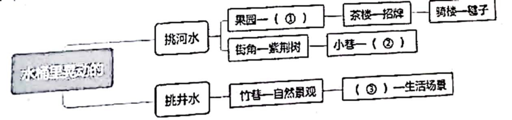

## **2023深圳中考语文试卷**

**一、基础（共26分）**
阅读下面文字，完成下面小题。
灿烂悠久的中华优秀传统文化是中华民族的精神血脉之所在，它起源于远古歌舞祭祀，发端于夏商周礼周易，①diàn jī（    ）于先秦诸子学说，丰富于楚辞汉赋，兴盛于唐诗宋词，繁华于元明清市井话本戏曲小说。深圳从2003年在全国率先确立“文化立市”战略至今，深圳市坚持把文化发展作为最重要的战略任务之一，让文化成为城市凝聚力和创造力的不竭源泉，在建设文化强国的大业中贡献自己的力量，②zhāng xiǎn（    ）了文化强市的担当。近年来深圳涌现出一批思想（③）、艺术（④）、制作（⑤）的文艺精品，<u>这座城市的文明水平和文化气质正汇聚成为提升城市核心竞争力的强大功能。</u>
1. 根据拼音写出相应的汉字。
①diàn jī（      ）            ②zhāng xiǎn（      ）
2. 选词填空请将下列三个词语选择填入文段中③-⑤处。（填入字母代号）
A．精湛      B．精深     C．精良
3. 判断下面两道题的正误，正确的在后面打√，错误的打×。
（1）《庄子》是先秦诸子学说中道家学派的作品。（      ）
（2）上面文段划线句“这座城市的文明水平和文化气质正汇聚成为提升城市核心竞争力的强大功能”的主语是“文化气质”。（      ）
综合性学习活动：“讲好英雄故事弘扬东江精神”
4. 你所在的班级组织全体同学去深圳市坪山区东江纵队纪念馆参观，老师决定由你要联系场馆工作人员，沟通、咨询参观相关事宜，请你写出打算咨询的问题（写两个即可）。
5. 参观完纪念馆后，小组通讯员写了一篇新闻稿，请你参考范例拟写标题。
新闻标题范例：《人民解放军百万大军横渡长江》《首届诺贝尔奖颁发》
新闻稿：
2023年5月4日，深圳市英华中学组织八年级全体同学参观了深圳市爱国主义教育基地——深圳东江纵队纪念馆，接受了一次心灵的冲击和革命的洗礼。
深圳东江纵队纪念馆位于东江纵队的重要活动地区深圳市坪山新区。纪念馆由大厅、展厅、文物厅、烈士芳名碑组成，共分为抗日救亡、武装准备、组队抗敌、突围东移等13部分，陈列了大量珍贵的历史照片和历史文献。东江纵队的发展史、战斗史让同学们深刻感受到革命先辈们抗争外敌、保卫祖国的革命精神，他们纷纷表示要在今后的学习和生活中进一步继承革命优良传统，弘扬不屈不挠的精神，努力学习，拼搏进取，为中华民族的复兴伟业尽自己的绵薄之力。
6. 班级汇演节目中，有位同学讲了抗日英雄、东江纵队传奇神枪手刘黑仔的故事（该故事来自颜飞鸣著《深圳河·水纪》），接下来由四位同学演唱《东江纵队之歌》，请你写一段串场词串接这两个节目。（要求至少运用一种修辞）
7. 请在下面的表格横线处填写相应的古诗文句子。
| 角度 | 内容 | 出处 |
| --- | --- | --- |
| 叙事 | _______________，木兰不用尚书郎。 | 《木兰诗》 |
| 叙事 | 夜来城外一尺雪，______________。 | 白居易《卖炭翁》 |
| 抒情 | ______________，端居耻圣明。 | 孟浩然《望洞庭湖赠张丞相》 |
| 抒情 | 但愿人长久，____________  | 苏轼《水调歌头》 |
| 喻理 | 得道者多助，_____________。 | 《得道多助，失道寡助》 |
| 喻理 | ______________，非志无以成学。 | 诸葛亮《诫子书》 |
| 言志 | “_______________，______________”表达了全军将士誓死报国的雄心壮志。 | 李贺《雁门太守行》 |
| 言志 | “______________，______________”表现了词人渴望率军北伐，统一南北，获得功勋和荣誉的理想。 | 辛弃疾《破阵子·为陈同甫赋壮词以寄之》 |

**二、阅读（共46分）**
**（一）（10分）**
阅读下面两篇文言文，完成下面小题。
【甲】
谢太傅寒雪日内集，与儿女讲论文义。俄而雪骤，公欣然曰：“白雪纷纷何所似？”兄子胡儿曰：“撒盐空中差可拟。”兄女曰：“<u>未若柳絮因风起</u>。”公大笑乐。即公大兄无奕女，左将军王凝之妻也。
（《世说新语·咏雪》）
【乙】
子路初见孔子，子曰：“汝何好乐①？”对曰：“好长剑。”孔子曰：“吾非此之问也，徒谓以子之所能，而加之以学问，岂可及哉？”子路曰：“学岂益哉也？”……子路曰：“<u>南山有竹不柔</u>②<u>自直斩而用之</u>，达于犀革③。<u>以此言之，何学之有</u>？”孔子曰：“栝而羽之④镞而砺之⑤，其入之不亦深乎？”子路再拜曰：“敬而受教。”
（节选自《孔子家书》，有删节）
【注释】①好（hào）乐：喜好，爱好。②柔：同“揉”，通过人力加工，把曲的变直，或直的变曲。③达于犀革：射穿用犀牛皮制作的战甲。④栝而羽之：栝（guā），箭的末端；羽，作动词用，即用羽毛装饰。⑤镞而砺之：镞（zú），箭头；砺，磨刀石，作动词用，即磨砺。
8. 选出加点词意义相同的一项（    ）
A 公欣然口/欣然前往

B. 撒盐空中差可拟/其势若犬牙差互
C. 汝何好乐/太守之乐其乐也
D. 岂可及哉/及鲁肃过浔阳
9. 下列关于甲乙两文的分析理解，选出错误的一项（    ）
A. 甲文中胡儿用“撒盐”的比喻描绘了“雪骤”的场景。
B. 甲文表现了谢道韫出色的文学才华。
C. 乙文中孔子强调了人的天分对成才的重要性。
D. 乙文划线句子，这样断句是正确的：“南山有竹/不柔自直/斩而用之”。
10. 用现代汉语翻译下面的句子。
（1）未若柳絮因风起。
（2）以此言之，何学之有？
11. 谢公是无言教育子侄，孔子是有言教育子路，都获得很好的效果。结合甲乙文，分别谈谈谢公和孔子是如何做到教育子弟的。
**（二）古诗词鉴赏（2分）**
12. 阅读下面古代诗歌，回答小题。

闻王昌龄左迁龙标遥有此寄

李白

杨花落尽子规啼，闻道龙标过五溪。

我寄愁心与明月，随君直到夜郎西，

诗人将明月人格化，“明月”在诗中扮演什么角色？
**（三）非连续性文本阅读（10分）**
材料一：
“小水滴”是咱们文博会可爱的吉祥物，名为“文鹏”，意为“文化鹏城”。今年，“小水滴”更是因“百变”而迅速“破圈”，收获大量关注。
就在5月23日，首款数字门票“醒狮小水滴”正式发售，迎来了文博会的数字非遗首秀。以粤剧脸谱为基础的红色关公狮头饰，象征忠义、胜利和财富；身穿长衫马褂，体现“天人合一”的人文理念；脚踩舞狮鞋，展示狮子活力四溢的形象……带有广东非遗特色的数字文化IP“醒狮小水滴”可谓亮点满满，精准还原了醒狮的色彩、纹理和形态等艺术细节，彰显中国传统文化的韵味。

表一：历年来参加文博会的展馆面积、参会单位、国外参会人员
| 年度 | 展馆面积（万平方米） | 单位数量（个） | 国外人员（人） |
| --- | --- | --- | --- |
| 2004 | 4.3 | 700 | 0 |
| 2014 | 10.5 | 2263 | 17696 |
| 2023 | 12 | 3576 | 25736 |

表二：特色展馆抢先看
| 展馆 | 特点 |
| --- | --- |
| 9号数字文化馆 | 全面展示数字技术应用成就，通过创新办展技术和手段，改善线上线下参展和观展体验。 |
| 10号文化产业综合馆A馆 | 由各省区市宣传文化部门牵头组织政府展团，组织本地重点文化企业参展。突出展示各地文化产业发展最新成果、优质文化项目和拳头产品。 |
| 13号文旅消费馆·一带一路国际馆 | 该馆设置了“一带一路”国际展区、文化旅游展区、文化消费展区三大展区。其中“一带一路”国际展区细分为欧洲展区、亚洲展区、中东地区展区、非洲展区、拉美地区展区和文化进口贸易展区。 |
| 14号非遗·工艺美术·艺术设计馆 | 可沉浸式、一站式欣赏到众多艺术珍品与文化传承佳作。 |

材料二：
①“新”，是第19届文博会的最大特点。
②这里有最新的科技。在“数字中国——AI时代的文化创新”主题展区，门口是一个超大的裸眼3D屏，上演着裸眼3D秀；展区内，铜奔马、后母戊青铜方鼎、四羊青铜方尊等国宝级文物，通过3D打印复刻，再结合透明的冰屏、全息屏等技术手段进行展示，比实物更加立体生动，让观众过足眼瘾。就说媒体开始尝试的“数字人主播”吧，本届文博会上，包括深圳特区报在内的多家媒体都推出了自己的Al数字人主播。“文化+科技”带来交互感和沉浸感更强的文旅体验，如丽日春风一样吹拂着文博会的每个展馆。
③这里有最新的产品。在青岛出版集团展区，一块硕大的屏幕前，观众手指轻点，屏幕上显示出我国历史上各朝代的文物和背后的故事，触摸屏幕上的人物、动物、景物，观众不仅能欣赏图书内容的朗读，还能进行场景互动。实际上，这是一款能“动”起来、“唱”出来的数字文化产品。吉祥物、小“潮玩”、数字文创产品……文博会上，各种时尚、酷炫的文化产品令人爱不释手，无形之中培育着新的消费群体，打开市场之门。
④这里有最新的理念。本届文博会上，深圳文交所城乡文化IP运营中心与《我是不白吃》IP版权方正式签约合作。据悉，本届文博会上，深圳文化产权交易所IP运营中心在深圳国际会展中心启动一系列合作签约，推动文化IP全产业发展。借文化IP加持推动产业发展，正在走向两全其美的现实。文博会期间举办的多领域多层次论坛，带来一场场头脑风暴、思想盛宴。“问渠哪得清如许，为有源头活水来。”最新的理念，为文化创新注入源头活水。
⑤文化是在创新创造中发展的。守正不守旧、尊古不复古，在传承中创新、在创新中发展，这是中华文明连绵不绝的基因。以文博会来看，作为“中国文化第一展”，本身就是一个文化IP，年复一年不断线，不是简单的复刻，而是不断开新、创新、出新的。
⑥文化传承发展之路，指向文化强国梦。唯有充分激发全民族文化创新创造活力，才能传承好、发展好中华优秀传统文化，扎实推进中华民族现代文明建设。从这个意义上说，文博会是一扇窗口，也是一面镜子、一个标杆。
材料三：
①2023年6月11日文博会闭幕，记者进行了现场采访，受访人表达了自己对此次文博会的感受。
②外国参展商：2019年，韩国传统文化产业研究所理事长郑光昊第一次参加文博会，之后又连续3年组团线上参展。“时隔3年再度来到深圳，我们非常兴奋。下一届我们还会参加，而且我们的准备会更充分，我已经开始期待下一届文博会了。”郑光昊说。
③本国参展商：在浙江伍马奥恩科技有限公司的展台，体验者戴上特制的装备，就可以聆听悠扬琴声，可以亲手抚琴，仿佛“走”入画中。该公司利用元宇宙技术，让人可以“穿越”到这幅名画中，身临其境感受清雅的意境。
④主办方：文博会组委会办公室主任曾相莱介绍，本届文博会重点组织数字化、网络化、智能化方向，组织5G、大数据、云计算、人工智能等技术应用文化企业参展，推动数字技术全面赋能文化产业。
13. 从材料一表1中，你得出了什么结论？
14. 从材料二和材料三之中总结出第19届文博会能够成功举办的原因。
15. 选择题：如果要介绍淄博烧烤应该去哪一个展馆？（    ）
A. 9号展馆	B. 10号展馆	C. 13号展馆	D. 14号展馆
16. 仿照示例，另外从“小贴士”中选一个常用语，探究小水滴作为文博会吉祥物的寓意。
小贴士：和水有关的常用语
水乳相融     水涨船高     水滴石穿         水无常形     上善若水
示例：我选“海纳百川”，水是流动的，小水滴汇入大海，像各类展品，汇聚文博会平台展示。
**（四）文学作品阅读（16分）**

水桶里晃动的

刘荒田

①“水桶里晃动的”这一意象，来自一首新诗。读罢顿时拍案，太有新意了。然而，那又是从童年起就烂熟的啊！
②怎么能够忘记水桶？
③小时候我居住的岭南小镇，镇中心流过一条不大不小的河，名叫“横水”。别指望什么“水是眼波横”，它的源头是连绵的大牛山，从方圆数十里阡陌纵横的田垌、炊烟袅袅的村庄、布满菜垄和坟墓的坡地，收纳各种各样的水，经过镇里埠头时，浑绿、浓稠。到了六月吃粽子的时节，洪涝来了，小孩子从石桥上吆喝着跳下，出水时头上披着泥沙。
④我和姐姐天天踏着花岗岩做的石级，把河水打进水桶，挑回家饮用。如今回头看，大吃一惊，混合着人畜排泄物、海量垃圾的污水，沿河人家喝了多少世代！直到上世纪50年代，居民才开始把明矾放进水缸，沉淀的杂质动不动是几寸厚。到了改革开放后，终于喝上了洁净的自来水。
⑤挑水时，好玩的不是水，而是水桶里晃动的倒影。那时我七八岁，祖母为我的窄肩配备的水桶是薄铁做的，容量不大，挑起来分量正好。大我三岁的姐姐负责打水，整理棕绳，为我扶起小扁担。（甲）<u>起步后，水桶发出奇妙的金属声，让人想到梵音，哐啷哐啷，紧随步子的节奏。</u>小小的水桶盛上水，如果静止，倒影不过是原物的拷贝；水晃动，便被赋予了生气，万花筒一般，幻化出奇异的色彩、怪诞的图形。
⑥挑起水桶，踏上九级石阶，被水桶里的风景迷住。先是从果园篱笆上伸出的番石榴树。果子躲在叶丛，桶里却看得分明。继而是充满动感的铺子，头一间是大芳茶楼，（乙）<u>招牌被水波颤出皱褶，“大芳”两个榜书仿佛跳起舞来。</u>骑楼下，小女孩在踢毽子，影子在水底飞过。然后是街角的一棵紫荆树，正是花期，桶里盛着艳丽的姿色，比树上的花更水灵。拐进小巷，倒影便全是乌黑的墙壁。
⑦从小学三年级开始，河水只拿来洗衣物，与小镇相邻的村庄有一口水井，饮用水去那里打。路远了，怕水溅出，挑上肩前，姐姐往桶里放上几片树叶。并沿的蔷薇开花那阵，姐姐趁村人不在旁，摘下几朵放在水上，慌慌张张像做贼。其实哪有人稀罕？
⑧井水比河水有看头，清凌凌的。离开井台往小镇走，经过一条俗称“竹巷”的植物长廊，两旁不全是凤尾竹，还有小叶榕、楠树、尤加利和乌桕。（丙）<u>密不透风的浓绿，应了那句唐诗“空翠湿人衣”。</u>是的，我的衣服湿了——既染上了绿色，又被桶里溅出的水花打湿。走得稍快一点，水桶里的世界更是精彩！一会儿是密密匝匝的竹竿，排浪一般打来。一会儿是头顶上的浓荫，教我恍惚间潜入大海深处。一会儿是旋转的灯笼花和扶桑花，犹如烟花爆开。一会儿，桶里一片澄明，水面纹丝不动，原来已走出竹巷，水桶兜上了无云的蓝天。还得穿过墟场。纷纷落进水桶的，近的有檐牙、帐篷、货摊上的遮阳伞、推鸡公车的汉子那上了釉似的背脊，远的有电线网、小伙伴放的风筝。
⑨自从被桶里的倒影迷住，我走路的姿态变得特别，让姐姐这监护人困惑。忽然快忽然慢，她要么跟不上要么超前，却不晓得我在“追”水桶里的景致。看得太投入，碰伤脚趾不止一次。有一回打了个趔趄，水桶侧翻，虽马上站定，水也泼出了一半，害得姐姐多走了一趟，水缸才给注满。过了很久，终于被姐姐识破，从此她走一段就高声提醒：“看路！”
⑩我抄下的那句诗是这样的：“水桶里晃动的青峰才是真正的秦岭。”我无意去分辨儿时小水桶里的倒影是不是比景物本身更真实，但能肯定，“水桶里晃动的”比现实的画面美得多。
（选自《光明日报》2023年05月19日15版）
景物之美
17. 通读全文，完成下面的空格。

①____________        ②____________        ③____________
完成空格后，同学们发现作者描写景物的观察角度是（④____________）
人物之美
18. 结合文章内容，分别概括姐姐和“我”在挑水过程中的关注点。
词语之美
19. 赏析第⑧段中加点的词语。
纷纷落进水桶的，近的有檐牙、帐篷、货摊上的遮阳伞、推鸡公车的汉子那上了釉似的背脊，远的有电线网、伙伴放的风筝。
艺术之美
20. 下列对本文艺术特色的赏析，说法错误的一项是（    ）
A. 本文以半句新诗开头，整句新诗结尾，首尾呼应，结构严谨。
B. 画线甲句调动多种感官，从视觉、听觉、味觉角度体现水桶晃动之姿。
C. 画线乙句中“放佛跳起舞来”，生动形象地写出了桶中水晃动的特点。
D. 画线丙句引用唐诗，清丽典雅，让人感觉到“浓绿”的情境美。
情思之美
21. 文章最后说“水桶里晃动的”比现实的画面美得多。请结合文本内容，探究作者这样说的原因。
**（五）名著阅读（8分）**
**少年正是读书时。阅读名著可以让我们享受和吸取人类文化的成果，让我们的心灵世界逐渐变得广阔，变得丰富多彩。**
22. 请你阅读下面四个名著选段，回答问题

（一）
××把马鞍搬到火堆跟前，坐在上面，然后打开那本厚厚的小书，放在膝盖上。
“同志们，这本书叫《牛虻》，我是从营政委那儿借来的，我读了很受感动，要是大伙好好坐着听，我就念。”
“快念吧！没说的！谁也不会跟你打岔。”
当团长普济列夫斯基同志同政委一道骑马悄悄走近篝火时，他看见十一对眼睛正一动不动地盯着那个念书的人。
（二）
××自此只在秦家放牛，每到黄昏，回家跟着母亲歇宿。或遇秦家煮些腌鱼、腊肉给他吃，他便拿块荷叶包了来家，递与母亲。每日点心钱，他也不买了吃，聚到一两个月，便偷个空，走到村学堂里，见那阔学堂的书客，就买几本旧书，日逐把牛栓了，坐在柳荫树下看。
（三）
我的视线又被收回到了手中的书上来，我正在看的是一本比尤伊克的《英国鸟类史》，总体来说，我不太喜欢上面的文字，不过，尽管那时我还是个孩子，但有几页说明也并没有被我当做空白页翻过去。它主要描写的是海鸟的栖息地，提到了只有那些“孤寂的岩石与海岬”是海鸟们经常光顾的地方。书中还提到了挪威海岸自南端的林蒂斯内斯——或称为纳斯——到北角遍布着许多多的海岛……
（四）
看新书的风气便流行起来，我也知道了中国有一部书叫《天演论》。星期日跑到城南去买了来，白纸石印的一厚本，价五百文正。翻开一看，是写得很好的字，开首便道：——
问题：上面四个文段都是写人物读书的情景，文段中的读书人物分别是谁？
A.周树人         B.保尔·柯察金      C.简·爱        D.王冕
23. 读书分享

我熟读经书，可是不喜欢它们。我爱看的是中国旧小说，特别是关于造反的故事。我很小的时候，尽管老师严加防范，还是读了《精忠传》《水浒传》《隋唐》《三国》和《西游记》。这位老先生讨厌这些禁书，说它们是坏书。我常常在学堂里读这些书，老师走过来的时候就用一本正经书遮住。大多数同学也都是这样做的。许多故事，我们几乎背得出，而且反复讨论了许多次。关于这些故事，我们比村里的老人知道得还要多些。他们也喜欢这些故事，常常和我们互相讲述。我认为这些书大概对我影响很大，因为是在容易接受的年龄里读的。
（选自埃德加·斯诺《红星照耀中国》）
上面的文字是毛泽东接受斯诺采访时自述自己少年时代所读的“课外书”。请你回答下列问题。
（1）在《水浒传》和《西游记》中任选一部作品，结合该书某些内容说说其对毛泽东产生了何种影响。
（2）结合《红星照耀中国》的具体内容，说说上题你选择的书籍对毛泽东产生某一方面的影响的印证。
**三、作文**
24. 命题作文
十四五岁的你一定学到了很多东西，比如学科知识、才艺技能、日常经验、思想见识等，你也一定曾有意无意地将它们用在生活中，或解决了问题，或展示了自我，或帮助了他人，或服务了社会。
把你相关经历与感受写下来与大家分享吧。请以“把学到的用起来真有意义”为题目，写一篇文章。

要求：（1）不少于600字；（2）禁止抄袭和套作；（3）写真情实感；（4）文中不得出现真实的校名、人名；（5）书写工整、规范。
