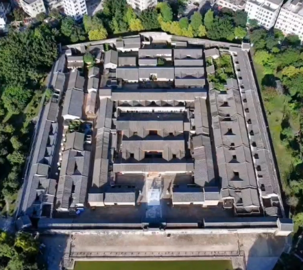
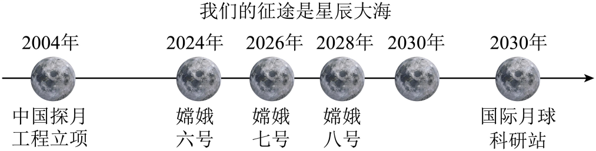
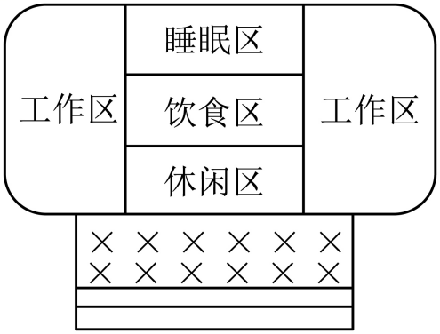

## **深圳市2024年初中学业水平考试**
## **语文**
**说明：**
**1.答题前，请将姓名、考生号、考点、考场号和座位号用黑色字迹的钢笔或签字笔写在答题卡指定的位置上，并将条形码粘贴好。**
**2.全卷共6页。考试时间120分钟，满分120分。**
**3.作答单项选择题时，选出每题答案后，用2B铅笔把答题卡上对应题目答案标号的信息点框涂黑。如需改动，用橡皮擦干净后，再选涂其它答案。作答非选择题，用黑色字迹的钢笔或签字笔将答案写在答题卡指定区域内。写在本试卷或草稿纸上，其答案一律无效。**
**4.考试结束后，请将本试卷和答题卡一并交回。**

**万物生生不息“变”是永恒主题**

**【回顾·变】**

**让我们从汉字的音形义中，了解古居文化内涵；从围屋功能的变化中，看古居如何突破时代重围，焕发生机。**
**一、基础知识与运用（共5题，共13分）**
【围屋说“围”】
围屋是围起来的建筑。俯瞰围屋，其整体结构像个巨大的“围”字（如图1）。汉字中像“围”这样带“口”（读wéi）的字还有很多，有的表示围起来的地方，如“圈”是古人养牲畜的地方，yuán<u>“</u><u>①</u>”是种果树的地方，pǔ<u>“</u><u>②</u>”是种菜的地方。
围屋是以堂屋为中心向外扩展而形成的庞大建筑体。家族世代居于其中，老少其乐融融，这场景正如对联所言“一围居室<u>▲▲▲</u>，四方天地家国情”。
围屋镌刻着客家人大迁徙的历史，留存了传统文化印记，当时代的脚步沿着青石板路悄然而来，人们走出古老的围屋<u>▲</u>奔赴广阔的天地；而围屋大门的漆色渐渐斑驳，院内幽深的寂静敲打着斜阳……

图1  深圳客家围屋
1. 请写出第一段①②两处的汉字。
2. 将第二段对联缺失部分“▲▲▲”补充完整，最合适的一项是（   ）
A. 山川美	B. 千秋歌	C. 四季诗	D. 天伦乐
3. 根据语境，第三段中“▲”处应填入的一个标点符号是（   ）
A. 顿号	B. 逗号	C. 分号	D. 句号
【古居破“围”】
久围则困，困则破“围”，破而求变。早在1996年，深圳围屋“鹤湖新居”就改建为客家民俗博物馆，让更多的人了解客家历史；2024年元宵节期间，“万居·咏月”诗词灯会深圳围屋“大万世居”举办，市民们相聚围炉煮茶，一时丝竹绕耳，不胜惬意。

图2  围屋更新示意图
4. 请结合“古居破围”相关文字和图2，归纳古居更新变化特点。
5. 作为城市的一员，请你在“我”、“古居”之间加入一个动词，表达你与古居这种文化源的关系，并对此作简要阐释。
**让我们从古诗文的字里行间，感受乡村生活，思考人生态度，探寻求新求变的不竭动力。**
**二、古文诗词巧辨识（共5题，共25分）**
【甲】
林尽水源，便得一山，山有小口，仿佛若有光。便舍船，从口入。初极狭，才通人。复行数十步，豁然开朗。土地平旷，屋舍俨然，有良田美池桑竹之属。阡陌交通，鸡犬相闻。其中往来种作，男女衣着，悉如外人。黄发垂髫，并怡然自乐。
见渔人，乃大惊，问所从来。具答之。便要还家，设酒杀鸡作食。村中闻有此人，咸来问讯。自云先世避秦时乱，率妻子邑人来此绝境，不复出焉，遂与外人间隔。问今是何世，乃不知有汉，无论魏晋。此人一一为具言所闻，皆叹惋。余人各复延至其家，皆出酒食。停数日，辞去。此中人语云：“不足为外人道也。”
（节选自东晋陶渊明《桃花源记》）
乙】

燕市①带面衣②，骑黄马，风起飞尘满衢陌。归来下马，两鼻孔黑如烟突③。大官传呼来，百姓窜<u>▲</u>不及，狂奔尽气，流汗至踵。
遥想江村夕阳，渔舟投④浦，返照入林，沙明如雪；花下晒网罟⑤，酒家白板青帘，掩映垂柳，老翁挈鱼提瓮出柴门。此时偕三五良朋，散步沙上，绝胜长安骑马冲泥也。
（节选自明代屠隆《在京与友人书》，有删减）
注释：①燕市：明都城北京。②面衣：面巾。③烟突：烟筒。④投：停靠。⑤罟（gǔ）：捕鱼的网。
6. 甲文加点词语中，最适合填入乙文的是（   ）

A 通	B. 还	C. 避	D. 延

7 请将下列句子翻译成现代汉语

①咸来问讯。                    ②沙明如雪。
8. 甲、乙两文描绘的乡村生活，都富有人情之美。请结合文章内容简要分析。
9. 两位同学围绕甲乙两文内容展开对话。请将对话补充完整。
小语：陶渊明想借“桃花源”来表达<u>（1）</u>_____。
小文：是啊，屠隆也说江村“绝胜长安”，他的生活态度与陶渊明相似。
小语：但是，如果人人都流连乡野，就怕没有人操心国家大事了。
小文：不会的。范仲淹的“进亦忧，退亦忧”就告诉我们<u>（2）</u>_____。
10. 文言文阅读。乙文“花下筛网罟”引人遐想，花是诗文中常见意象，读花赏花，兴味盎然。班级就此开展“觅花辑诗文”活动。
（1）请将以下“花之诗文”补充完整。
①____________________，浅草才能没马蹄。（唐·白居易《钱塘湖春行》）
②相见时难别亦难，____________________。（唐·李商隐《无题》）
③____________________，似曾相识燕归来。（宋·晏殊《浣溪沙（一曲新词酒一杯）》）
④香远益清，____________________。（宋·周敦颐《爱莲说》）
⑤山重水复疑无路，____________________。（宋·陆游《游山西村》）
⑥____________________，化作春泥更护花。（清·龚自珍《己亥杂诗（其五）》）
（2）请你辑录杜甫《春望》中合适的诗句：____________________，____________________。
（3）辑录时，有同学错误选取了岑参《白雪歌送武判官归京》中的“忽如一夜春风来，千树万树梨花开”。请你解释这句诗为什么不能入选。_________

**【展望·变】**

**三、（共4题，共12分）**
班级分组开展“月球建筑模型设计”综合性学习活动。请阅读材料，按要求完成下面小题
材料一

月球上造房子充满挑战

月球上造房子要面临极端环境的挑战。月球每年发生约1000次深部月震，还有太阳风和微陨石等的冲击，月球建筑的承受能力将受到严峻考验；月球表面重力约为地球表面的1/6，建筑物和人的受力状态与在地球上时完全不同；月面昼夜27.32天更替一次，昼夜温差可达290℃，建材性能可能会在热疲声的下退化，宇宙射线如质子、α粒子、β粒子、γ射线等可直达月面，月表辐射强度极高，建造装备可能在强辐射下失效。
在月球上建造房子还得考虑建筑材料和工程建设能力。首先，由于重量和航天器的载荷限制，建筑材料必须满足轻便、结实和易于携带等条件。其次，由于艰苦环境的限制，建筑物必须具备防辐射、防微尘和保温隔热等特性，研究显示，月壤可极大地降低昼夜温差对建筑结构的影响，并可减少辐射造成的材料性能损伤和老化，可考虑用来用来建造月球建筑。最后，月球表面移动和建筑物组装方面，也需要更先进的科技和工程技术的支持。目前对建造月球建筑的设想，主要有以下几种方案：
| 
  建造方案  
 | 
  特点  
 |
| --- | --- |
| 预制式 | 在地球上预制光都面建筑，运载至月球表面安装，由于运载成本高昂、运载尺寸受限，该方案适合小型月球建筑。 |
| 展开式 | 建筑核心部分在地球预制，到达月球再以充气或展开折叠的形式扩展，能有效结合地月优势，现阶段可行性较强。 |
| 原位建造式 | 利用月壤在月球建造建筑主体，在月球完成材料制备和建设安装。这种方案难度较大，核心技术有待进一步突破。 |

材料二
                      图1

（材料一、材料二取材于刘益清、梅洪元等人的文章）
材料三
                          图2

图：中国探月工程时间线
中国探月工程不断刷新人类月球探测的纪录。2024年6月，娥六号月球探测器在月球着陆，完成人类探测器首次在月球背面实施的样品采集任务，这是“人类探索月球的历史性时刻”。2030年前我们将可能实现航天员登月计划，在月球南极建立研究基地。而对于未来月球建筑的模样，目前也有许多构想和探索。华中科技大学研究团队已制备出国内首个模拟月壤真空烧结打印的样品“月壶尊”，实现从0到1的突破。哈尔滨工业大学研究团队提出“三叶草”月球建筑方案，综合运用预制舱体，充气扩展，月壤3D打印等技术，为中国未来月球基地建设探索路径。其方案理念取自地球上具有顽强生命力的植物“三叶草”，寓意在月球播种生命，共筑月海绿洲。
（取材于《参考消息》等）
11. 根据材料，同学们有以下分析，其中不准确项（   ）

A. 月球上造房子要考虑极端环境、建筑材料和工程建设能力全国。
B. 月面要承受大温差和强烈辐射，月球建筑可以考虑用月壤。
C. 原位建造式方案是在地球预制完整的建筑，运载至月球表面安装
D. 在不断探索下，未来十年左右中国将有可能建设国际月球科研站。
12. 图3是登月组设计的月球建筑模型平面图，请你根据该图简要说明各功能区的空间布局情况。

图3
13. 以下是登月组对建筑模型的制作设想，请结合制作设想，根据材料二，对该小组目前的设计（图3）提出完善建议。
| 
  模型制作设想  
 ➢使用轻便材料制作模型，减轻重量； ➢用折叠形式制作，展示时可随时打开。 |
| --- |

14. 总结环节中，你代表小组发言。请你综合材料及活动过程，以“实现月球家园梦，我们在行动”为话题，分享自己的学习体会。（两点即可）

**【凝视·变】**

**万物凝视，世界变有味。让我们走进文本，思考野蜜蜂的困惑，找到自己的方向。**
**四、现代文本会分析（共5题，共22分）**

万物凝视（节选）

鲍尔吉·原野

野蜜蜂给月牙的信

亲爱的月牙：
①有人给你写信吗？是不是他们觉得你所在的位置太高，信投不过去就不给你写呢？我不管，我一定要给你写信，请你帮我办一件事。所以当你读这封信的时候，请不要转开脸，我就在你翘起来的尖下颌的正下方，我是野蜜蜂。我丢了我的定位器。我们野蜜蜂的工作范围漫山遍野，常常迷失方向，离不开定位器。
②定位器不见了，我迷失了方向。我觉得所有的方向都是南，南南南南南，这给我带来困惑。我再转过身前面还是南。我趴在地上祈祷，觉得我面对的大地也是南。月牙请你告诉我，你用你那尖尖的月牙的下颌指哪个方向，我就知道它在哪里，好吗？这个事对你来说不费什么事，你站得那么高，一定看得很远，很清晰。而且月光那么亮，世上所有的东西，你都能尽收眼底。
③第二个问题，这封信你多长时间才能收到？在你收到我的信之前，我去做什么？南南南南南，我几乎什么也做不了。亲爱的月牙，也许我还有一个选择，就是飞到月牙上，躺在你那个上翘的下颌睡觉，睡醒了，到你的背面睡觉。你们那里不会到处都是南吧？
④亲爱的月牙，如果你帮我找回定位器，我会把我收藏的宝物都送给你，我还有一件银莲花白色的花瓣，原来准备用它做结婚的吊床，我还不知道跟谁结婚，所以送给你。你对这礼物满意吗？你想要哪些东西，在信中告诉我，我去寻找。
爱你的野蜜蜂

月牙给野蜜蜂回信

亲爱的野蜜蜂：
⑤你的信我收到了。你这么信任我，让我感动。我作为月亮不忍心欺骗你，不能为了让你满意，就随便用月牙的下颌向东指一指，向西指一指，好像在帮你，实际是骗你。你的定位器落在了哪里？我这个位置看不到你如果相信我，我对你说实话，我连你所在的那座山都看不清楚，它连灰尘都算不上。因为我们相距实在太远了。你所在那个星球可能叫地球，它在我眼里像一粒沙子。我怎么能分得清地球上哪里是高山，哪里是大河？更看不清你的左手和右手呢。
⑥亲爱的野蜜蜂，你不要着急，我来告诉你怎么获得定位。我说一下新方法：你去寻找一颗鞑靼山茱萸树你用后脑勺在这棵树上蹭。要知道这种树有磁性，经过摩擦，磁性导入你的身体，然后你就获得了定位能力可以飞遍天涯海角，清晰你前进的方向。我知道，没有定位器就没法飞行，而且头颅撞到树木上是很痛的。
⑦你说你要飞到月亮上，这不算是一个好主意。先不说你要经过多少年，或多少万年，也许多少亿年才能飞到月亮上。再说了，月亮上的气温不适合你呀，你觉得你能适应吗？我想你够呛。所以对你来说，月亮也就是看看而已，不一定到上而来探查究竟。当然，你如果能飞到月亮上，我说的是“如果”，你会看到无与伦比的美丽景象。那时候，你看到的并非是小小的山脉河流；而是浩瀚的宇宙。
⑧你听过宇宙这个词吗？世界上所有形客广阔的词汇加到一起，也没有宇宙广阔。所以人们说宇宙浩瀚。浩瀚是什么样子？我说来给你听，如果可以比拟的话，眼前的浩瀚如同地球上的沙丘，只是这些沙丘的沙子全都飞了起来，化成蓝色，在天空飞舞。而你所在的地球，不过是这些沙粒中的一粒。宇宙的一切物体都在运动。没有开始，没有结束。每一种物体都精妙地运行在自己的轨道上。
⑨亲爱的野蜜蜂、你听懂了吗？我希望你尽快找到鞑靼山茱萸树，把后脑勺靠在树上蹭，这样你就恢复了定位的能力。
爱你的月牙儿
（选自《十月》2024年第1期，有删改）
15. 下面句子写出了野蜜蜂迷失方向之后的心理状态。请你具体品味分析。
我觉得所有的方向都是南，南南南南南，这给我带来困惑。
16. 月牙说“你这么信任我，让我感动”。在第一封信中，野蜜蜂对月牙的信任体现在哪些地方？
17. 在第二封信中，月牙从哪些方面回应了野蜜蜂？
18. 月牙能否帮助野蜜蜂解决困惑？请结合文本谈谈你的理解。
19. 某种意义上说，经典名著具有“定位功能”，可以指引方向。请从备选名著中任选一部，结合名著内容与成长体验，加以简述。
备选名著：《红星照耀中国》        《西游记》        《简·爱》        《经典常谈》

**【描绘·变】**

**五、书写美文写好字（共48分，其中写作45分，书写3分）**
20. 作文
自然景色四季流转，少年成长拔节而上，科技发展日新月异，社会风貌向美向善，神州大地万象更新……看，风景在变。关注变化的风景，感受变化的力量。
请以“看，风景在变”为标题，写一篇作文。
要求：（1）思想健康，内容充实，语言流畅，书写清晰；
（2）文体不限（诗歌除外），文体特征鲜明；（3）不少于600字，不超过900字；
（4）不出现真实信息（人名、校名等），不可避免时XX代替；（5）不得抄袭，不得套作。
