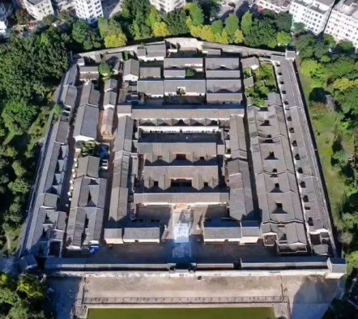
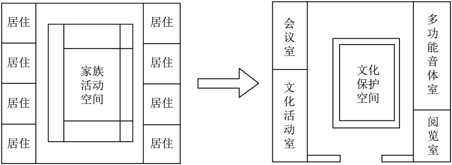
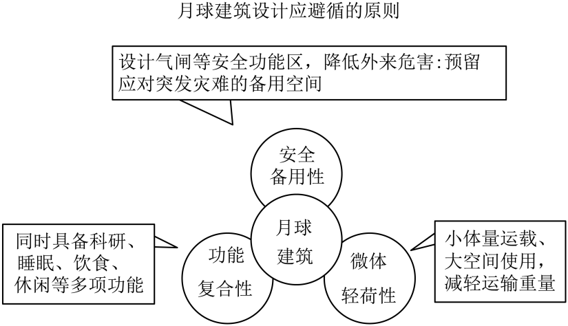
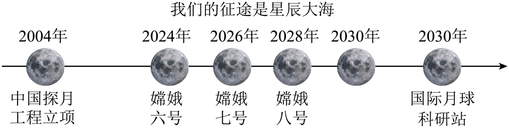

## **深圳市2024年初中学业水平考试**
## **语文**
**说明：**
**1.答题前，请将姓名、考生号、考点、考场号和座位号用黑色字迹的钢笔或签字笔写在答题卡指定的位置上，并将条形码粘贴好。**
**2.全卷共6页。考试时间120分钟，满分120分。**
**3.作答单项选择题时，选出每题答案后，用2B铅笔把答题卡上对应题目答案标号的信息点框涂黑。如需改动，用橡皮擦干净后，再选涂其它答案。作答非选择题，用黑色字迹的钢笔或签字笔将答案写在答题卡指定区域内。写在本试卷或草稿纸上，其答案一律无效。**
**4.考试结束后，请将本试卷和答题卡一并交回。**

**万物生生不息“变”是永恒主题**

**【回顾·变】**

**让我们从汉字的音形义中，了解古居文化内涵；从围屋功能的变化中，看古居如何突破时代重围，焕发生机。**
**一、基础知识与运用（共5题，共13分）**
【围屋说“围”】
围屋是围起来的建筑。俯瞰围屋，其整体结构像个巨大的“围”字（如图1）。汉字中像“围”这样带“口”（读wéi）的字还有很多，有的表示围起来的地方，如“圈”是古人养牲畜的地方，yuán<u>“</u><u>①</u>”是种果树的地方，pǔ<u>“</u><u>②</u>”是种菜的地方。
围屋是以堂屋为中心向外扩展而形成的庞大建筑体。家族世代居于其中，老少其乐融融，这场景正如对联所言“一围居室<u>▲▲▲</u>，四方天地家国情”。
围屋镌刻着客家人大迁徙的历史，留存了传统文化印记，当时代的脚步沿着青石板路悄然而来，人们走出古老的围屋<u>▲</u>奔赴广阔的天地；而围屋大门的漆色渐渐斑驳，院内幽深的寂静敲打着斜阳……

图1  深圳客家围屋
1. 请写出第一段①②两处的汉字。
2. 将第二段对联缺失部分“▲▲▲”补充完整，最合适的一项是（   ）
A. 山川美	B. 千秋歌	C. 四季诗	D. 天伦乐
3. 根据语境，第三段中“▲”处应填入的一个标点符号是（   ）
A. 顿号	B. 逗号	C. 分号	D. 句号
【古居破“围”】
久围则困，困则破“围”，破而求变。早在1996年，深圳围屋“鹤湖新居”就改建为客家民俗博物馆，让更多的人了解客家历史；2024年元宵节期间，“万居·咏月”诗词灯会深圳围屋“大万世居”举办，市民们相聚围炉煮茶，一时丝竹绕耳，不胜惬意。

图2  围屋更新示意图
4. 请结合“古居破围”相关文字和图2，归纳古居更新变化特点。
5. 作为城市的一员，请你在“我”、“古居”之间加入一个动词，表达你与古居这种文化源的关系，并对此作简要阐释。
【答案】1. 园 圃    2. D    3. B
4. 古居更新变化特点有：一是改变原居室的原有用途，如把家族活动空间改为文化活动空间，把居室改为阅览室等。二是把“鹤湖新居”改为“客家民宿博物馆”，让人们了解客家历史；三是在围屋举办文化活动，如2024年元宵节，在大万世居举办“万居，咏月”诗词灯会。
5. 示例一加“爱”字。“我爱古居”——以“鹤湖新居”“大万世居”为代表的深圳客家同屋镌刻着客家人大迁徙的历史，留存了传统文化印记，它对于我们了解深圳的历史有重要的意义。
示例二加“游览”一词。“我游览古居”我曾经和家人一起游览“鹤湖新居”。“鹤湖新居”是中国目前规模最大的客家围村建筑群，涉及龙岗客家的历史沿革、独特的风土人情等方方面面，它令我流连忘返。
【解析】
【1题详解】
本题考查字形。
在“汉字中像‘围’这样带‘口’（读wéi）的字还有很多，有的表示围起来的地方，如‘圈’是古人养牲畜的地方，yuán①是种果树的地方，pǔ②是种菜的地方”这一语境中：①处应填“园”。从语境来看，此处描述的是一个围起来用于种植果树的地方，“园”字有“种植果蔬花木的地方”这一含义，与“种果树的地方”这一语境相契合，比如常见的“果园”，就是专门种植果树的园子，所以这里填“园”是合适的。②处应填“圃”。结合语境，这里说的是围起来种菜的地方，“圃”的意思是“种植菜蔬、花草、瓜果的园子”，像“菜圃”就是专门用来种菜的园子，与“种菜的地方”的语境相符，因此此处应填“圃”。
【2题详解】
本题考查对联。
A.“山川”主要是指自然环境中的山和河流等景观，与围屋中家族世代居住、老少其乐融融的人文生活场景和氛围关联不紧密，放在“一围居室”后面，无法准确体现围屋内的生活特点和情感氛围，不能很好地与“四方天地家国情”形成呼应和匹配；
B.“千秋”强调时间的久远，“歌”一般指歌曲、歌颂等，与围屋中当下家族成员之间的生活场景和情感状态没有直接的、具体的联系，无法生动地展现围屋内老少相处的那种温馨、和谐的场景，与下联的“家国情”在情境和意境上也不够协调。“歌”是一声，也不符合对联的平仄要求，上联末字应是三声或四声；
C.“四季”体现的是时间的变化和自然的轮回，“诗”更多的是一种文学艺术形式或浪漫的意象，与围屋中实实在在的家族生活场景以及其中蕴含的亲情等情感内容不太契合，不能准确地表达出围屋内人们生活的那种其乐融融的状态，和下联的“家国情”在表意和情感上的衔接不够自然。“诗”是一声，也不符合对联的平仄要求，上联末字应是三声或四声；
D.“天伦”指的是父子、兄弟等亲属关系，“天伦乐”就是指家庭中亲人之间团聚、和睦相处的快乐。这与“一围居室”所代表的围屋这一居住环境以及家族世代居于其中，老少其乐融融的场景完全相符，能够准确地表达出围屋内家庭生活的温馨与和谐，与下联“四方天地家国情”在情感和意境上也相互呼应，上联侧重家庭内部的欢乐，下联扩展到天地间的家国情怀，层次分明，表意完整；
故选D。
【3题详解】
本题考查标点运用。
“当时代的脚步沿着青石板路悄然而来，人们走出古老的围屋”与“奔赴广阔的天地”在语义上紧密相连，前者描述人们走出围屋的背景，后者是走出围屋之后的行为动作，二者是一个连续的表达，中间需要停顿但又未表达完整的意思，所以用逗号合适。
顿号一般用于并列词语之间的停顿，“走出古老的围屋”和“奔赴广阔的天地”并非并列词语关系，不能用顿号。分号常用于复句内部并列分句之间的停顿，此处前后并非并列分句关系，不适用分号。句号表示一句话的结束，“人们走出古老的围屋”语义未完整，后面“奔赴广阔的天地”是对其的进一步说明，用句号会使语义表达中断，不合适。
故选B。
【4题详解】
本题考查图文转换。
看图要知，家庭活动空间改成了文化保护空间，原有的居室变成了会议室、文化活动室、多功能音体室、阅览室等，改变了原有的居室用途。可得：改变原居室的原有用途。
根据题干中的“早在1996年，深圳围屋‘鹤湖新居’就改建为客家民俗博物馆，让更多的人了解客家历史”可得：把“鹤湖新居”改为“客家民宿博物馆”，让人们了解客家历史。
根据题干中的“2024年元宵节期间，‘万居·咏月’诗词灯会深圳围屋‘大万世居’举办”可得：在围屋举办文化活动，如2024年元宵节，在大万世居举办“万居，咏月”诗词灯会。
【5题详解】
本题考查自由表达观点。
需要在“我”和“古居”之间加入一个动词来体现与古居这种文化源的关系，可从传承、保护、了解、亲近等角度思考。加入的动词要能准确表达出自己对古居文化的一种态度和行为，之后对其阐释要围绕该动词展开，说明为什么是这种关系以及这种关系的意义。
示例：动词：守护。阐释：古居承载着丰富的历史文化内涵，是城市珍贵的文化遗产。作为城市的一员，“我”有责任守护古居。守护意味着关注古居的现状，积极参与到古居的保护行动中，比如向身边人宣传古居的价值，监督对古居的不合理利用等行为。古居是城市文化的根脉，守护它就是守护城市的记忆和独特魅力，让这份珍贵的文化源得以长久传承下去。
**让我们从古诗文的字里行间，感受乡村生活，思考人生态度，探寻求新求变的不竭动力。**
**二、古文诗词巧辨识（共5题，共25分）**
【甲】
林尽水源，便得一山，山有小口，仿佛若有光。便舍船，从口入。初极狭，才通人。复行数十步，豁然开朗。土地平旷，屋舍俨然，有良田美池桑竹之属。阡陌交通，鸡犬相闻。其中往来种作，男女衣着，悉如外人。黄发垂髫，并怡然自乐。
见渔人，乃大惊，问所从来。具答之。便要还家，设酒杀鸡作食。村中闻有此人，咸来问讯。自云先世避秦时乱，率妻子邑人来此绝境，不复出焉，遂与外人间隔。问今是何世，乃不知有汉，无论魏晋。此人一一为具言所闻，皆叹惋。余人各复延至其家，皆出酒食。停数日，辞去。此中人语云：“不足为外人道也。”
（节选自东晋陶渊明《桃花源记》）
【乙】
燕市①带面衣②，骑黄马，风起飞尘满衢陌。归来下马，两鼻孔黑如烟突③。大官传呼来，百姓窜<u>▲</u>不及，狂奔尽气，流汗至踵。
遥想江村夕阳，渔舟投④浦，返照入林，沙明如雪；花下晒网罟⑤，酒家白板青帘，掩映垂柳，老翁挈鱼提瓮出柴门。此时偕三五良朋，散步沙上，绝胜长安骑马冲泥也。
（节选自明代屠隆《在京与友人书》，有删减）
注释：①燕市：明都城北京。②面衣：面巾。③烟突：烟筒。④投：停靠。⑤罟（gǔ）：捕鱼网。

6. 甲文加点的词语中，最适合填入乙文的是（   ）
A. 通	B. 还	C. 避	D. 延
7. 请将下列句子翻译成现代汉语
①咸来问讯。                    ②沙明如雪。
8. 甲、乙两文描绘的乡村生活，都富有人情之美。请结合文章内容简要分析。
9. 两位同学围绕甲乙两文内容展开对话。请将对话补充完整。
小语：陶渊明想借“桃花源”来表达<u>（1）</u>_____。
小文：是啊，屠隆也说江村“绝胜长安”，他的生活态度与陶渊明相似。
小语：但是，如果人人都流连乡野，就怕没有人操心国家大事了。
小文：不会的。范仲淹的“进亦忧，退亦忧”就告诉我们<u>（2）</u>_____。
【答案】6. C    7. （1）（村人）都来打听消息。
（2）沙滩像雪一样洁白。
8. 甲乙两文描写的人情美有：桃花源和江边小村的人们都靠渔耕劳作过着自给自足、和平恬静的生活，那里民风淳朴，人们幸福快乐。
9.     ①. 陶渊明想借“桃花源”来表达他的社会（政治）理想：没有压迫，没有战乱，人们过着和平安乐、自给富足的生活。    ②. 身在官场要为平民百姓忧虑；处在僻远的江湖间则替国事担忧。也就是说，无论自己的处境如何，都可以关心国计民生。
【解析】
【导语】本文通过比较分析陶渊明的《桃花源记》和屠隆的《在京与友人书》两篇古文，描绘了两种理想的乡村生活景象。陶渊明刻画的桃花源是一片和平、宁静、远离世俗纷争的桃源仙境，表达了人们对美好生活的向往。屠隆则描述了与好友在江村散步的美好情景，突出乡村生活的悠闲与惬意。两篇文章都体现了古人对自然和谐、质朴人情的追求，给人一种返璞归真的美好愿望。
【6题详解】
本题考查实词用法。
通：在甲文中有“初极狭，才通人”，“通”意为通过、通行，侧重于表示空间上的可通过性或道路的畅通等。在乙文“大官传呼来，百姓窜▲不及”的语境中，“通”字无法体现百姓面对大官传呼时的行为动作和状态，与上下文逻辑不相符，不能表达出百姓想要躲避或其他相关的意思，所以“通”不适合填入。
还：在甲文中如“便要还家”的“还”是返回、回到的意思。在乙文语境里，“还”字不能合理地衔接“百姓窜”与“不及”，“窜还”这种表述不符合百姓面对大官传呼时的情境，无法表达出百姓是因为来不及做什么而出现的状态，不能准确传达句子想要表达的意思，所以“还”不适合放在此处。
避：有躲避、逃避的意思。在乙文“大官传呼来，百姓窜▲不及”中，“窜避”可以很好地表现出百姓在听到大官传呼时，因害怕而慌忙逃窜躲避，却又来不及的状态，与整个句子所营造的紧张氛围和百姓的行为反应相契合，能够准确地表达出句子的含义，所以“避”是最适合填入的字。
延：在甲文中“余人各复延至其家”的“延”是邀请的意思。将“延”放入乙文“百姓窜▲不及”中，“窜延”这种组合没有合理的语义，与百姓面对大官传呼时的情境毫无关联，无法表达出句子应有的意思，所以“延”不适合填入乙文此处。
故选C。
【7题详解】
本题考查译句。重点词语：①咸：全，都。来：过来。问：询问。讯：消息。②沙：沙子，沙滩。明：明亮。如：像。雪：雪花。
【8题详解】
本题考查比较阅读。
甲文第一段中的“土地平旷，屋舍俨然，有良田美池桑竹之属。阡陌交通，鸡犬相闻。其中往来种作，男女衣着，悉如外人。黄发垂髫，并怡然自乐”描绘出桃花源里土地平整，屋舍整齐，人们从事着农耕，老人小孩都很快乐，展现出这里人们过着自给自足、和平恬静的生活。第二段中的“便要还家，设酒杀鸡作食。村中闻有此人，咸来问讯”又体现出村民的热情好客，民风淳朴。乙文第一段中的“遥想江村夕阳，渔舟投浦，返照入林，沙明如雪；花下晒网罟，酒家白板青帘，掩映垂柳，老翁挈鱼提瓮出柴门”描绘了江边小村夕阳西下，渔舟归岸，人们晒网，老翁提鱼拿瓮的画面，展现出这里的人们靠渔耕劳作过着自给自足、和平恬静的生活。第二段中的“此时偕三五良朋，散步沙上，绝胜长安骑马冲泥也”则体现出人们生活的悠闲惬意，与朋友相处的和谐美好，可见这里民风淳朴，人们幸福快乐。
所以甲乙两文都展现出桃花源和江边小村的人们靠渔耕劳作过着自给自足、和平恬静的生活，且民风淳朴，人们幸福快乐，都富有人情之美 。
【9题详解】
本题考查比较阅读。
在甲文第一段中，“土地平旷，屋舍俨然，有良田美池桑竹之属。阡陌交通，鸡犬相闻。其中往来种作，男女衣着，悉如外人。黄发垂髫，并怡然自乐”，从这里对桃花源内环境的描写，土地平整、屋舍整齐，有各种美好的田园景致，人们从事着耕种劳作，老人和小孩都怡然自乐，能看出这里没有外界的压迫和战乱，人们生活和平安乐；第二段中的“自云先世避秦时乱，率妻子邑人来此绝境，不复出焉，遂与外人间隔”，表明桃花源的人是为躲避战乱才来到这里，与外界隔绝，更体现出他们对没有战乱生活的向往，所以陶渊明想借“桃花源”来表达他的社会（政治）理想：没有压迫，没有战乱，人们过着和平安乐、自给富足的生活。
范仲淹的“进亦忧，退亦忧”出自《岳阳楼记》，“居庙堂之高则忧其民；处江湖之远则忧其君。是进亦忧，退亦忧”，意思是在朝廷里做高官就应当心系百姓，处在僻远的江湖间也不能忘记关注国家安危。结合乙文中屠隆向往江村生活，小语担心人人流连乡野没人操心国家大事，而范仲淹的这句话表明，无论身在官场（进），还是处于僻远的江湖（退），也就是无论自己的处境如何，都可以关心国计民生，所以范仲淹的“进亦忧，退亦忧”就告诉我们身在官场要为平民百姓忧虑；处在僻远的江湖间则替国事担忧。也就是说，无论自己的处境如何，都可以关心国计民生。
【点睛】参考译文：
【甲】：桃林的尽头就是溪水的发源地，渔人发现了一座小山，山上有个小洞口，隐隐约约好像有点光亮。（渔人）于是离开小船，从洞口进去了。起初洞口很狭窄，只容一个人通过。又走了几十步，突然变得开阔明亮了。（呈现在他眼前的是）一片平坦宽广的土地，一排排整齐的房舍。还有肥沃的田地、美丽的池塘，桑树竹林之类的。田间小路交错相通，鸡鸣狗叫到处可以听到。人们在田野里来来往往耕种劳作，男女的穿戴，跟桃花源以外的世人完全一样。老人和小孩们个个都安闲快乐。
（村里的人）看见了渔人，感到非常惊讶，问他是从哪儿来的。（渔人）把自己知道的事都详细地一一作了回答。村中人就邀请渔人到自己家里去，摆了酒、杀了鸡做饭来款待他。村子里的人听说来了这么一个人，都来打听消息。他们自己说他们的祖先为了躲避秦朝的战乱，领着妻子儿女和乡邻们来到这个与人世隔绝的地方，不再出去，因而跟外面的人断绝了来往。他们问现在是什么朝代，竟然不知道有过汉朝， 更不必说魏晋两朝了。渔人把自己听到的事一一向他们详细地说出，他们都感叹惋惜。其余的人各自又把渔人邀请到自己家中，都拿出酒菜饭食来款待他。渔人居住了几天，告辞离开。这里的人告诉他说：“（这里的情况）不值得对外面的人说啊。”
【乙】：在燕京的集市上，人们带着面纱，骑着黄马，风吹起来，灰尘飞扬，布满了大街小巷。回来下马后，两个鼻孔就黑得像烟囱一样。大官传令召唤，百姓们躲避不及，拼命奔跑，用尽了力气，汗水一直流到脚后跟。
遥想那江边的村庄，夕阳西下，渔船纷纷驶向岸边停泊，落日的余晖照进树林，沙滩明亮得如同白雪；在花丛下晾晒着渔网，酒家的白色门板和青色酒帘，在垂柳的映衬下若隐若现，一位老翁提着鱼、拿着酒瓮走出柴门。这个时候，和三五个好朋友一起，在沙滩上悠闲地散步，远远胜过在长安城里骑着马在泥泞中奔波啊。
10. 文言文阅读。乙文“花下筛网罟”引人遐想，花是诗文中常见意象，读花赏花，兴味盎然。班级就此开展“觅花辑诗文”活动。
（1）请将以下“花之诗文”补充完整。
①____________________，浅草才能没马蹄。（唐·白居易《钱塘湖春行》）
②相见时难别亦难，____________________。（唐·李商隐《无题》）
③____________________，似曾相识燕归来。（宋·晏殊《浣溪沙（一曲新词酒一杯）》）
④香远益清，____________________。（宋·周敦颐《爱莲说》）
⑤山重水复疑无路，____________________。（宋·陆游《游山西村》）
⑥____________________，化作春泥更护花。（清·龚自珍《己亥杂诗（其五）》）
（2）请你辑录杜甫《春望》中合适的诗句：____________________，____________________。
（3）辑录时，有同学错误选取了岑参《白雪歌送武判官归京》中的“忽如一夜春风来，千树万树梨花开”。请你解释这句诗为什么不能入选。_________
【答案】    ①. 乱花渐欲迷人眼    ②. 东风无力百花残    ③. 无可奈何花落去    ④. 亭亭净植    ⑤. 柳暗花明又一村    ⑥. 落红不是无情物    ⑦. 感时花溅泪    ⑧. 恨别鸟惊心    ⑨. “忽如一夜春风来，千树万树梨花开”运用了比喻，把边地冬景比作是南国春景，把枝头白雪比作盛开的梨花，并不是写花的诗句，所以不能入选。
【解析】
【详解】（1）本题考查名篇背诵。注意：渐、残、亭亭。
（2）本题考查诗句赏析。在杜甫的《春望》中，与花相关且合适辑录用于“觅花辑诗文”活动的诗句是“感时花溅泪，恨别鸟惊心”。“感时花溅泪，恨别鸟惊心”这句诗运用了移情于物的手法，诗人因感时伤怀，加之久别思乡之苦，即便是面对繁花，也难掩心中的悲痛，反而觉得花也在流泪，鸟的啼叫也让人惊心。这里的“花”不再是单纯的自然景物，而是诗人情感的载体，它承载着诗人对国家命运的忧虑、对亲人的思念以及对战争的厌恶等复杂情感。以花为切入点，生动地表现出了诗人在战乱时期的愁苦与哀伤，让读者能深切地感受到诗人内心的痛苦，是诗中的经典名句，非常适合“觅花辑诗文”这一活动主题，能让参与者通过这句诗感受到花在特定情境下所蕴含的深沉情感。
（3）本题考查诗句赏析。“忽如一夜春风来，千树万树梨花开”不能入选“觅花辑诗文”活动，是因为这句诗中“梨花”实则是喻指雪花，并非真正写花，其意象本质是雪。从诗歌主题看，《白雪歌送武判官归京》主要围绕雪景与惜别之情，雪是核心，花只是比喻载体，不是对花本身的描绘欣赏或借花抒情。从情感表达来说，诗句重点营造塞外雪景氛围，表达与塞外风光、友人离别相关情感，并非围绕花来表达与花直接相关的情感，不符合“觅花辑诗文”活动以花为核心表达情感等的要求。

**【展望·变】**

**三、（共4题，共12分）**
班级分组开展“月球建筑模型设计”综合性学习活动。请阅读材料，按要求完成下面小题
材料一

月球上造房子充满挑战

月球上造房子要面临极端环境的挑战。月球每年发生约1000次深部月震，还有太阳风和微陨石等的冲击，月球建筑的承受能力将受到严峻考验；月球表面重力约为地球表面的1/6，建筑物和人的受力状态与在地球上时完全不同；月面昼夜27.32天更替一次，昼夜温差可达290℃，建材性能可能会在热疲声的下退化，宇宙射线如质子、α粒子、β粒子、γ射线等可直达月面，月表辐射强度极高，建造装备可能在强辐射下失效。
在月球上建造房子还得考虑建筑材料和工程建设能力。首先，由于重量和航天器的载荷限制，建筑材料必须满足轻便、结实和易于携带等条件。其次，由于艰苦环境的限制，建筑物必须具备防辐射、防微尘和保温隔热等特性，研究显示，月壤可极大地降低昼夜温差对建筑结构的影响，并可减少辐射造成的材料性能损伤和老化，可考虑用来用来建造月球建筑。最后，月球表面移动和建筑物组装方面，也需要更先进的科技和工程技术的支持。目前对建造月球建筑的设想，主要有以下几种方案：
| 
  建造方案  
 | 
  特点  
 |
| --- | --- |
| 预制式 | 在地球上预制光都面建筑，运载至月球表面安装，由于运载成本高昂、运载尺寸受限，该方案适合小型月球建筑。 |
| 展开式 | 建筑核心部分在地球预制，到达月球再以充气或展开折叠的形式扩展，能有效结合地月优势，现阶段可行性较强。 |
| 原位建造式 | 利用月壤在月球建造建筑主体，在月球完成材料制备和建设安装。这种方案难度较大，核心技术有待进一步突破。 |

材料二
                      图1

（材料一、材料二取材于刘益清、梅洪元等人的文章）
材料三
                          图2

图：中国探月工程时间线
中国探月工程不断刷新人类月球探测的纪录。2024年6月，娥六号月球探测器在月球着陆，完成人类探测器首次在月球背面实施的样品采集任务，这是“人类探索月球的历史性时刻”。2030年前我们将可能实现航天员登月计划，在月球南极建立研究基地。而对于未来月球建筑的模样，目前也有许多构想和探索。华中科技大学研究团队已制备出国内首个模拟月壤真空烧结打印的样品“月壶尊”，实现从0到1的突破。哈尔滨工业大学研究团队提出“三叶草”月球建筑方案，综合运用预制舱体，充气扩展，月壤3D打印等技术，为中国未来月球基地建设探索路径。其方案理念取自地球上具有顽强生命力的植物“三叶草”，寓意在月球播种生命，共筑月海绿洲。
（取材于《参考消息》等）
11. 根据材料，同学们有以下分析，其中不准确的项（   ）
A. 月球上造房子要考虑极端环境、建筑材料和工程建设能力全国。
B. 月面要承受大温差和强烈辐射，月球建筑可以考虑用月壤。
C. 原位建造式方案是在地球预制完整的建筑，运载至月球表面安装
D. 在不断探索下，未来十年左右中国将有可能建设国际月球科研站。
12. 图3是登月组设计的月球建筑模型平面图，请你根据该图简要说明各功能区的空间布局情况。

图3
13. 以下是登月组对建筑模型的制作设想，请结合制作设想，根据材料二，对该小组目前的设计（图3）提出完善建议。
| 
  模型制作设想  
 ➢使用轻便材料制作模型，减轻重量； ➢用折叠形式制作，展示时可随时打开。 |
| --- |

14. 总结环节中，你代表小组发言。请你综合材料及活动过程，以“实现月球家园梦，我们在行动”为话题，分享自己的学习体会。（两点即可）
【答案】11. C    12. 月球建筑模型设计由左、中、右三个部分构成的长方形建筑。左、右两部分是工作区，中间部分由人口进依次分为休闲区、饮食区和睡眠区。
13. 完善建议示例：在建筑前部新开辟出两个区块：一个作为安全区，设计气闸，以降低外来危害，一个作为备用区，以应对突发灾难。这两个区域建议使用轻便材料制作，以减轻重量；主体部分建议用预制式和展开式结合建造，以满足功能复合性的要求。
14. 我的学习体会示例：①我国的探月工程是人类历史上一项伟大的创举，如果能在2035年如期建成国际月球科研站，必将成为中华民族奉献给全人类的辉煌科技成果。②现在离建成月球科研站只有十来年的时间，我国的科学家必须争分夺秒，奋力拼搏，团结协作，共襄大业。③知识无止境，探索之路漫长。作为中国新时代的青年学生，我们要刻苦钻研科学知识，为祖国的未来探月事业做出我们的贡献。
【解析】
【导语】这篇阅读材料从多个方面详细介绍了在月球上建造建筑物所面临的挑战，包括极端环境、建筑材料和工程建设能力。通过材料一、材料二和材料三，展示了当前科学技术在月球建筑领域的探索和发展现状，以及未来可能的建设方案。内容生动，信息量大，采用问答形式引导学生思考，增强了学习趣味性和实际应用性，是一篇启发性和知识性兼具的阅读材料。
【11题详解】
本题考查辨析信息。
C．根据材料一表格中的“利用月壤在月球建造建筑主体，在月球完成材料制备和建设安装”可知，原位建造式是利用月壤在月球完成材料制备和建设安装，而不是在地球预制完整的建筑再运载至月球表面安装，该项表述错误。故选C。
【12题详解】
本题考查图文转换。
确定整体形状和构成观察月球建筑模型平面图，可见其轮廓呈现长方形。且从图中能看出建筑由明显的左、中、右三个部分组成，由此得出“月球建筑模型设计由左、中、右三个部分构成的长方形建筑”这一整体描述。
仔细查看平面图，发现左右两侧区域均标注为“工作区”，因此得出“左、右两部分是工作区”的结论。
从图中入口位置开始，顺着进入建筑内部的方向依次观察，看到最先出现的是“休闲区”，接着是“饮食区”，最后是“睡眠区”，由此得到“中间部分由入口进依次分为休闲区、饮食区和睡眠区”。
综上，通过对平面图整体形状、各区域位置及标注的观察和分析，得出了各功能区的空间布局情况。
【13题详解】
本题考查提出建议。
基于安全备用性原则，材料二图示中明确指出月球建筑设计应“设计气闸等安全功能区，降低外来危害；预留应对突发灾难的备用空间”。观察图3的设计，发现其中未体现出安全功能区与备用空间。为遵循这一原则，保障月球建筑在面临外来威胁和突发灾难时的安全性与应对能力，所以提出在建筑前部新开辟两个区块，一个作为安全区设置气闸，降低外来危害；一个作为备用区，以应对突发灾难。
材料二图示中提到轻荷性原则为“小体量运载、大空间使用，减轻运输重量”。制作设想中“使用轻便材料制作模型，减轻重量”与之相契合。因此，对于新开辟的安全区和备用区，建议使用轻便材料制作，以减轻整体重量，既满足制作设想，又符合月球建筑设计的轻荷性要求。
根据材料二图示中功能复合性要求月球建筑“同时具备科研、睡眠、饮食、休闲等多项功能”。现有设计虽有各功能区，但为了更好地实现功能复合，考虑到材料一中提到的建造方案，选择预制式和展开式结合建造主体部分。预制式和展开式结合能在满足多种功能需求的同时，有效结合地月优势，现阶段可行性较强，有助于更好地满足功能复合性原则。
【14题详解】
本题考查阅读启示。
从材料一可知，月球上造房子面临极端环境（如频繁月震、太阳风、微陨石冲击、大温差、强辐射等）、建筑材料（需轻便、结实、易于携带且具备防辐射等特性）和工程建设能力（如月球表面移动和组装需先进科技）等多方面挑战。材料二则明确了月球建筑设计应遵循安全备用性、功能复合性、轻荷性等原则。在活动过程中，小组依据这些知识对建筑模型进行设计与完善，这让我们深刻认识到要实现月球家园梦，必须充分了解月球环境特点，严格遵循建筑设计原则，以应对各种挑战。材料三呈现了中国探月工程的时间线以及取得的成就，如嫦娥六号完成月球背面样品采集任务，2030年前可能实现航天员登月计划并在月球南极建立研究基地等，还提到了国内团队在月球建筑方面的探索成果。这让我们感受到中国在探月领域的飞速发展与强大实力，也激励我们在月球家园的探索中要积极创新，勇于尝试新技术、新方案，为实现月球家园梦贡献力量。
示例：实现月球家园梦，要充分了解月球环境。月球上极端的环境给建筑带来诸多挑战，我们在设计月球建筑时，必须依据其环境特点，遵循安全备用性、功能复合性、轻荷性等原则，才能打造出适应月球环境的建筑，为未来月球家园奠定基础。实现月球家园梦，离不开科技创新。中国探月工程不断取得突破，国内团队也在月球建筑方面积极探索新成果。我们在活动中也尝试结合多种建造方案完善模型，这启示我们要紧跟科技发展步伐，勇于创新，运用新技术、新方法，助力月球家园梦的实现。

**【凝视·变】**

**万物凝视，世界变有味。让我们走进文本，思考野蜜蜂的困惑，找到自己的方向。**
**四、现代文本会分析（共5题，共22分）**

万物凝视（节选）

鲍尔吉·原野

野蜜蜂给月牙的信

亲爱的月牙：
①有人给你写信吗？是不是他们觉得你所在的位置太高，信投不过去就不给你写呢？我不管，我一定要给你写信，请你帮我办一件事。所以当你读这封信的时候，请不要转开脸，我就在你翘起来的尖下颌的正下方，我是野蜜蜂。我丢了我的定位器。我们野蜜蜂的工作范围漫山遍野，常常迷失方向，离不开定位器。
②定位器不见了，我迷失了方向。我觉得所有的方向都是南，南南南南南，这给我带来困惑。我再转过身前面还是南。我趴在地上祈祷，觉得我面对的大地也是南。月牙请你告诉我，你用你那尖尖的月牙的下颌指哪个方向，我就知道它在哪里，好吗？这个事对你来说不费什么事，你站得那么高，一定看得很远，很清晰。而且月光那么亮，世上所有的东西，你都能尽收眼底。
③第二个问题，这封信你多长时间才能收到？在你收到我的信之前，我去做什么？南南南南南，我几乎什么也做不了。亲爱的月牙，也许我还有一个选择，就是飞到月牙上，躺在你那个上翘的下颌睡觉，睡醒了，到你的背面睡觉。你们那里不会到处都是南吧？
④亲爱的月牙，如果你帮我找回定位器，我会把我收藏的宝物都送给你，我还有一件银莲花白色的花瓣，原来准备用它做结婚的吊床，我还不知道跟谁结婚，所以送给你。你对这礼物满意吗？你想要哪些东西，在信中告诉我，我去寻找。
爱你的野蜜蜂

月牙给野蜜蜂回信

亲爱的野蜜蜂：
⑤你的信我收到了。你这么信任我，让我感动。我作为月亮不忍心欺骗你，不能为了让你满意，就随便用月牙的下颌向东指一指，向西指一指，好像在帮你，实际是骗你。你的定位器落在了哪里？我这个位置看不到你如果相信我，我对你说实话，我连你所在的那座山都看不清楚，它连灰尘都算不上。因为我们相距实在太远了。你所在那个星球可能叫地球，它在我眼里像一粒沙子。我怎么能分得清地球上哪里是高山，哪里是大河？更看不清你的左手和右手呢。
⑥亲爱的野蜜蜂，你不要着急，我来告诉你怎么获得定位。我说一下新方法：你去寻找一颗鞑靼山茱萸树你用后脑勺在这棵树上蹭。要知道这种树有磁性，经过摩擦，磁性导入你的身体，然后你就获得了定位能力可以飞遍天涯海角，清晰你前进的方向。我知道，没有定位器就没法飞行，而且头颅撞到树木上是很痛的。
⑦你说你要飞到月亮上，这不算是一个好主意。先不说你要经过多少年，或多少万年，也许多少亿年才能飞到月亮上。再说了，月亮上的气温不适合你呀，你觉得你能适应吗？我想你够呛。所以对你来说，月亮也就是看看而已，不一定到上而来探查究竟。当然，你如果能飞到月亮上，我说的是“如果”，你会看到无与伦比的美丽景象。那时候，你看到的并非是小小的山脉河流；而是浩瀚的宇宙。
⑧你听过宇宙这个词吗？世界上所有形客广阔的词汇加到一起，也没有宇宙广阔。所以人们说宇宙浩瀚。浩瀚是什么样子？我说来给你听，如果可以比拟的话，眼前的浩瀚如同地球上的沙丘，只是这些沙丘的沙子全都飞了起来，化成蓝色，在天空飞舞。而你所在的地球，不过是这些沙粒中的一粒。宇宙的一切物体都在运动。没有开始，没有结束。每一种物体都精妙地运行在自己的轨道上。
⑨亲爱的野蜜蜂、你听懂了吗？我希望你尽快找到鞑靼山茱萸树，把后脑勺靠在树上蹭，这样你就恢复了定位的能力。
爱你的月牙儿
（选自《十月》2024年第1期，有删改）
15. 下面句子写出了野蜜蜂迷失方向之后的心理状态。请你具体品味分析。
我觉得所有的方向都是南，南南南南南，这给我带来困惑。
16. 月牙说“你这么信任我，让我感动”。在第一封信中，野蜜蜂对月牙的信任体现在哪些地方？
17. 在第二封信中，月牙从哪些方面回应了野蜜蜂？
18. 月牙能否帮助野蜜蜂解决困惑？请结合文本谈谈你的理解。
19. 某种意义上说，经典名著具有“定位功能”，可以指引方向。请从备选名著中任选一部，结合名著内容与成长体验，加以简述。
备选名著：《红星照耀中国》        《西游记》        《简·爱》        《经典常谈》
【答案】15. 本句运用了心理描写的手法，在修辞上反复使用了“南”字，凸显了野蜜蜂迷失方向之后困惑、焦急的心态，短促的句式结构，恰切地刻画了野蜜蜂的心理活动。
16. 野蜜蜂对月牙的信任体现在：他跟月牙并不认识，却在危难之时首先想到向月牙求援；野蜜蜂认为月牙的下颌指哪个方向就是正确的方向；不管路途多么遥远，野蜜蜂也向月牙求救；尽管野蜜蜂跟月牙并不相识，他却敢放心地躺在月牙上翘的下颌睡觉；野蜜蜂承诺月牙，如果帮他找回定位器，他愿把自己收藏的宝物都送给月牙。
17. 月牙在以下方面回应野蜜蜂：一是如实相告。月牙诚实地告诉野蜜蜂，因为距离遥远，自己无法看清野蜜蜂的位置。二是教野蜜蜂定位的方法。叫他寻找鞑靼山茱萸树。三是否定野蜜蜂想飞到月牙上的想法。告知野蜜蜂飞到月牙不是一个好主意。四是跟野蜜蜂描绘宇宙的美，以激励他树立信心。
18. 示例一：月牙可以帮助野蜜蜂解决困惑。因为月牙向野蜜蜂详细说明了如何获得定位的方法：包括具体的动作以及蕴含的科学原理。所以野蜜蜂只要照做，就会成功。
示例二：月牙没有帮助野蜜蜂解决困惑。因为野蜜蜂好高骛远，缺乏脚踏实地、解决问题的精神。野蜜蜂迷失了方向，却幻想着一步登天，到美丽的月牙睡觉。所以野蜜蜂最终不会实现重新定位。
19. 示例一：我选《红星照耀中国》。红军在漫长的长征路上一路遇到艰难险阻，有很多人饿死、战死，但红军依然不失革命信念，以无与伦比的勇气和毅力坚持下去，最终到达了目的地一延安。这事例告诉我：在我以后的人生道路上，无论遇到什么苦难和挫折，我一定要坚守初心，不放弃，不气馁，最终一定会胜利。这就是《红星照耀中国》给我的定位功能。
示例二：我选《西游记》。唐僧西天取经的故事告诉我团队合作的重要性。在取经的过程中，唐僧师徒四人各有特点和长处，他们相互协作，充分发挥各自的优势，最终取得了成功。这告诉我们，在团队合作中，每个人都应该发挥自己的优势，相互配合，共同完成任务。这就是《西游记》给我的定位功能。
示例三：我选《简·爱》。在简·爱的人生中，友情和亲情是非常重要的。她珍视与海伦·彭斯的友情，也渴望与自己的亲人团聚。这启示我们，要珍视身边的友情和亲情，它们是我们人生中不可或缺的部分。这就是《简•爱》给我的定位功能。
示例四：我选《经典常谈》。《经典常谈》告诉我，经典作品涵盖了广泛知识领域，包括文学、历史、哲学、艺术等。通过阅读这些作品，我们可以拓展自己的知识视野，了解不同领域的知识和思想。同时，我们也可以将这些知识与其他学科进行交叉融合，形成更加完善的知识结构。这就是《经典常谈》给我的定位功能。

【解析】
【导语】《万物凝视》通过野蜜蜂和月牙之间的书信，对话构建了一个充满童话色彩的世界。野蜜蜂代表了小人物对生活的困惑和希冀，而月牙则象征着智慧和远见。文章通过细腻的情感描写和生动的语言，探讨了在迷茫时寻找方向的主题。文中的交流不仅展示了人与自然的和谐关系，也启示人们通过彼此信任和指导去克服困境，追求内心的平静与明确的目标。文章富有哲理与想象力，具有深刻的教育意义。
【15题详解】
本题考查语句赏析。
在“我觉得所有的方向都是南，南南南南南，这给我带来困惑”这句话中，作者运用心理描写，直接深入野蜜蜂的内心世界，将它迷失方向后的真实感受呈现出来 。从修辞角度看，“南”字的反复使用，不是简单的重复，而是一种强调，每一个“南”都像是野蜜蜂内心的一声呼喊，不断强化它对方向混乱的认知，使得它的困惑和焦急被放大，让读者能深切感受到它在迷失方向后的那种无助与迷茫。在句式结构上，“南南南南南”这种短促的句式，没有过多的修饰与拖沓，如同急促的鼓点，一下下敲在读者心上，与野蜜蜂焦急的心理节奏相契合，精准地刻画出野蜜蜂内心因为找不到方向而产生的慌乱、急切，使读者仿佛能看到一只在天空中四处乱撞、不知该飞向何方的野蜜蜂，真切地体会到它所处的困境和复杂的心理状态。
【16题详解】
本题考查内容理解

根据第①段中的“有人给你写信吗？是不是他们觉得你所在的位置太高，信投不过去就不给你写呢？我不管，我一定要给你写信，请你帮我办一件事”可知，野蜜蜂跟月牙并不认识，却在自己丢了定位器迷失方向这一危难之时首先想到向月牙求援，体现了对月牙的信任。
根据第②段中的“月牙请你告诉我，你用你那尖尖的月牙的下颌指哪个方向，我就知道它在哪里，好吗？”可知，野蜜蜂认为月牙的下颌指哪个方向就是正确的方向，才会请求月牙用下颌指示方向，这是对月牙的信任。
根据第③段中“第二个问题，这封信你多长时间才能收到？在你收到我的信之前，我去做什么？”以及“亲爱的月牙，也许我还有一个选择，就是飞到月牙上，躺在你那个上翘的下颌睡觉”可知，不管路途多么遥远，野蜜蜂在信中还想着飞到月牙上，也向月牙求救，甚至敢放心地躺在月牙上翘的下颌睡觉，体现出对月牙的信任。

根据第④段中的“亲爱的月牙，如果你帮我找回定位器，我会把我收藏的宝物都送给你，我还有一件银莲花白色的花瓣，原来准备用它做结婚的吊床，我还不知道跟谁结婚，所以送给你”可知，尽管野蜜蜂跟月牙并不相识，他却承诺月牙，如果帮他找回定位器，他愿把自己收藏的宝物都送给月牙，这也表现出对月牙的信任。
【17题详解】
本题考查内容理解。
根据第⑤段中“我作为月亮不忍心欺骗你，不能为了让你满意，就随便用月牙的下颌向东指一指，向西指一指，好像在帮你，实际是骗你。你的定位器落在了哪里？我这个位置看不到你，如果相信我，我对你说实话，我连你所在的那座山都看不清楚，它连灰尘都算不上。因为我们相距实在太远了”可知，月牙诚实地告诉野蜜蜂，由于它们之间距离遥远，自己无法看清野蜜蜂的位置，做到了如实相告。

根据第⑥段中的“亲爱的野蜜蜂，你不要着急，我来告诉你怎么获得定位。我说一下新方法：你去寻找一颗鞑靼山茱萸树，你用后脑勺在这棵树上蹭。要知道这种树有磁性，经过摩擦，磁性导入你的身体，然后你就获得了定位能力，可以飞遍天涯海角，清晰你前进的方向”可知，月牙教给野蜜蜂定位的方法，让它去寻找鞑靼山茱萸树。
根据第⑦段中的“你说你要飞到月亮上，这不算是一个好主意。先不说你要经过多少年，或多少万年，也许多少亿年才能飞到月亮上。再说了，月亮上的气温不适合你呀，你觉得你能适应吗？我想你够呛”可知，月牙否定了野蜜蜂想飞到月牙上的想法，告知野蜜蜂飞到月亮上不是一个好主意。
根据第⑧段中的“你听过宇宙这个词吗？世界上所有形容广阔的词汇加到一起，也没有宇宙广阔。所以人们说宇宙浩瀚。浩瀚是什么样子？我说来给你听，如果可以比拟的话，眼前的浩瀚如同地球上的沙丘，只是这些沙丘的沙子全都飞了起来，化成蓝色，在天空飞舞。而你所在的地球，不过是这些沙粒中的一粒。宇宙的一切物体都在运动。没有开始，没有结束。每一种物体都精妙地运行在自己的轨道上”可知，月牙跟野蜜蜂描绘了宇宙的美，以此激励野蜜蜂树立信心。
【18题详解】
本题考查内容理解。
可以认为解决了。根据第⑥段中的“亲爱的野蜜蜂，你不要着急，我来告诉你怎么获得定位。我说一下新方法：你去寻找一颗鞑靼山茱萸树，你用后脑勺在这棵树上蹭。要知道这种树有磁性，经过摩擦，磁性导入你的身体，然后你就获得了定位能力，可以飞遍天涯海角，清晰你前进的方向”可知，月牙向野蜜蜂详细说明了获得定位的具体方法，不仅告知要寻找鞑靼山茱萸树，还说明了要用后脑勺在树上蹭这一动作，以及树有磁性经过摩擦磁性导入身体就能获得定位能力的科学原理。所以从理论上来说，只要野蜜蜂按照月牙所说的方法去做，是有可能成功获得定位能力，从而解决迷失方向这一困惑的，因此月牙可以帮助野蜜蜂解决困惑。
可以认为没有解决。根据第③段中的“亲爱的月牙，也许我还有一个选择，就是飞到月牙上，躺在你那个上翘的下颌睡觉，睡醒了，到你的背面睡觉”可知，野蜜蜂在迷失方向的情况下，没有专注于解决实际的定位问题，而是幻想着飞到月牙上睡觉，这体现出它好高骛远的心态。同时，在面对迷失方向的困境时，没有表现出脚踏实地去寻找解决办法的态度和行动，只是寄希望于不切实际的幻想。所以即便月牙告诉了它获得定位的方法，以它这种缺乏脚踏实地、解决问题精神的状态，最终也可能不会按照方法去做，也就难以实现重新定位，解决迷失方向的困惑，因此月牙没有帮助野蜜蜂解决困惑。
【19题详解】
本题考查名著阅读。
《红星照耀中国》：这部纪实作品以真实笔触勾勒出中国革命的壮丽画卷，宛如精准的导航仪，为成长中的我们提供清晰的方向指引。在成长的旅途中，我们常常会在纷扰的世界里迷失方向，对理想和价值感到困惑。《红星照耀中国》中，红军战士们怀揣着对革命的热忱与对理想社会的向往，在枪林弹雨、饥寒交迫中执着前行。他们的理想信念如同明亮的灯塔，让我们在迷茫时，能够校准自己的人生坐标，明确努力的方向，激励我们为了理想不懈奋斗，将个人成长与社会发展紧密相连。
《西游记》：作为一部家喻户晓的神话小说，《西游记》蕴含着深刻的人生哲理，恰似指南针，在我们成长的关键节点发挥“定位功能”。成长之路布满荆棘，诱惑与挑战无处不在。唐僧师徒四人西天取经，一路上妖魔鬼怪的诱惑、艰难险阻的考验不断。孙悟空面对诱惑时的清醒、面对困难时的勇敢机智，唐僧坚定不移的信念，都为我们提供了应对成长困境的参照。当我们在学业、生活中遭遇挫折，或被外界干扰时，它能引导我们坚守初心，不被困难击退，不被诱惑迷惑，始终朝着目标稳步迈进。
《简·爱》：这部作品以女性视角展现了追求平等与尊严的坚韧精神，像一把精准的定位标尺，在我们构建价值观和面对情感、生活抉择时发挥关键作用。成长过程中，我们会面临诸多关乎自我价值与尊严的抉择，容易在世俗观念和他人期待中迷失。简·爱虽出身卑微，却敢于反抗不公，在爱情面前，她坚守平等与尊严，不依附、不盲从。她的经历让我们明白，在任何情况下都要坚守内心的原则，尊重自我价值，为我们在复杂的人际关系和生活困境中，找准自我定位，做出符合内心的选择。
《经典常谈》：朱自清先生的《经典常谈》是一本深入浅出介绍中国古代经典的佳作，宛如通往传统文化宝库的导航图，为成长中的我们在文化传承与自我修养提升方面提供方向指引。在多元文化冲击的时代，我们容易在文化浪潮中失去根基。《经典常谈》系统梳理众多古代经典，使我们能快速了解传统文化精髓，如《论语》中的为人处世之道、《诗经》里的生活百态。它帮助我们筑牢文化根基，明确文化传承的责任，在文化的滋养中塑造正确的价值观与人生观，找准在文化长河中的定位。
示例：《红星照耀中国》：刚上初二，学业压力陡然增大，各种学科竞赛和考试让我应接不暇，逐渐迷失了学习的方向，陷入一种盲目刷题、只为成绩的机械学习状态。当我翻开《红星照耀中国》，书中红军战士们为民族解放事业不懈奋斗的事迹深深触动了我。他们有着明确的目标——为了广大人民的幸福，为了建立一个公平正义的新中国，哪怕面对残酷的战争、恶劣的环境，也从未动摇。这就像在黑暗中为我点亮了一盏明灯，让我重新思考学习的意义和目标。我开始明白，学习不仅仅是为了个人成绩，更是为了提升自己，将来能为社会贡献力量。从那以后，每当我因学习的枯燥而感到迷茫时，红军战士坚定的信念就如同定位系统，将我拉回正轨，激励我以更积极的态度、更明确的目标投入学习。
《西游记》：有一次学校组织科技小制作比赛，我满心期待地参加，可制作过程中困难重重。材料总是出现问题，设计思路也不断受阻，我内心十分沮丧，甚至想要放弃。就在这时，《西游记》中唐僧师徒四人西天取经的画面浮现在我脑海。他们一路上遭遇无数妖魔鬼怪，历经九九八十一难，却始终没有放弃前往西天的目标。孙悟空的勇敢无畏、坚韧不拔，面对困难从不退缩的精神，给了我极大的鼓舞。这仿佛是一个精准的定位仪，让我在想要逃避的时刻，重新找准自己的方向，坚定继续下去的决心。我静下心来，仔细检查材料，重新梳理思路，不断尝试新的方法。最终，我的科技小制作获得了不错的成绩。《西游记》在我面对困难想要逃避时，为我定位出坚持和勇敢的方向，让我懂得只要坚守目标，勇往直前，就能战胜困难。
《简・爱》：初三时，我面临着升学的压力，同时还遭遇了同学之间的小团体孤立，心情十分低落，对自己也产生了怀疑，变得畏畏缩缩。当我再次捧起《简・爱》，简・爱坎坷的人生经历和她始终坚守自我、追求平等与尊严的形象深深震撼了我。她在面对罗切斯特时，不卑不亢，即使深爱着对方，也绝不放弃自己的原则和尊严。这就像为我混乱的生活按下了“定位重置”键，让我重新审视自己，明白不能因为外界的压力和他人的看法而失去自我。我开始不再在意那些小团体的孤立，专注于自己的学业和成长。积极参加班级活动，展现自己的优点和能力，逐渐找回了自信。《简・爱》在我自我认知混乱、陷入困境时，为我定位出坚守自我、追求平等与尊严的方向，让我在成长的道路上不再迷失。
《经典常谈》：在学习语文的过程中，我对古代文学经典一直感到困惑，众多的诗词歌赋、文言文作品，让我不知从何处下手去理解和欣赏，仿佛在一片文化的迷雾中徘徊。当我阅读了《经典常谈》后，朱自清先生对古代经典深入浅出的讲解，就像给我配备了一个文化导航仪。书中对《诗经》《楚辞》《论语》等经典的解读，让我清晰地了解到它们的时代背景、文学价值和文化内涵。比如通过对《诗经》的介绍，我明白了如何从那些质朴的诗句中感受古人的生活情感；对《论语》的讲解，让我懂得了古人的处世哲学。这使我在学习古代文学经典时不再盲目，有了明确的方向和方法。我开始有计划地阅读经典作品，从不同角度去理解和感悟，语文学习也变得更加得心应手。《经典常谈》在我探索古代文学经典的道路上，为我精准定位，指引我走向传统文化的深处。

**【描绘·变】**

**五、书写美文写好字（共48分，其中写作45分，书写3分）**
20. 作文
自然景色四季流转，少年成长拔节而上，科技发展日新月异，社会风貌向美向善，神州大地万象更新……看，风景在变。关注变化的风景，感受变化的力量。
请以“看，风景在变”为标题，写一篇作文。
要求：（1）思想健康，内容充实，语言流畅，书写清晰；
（2）文体不限（诗歌除外），文体特征鲜明；（3）不少于600字，不超过900字；
（4）不出现真实信息（人名、校名等），不可避免时XX代替；（5）不得抄袭，不得套作。
【答案】例文：

看，风景在变

“时代的一粒灰，落在个人头上，就是一座山。”在时代的浪潮下，每一个细微的变化都能汇聚成磅礴的力量，推动着社会的发展。回首过往，那些熟悉的风景在时代的变迁中悄然改变，记录着岁月的痕迹，也见证着时代的进步。
小时候，我常随父母回乡下的老家。那时，通往村子的是一条狭窄的土路，车子一路颠簸，扬起漫天的尘土。村子里，低矮的土坯房错落有致，屋顶上的瓦片在风雨的侵蚀下显得破旧不堪。村里唯一的娱乐设施，是那棵老槐树下的一台破旧的石磨，农闲时，人们聚在那里，谈天说地，打发着悠闲的时光。
村子周边，是大片大片的农田，每到播种和收获的季节，乡亲们便在田间忙碌，挥洒着辛勤的汗水。那时的乡村，虽然质朴宁静，但也透露着几分落后与贫穷。孩子们没有精致的玩具，只能在田野间奔跑嬉戏，以大自然为游乐场。
后来，随着新农村建设的推进，家乡的风景开始发生翻天覆地的变化。那条土路变成了宽阔平坦的水泥路，车辆畅通无阻。村里的土坯房逐渐被两层的小洋楼取代，崭新的琉璃瓦在阳光下闪闪发光。老槐树下的石磨不见了，取而代之的是一个现代化的文化广场，健身器材一应俱全，每到傍晚，村民们在这里跳舞、健身，充满了欢声笑语。
农田里，也不再是靠人力劳作，大型的农业机械穿梭其中，大大提高了生产效率。乡亲们的生活越来越富裕，不少家庭都买了小汽车，出行更加便捷。村里还办起了电商服务站，农产品通过网络销往全国各地，村民们的收入大幅增加。
不仅如此，人们的精神风貌也在悄然改变。过去，邻里之间为了一点小事可能会争吵不休，如今，大家互帮互助，文明和谐的氛围日益浓厚。垃圾分类成为人们的自觉行动，绿色环保的理念深入人心。越来越多的人投身于志愿服务，传递着爱心与温暖。
看，风景在变，从物质生活到精神世界，每一处变化都诉说着时代的故事。站在新的起点上，我们满怀期待，相信在时代的洪流中，未来的风景将更加美好，更加绚烂多彩。
【解析】
【详解】本题考查全命题作文。
审题立意：“看，风景在变”，这是一个充满动态感和变化性的题目。“看”字，引导我们用敏锐的视角去观察周围的世界；“风景”的范畴极为广泛，既可以是自然景观，像四季更迭带来的山川、花草、树木的变化，也能是人文景观，比如城市的发展、乡村的变迁、社会的进步；“在变”则是题目的核心，它强调的是一种动态的过程，要求我们关注到事物的发展与变化，挖掘变化背后的原因、影响和意义。立意可以从多个角度展开，比如展现自然的生命力与循环规律，体现社会发展的日新月异，或者表达个人在成长过程中的蜕变与感悟，旨在通过对风景变化的描述，让读者感受到变化带来的力量，领悟到生活的丰富多彩和不断进取的精神。
选材构思：选材可以从生活的不同层面入手。若是着眼自然风景，可选取家乡的一条小河，曾经河水清澈，鱼虾成群，后来因污染变得浑浊不堪，而近年来在环保政策推动下又逐渐恢复生机，从这样的变化中反映人与自然的关系以及环保的重要性。若关注社会风景，可写城市里老旧街区的改造，过去狭窄的街道、破旧的房屋，如今变成了现代化的商业步行街，高楼林立，设施完备，通过对比展现城市发展的成果以及人们生活品质的提升。在构思上，采用总分总的结构较为合适。开头以引人入胜的场景描写或富有哲理的话语引出“看，风景在变”这一主题；中间部分详细叙述所选风景的变化过程，运用细节描写、对比等手法增强感染力；结尾总结全文，升华主题，表达对变化的感慨与对未来的期待。
