## **深圳市2020年中考数学试卷**

**一、选择题（每小题3分，共12小题，满分36分）**
2020的相反数是(　　　)
	A.2020	B.	C.-2020	D.
下列图形中既是轴对称图形，也是中心对称图形的是(　　　)
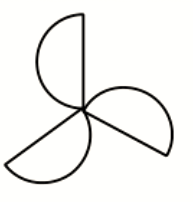

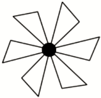
	A.	B.	C.	D.
2020年6月30日，深圳市总工会启动“百万职工消费扶贫采购节”活动，预计撬动扶贫消费额约
150 000 000元。将150 000 000用科学记数法表示为(　　　)
	A.	B.	C.	D.
下列哪个图形，主视图、左视图和俯视图相同的是(　　　)
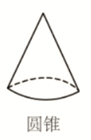
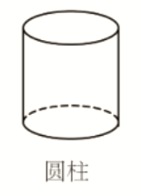
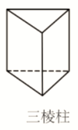
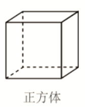
	A.圆锥	B.圆柱	C.三棱柱	D.正方体
某同学在今年的中考体育测试中选考跳绳。考前一周，他记录了自己五次跳绳的成绩（次数/分钟）：247,253,247,255,263.这五次成绩的**平均数**和**中位数**分别是（）(　　　)
	A.253，253	B.255，253	C.253，247	D.255，247
下列运算正确的是（
	A. 		B.
	C. 		D.

一把直尺与30°的直角三角板如图所示，∠1=40°，则∠2=(　　　)
	A.50°	B.60°	C.70°	D.80°
如图，已知*AB*=*AC*，*BC*=6，山尺规作图痕迹可求出*BD*=(　　　)
	A.2	B.3	C.4	D.5
以下说法正确的是(　　　)
	A.平行四边形的对边相等	B.圆周角等于圆心角的一半
	C.分式方程的解为*x*=2	D.三角形的一个外角等于两个内角的和
如图，为了测量一条河流的宽度，一测量员在河岸边相距200米的*P*、*Q*两点分别测定对岸一棵树*T*的位置，*T*在*P*的正北方向，且*T*在*Q*的北偏西70°方向，则河宽（*PT*的长）可以表示为（） (　　　)
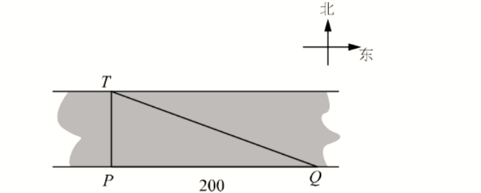
	A.200tan70°米	B.米
	C.200sin70°米	D.米

二次函数*y*=*ax*2+*bx*+*c*（*a*≠0）的图象如图所示，下列说法错误的是(　　　)
	A.	B.4*ac*-*b*2<0
	C.3*a*+*c*>0	D.*ax*2+*bx*+*c*=*n*+1无实数根
如图，矩形纸片*ABCD*中，*AB*=6，*BC*=12.将纸片折叠，使点*B*落在边*AD*的延长线上的点*G*处，折痕为*EF*，点*E*、*F*分别在边*AD*和边*BC*上。连接*BG*，交*CD*于点*K*,*FG*交*CD*于点*H*。给出以下结论：
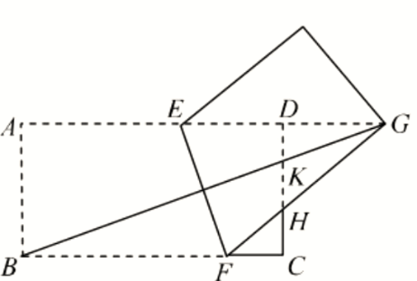
*EF*⊥*BG*；②*GE**=**GF*；③△*GDK*和△*GKH*的面积相等；④当点*F*与点*C*重合时，∠*DEF*=75°
其中**正确**的结论共有(　　　)
	A.1个	B.2个	C.3个	D.4个
**二、填空题（每小题3分，共4小题，满分12分）**
分解因式：*m*3-*m*=<u>　　　　</u>.
口袋内装有编号分别为1,2,3,4,5,6,7的七个球（除编号外都相同），从中随机摸出一个球，则摸出编号为偶数的球的概率是<u>　　　　</u>.
如图，在平面直角坐标系中，*ABCO*为平行四边形，*O*（0，0），*A*（3，1），*B*（1，2），反比例函数的图象经过*OABC*的顶点C，则*k*=<u>　　　　.</u>
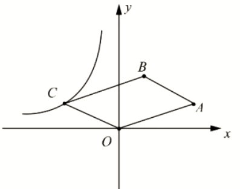
如图，已知四边形*ABCD*，*AC*与*BD*相交于点*O*，∠*ABC*=∠*DAC*=90°，，，则=<u>　　　　.</u>

**三、解答题（第17题5分，第18题6分，第19题7分，第20题8分，第21题8分，第22题9分，第23题9分，满分52分）**
计算：
先化简，再求值：，其中*a*=2.
以人工智能、大数据、物联网为基础的技术创新促进了新业态蓬勃发展，新业态发展对人才的需求更加旺盛。某大型科技公司上半年新招聘软件、硬件、总线、测试四类专业的毕业生，现随机调査了*m*名新聘毕业生的专业情况，并将调查结果绘制成如下两幅不完整的统计图:

根据以上信息，解答下列问题：
（1）*m*=<u>　　　　</u>，n=<u>　　　　</u>.
（2）请补全条形统计图；
（3）在扇形统计图中，“软件”所对应圆心角的度数是<u>　　　　.</u>
（4）若该公司新聘600名毕业生，请你估计“总线”专业的毕业生有<u>　　　　</u>名
如图，*AB*为⊙*O*的直径，点*C*在⊙*O*上，*AD*与过点*C*的切线互相垂直，垂足为*D*.连接*BC*并延长，交*AD*的延长线于点*E*

（1）求证：*AE*=*AB*
（2）若*AB*=10，*BC*=6，求*CD*的长
端午节前夕，某商铺用620元购进50个肉粽和30个蜜枣粽，肉粽的进货单价比蜜枣粽的进货单价多6元
（1）肉粽和蜜枣粽的进货单价分别是多少元？
（2）由于粽子畅销，商铺决定再购进这两种粽子共300个，其中肉粽数量不多于蜜枣粽数量的2倍，且每种粽子的进货单价保持不变，若肉粽的销售单价为14元，蜜枣粽的销售单价为6元，试问第二批购进肉粽多少个时，全部售完后，第二批粽子获得利润最大？第二批粽子的最大利润是多少元？
背景：一次小组合作探究课上，小明将两个正方形按背景图位置摆放（点*E*，*A*，*D*在同一条直线上），
发现*BE*=*DG*且*BE*⊥*DG*。
小组讨论后，提出了三个问题，请你帮助解答：
（1）将正方形*AEFG*绕点*A*按逆时针方向旋转，（如图1）还能得到*BE*=*DG*吗？如果能，请给出证明．如
若不能，请说明理由：
（2）把背景中的正方形分别改为菱形*AEFG*和菱形*ABCD*，将菱形*AEFG*绕点*A*按顺时针方向旋转，（如图2）试问当∠*EAG*与∠*BAD*的大小满足怎样的关系时，背景中的结论*BE*=*DG*仍成立？请说明理由；
（3）把背景中的正方形改成矩形*AEFG*和矩形*ABCD*，且，*AE*=4，*AB*=8，将矩形*AEFG*绕点*A*按顺时针方向旋转（如图3），连接*DE*，*BG*。小组发现：在旋转过程中， *BG*2+*DE*2是定值，请求出这个定值
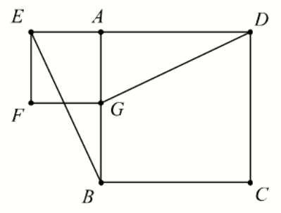
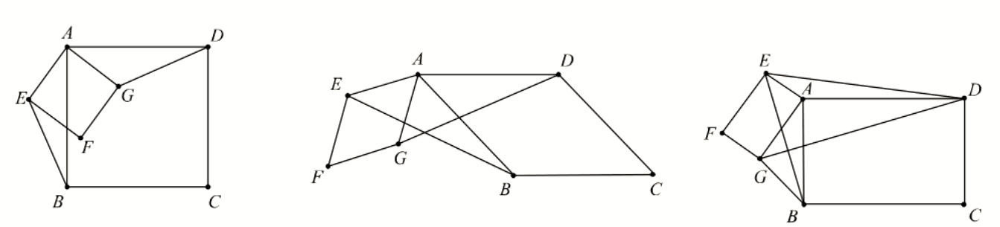
如图1，抛物线*y*=*ax*2+*bx*+3（*a*≠0）与*x*轴交于*A*（-3，0）和*B*（1，0），与*y*轴交于点*C*，顶点为*D*
（1）求解抛物线解析式
（2）连接*AD*，*CD*，*BC*，将△*OBC*沿着*x*轴以每秒1个单位长度的速度向左平移，得到,点*O*、*B*、*C*的对应点分别为点，，，设平移时间为*t*秒，当点与点*A*重合时停止移动。记△与四边形*AOCD*的重叠部分的面积为*S*，请**直接写出***S*与时间*t*的函数解析式;
（3）如图2，过抛物线上**任意**一点*M*（*m*，*n*）向直线*l*:作垂线，垂足为*E*，试问在该抛物线的对称轴上是否存在一点*F*，使得*ME*-*MF*=？若存在，请求*F*点的坐标；若不存在，请说明理由。

## **深圳市2020年中考数学试卷**

**一、选择题（每小题3分，共12小题，满分36分）**
2020的相反数是(　　　)
	A.2020	B.	C.-2020	D.
【考点】相反数
【答案】C
【解析】由相反数的定义可得选C。
下列图形中既是轴对称图形，也是中心对称图形的是(　　　)

	A.	B.	C.	D.
【考点】轴对称和中心对称
【答案】B
【解析】A图既不是轴对称也不是中心对称；C图为轴对称，但不是中心对称；D图为中心对称，但不是轴对称，故选B。
2020年6月30日，深圳市总工会启动“百万职工消费扶贫采购节”活动，预计撬动扶贫消费额约
150 000 000元。将150 000 000用科学记数法表示为(　　　)
	A.	B.	C.	D.
【考点】科学计数法
【答案】D
【解析】用科学计数法表示小数点需向左移动8位，故选D。
下列哪个图形，主视图、左视图和俯视图相同的是(　　　)

	A.圆锥	B.圆柱	C.三棱柱	D.正方体
【考点】三视图
【答案】D
【解析】分析以上立方体的三视图，可知三视图都相同的为D项。
某同学在今年的中考体育测试中选考跳绳。考前一周，他记录了自己五次跳绳的成绩（次数/分钟）：247,253,247,255,263.这五次成绩的**平均数**和**中位数**分别是（）(　　　)
	A.253，253	B.255，253	C.253，247	D.255，247
【考点】数据的描述
【答案】A
【解析】求平均数可用基准数法，设基准数为250，则新数列为-4，3，-3，5，13，新数列的平均数为3，则原数列的平均数为253；对数据从小到大进行排列，可知中位数为253，故选A。
下列运算正确的是（
	A. 		B.
	C. 		D.

【考点】整式的运算
【答案】B
【解析】A项结果应为3a，C项结果应为，D项结果应为。
一把直尺与30°的直角三角板如图所示，∠1=40°，则∠2=(　　　)
	A.50°	B.60°	C.70°	D.80°
【考点】平行线的性质
【答案】D

【解析】令直角三角形中与30°互余的角为，则，由两直线平行，同旁内角互补得：，故选D。
如图，已知*AB*=*AC*，*BC*=6，山尺规作图痕迹可求出*BD*=(　　　)
	A.2	B.3	C.4	D.5
【考点】等腰三角形的三线合一
【答案】B
【解析】由作图痕迹可知AD为的角平分线，而AB=AC，由等腰三角形的三线合一知D为BC重点，BD=3，故选B。
以下说法正确的是(　　　)
	A.平行四边形的对边相等	B.圆周角等于圆心角的一半
	C.分式方程的解为*x*=2	D.三角形的一个外角等于两个内角的和
【考点】命题的真假
【答案】A
【解析】B没有强调同弧，同弧所对的圆周角等于圆心角的一半；C项*x*=2为增根，原分式方程无解；D项没有指明两个内角为不想邻的内角，故错误。正确的命题为A。
如图，为了测量一条河流的宽度，一测量员在河岸边相距200米的*P*、*Q*两点分别测定对岸一棵树*T*的位置，*T*在*P*的正北方向，且*T*在*Q*的北偏西70°方向，则河宽（*PT*的长）可以表示为（） (　　　)

	A.200tan70°米	B.米
	C.200sin70°米	D.米
【考点】直角三角形的边角关系
【答案】B
【解析】由题意知，则，变形可得选B。

二次函数*y*=*ax*2+*bx*+*c*（*a*≠0）的图象如图所示，下列说法错误的是(　　　)
	A.	B.4*ac*-*b*2<0
	C.3*a*+*c*>0	D.*ax*2+*bx*+*c*=*n*+1无实数根
【考点】二次函数综合
【答案】B
【解析】由图可知二次函数对称轴为*x*=-1，则根据对称性可得函数与*x*轴的另一交点坐标为(1，0)，代入
解析式*y*=*ax*2+*bx*+*c*可得*b*=2*a*，*c*=-3*a*，其中*a*<0。*b*<0，*c*>0，3*a*+*c*=0，*abc*>0；二次函数与*x*轴有两个交点，，故*B*项错误；*D*项可理解为二次函数与直线*y*=*n*+1无交点，显然成立。综上，此题选*B*。
如图，矩形纸片*ABCD*中，*AB*=6，*BC*=12.将纸片折叠，使点*B*落在边*AD*的延长线上的点*G*处，折痕为*EF*，点*E*、*F*分别在边*AD*和边*BC*上。连接*BG*，交*CD*于点*K*,*FG*交*CD*于点*H*。给出以下结论：

*EF*⊥*BG*；②*GE**=**GF*；③△*GDK*和△*GKH*的面积相等；④当点*F*与点*C*重合时，∠*DEF*=75°
其中**正确**的结论共有(　　　)
	A.1个	B.2个	C.3个	D.4个
【考点】几何综合
【答案】C
【解析】由折叠易证四边形EBFG为菱形，故EF⊥BG，GE=GF，∴①②正确；KG平分，,,∴,,故③错误；当点F与点C重合时，BE=BF=BC=12=2AB，∴，，故④正确。综合，正确的为①②④，选C。
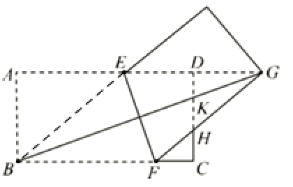
**二、填空题（每小题3分，共4小题，满分12分）**
分解因式：*m*3-*m*=<u>　　　　</u>.
【考点】因式分解
【答案】
【解析】
口袋内装有编号分别为1,2,3,4,5,6,7的七个球（除编号外都相同），从中随机摸出一个球，则摸出编号为偶数的球的概率是<u>　　　　</u>.
【考点】等可能性事件概率
【答案】
【解析】摸到编号为偶数的球的情况有3种：编号为2，4，6，∴概率为。
如图，在平面直角坐标系中，*ABCO*为平行四边形，*O*（0，0），*A*（3，1），*B*（1，2），反比例函数的图象经过*OABC*的顶点C，则*k*=<u>　　　　.</u>

【考点】反比例函数k值
【答案】-2
【解析】如图，向坐标轴作垂线，易证△CDO≌△BFA，CD=BF=1,DO=FA=2,∴C点坐标为(-2，1)，故k=-2

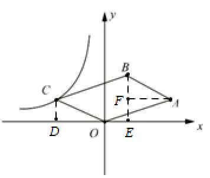
如图，已知四边形*ABCD*，*AC*与*BD*相交于点*O*，∠*ABC*=∠*DAC*=90°，，，则=<u>　　　　.</u>
【考点】三角形形似
【答案】
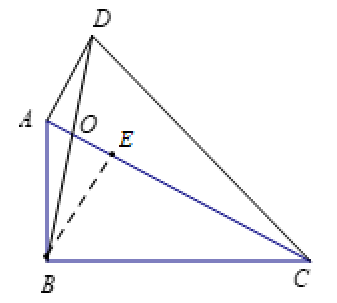
【解析】过B点作BE//AD交AC于点E，则BE⊥AD，△ADO∽△EBO，
∴,由可得CE=2BE=4AE，
∴
**三、解答题（第17题5分，第18题6分，第19题7分，第20题8分，第21题8分，第22题9分，第23题9分，满分52分）**
计算：
【考点】实数的计算
【答案】2
【解析】
解：
先化简，再求值：，其中*a*=2.
【考点】代数式的化简求值
【答案】
【解析】
解：
当a=2时，
以人工智能、大数据、物联网为基础的技术创新促进了新业态蓬勃发展，新业态发展对人才的需求更加旺盛。某大型科技公司上半年新招聘软件、硬件、总线、测试四类专业的毕业生，现随机调査了*m*名新聘毕业生的专业情况，并将调查结果绘制成如下两幅不完整的统计图:

根据以上信息，解答下列问题：
（1）*m*=<u>　　　　</u>，n=<u>　　　　</u>.
（2）请补全条形统计图；
（3）在扇形统计图中，“软件”所对应圆心角的度数是<u>　　　　.</u>
（4）若该公司新聘600名毕业生，请你估计“总线”专业的毕业生有<u>　　　　</u>名
【考点】数据统计
【答案】（1）50，10（2）见解析（3）700（4）180
【解析】由统计图可知，，n=10。硬件专业的毕业生为人，则统计图为

软件专业的毕业生对应的占比为，所对的圆心角的度数为。若该公司新聘600名毕业生，“总线”专业的毕业生为名。
如图，*AB*为⊙*O*的直径，点*C*在⊙*O*上，*AD*与过点*C*的切线互相垂直，垂足为*D*.连接*BC*并延长，交*AD*的延长线于点*E*

（1）求证：*AE*=*AB*
（2）若*AB*=10，*BC*=6，求*CD*的长
【考点】圆的证明与计算
【解析】
解：（1）证：连接*OC*
∵*CD*与相切于*C*点
∴*OC*⊥*CD*
又∵*CD*⊥*AE*
∴*OC*//*AE*
∴
∵*OC*=*OB*

∴
∴
∴*AE*=*AB*
（2）连接*AC*
∵*AB*为的直径
∴
∴
∵*AB*=*AE*，*AC*⊥*BE*
∴*EC*=*BC*=6
∵,
∴△*EDC*∽△*ECA*
∴
∴
端午节前夕，某商铺用620元购进50个肉粽和30个蜜枣粽，肉粽的进货单价比蜜枣粽的进货单价多6元
（1）肉粽和蜜枣粽的进货单价分别是多少元？
（2）由于粽子畅销，商铺决定再购进这两种粽子共300个，其中肉粽数量不多于蜜枣粽数量的2倍，且每种粽子的进货单价保持不变，若肉粽的销售单价为14元，蜜枣粽的销售单价为6元，试问第二批购进肉粽多少个时，全部售完后，第二批粽子获得利润最大？第二批粽子的最大利润是多少元？
【考点】方程（组）与不等式
【解析】
解：（1）设肉粽和蜜枣粽的进货单价分别为*x*,*y*元，则根据题意可得：
解此方程组得：
答：肉粽得进货单价为10元，蜜枣粽得进货单价为4元
（2）设第二批购进肉粽*t*个，第二批粽子得利润为*W*，则
∵*k*=2>0
∴*W*随*t*的增大而增大。
由题意，解得
∴当*t*=200时，第二批粽子由最大利润，最大利润
答：第二批购进肉粽200个时，全部售完后，第二批粽子获得利润最大，最大利润为1000元。
背景：一次小组合作探究课上，小明将两个正方形按背景图位置摆放（点*E*，*A*，*D*在同一条直线上），
发现*BE*=*DG*且*BE*⊥*DG*。
小组讨论后，提出了三个问题，请你帮助解答：
（1）将正方形*AEFG*绕点*A*按逆时针方向旋转，（如图1）还能得到*BE*=*DG*吗？如果能，请给出证明．如
若不能，请说明理由：
（2）把背景中的正方形分别改为菱形*AEFG*和菱形*ABCD*，将菱形*AEFG*绕点*A*按顺时针方向旋转，（如图2）试问当∠*EAG*与∠*BAD*的大小满足怎样的关系时，背景中的结论*BE*=*DG*仍成立？请说明理由；
（3）把背景中的正方形改成矩形*AEFG*和矩形*ABCD*，且，*AE*=4，*AB*=8，将矩形*AEFG*绕点*A*按顺时针方向旋转（如图3），连接*DE*，*BG*。小组发现：在旋转过程中， *BG*2+*DE*2是定值，请求出这个定值

【考点】手拉手，相似，勾股
【解析】
解：（1）证明：∵四边形*ABCD*为正方形
∴*AB*=*AD*，
∵四边形*AEFG*为正方形
∴*AE*=*AG*，
∴
在△*EAB*和△*GAD*中有：
∴△*EAB*≌△*GAD*
∴*BE*=*DG*
(2)当∠*EAG*=∠*BAD*时，*BE*=*DG*成立。
证明：∵四边形*ABCD*菱形
∴*AB*=*AD*
∵四边形*AEFG*为正方形
∴*AE*=*AG*
∵∠*EAG*=∠*BAD*
∴
∴
在△*EAB*和△*GAD*中有：
∴△*EAB*≌△*GAD*
∴*BE*=*DG*
(3)连接*EB*，*BD*,设*BE*和*GD*相交于点*H*
∵四边形*AEFG*和*ABCD*为矩形
∴
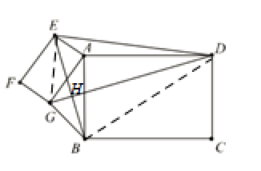
∴
∵
∴△*EAB*∽△*GAD*
∴
∴
∴,
∴
,
∴
如图1，抛物线*y*=*ax*2+*bx*+3（*a*≠0）与*x*轴交于*A*（-3，0）和*B*（1，0），与*y*轴交于点*C*，顶点为*D*
（1）求解抛物线解析式
（2）连接*AD*，*CD*，*BC*，将△*OBC*沿着*x*轴以每秒1个单位长度的速度向左平移，得到,点*O*、*B*、*C*的对应点分别为点，，，设平移时间为*t*秒，当点与点*A*重合时停止移动。记△与四边形*AOCD*的重叠部分的面积为*S*，请**直接写出***S*与时间*t*的函数解析式;
（3）如图2，过抛物线上**任意**一点*M*（*m*，*n*）向直线*l*:作垂线，垂足为*E*，试问在该抛物线的对称轴上是否存在一点*F*，使得*ME*-*MF*=？若存在，请求*F*点的坐标；若不存在，请说明理由。

【考点】二次函数，变量之间的关系，存在性问题
【解析】
解：（1）将*A*（-3，0）和*B*（1，0）代入抛物线解析式*y*=*ax*2+*bx*+3中，可得：
∴抛物线解析式为*y*=-*x*2-2*x*+3
（2）①如图所示，当0<*t*<1时，

由抛物线解析式得顶点*D*坐标为(-1，4)，则直线*AD*的解析式为
*y*=2*x*+6,当在*AD*上时，坐标为
②当时，完全在四边形*AOCD*内，
③当时，如图所示，过*G*点作*GH*⊥,设*HG*=*x*，
∵
∴

∵
∴
∴
而
∴
∴
∴
综上：
（3）假设存在，设*F*点坐标为(-1，*t*)
∵点*M*（*m*，*n*）在抛物线上
∴
∴
∴
而
∴
∴
∴，
∴

