## **2022****年深圳市初中学业水平测试（回忆版）**

## **数学学科试卷**
**说明****:1****．答题前，请将姓名、准考证号和学校用黑色字迹的钢笔或签字笔填写在答题卡定的位置上，并将条形码粘贴好． **
**2****．全卷共****6****页． 考试时间****90****分钟，满分****100****分． **
**3****．作答选择题****1-10****，选出每题答案后，用****2B****铅笔把答题卡上对应题目答案标号的信息点框涂黑． 如需改动，用橡皮擦干净后，再选涂其它答案． 作答非选择题****11-22****，用黑色字迹的钢笔或签字笔将答案（含作辅助线）写在答题卡指定区域内． 写在本试卷或草稿纸上，其答案一律无效． **
**4****．考试结束后，请将答题卡交回． **

**第一部分**** ****选择题**

**一、选择题（本大题共****10****小题，每小题****3****分，共****30****分，每小题有四个选项，其中只有一个是正确的）**
1. 下列互为倒数的是（    ）
A. 和	B. 和	C. 和	D. 和
2. 下列图形中，主视图和左视图一样的是（    ）
A. 	B. 	C. 	D.
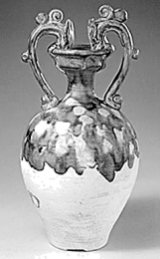

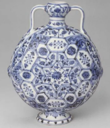

3. 某学校进行演讲比赛，最终有7位同学进入决赛，这七位同学的评分分别是：9.5，9.3，9.1，9.4，9.7，9.3，9.6．请问这组评分的众数是（    ）
A. 9.5	B. 9.4	C. 9.1	D. 9.3
4. 某公司一年销售利润是1.5万亿元．1.5万亿用科学记数法表示（    ）

A. 	B. 	C. 	D.
5. 下列运算正确是（    ）

A. 	B. 	C. 	D.
6. 一元一次不等式组的解集为（    ）
A. 	B.

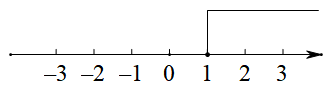
C. 	D.

7. 将一副三角板如图所示放置，斜边平行，则的度数为（    ）
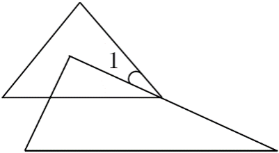
A 	B. 	C. 	D.

8. 下列说法错误的是（    ）
A. 对角线垂直且互相平分的四边形是菱形	B. 同圆或等圆中，同弧对应的圆周角相等
C. 对角线相等的四边形是矩形	D. 对角线垂直且相等的四边形是正方形
9. 张三经营了一家草场，草场里面种植上等草和下等草．他卖五捆上等草的根数减去11根，就等下七捆下等草的根数；卖七捆上等草的根数减去25根，就等于五捆下等草的根数．设上等草一捆为根，下等草一捆为根，则下列方程正确的是（    ）
A.  	B.  	C. 	D.
10. 如图所示，已知三角形为直角三角形，为圆切线，为切点，则和面积之比为（    ）
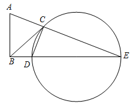
A 	B. 	C. 	D.

**第二部分**** ****非选择题**

**二、填空题（本大题共****5****小题，每小题****3****分，共****15****分）**
11. 分解因式：=____．
12. 某工厂一共有1200人，为选拔人才，提出了一些选拔的条件，并进行了抽样调查．从中抽出400人，发现有300人是符合条件的，那么则该工厂1200人中符合选拔条件的人数为________________．
13. 已知一元二次方程有两个相等实数根，则的值为________________．

14. 如图，已知直角三角形中，，将绕点点旋转至的位置，且在的中点，在反比例函数上，则的值为________________．

15. 已知是直角三角形，连接以为底作直角三角形且是边上的一点，连接和且则长为______．
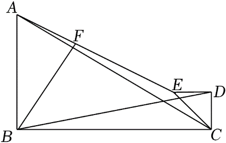
**三、解答题（本题共****7****小题，其中第****16****题****5****分，第****17****题****7****分，第****18****题****8****分，第****19****题****8****分，第****20****题****8****分，第****21****题****9****分，第****22****题****10****分，共****55****分）**
16.
17. 先化简，再求值：其中
18. 某工厂进行厂长选拔，从中抽出一部分人进行筛选，其中有“优秀”，“良好”，“合格”，“不合格”．
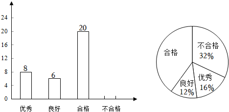
（1）本次抽查总人数为<u>        </u>，“合格”人数的百分比为<u>        </u>．
（2）补全条形统计图．
（3）扇形统计图中“不合格人数”的度数为<u>        </u>．
（4）在“优秀”中有甲乙丙三人，现从中抽出两人，则刚好抽中甲乙两人的概率为<u>         </u>．
19. 某学校打算购买甲乙两种不同类型的笔记本．已知甲种类型的电脑的单价比乙种类型的要便宜10元，且用110元购买的甲种类型的数量与用120元购买的乙种类型的数量一样．
（1）求甲乙两种类型笔记本的单价．
（2）该学校打算购买甲乙两种类型笔记本共100件，且购买的乙的数量不超过甲的3倍，则购买的最低费用是多少?
20. 二次函数先向上平移6个单位，再向右平移3个单位，用光滑的曲线画在平面直角坐标系上．
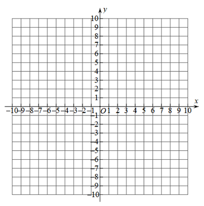
|  |  |
| --- | --- |
|  |  |
|  |  |
|  |  |
|  |  |
|  |  |

（1）的值为                      ；
（2）在坐标系中画出平移后的图象并求出与的交点坐标；
（3）点在新的函数图象上，且两点均在对称轴的同一侧，若则                    （填“”或“”或“”）
21. 一个玻璃球体近似半圆为直径，半圆上点处有个吊灯的中点为

（1）如图①，为一条拉线，在上，求的长度．
（2）如图②，一个玻璃镜与圆相切，为切点，为上一点，为入射光线，为反射光线，求的长度．
（3）如图③，是线段上的动点，为入射光线，为反射光线交圆于点在从运动到的过程中，求点的运动路径长．
22. （1）【探究发现】如图①所示，在正方形中，为边上一点，将沿翻折到处，延长交边于点．求证：
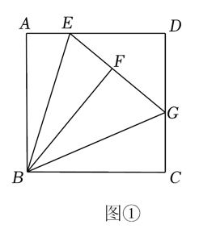
（2）【类比迁移】如图②，在矩形中，为边上一点，且将沿翻折到处，延长交边于点延长交边于点且求的长．
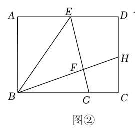
（3）【拓展应用】如图③，在菱形中，为边上的三等分点，将沿翻折得到，直线交于点求的长．
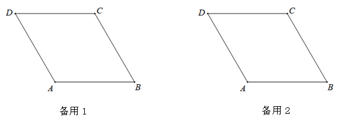
