## **2022****年深圳市初中学业水平测试（回忆版）**

## **数学学科试卷**
**说明****:1****．答题前，请将姓名、准考证号和学校用黑色字迹的钢笔或签字笔填写在答题卡定的位置上，并将条形码粘贴好． **
**2****．全卷共****6****页． 考试时间****90****分钟，满分****100****分． **
**3****．作答选择题****1-10****，选出每题答案后，用****2B****铅笔把答题卡上对应题目答案标号的信息点框涂黑． 如需改动，用橡皮擦干净后，再选涂其它答案． 作答非选择题****11-22****，用黑色字迹的钢笔或签字笔将答案（含作辅助线）写在答题卡指定区域内． 写在本试卷或草稿纸上，其答案一律无效． **
**4****．考试结束后，请将答题卡交回． **

**第一部分**** ****选择题**

**一、选择题（本大题共****10****小题，每小题****3****分，共****30****分，每小题有四个选项，其中只有一个是正确的）**
1. 下列互为倒数的是（    ）
A. 和	B. 和	C. 和	D. 和
【答案】A
【解析】
【分析】根据互为倒数的意义，找出乘积为1的两个数即可．
【详解】解：A．因为，所以3和是互为倒数，因此选项符合题意；
B．因为，所以与2不是互为倒数，因此选项不符合题意；
C．因为，所以3和不是互为倒数，因此选项不符合题意；
D．因为，所以和不是互为倒数，因此选项不符合题意；
故选：A．
【点睛】本题考查了倒数，解题关键是理解互为倒数的意义是正确判断的前提，掌握“乘积为1的两个数互为倒数”．

2. 下列图形中，主视图和左视图一样的是（    ）
A. 	B. 	C. 	D.

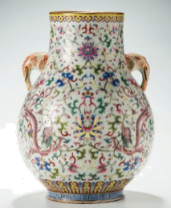

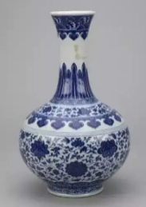
【答案】D
【解析】
【分析】根据各个几何体的主视图和左视图进行判定即可．
【详解】解：A．主视图和左视图不相同，故本选项不合题意；
B．主视图和左视图不相同，故本选项不合题意；
C．主视图和左视图不相同，故本选项不合题意；
D．主视图和左视图相同，故本选项符合题意；
故选：D．
【点睛】本题考查简单几何体的三视图，解题的关键是掌握各种几何体的三视图的形状．
3. 某学校进行演讲比赛，最终有7位同学进入决赛，这七位同学的评分分别是：9.5，9.3，9.1，9.4，9.7，9.3，9.6．请问这组评分的众数是（    ）
A. 9.5	B. 9.4	C. 9.1	D. 9.3
【答案】D
【解析】
【分析】直接根据众数的概念求解即可．
【详解】解：这七位同学的评分分别是9.5，9.3，9.1，9.4，9.7，9.3，9.6．
这组评分的众数为9.3，
故选：D．
【点睛】本题主要考查众数：是一组数据中出现次数最多的数，解题的关键是掌握众数的定义．
4. 某公司一年的销售利润是1.5万亿元．1.5万亿用科学记数法表示（    ）
A. 	B. 	C. 	D.
【答案】B
【解析】
【分析】科学记数法的表示形式为的形式，其中，为整数．确定的值时，要看把原数变成时，小数点移动了多少位，的绝对值与小数点移动的位数相同．当原数绝对值时，是正数；当原数的绝对值时，是负数．
【详解】解：1.5万亿．
故选：B．
【点睛】本题考查科学记数法的表示方法．科学记数法的表示形式为的形式，其中，为整数，解题的关键是正确确定的值以及的值．
5. 下列运算正确的是（    ）
A. 	B. 	C. 	D.
【答案】A
【解析】
【分析】分别根据同底数幂的乘法法则，积的乘方运算法则，单项式乘多项式及合并同类项的法则逐一判断即可．
【详解】解：，计算正确，故此选项符合题意；
B、，原计算错误，故此选项不符合题意；
C、，原计算错误，故此选项不符合题意；
D、，不同类项不能合并，原计算错误，故此选项不符合题意．

故选：A．
【点睛】本题考查了同底数幂的乘法，合并同类项以及幂的乘方与积的乘方，熟记幂的运算法则是解答本题的关键．
6. 一元一次不等式组的解集为（    ）
A. 	B.
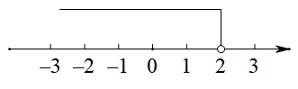

C. 	D.
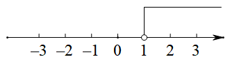
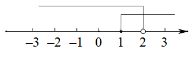
【答案】D
【解析】
【分析】解出不等式组的解集，再把不等式的解集在数轴表示出来即可求解．
【详解】解：不等式，
移项得：，
∴不等式组的解集为：，
故选：D．
【点睛】本题考查了求不等式组的解集并在数轴上表示解集，根据不等式的解集，利用找不等式组的解集的规律的出解集是解题的关键．
7. 将一副三角板如图所示放置，斜边平行，则的度数为（    ）

A. 	B. 	C. 	D.
【答案】C
【解析】
【分析】由题意得：，，利用平行线的性质可求，进而可求解．
【详解】解：如图，，，
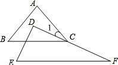
，
，
，
故选：C．
【点睛】本题主要考查平行线的性质，解题的关键是掌握平行线的性质．
8. 下列说法错误的是（    ）
A. 对角线垂直且互相平分的四边形是菱形	B. 同圆或等圆中，同弧对应的圆周角相等
C. 对角线相等的四边形是矩形	D. 对角线垂直且相等的四边形是正方形
【答案】C
【解析】
【分析】根据平行四边形、矩形、菱形、正方形的判定方法及圆周角定理，分别分析得出答案．
【详解】解：A．对角线垂直且互相平分四边形是菱形，所以A选项说法正确，故A选项不符合题意；

B．同圆或等圆中，同弧对应的圆周角相等，所以A选项说法正确，故B选项不符合题意；
C．对角线相等的四边形是不一定是矩形，所以C选项说法不正确，故C选项符合题意；
D．对角线垂直且相等的平行四边形是正方形，所以D选项说法正确，故D选项不符合题意．
故选：C．
【点睛】本题主要考查了圆周角定理，平行四边形的判定与性质，菱形的判定等知识，熟练掌握圆周角定理，平行四边形的判定与性质，菱形的判定方法等进行求解是解决本题的关键．
9. 张三经营了一家草场，草场里面种植上等草和下等草．他卖五捆上等草的根数减去11根，就等下七捆下等草的根数；卖七捆上等草的根数减去25根，就等于五捆下等草的根数．设上等草一捆为根，下等草一捆为根，则下列方程正确的是（    ）
A.  	B.  	C. 	D.
【答案】C
【解析】
【分析】设上等草一捆为根，下等草一捆为根，根据“卖五捆上等草的根数减去11根，就等下七捆下等草的根数；卖七捆上等草的根数减去25根，就等于五捆下等草的根数．”列出方程组，即可求解．
【详解】解：设上等草一捆为根，下等草一捆为根，根据题意得：
．
故选：C
【点睛】本题主要考查了二元一次方程组的应用，明确题意，准确得到等量关系是解题的关键．
10. 如图所示，已知三角形为直角三角形，为圆切线，为切点，则和面积之比为（    ）

A. 	B. 	C. 	D.
【答案】B
【解析】
【分析】根据圆周角定理，切线的性质以及等腰三角形的判定和性质，全等三角形的判定及性质进行计算即可．
【详解】解：如图取中点*O*，连接．
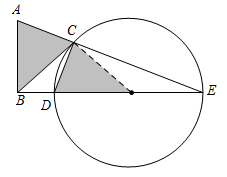
∵是圆*O*的直径．
∴．
∵与圆*O*相切．
∴．
∵．
∴．
∵．
∴．
又∵．
∴．
∵，，．
∴．
∴．
∵点*O*是的中点．
∴．
∴．
∴
故答案是：1∶2．
故选：B．
【点睛】本题考查切线的性质，圆周角定理，等腰三角形以及全等三角形的性质，理解切线的性质，圆周角定理以及全等三角形的判定和性质是解决问题的前提．

**第二部分**** ****非选择题**

**二、填空题（本大题共****5****小题，每小题****3****分，共****15****分）**
11. 分解因式：=____．
【答案】．
【解析】
【分析】利用平方差公式分解因式即可得到答案
【详解】解：．
故答案为：
【点睛】本题考查的是利用平方差公式分解因式，掌握利用平方差公式分解因式是解题的关键．
12. 某工厂一共有1200人，为选拔人才，提出了一些选拔的条件，并进行了抽样调查．从中抽出400人，发现有300人是符合条件的，那么则该工厂1200人中符合选拔条件的人数为________________．
【答案】900人
【解析】
【分析】符合选拔条件的人数=该工厂总共人数×符合条件的人数所占的百分率，列出算式计算即可求解．
【详解】解：（人）．
故答案是：900人．
【点睛】本题考查了用样本估计总体，关键是得到符合条件的人数所占的百分率．
13. 已知一元二次方程有两个相等的实数根，则的值为________________．
【答案】9
【解析】
【分析】根据根的判别式的意义得到△，然后解关于的方程即可．
【详解】解：根据题意得△，
解得．
故答案为：9．
【点睛】本题考查了根的判别式，解题的关键是掌握一元二次方程的根与△有如下关系：当△时，方程有两个不相等的实数根；当△时，方程有两个相等的实数根；当△时，方程无实数根．
14. 如图，已知直角三角形中，，将绕点点旋转至的位置，且在的中点，在反比例函数上，则的值为________________．
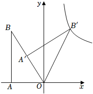
【答案】
【解析】
【分析】连接，作轴于点，根据直角三角形斜边中线的性质和旋转的性质得出是等边三角形，从而得出，即可得出，解直角三角形求得的坐标，进一步求得．
【详解】解：连接，作轴于点，
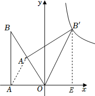
由题意知，是中点，，，
，
是等边三角形，
，
，，
，
，
，
，
在反比例函数上，
．
故答案为：．
【点睛】本题考查反比例函数图象上点的坐标特征，坐标与图形变化性质，解题的关键是明确题意，利用数形结合的思想解答．
15. 已知是直角三角形，连接以为底作直角三角形且是边上的一点，连接和且则长为______．

【答案】
【解析】
【分析】将线段绕点顺时针旋转，得到线段，连接，*HE*，利用证明，得，，则，即可解决问题．
【详解】解：将线段绕点顺时针旋转，得到线段，连接，*HE*，
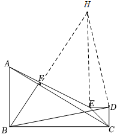
是等腰直角三角形，
又是等腰直角三角形，
，，，
，
，，
，
，
，
，
，
，
故答案为：．
【点睛】本题主要考查了等腰直角三角形的性质，全等三角形的判定与性质，相似三角形的判定与性质等知识，解题的关键是作辅助线构造全等三角形．
**三、解答题（本题共****7****小题，其中第****16****题****5****分，第****17****题****7****分，第****18****题****8****分，第****19****题****8****分，第****20****题****8****分，第****21****题****9****分，第****22****题****10****分，共****55****分）**
16.
【答案】
【解析】
【分析】根据零指数幂、二次根式、锐角三角函数值、负指数幂的运算法则进行计算后，再进行加减运算即可．
【详解】解：原式．
【点睛】此题考查了实数的混合运算，准确求解零指数幂、二次根式、锐角三角函数值、负指数幂是解题的关键．
17. 先化简，再求值：其中
【答案】，
【解析】
【分析】利用分式的相应的运算法则进行化简，再代入相应的值运算即可．
【详解】解：原式
=
将代入得原式．
【点睛】本题主要考查分式的化简求值，解答的关键是对相应的运算法则的掌握．
18. 某工厂进行厂长选拔，从中抽出一部分人进行筛选，其中有“优秀”，“良好”，“合格”，“不合格”．

（1）本次抽查总人数为<u>        </u>，“合格”人数的百分比为<u>        </u>．
（2）补全条形统计图．
（3）扇形统计图中“不合格人数”的度数为<u>        </u>．
（4）在“优秀”中有甲乙丙三人，现从中抽出两人，则刚好抽中甲乙两人的概率为<u>         </u>．
【答案】（1）50人，；
（2）见解析    （3）
（4）
【解析】
【分析】（1）由优秀人数及其所占百分比可得总人数，根据百分比之和为1可得合格人数所占百分比；
（2）总人数乘以不合格人数所占百分比求出其人数，从而补全图形；
（3）用乘以样本中“不合格人数”所占百分比即可得出答案；
（4）列表得出所有等可能结果，从中找到符合条件的结果数，再根据概率公式求解即可．
【小问1详解】
解：本次抽查的总人数为（人，
“合格”人数的百分比为，
故答案为：50人，；
【小问2详解】
解：不合格的人数为：；
补全图形如下：
【小问3详解】
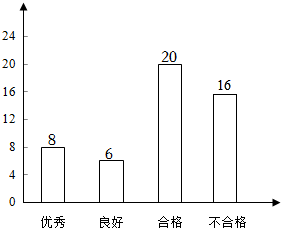
解：扇形统计图中“不合格”人数度数为，

故答案为：；
【小问4详解】
解：列表如下：
|  | 甲 | 乙 | 丙 |
| --- | --- | --- | --- |
| 甲 |  | （乙，甲） | （丙，甲） |
| 乙 | （甲，乙） |  | （丙，乙） |
| 丙 | （甲，丙） | （乙，丙） |  |

由表知，共有6种等可能结果，其中刚好抽中甲乙两人的有2种结果，
所以刚好抽中甲乙两人的概率为．
故答案为：．
【点睛】本题考查了列表法或树状图法求概率、扇形统计图与条形统计图的关联，读懂统计图中的信息、画出树状图或列表是解题的关键．
19. 某学校打算购买甲乙两种不同类型的笔记本．已知甲种类型的电脑的单价比乙种类型的要便宜10元，且用110元购买的甲种类型的数量与用120元购买的乙种类型的数量一样．
（1）求甲乙两种类型笔记本的单价．
（2）该学校打算购买甲乙两种类型笔记本共100件，且购买的乙的数量不超过甲的3倍，则购买的最低费用是多少?
【答案】（1）甲类型的笔记本电脑单价为110元，乙类型的笔记本电脑单价为120元
（2）最低费用为11750元
【解析】
【分析】（1）设甲类型的笔记本电脑单价为*x*元，则乙类型的笔记本电脑为元．列出方程即可解答；
（2）设甲类型笔记本电脑购买了*a*件，最低费用为*w*，列出*w*关于*a*的函数，利用一次函数的增减性进行解答即可．
【小问1详解】
设甲类型的笔记本电脑单价为*x*元，则乙类型的笔记本电脑为元．
由题意得：
解得：
经检验是原方程的解，且符合题意．
∴乙类型的笔记本电脑单价为：（元）．
答：甲类型的笔记本电脑单价为110元，乙类型的笔记本电脑单价为120元．
【小问2详解】
设甲类型笔记本电脑购买了*a*件，最低费用为*w*，则乙类型笔记本电脑购买了件．
由题意得：．
∴．
．
∵，
∴当*a*越大时*w*越小．
∴当时，*w*最小，最小值为（元）．
答：最低费用为11750元．
【点睛】此题考查了分式方程的应用，以及一次函数的应用，掌握分式方程的应用，以及一次函数的应用是解题的关键．
20. 二次函数先向上平移6个单位，再向右平移3个单位，用光滑的曲线画在平面直角坐标系上．

|  |  |
| --- | --- |
|  |  |
|  |  |
|  |  |
|  |  |
|  |  |

（1）的值为                      ；
（2）在坐标系中画出平移后的图象并求出与的交点坐标；
（3）点在新的函数图象上，且两点均在对称轴的同一侧，若则                    （填“”或“”或“”）
【答案】（1）
（2）图见解析，和
（3）或
【解析】
【分析】（1）把点代入即可求解．
（2）根据描点法画函数图象可得平移后的图象，在根据交点坐标的特点得一元二次方程，解出方程即可求解．
（3）根据新函数图象及性质可得：当*P*，*Q*两点均在对称轴的左侧时，若，则，当*P*，*Q*两点均在对称轴的右侧时，若，则，进而可求解．

【小问1详解】
解：当时，，
∴．
【小问2详解】
平移后的图象如图所示：
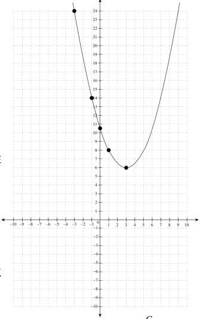
由题意得：，
解得，
当时，，则交点坐标为：，
当时，，则交点坐标为：，
综上所述：与的交点坐标分别为和．
【小问3详解】
由平移后的二次函数可得：对称轴，，
∴当时，随*x*的增大而减小，当时，随*x*的增大而增大，
∴当*P*，*Q*两点均在对称轴的左侧时，若，则，
当*P*，*Q*两点均在对称轴的右侧时，若，则，
综上所述：点在新函数图象上，且*P*，*Q*两点均在对称轴同一侧，若，则或，
故答案为：或．
【点睛】本题考查了二次函数的图象及性质，二次函数图象的平移，理解二次函数的性质，利用数形结合思想解决问题是解题的关键．
21. 一个玻璃球体近似半圆为直径，半圆上点处有个吊灯的中点为
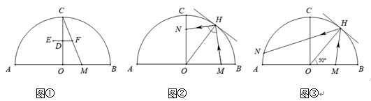
（1）如图①，为一条拉线，在上，求的长度．
（2）如图②，一个玻璃镜与圆相切，为切点，为上一点，为入射光线，为反射光线，求的长度．
（3）如图③，是线段上的动点，为入射光线，为反射光线交圆于点在从运动到的过程中，求点的运动路径长．
【答案】（1）2    （2）
（3）
【解析】
【分析】（1）由，可得出为的中位线，可得出*D*为中点，即可得出的长度；
（2）过*N*点作，交于点*D*，可得出为等腰直角三角形，根据,可得出，设，则，根据，即可求得，再根据勾股定理即可得出答案；
（3）依题意得出点*N*路径长为： ，推导得出，即可计算给出，即可得出答案．
【小问1详解】
∵
∴为的中位线
∴*D*为的中点
∵
∴
【小问2详解】
过*N*点作，交于点*D**，*
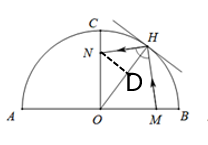
∵，
∴为等腰直角三角形，即，
又∵，
∴，
∴，
∴，
设，则，
∵，
∴，
解得，
∴，，
∴在中，；
【小问3详解】
如图，当点*M*与点*O*重合时，点*N*也与点*O*重合． 当点*M*运动至点*A*时，点*N*运动至点*T*，故点*N*路径长为： ．
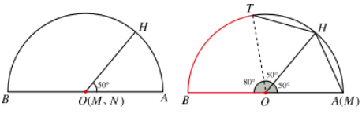
∵．
∴．
∴．
∴，
∴，
∴*N*点的运动路径长为： ，
故答案为：．
【点睛】本题考查了圆的性质，弧长公式、勾股定理、中位线，利用锐角三角函数值解三角函数，掌握以上知识，并能灵活运用是解题的关键．
22. （1）【探究发现】如图①所示，在正方形中，为边上一点，将沿翻折到处，延长交边于点．求证：

（2）【类比迁移】如图②，在矩形中，为边上一点，且将沿翻折到处，延长交边于点延长交边于点且求的长．

（3）【拓展应用】如图③，在菱形中，为边上的三等分点，将沿翻折得到，直线交于点求的长．

【答案】（1）见解析；（2）；（3）的长为或
【解析】
【分析】（1）根据将沿翻折到处，四边形是正方形，得，，即得，可证；
（2）延长，交于，设，在中，有，得，，由，得，，，而，，可得，即，，设，则，因，有，即解得的长为；
（3）分两种情况：（Ⅰ）当时，延长交于，过作于，设，，则，，由是的角平分线，有①，在中，②，可解得，；
（Ⅱ）当时，延长交延长线于，过作交延长线于，同理解得，．
【详解】证明：（1）将沿翻折到处，四边形是正方形，
，，
，
，，
；
（2）解：延长，交于，如图：
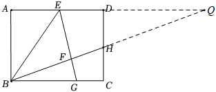
设，
在中，，
，
解得，
，
，，
，
，即，
，，
，，
，，
，即，
，
设，则，
，
，
，即，
解得，
的长为；
（3）（Ⅰ）当时，延长交于，过作于，如图：
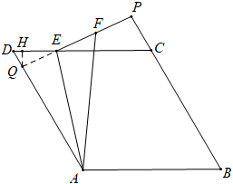
设，，则，
，
，
，
，
沿翻折得到，
，，，
是的角平分线，
，即①，
，
，，，
在中，，
②，
联立①②可解得，
；
（Ⅱ）当时，延长交延长线于，过作交延长线于，如图：
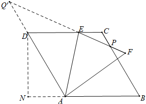
同理，
，即，
由得：，
可解得，
，
综上所述，的长为或．
【点睛】本题考查四边形的综合应用，涉及全等三角形的判定，相似三角形的判定与性质，三角形角平分线的性质，勾股定理及应用等知识，解题的关键是方程思想的应用．
