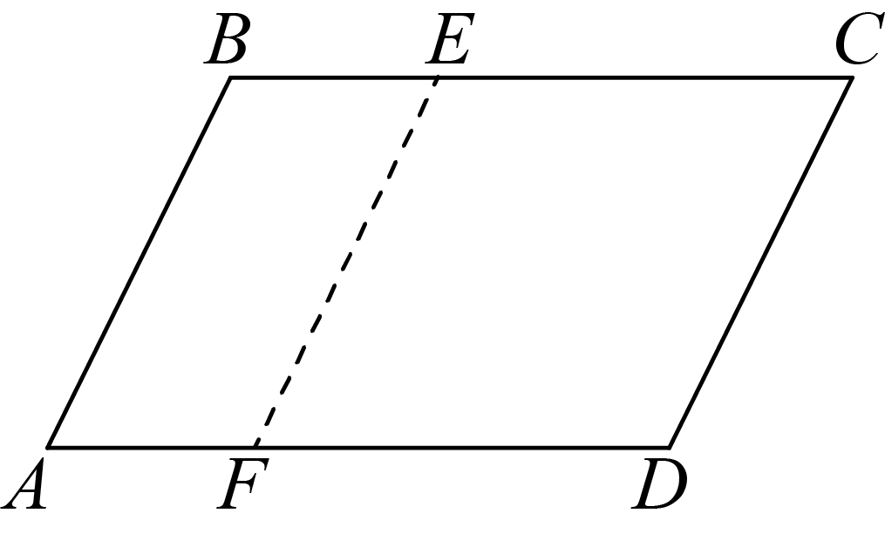
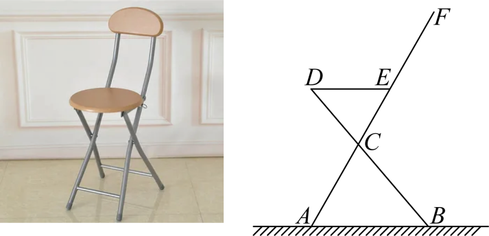
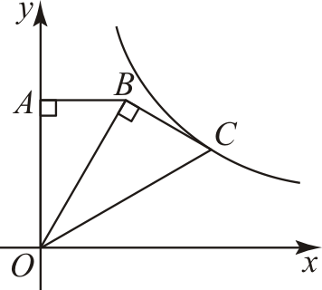
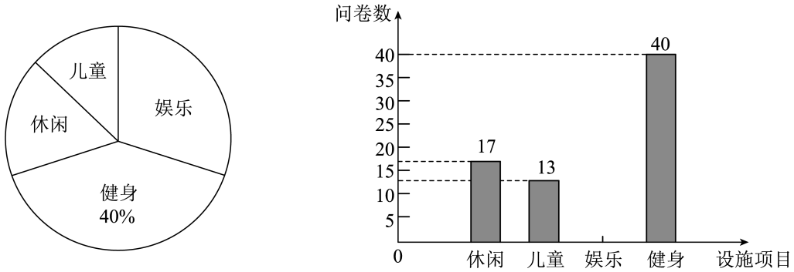
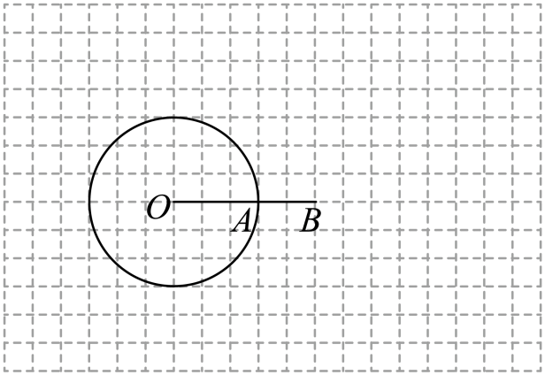
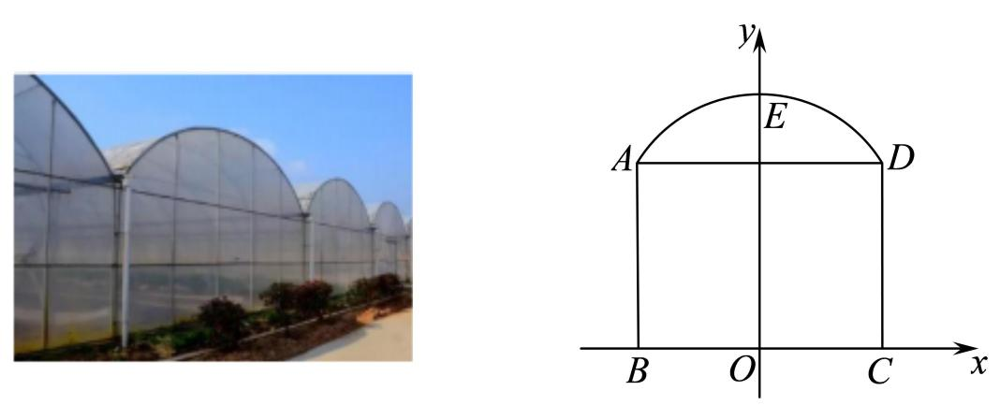
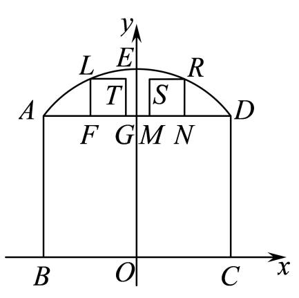
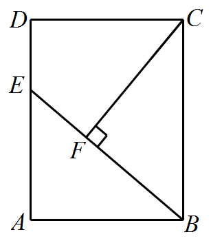
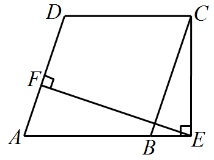
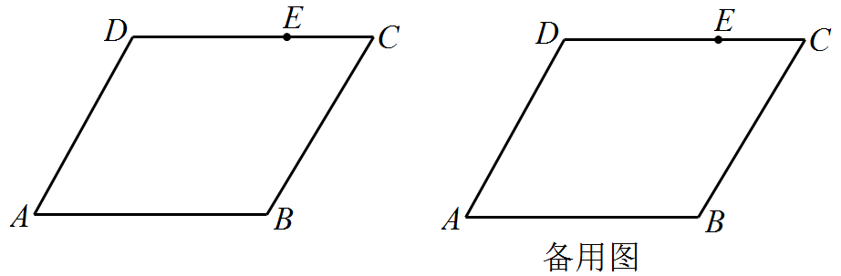

## **2023****年深圳市初中学业水平测试（回忆版）**

## **数学学科试卷**
**一、选择题**
1. 如果°C表示零上10度，则零下8度表示（    ）
A 	B. 	C. 	D.

2. 下列图形中，为轴对称的图形的是（    ）
A.   	B.   	C.   	D.

3. 深中通道是世界级“桥、岛、隧、水下互通”跨海集群工程，总计用了320000万吨钢材，320000这个数用科学记数法表示为（    ）
A 	B. 	C. 	D.

4. 下表为五种运动耗氧情况，其中耗氧量的中位数是（    ）
| 打网球 | 跳绳 | 爬楼梯 | 慢跑 | 游泳 |
| --- | --- | --- | --- | --- |
|  |  |  |  |  |

A. 	B. 	C. 	D.
5. 如图，在平行四边形中，，，将线段水平向右平移*a*个单位长度得到线段，若四边形为菱形时，则*a*的值为（    ）

A. 1	B. 2	C. 3	D. 4
6. 下列运算正确的是（    ）
A. 	B. 	C. 	D.
7. 如图为商场某品牌椅子的侧面图，，与地面平行，，则（    ）

A. 70°	B. 65°	C. 60°	D. 50°
8. 某运输公司运输一批货物，已知大货车比小货车每辆多运输5吨货物，且大货车运输75吨货物所用车辆数与小货车运输50吨货物所用车辆数相同，设有大货车每辆运输*x*吨，则所列方程正确的是（    ）
A. 	B. 	C. 	D.
9. 爬坡时坡角与水平面夹角为，则每爬1m耗能，若某人爬了1000m，该坡角为30°，则他耗能（参考数据：，）（    ）

A. 58J	B. 159J	C. 1025J	D. 1732J
10. 如图1，在中，动点*P*从*A*点运动到*B*点再到*C*点后停止，速度为2单位/s，其中长与运动时间*t*（单位：s）的关系如图2，则的长为（    ）

A. 	B. 	C. 17	D.
**二、填空题**
11. 小明从《红星照耀中国》，《红岩》，《长征》，《钢铁是怎样炼成》四本书中随机挑选一本，其中拿到《红星照耀中国》这本书的概率为______．

12. 已知实数*a*，*b*，满足，，则的值为______．
13. 如图，在中，为直径，*C*为圆上一点，的角平分线与交于点*D*，若，则______°．

14. 如图，与位于平面直角坐标系中，，，，若，反比例函数恰好经过点*C*，则______．

15. 如图，在中，，，点*D*为上一动点，连接，将沿翻折得到，交于点*G*，，且，则______．

**三、解答题**
16. 计算：．
17. 先化简，再求值：，其中．
18. 为了提高某城区居民的生活质量，政府将改造城区配套设施，并随机向某居民小区发放调查问卷（1人只能投1票），共有休闲设施，儿童设施，娱乐设施，健身设施4种选项，一共调查了*a*人，其调查结果如下：

如图，为根据调查结果绘制的扇形统计图和条形统计图，请根据统计图回答下面的问题：
①调查总人数______人；
②请补充条形统计图；
③若该城区共有10万居民，则其中愿意改造“娱乐设施”的约有多少人？
④改造完成后，该政府部门向甲、乙两小区下发满意度调查问卷，其结果（分数）如下：
| 
  项目  
 
  小区  
 | 
  休闲  
 | 
  儿童  
 | 
  娱乐  
 | 
  健身  
 |
| --- | --- | --- | --- | --- |
| 
  甲  
 | 
  7  
 | 
  7  
 | 
  9  
 | 
  8  
 |
| 
  乙  
 | 
  8  
 | 
  8  
 | 
  7  
 | 
  9  
 |

若以进行考核，______小区满意度（分数）更高；
若以进行考核，______小区满意度（分数）更高．
19. 某商场在世博会上购置*A*，*B*两种玩具，其中*B*玩具单价比*A*玩具的单价贵25元，且购置2个*B*玩具与1个*A*玩具共花费200元．

（1）求*A*，*B*玩具的单价；
（2）若该商场要求购置*B*玩具的数量是*A*玩具数量的2倍，且购置玩具的总额不高于20000元，则该商场最多可以购置多少个*A*玩具？
20. 如图，在单位长度为1的网格中，点*O*，*A*，*B*均在格点上，，，以*O*为圆心，为半径画圆，请按下列步骤完成作图，并回答问题：

①过点*A*作切线，且（点*C*在*A*的上方）；
②连接，交于点*D*；
③连接，与交于点*E*．
（1）求证：为切线；

（2）求的长度．
21. 蔬菜大棚是一种具有出色的保温性能的框架覆膜结构，它出现使得人们可以吃到反季节蔬菜．一般蔬菜大棚使用竹结构或者钢结构的骨架，上面覆上一层或多层保温塑料膜，这样就形成了一个温室空间．如图，某个温室大棚的横截面可以看作矩形和抛物线构成，其中，，取中点*O*，过点*O*作线段的垂直平分线交抛物线于点*E*，若以*O*点为原点，所在直线为*x*轴，为*y*轴建立如图所示平面直角坐标系．
请回答下列问题：
（1）如图，抛物线的顶点，求抛物线的解析式；

（2）如图，为了保证蔬菜大棚的通风性，该大棚要安装两个正方形孔的排气装置，，若，求两个正方形装置的间距的长；

（3）如图，在某一时刻，太阳光线透过*A*点恰好照射到*C*点，此时大棚截面的阴影为，求的长．

22. （1）如图，在矩形中，为边上一点，连接，
①若，过作交于点，求证：；
②若时，则______．

（2）如图，在菱形中，，过作交的延长线于点，过作交于点，若时，求的值．

（3）如图，在平行四边形中，，，，点在上，且，点为上一点，连接，过作交平行四边形的边于点，若时，请直接写出的长．

