## **2023****年深圳市初中学业水平测试（回忆版）**

## **数学学科试卷**
**一、选择题**
1. 如果°C表示零上10度，则零下8度表示（    ）
A. 	B. 	C. 	D.
【答案】B
【解析】
【分析】根据“负数是与正数互为相反意义的量”即可得出答案．
【详解】解：因为°C表示零上10度，
所以零下8度表示“”．
故选B
【点睛】本题考查正负数的意义，属于基础题，解题的关键在于理解负数的意义．
2. 下列图形中，为轴对称的图形的是（    ）
A.   	B.   	C.   	D.
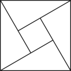

【答案】D
【解析】
【分析】根据轴对称图形的概念对各选项分析判断即可得解．
【详解】解：A、不是轴对称图形，故本选项不符合题意；
B、不是轴对称图形，故本选项不符合题意；
C、不是轴对称图形，故本选项不符合题意；
D、是轴对称图形，故本选项符合题意．
故选：D．
【点睛】本题主要考查了轴对称图形，解决问题的关键是熟练掌握轴对称图形的概念，轴对称图形概念，一个图形沿着一条直线折叠，直线两旁的部分能够互相重合，这个图形就是轴对称图形．
3. 深中通道是世界级“桥、岛、隧、水下互通”跨海集群工程，总计用了320000万吨钢材，320000这个数用科学记数法表示为（    ）
A. 	B. 	C. 	D.
【答案】B
【解析】
【分析】根据科学记数法的表示方法求解即可．
【详解】．
故选：B．
【点睛】本题主要考查科学记数法．科学记数法的表示形式为的形式，其中，*n*为整数．解题关键是正确确定*a*的值以及*n*的值．
4. 下表为五种运动耗氧情况，其中耗氧量的中位数是（    ）
| 打网球 | 跳绳 | 爬楼梯 | 慢跑 | 游泳 |
| --- | --- | --- | --- | --- |
|  |  |  |  |  |

A. 	B. 	C. 	D.
【答案】C
【解析】
【分析】将数据排序后，中间一个数就是中位数．
【详解】解：由表格可知，处在中间位置的数据为，
∴中位数为，
故选C．
【点睛】本题考查中位数．熟练掌握中位数的确定方法：将数据进行排序后，处在中间位置的一个数据或者两个数据的平均数为中位数，是解题的关键．
5. 如图，在平行四边形中，，，将线段水平向右平移*a*个单位长度得到线段，若四边形为菱形时，则*a*的值为（    ）
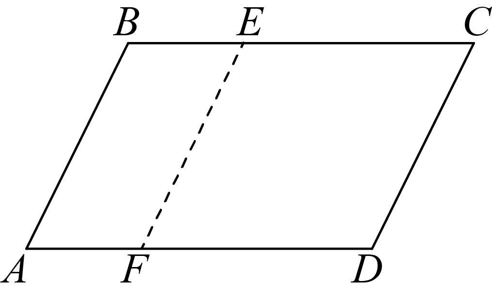
A 1	B. 2	C. 3	D. 4

【答案】B
【解析】
【分析】首先根据平行四边形的性质得到，然后根据菱形的性质得到，然后求解即可．
【详解】∵四边形是平行四边形，
∴，
∵四边形为菱形，
∴，
∵，
∴，
∴．
故选：B．
【点睛】此题考查了平行四边形和菱形的性质，平移的性质等知识，解题的关键是熟练掌握以上知识点．
6. 下列运算正确的是（    ）
A. 	B. 	C. 	D.
【答案】D
【解析】
【分析】根据同底数幂的乘法法则、合并同类项法则、完全平方公式和幂的乘方的运算法则进行计算即可．
【详解】解：∵，故A不符合题意；
∵，故B不符合题意；
∵，故C不符合题意；
∵，故D符合题意；
故选：D．
【点睛】本题考查同底数幂的乘法法则、合并同类项法则、完全平方公式和幂的乘方的运算法则，熟练掌握相关法则是解题的关键．
7. 如图为商场某品牌椅子侧面图，，与地面平行，，则（    ）

A. 70°	B. 65°	C. 60°	D. 50°
【答案】A
【解析】
【分析】根据平行得到，再利用外角的性质和对顶角相等，进行求解即可．
【详解】解：由题意，得：，
∴，
∵，
∴，
∴；
故选A．
【点睛】本题考查平行线的性质，三角形外角的性质，对顶角．熟练掌握相关性质，是解题的关键．
8. 某运输公司运输一批货物，已知大货车比小货车每辆多运输5吨货物，且大货车运输75吨货物所用车辆数与小货车运输50吨货物所用车辆数相同，设有大货车每辆运输*x*吨，则所列方程正确的是（    ）
A. 	B. 	C. 	D.
【答案】B
【解析】
【分析】根据“大货车运输75吨货物所用车辆数与小货车运输50吨货物所用车辆数相同”即可列出方程．
【详解】解：设有大货车每辆运输*x*吨，则小货车每辆运输吨，
则．
故选B
【点睛】本题考查分式方程的应用，理解题意准确找到等量关系是解题的关键．
9. 爬坡时坡角与水平面夹角为，则每爬1m耗能，若某人爬了1000m，该坡角为30°，则他耗能（参考数据：，）（    ）

A. 58J	B. 159J	C. 1025J	D. 1732J
【答案】B
【解析】
【分析】根据特殊角三角函数值计算求解．
【详解】
故选：B．
【点睛】本题考查特殊角三角函数值，掌握特殊角三角函数值是解题的关键．
10. 如图1，在中，动点*P*从*A*点运动到*B*点再到*C*点后停止，速度为2单位/s，其中长与运动时间*t*（单位：s）的关系如图2，则的长为（    ）

A. 	B. 	C. 17	D.
【答案】C
【解析】
【分析】根据图象可知时，点与点重合，得到，进而求出点从点运动到点所需的时间，进而得到点从点运动到点的时间，求出的长，再利用勾股定理求出即可．
【详解】解：由图象可知：时，点与点重合，
∴，
∴点从点运动到点所需的时间为；
∴点从点运动到点的时间为，
∴；
在中：；
故选C．
【点睛】本题考查动点的函数图象，勾股定理．从函数图象中有效的获取信息，求出的长，是解题的关键．
**二、填空题**
11. 小明从《红星照耀中国》，《红岩》，《长征》，《钢铁是怎样炼成的》四本书中随机挑选一本，其中拿到《红星照耀中国》这本书的概率为______．
【答案】##0.25
【解析】
【分析】根据概率公式进行计算即可．
【详解】解：随机挑选一本书共有4种等可能的结果，其中拿到《红星照耀中国》这本书的结果有1种，
∴，
故答案为：．
【点睛】本题考查概率．熟练掌握概率公式，是解题的关键．
12. 已知实数*a*，*b*，满足，，则的值为______．
【答案】42
【解析】
【分析】首先提取公因式，将已知整体代入求出即可．
【详解】
．
故答案为：42．
【点睛】此题考查了求代数式的值，提公因式法因式分解，整体思想的应用，解题的关键是掌握以上知识点．
13. 如图，在中，为直径，*C*为圆上一点，的角平分线与交于点*D*，若，则______°．

【答案】35
【解析】
【分析】由题意易得，，则有，然后问题可求解．
【详解】解：∵是的直径，
∴，
∵，，
∴，
∴，
∵平分，
∴；
故答案为35．
【点睛】本题主要考查圆周角的性质，熟练掌握直径所对圆周角为直角是解题的关键．
14. 如图，与位于平面直角坐标系中，，，，若，反比例函数恰好经过点*C*，则______．
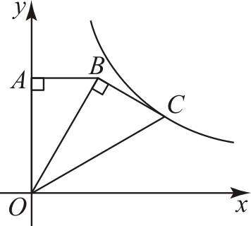
【答案】
【解析】
【分析】过点*C*作轴于点*D*，由题意易得，然后根据含30度直角三角形的性质可进行求解．
【详解】解：过点*C*作轴于点*D*，如图所示：
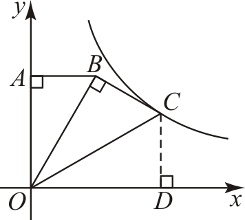
∵，，，
∴，
∵，
∴，
∵，
∴，
在中，，
∴，，
∵，，
∴，
∴，
∴点，
∴，
故答案为：．
【点睛】本题主要考查反比例函数的图象与性质及含30度直角三角形的性质，熟练掌握反比例函数的图象与性质及含30度直角三角形的性质是解题的关键．
15. 如图，在中，，，点*D*为上一动点，连接，将沿翻折得到，交于点*G*，，且，则______．
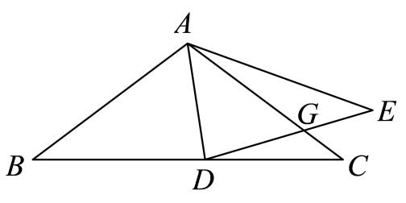
【答案】
【解析】
【分析】于点*M*，于点*N*，则，过点*G*作于点*P*，设，根据得出，继而求得，，，再利用，求得，利用勾股定理求得，，故，
【详解】由折叠的性质可知，是的角平分线，，用证明，从而得到，设，则，，利用勾股定理得到即，化简得，从而得出，利用三角形的面积公式得到：．
作于点*M*，于点*N*，则，
过点*G*作于点*P*，
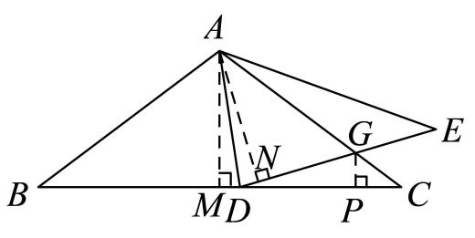
∵于点*M*，
∴，
设，则，，
又∵，，
∴，，，
∵，即，
∴，，
中，，，

设，则
∴
∴，
∵，，，
∴，
∵，，
∴，
∴，
∵，，，，
∴，
∴，
设，则，，
在中，，即，
化简得：，
∴，
∴
故答案是：．
【点睛】本题考查解直角三角形，折叠的性质，全等三角形的判定与性质，角平分线的性质，勾股定理等知识，正确作出辅助线并利用勾股定理列出方程是解题的关键．
**三、解答题**
16. 计算：．
【答案】
【解析】
【分析】根据零次幂及特殊三角函数值可进行求解．
【详解】解：原式
．
【点睛】本题主要考查零次幂及特殊三角函数值，熟练掌握各个运算是解题的关键．
17. 先化简，再求值：，其中．
【答案】，
【解析】
【分析】先根据分式混合运算的法则把原式进行化简，再把*x*的值代入进行计算即可．
【详解】
∵
∴原式．
【点睛】本题考查了分式的化简求值，熟知分式混合运算的法则是解答此题的关键．
18. 为了提高某城区居民的生活质量，政府将改造城区配套设施，并随机向某居民小区发放调查问卷（1人只能投1票），共有休闲设施，儿童设施，娱乐设施，健身设施4种选项，一共调查了*a*人，其调查结果如下：
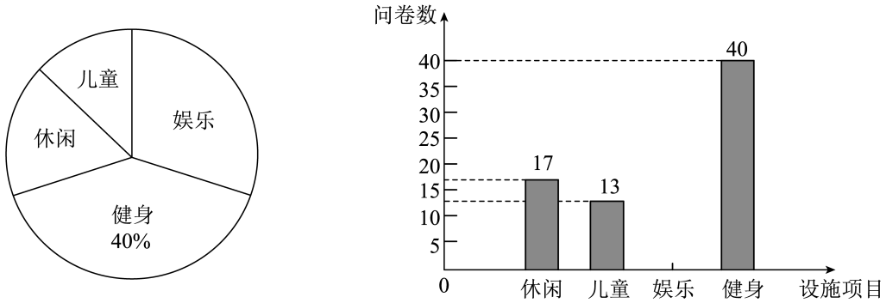
如图，为根据调查结果绘制的扇形统计图和条形统计图，请根据统计图回答下面的问题：
①调查总人数______人；
②请补充条形统计图；
③若该城区共有10万居民，则其中愿意改造“娱乐设施”的约有多少人？
④改造完成后，该政府部门向甲、乙两小区下发满意度调查问卷，其结果（分数）如下：
| 
  项目  
 
  小区  
 | 
  休闲  
 | 
  儿童  
 | 
  娱乐  
 | 
  健身  
 |
| --- | --- | --- | --- | --- |
| 
  甲  
 | 
  7  
 | 
  7  
 | 
  9  
 | 
  8  
 |
| 
  乙  
 | 
  8  
 | 
  8  
 | 
  7  
 | 
  9  
 |

若以进行考核，______小区满意度（分数）更高；
若以进行考核，______小区满意度（分数）更高．
【答案】①100；②见解析；③愿意改造“娱乐设施”的约有3万人；④乙；甲．
【解析】
【分析】①根据健身的人数和所占的百分比即可求出总人数；
②用总数减去其他3项的人数即可求出娱乐的人数；
③根据样本估计总体的方法求解即可；
④根据加权平均数的计算方法求解即可．
【详解】①（人），
调查总人数人；
故答案为：100；
②（人）
∴娱乐的人数为30（人）
∴补充条形统计图如下：
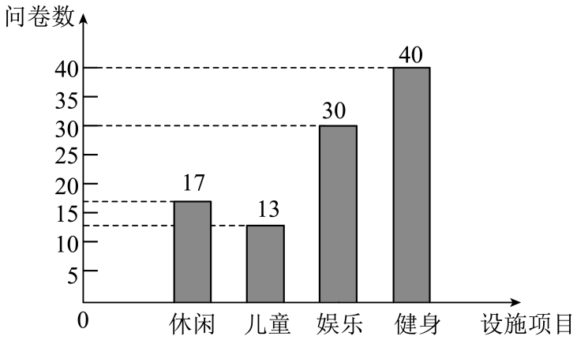
③（人）
∴愿意改造“娱乐设施”的约有3万人；
④若以进行考核，
甲小区得分为，
乙小区得分为，
∴若以进行考核，乙小区满意度（分数）更高；
若以进行考核，
甲小区得分为，
乙小区得分为，
∴若以进行考核，甲小区满意度（分数）更高；
故答案为：乙；甲．
【点睛】本题考查条形统计图、扇形统计图，加权平均数，样本估计总体等知识，理解两个统计图中数量之间的关系是正确解答的关键．
19. 某商场在世博会上购置*A*，*B*两种玩具，其中*B*玩具的单价比*A*玩具的单价贵25元，且购置2个*B*玩具与1个*A*玩具共花费200元．
（1）求*A*，*B*玩具的单价；
（2）若该商场要求购置*B*玩具的数量是*A*玩具数量的2倍，且购置玩具的总额不高于20000元，则该商场最多可以购置多少个*A*玩具？
【答案】（1）*A*、*B*玩具的单价分别为50元、75元；
（2）最多购置100个*A*玩具．
【解析】
【分析】（1）设*A*玩具的单价为*x*元每个，则*B*玩具的单价为元每个；根据“购置2个*B*玩具与1个*A*玩具共花费200元”列出方程即可求解；
（2）设*A*玩具购置*y*个，则*B*玩具购置个，根据“购置玩具的总额不高于20000元”列出不等式即可得出答案．
【小问1详解】
解：设*A*玩具的单价为*x*元，则*B*玩具的单价为元；
由题意得：；
解得：，
则*B*玩具单价（元）；

答：*A*、*B*玩具的单价分别为50元、75元；
【小问2详解】
设*A*玩具购置*y*个，则*B*玩具购置个，
由题意可得：，
解得：，
∴最多购置100个*A*玩具．
【点睛】本题考查一元一次方程和一元一次不等式的应用，属于中考常规考题，解题的关键在于读懂题目，找准题目中的等量关系或不等关系．
20. 如图，在单位长度为1的网格中，点*O*，*A*，*B*均在格点上，，，以*O*为圆心，为半径画圆，请按下列步骤完成作图，并回答问题：

①过点*A*作切线，且（点*C*在*A*的上方）；
②连接，交于点*D*；
③连接，与交于点*E*．
（1）求证：为的切线；
（2）求的长度．
【答案】（1）画图见解析，证明见解析
（2）
【解析】
【分析】（1）根据题意作图，首先根据勾股定理得到，然后证明出，得到，即可证明出为的切线；
（2）首先根据全等三角形的性质得到，然后证明出，利用相似三角形的性质求解即可．
【小问1详解】
如图所示，
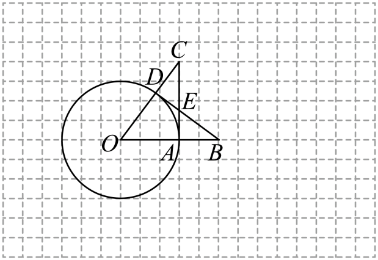
∵是的切线，
∴，
∵，，
∴，
∵，，
∴，
∴，
又∵，，
∴，
∴，
∴，
∵点*D*在上，
∴为的切线；
【小问2详解】
∵，
∴，
∵，，
∴，
∴，即，
∴解得．
【点睛】此题考查了格点作图，圆切线的性质和判定，全等三角形的性质和判定，相似三角形的性质和判定等知识，解题的关键是熟练掌握以上知识点．
21. 蔬菜大棚是一种具有出色的保温性能的框架覆膜结构，它出现使得人们可以吃到反季节蔬菜．一般蔬菜大棚使用竹结构或者钢结构的骨架，上面覆上一层或多层保温塑料膜，这样就形成了一个温室空间．如图，某个温室大棚的横截面可以看作矩形和抛物线构成，其中，，取中点*O*，过点*O*作线段的垂直平分线交抛物线于点*E*，若以*O*点为原点，所在直线为*x*轴，为*y*轴建立如图所示平面直角坐标系．
请回答下列问题：
（1）如图，抛物线的顶点，求抛物线的解析式；

（2）如图，为了保证蔬菜大棚的通风性，该大棚要安装两个正方形孔的排气装置，，若，求两个正方形装置的间距的长；

（3）如图，在某一时刻，太阳光线透过*A*点恰好照射到*C*点，此时大棚截面的阴影为，求的长．
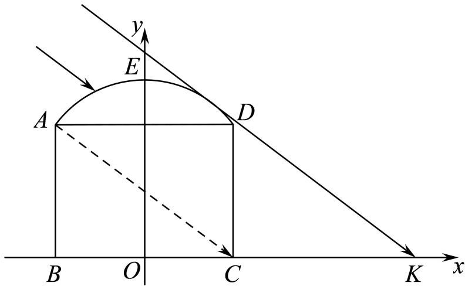
【答案】（1）
（2）
（3）
【解析】
【分析】（1）根据顶点坐标，设函数解析式为，求出点坐标，待定系数法求出函数解析式即可；
（2）求出时对应的自变量的值，得到的长，再减去两个正方形的边长即可得解；
（3）求出直线的解析式，进而设出过点的光线解析式为，利用光线与抛物线相切，求出的值，进而求出点坐标，即可得出的长．
【小问1详解】
解：∵抛物线的顶点，
设抛物线的解析式为，
∵四边形为矩形，为的中垂线，
∴，，
∵，
∴点，代入，得：
，
∴，
∴抛物线的解析式为；
【小问2详解】
∵四边形，四边形均正方形，，

∴，
延长交于点，延长交于点，则四边形，四边形均为矩形，
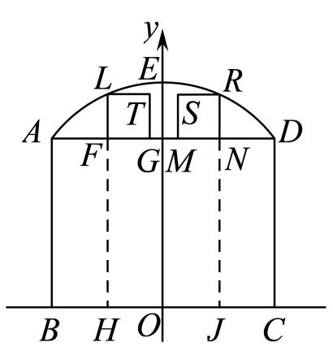
∴，
∴，
∵，当时，，解得：，
∴，，
∴，
∴；
【小问3详解】
∵，垂直平分，
∴，
∴，
设直线的解析式为，
则：，解得：，
∴，
∵太阳光为平行光，
设过点平行于的光线的解析式为，
由题意，得：与抛物线相切，
联立，整理得：，
则：，解得：；
∴，当时，，
∴，
∵，
∴．
【点睛】本题考查二次函数的实际应用．读懂题意，正确的求出二次函数解析式，利用数形结合的思想，进行求解，是解题的关键．
22. （1）如图，在矩形中，为边上一点，连接，
①若，过作交于点，求证：；
②若时，则______．
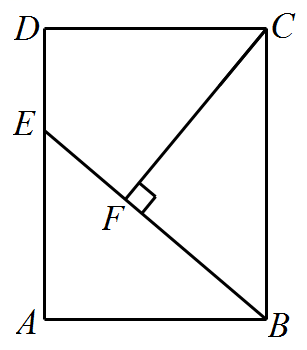
（2）如图，在菱形中，，过作交的延长线于点，过作交于点，若时，求的值．

（3）如图，在平行四边形中，，，，点在上，且，点为上一点，连接，过作交平行四边形的边于点，若时，请直接写出的长．
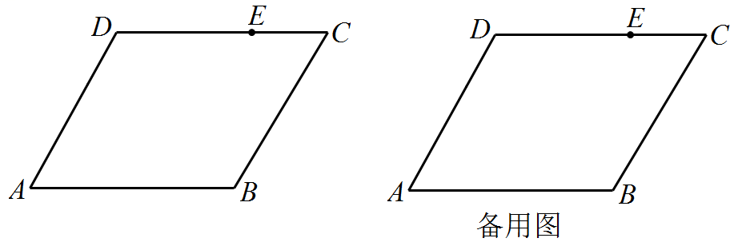
【答案】（1）①见解析；②；（2）；（3）或或
【解析】
【分析】（1）①根据矩形的性质得出，，进而证明结合已知条件，即可证明；
②由①可得，，证明，得出，根据，即可求解；
（2）根据菱形的性质得出，，根据已知条件得出，证明，根据相似三角形的性质即可求解；
（3）分三种情况讨论，①当点在边上时，如图所示，延长交的延长线于点，连接，过点作于点，证明，解，进而得出，根据，得出，建立方程解方程即可求解；②当点在边上时，如图所示，连接，延长交的延长线于点，过点作，则，四边形是平行四边形，同理证明，根据得出，建立方程，解方程即可求解；③当点在边上时，如图所示，过点作于点，求得，而，得出矛盾，则此情况不存在．
【详解】解：（1）①∵四边形是矩形，则，
∴，
又∵，
∴，，
∴，
又∵，
∴；
②由①可得，
∴
∴，
又∵
∴,
故答案为：．
（2）∵在菱形中，，
∴，，
则，
∵，
∴，
∵
∴，
∴，
∵，
∴,
又，
∴，
∴，
∴；
（3）①当点在边上时，如图所示，延长交的延长线于点，连接，过点作于点，
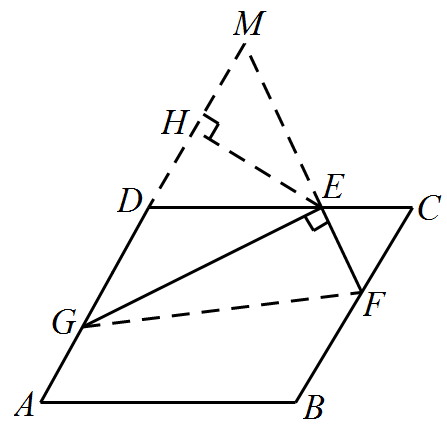
∵平行四边形中，，，
∴，,
∵，
∴
∴，
∴
∴
在中，，
则，，
∴
∴，
∵，
∴
∴
∴
∴
设，则，，，
∴
解得：或，
即或，
②当点在边上时，如图所示，
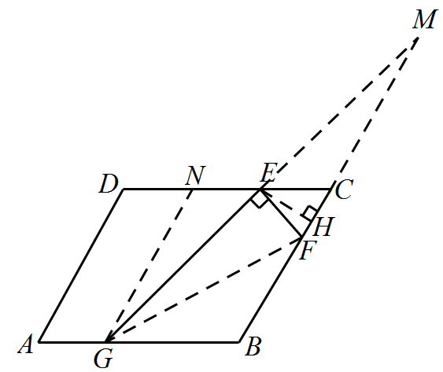
连接，延长交的延长线于点，过点作，则，四边形是平行四边形，
设，则，，
∵
∴
∴，
∴
∴，
∵
∴
过点作于点，
在中，，
∴，，
∴，则，
∴，
∴，
，
∴
∴，
即，
∴
即
解得：（舍去）
即；
③当点在边上时，如图所示，
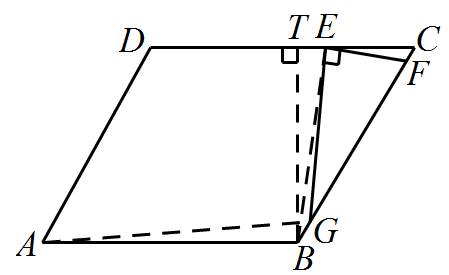
过点作于点，
在中，，，
∴，
∵，
∴，
∵，
∴点不可能在边上，
综上所述，的长为或或．
【点睛】本题考查了相似三角形的性质与判定，平行四边形的性质，解直角三角形，矩形的性质，熟练掌握相似三角形的性质与判定，分类讨论是解题的关键．
