## **2024****年深圳市初中学业水平测试**

## **数学学科试卷**
**说明：**
**1****．答题前，请将姓名、准考证号和学校用黑色字迹的钢笔或签字笔填写在答题卡定的位置上，并将条形码粘贴好．**
**2****．全卷共****6****页．考试时间****90****分钟，满分****100****分．**
**3****．作答选择题****1-8****，选出每题答案后，用****2B****铅笔把答题卡上对应题目答案标号的信息点框涂黑．如需改动，用橡皮擦干净后，再选涂其它答案．作答非选择题****9—20****，用黑色字迹的钢笔或签字笔将答案（含作辅助线）写在答题卡指定区域内．写在本试卷或草稿纸上，其答案一律无效．**
**4****．考试结束后，请将答题卡交回．**

**第一部分****  ****选择题**

**一、选择题（本大题共****8****小题，每小题****3****分，共****24****分，每小题有四个选项，其中只有一个是正确的）**
1. 下列用七巧板拼成的图案中，为中心对称图形的是（    ）
A. 	B. 	C. 	D.

2. 如图，实数*a*，*b*，*c*，*d*在数轴上表示如下，则最小的实数为（    ）

A. *a*	B. *b*	C. *c*	D. *d*
3. 下列运算正确的是（    ）
A 	B.

C. 	D.
4. 二十四节气，它基本概括了一年中四季交替的准确时间以及大自然中一些物候等自然现象发生的规律，二十四个节气分别为：春季（立春、雨水、惊蛰、春分、清明、谷雨），夏季（立夏、小满、芒种、夏至、小暑、大暑），秋季（立秋、处暑、白露、秋分、寒露、霜降），冬季（立冬、小雪、大雪、冬至、小寒、大寒），若从二十四个节气中选一个节气，则抽到的节气在夏季的概率为（    ）
A. 	B. 	C. 	D.
5. 如图，一束平行光线照射平面镜后反射，若入射光线与平面镜夹角，则反射光线与平面镜夹角的度数为（    ）
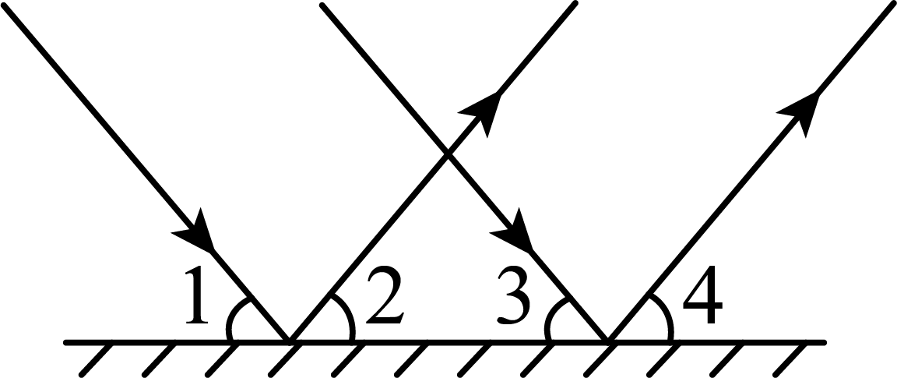
A. 	B. 	C. 	D.
6. 在如图的三个图形中，根据尺规作图的痕迹，能判断射线平分的是（    ）
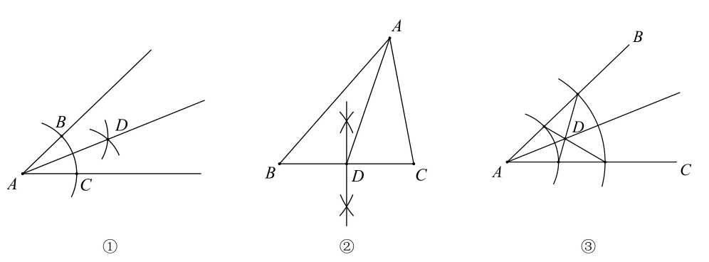
A. ①②	B. ①③	C. ②③	D. 只有①
7. 在明朝程大位《算法统宗》中有首住店诗：我问开店李三公，众客都来到店中，一房七客多七客，一房九客一房空．诗的大意是：一些客人到李三公的店中住宿，如果每一间客房住7人，那么有7人无房可住；如果每一间客房住9人，那么就空出一间房．设该店有客房*x*间，房客*y*人，则可列方程组为（    ）
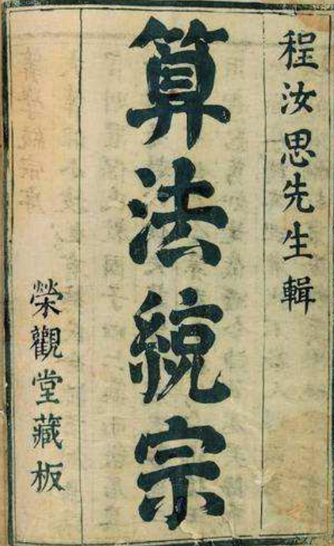
A. 	B.
C 	D.

8. 如图，为了测量某电子厂的高度，小明用高的测量仪测得的仰角为，小军在小明的前面处用高的测量仪测得的仰角为，则电子厂的高度为（    ）（参考数据：，，）
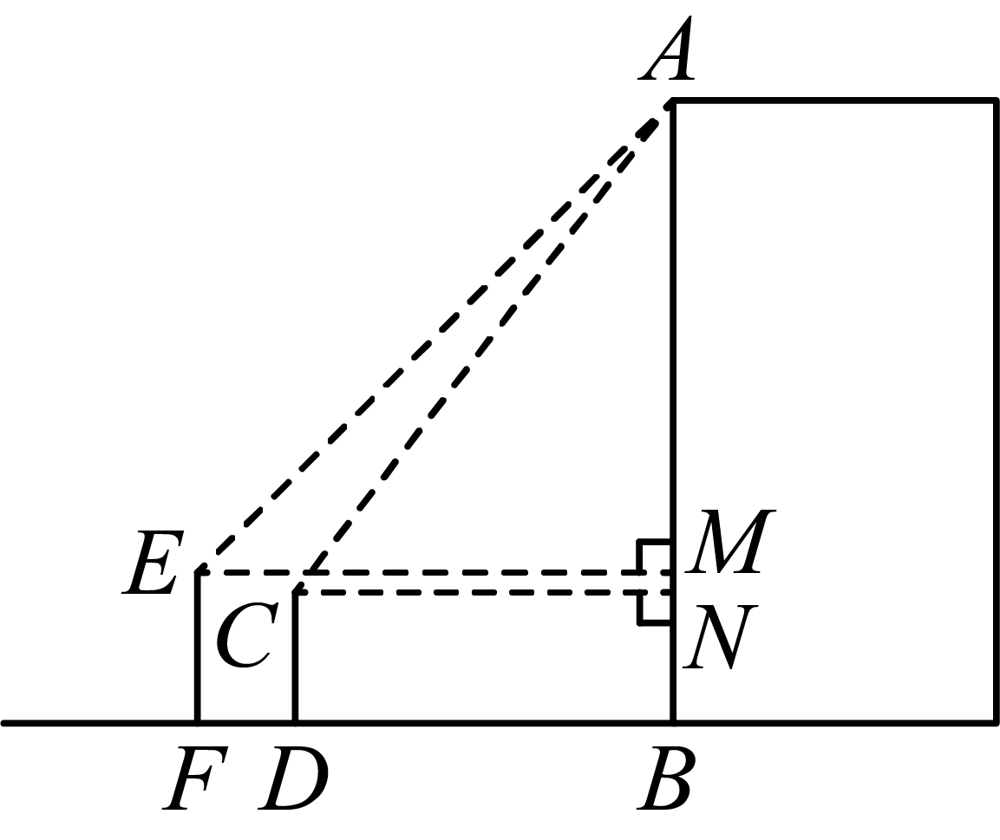
A  	B.  	C.  	D.

**第二部分****  ****非选择题**

**二、填空题（本大题共****5****小题，每小题****3****分，共****15****分）**
9. 已知一元二次方程的一个根为1，则______．
10. 如图所示，四边形，，均为正方形，且，，则正方形的边长可以是________．（写出一个答案即可）
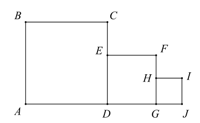
11. 如图，在矩形中，，*O*为中点，，则扇形的面积为________．
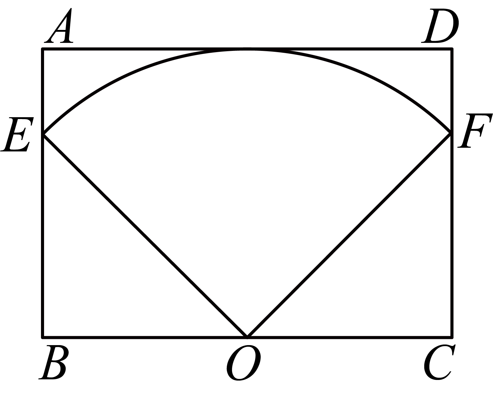
12. 如图，在平面直角坐标系中，四边形为菱形，，且点*A*落在反比例函数上，点*B*落在反比例函数上，则________．
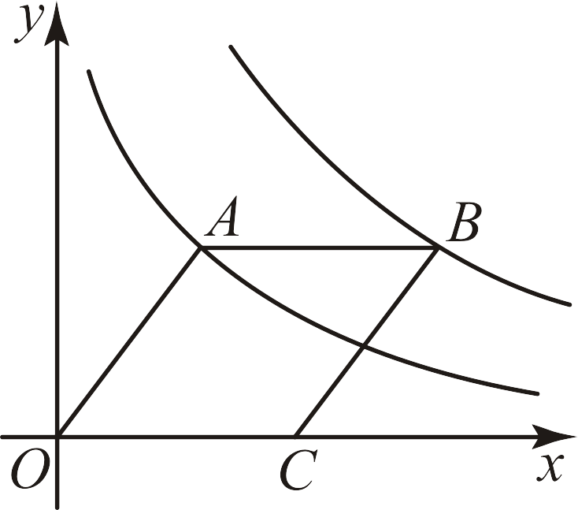
13. 如图，在中，，，*D*为上一点，且满足，过*D*作交延长线于点*E*，则________．
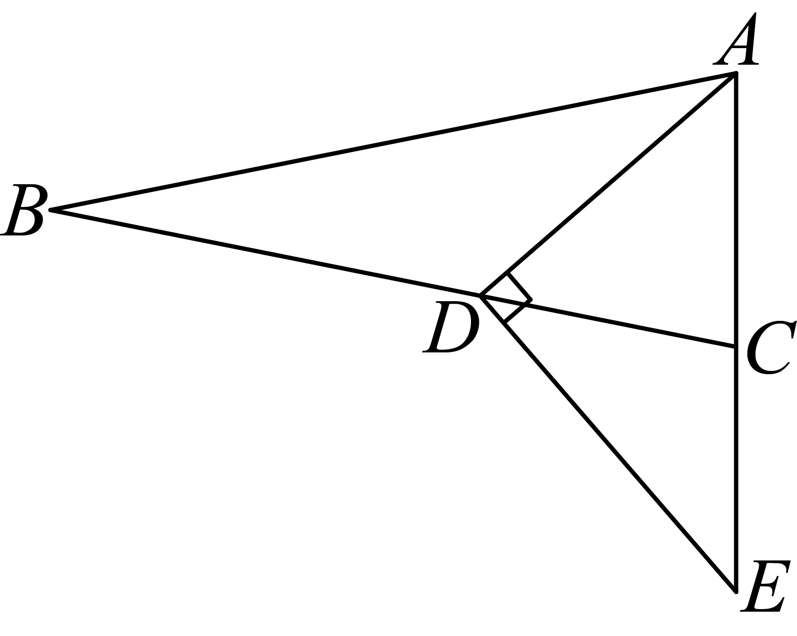
**三、解答题（本题共****7****小题，其中第****14****题****5****分，第****15****题****7****分，第****16****题****8****分，第****17****题****8****分，第****18****题****9****分，第****19****题****12****分，第****20****题****12****分，共****61****分）**
14. 计算：．
15. 先化简，再求值： ，其中
16. 据了解，“i深圳”体育场地一键预约平台是市委、市政府打造“民生幸福标杆”城市过程中，推动的惠民利民重要举措，在满足市民健身需求、激发全民健身热情、促进体育消费等方面具有重大意义．按照符合条件的学校体育场馆和社会体育场馆“应接尽接”原则，“i深圳”体育场馆一键预约平台实现了“让想运动的人找到场地，已有的体育场地得到有效利用”．
小明爸爸决定在周六上午预约一所学校的操场锻炼身体，现有*A*，*B*两所学校适合，小明收集了这两所学校过去10周周六上午的预约人数：
学校*A*：28，30，40，45，48，48，48，48，48，50，
学校*B*：
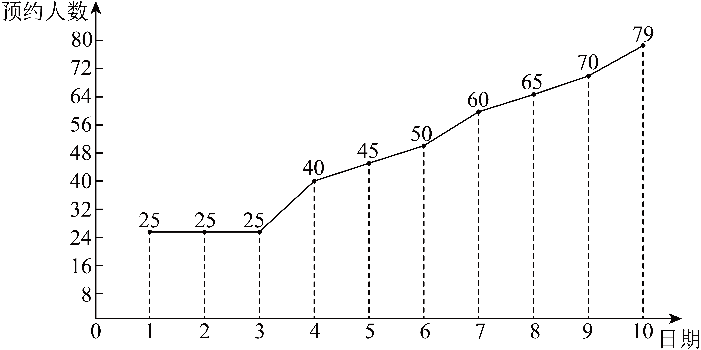
（1）
| 学校 | 平均数 | 众数 | 中位数 | 方差 |
| --- | --- | --- | --- | --- |
| A | ①________ | 48 |  | 83.299 |
| B | 48.4 | ②________ | ③________ | 354.04 |

（2）根据上述材料分析，小明爸爸应该预约哪所学校？请说明你的理由．
17.
| 背景 | 【缤纷618，优惠送大家】 今年618各大电商平台促销火热，线下购物中心也亮出大招，年中大促进入“白热化”．深圳各大购物中心早在5月就开始推出618活动，进入6月更是持续加码，如图，某商场为迎接即将到来618优惠节，采购了若干辆购物车．   | 【缤纷618，优惠送大家】 今年618各大电商平台促销火热，线下购物中心也亮出大招，年中大促进入“白热化”．深圳各大购物中心早在5月就开始推出618活动，进入6月更是持续加码，如图，某商场为迎接即将到来618优惠节，采购了若干辆购物车．   |
| --- | --- | --- |
| 素材 | 如图为某商场叠放的购物车，右图为购物车叠放在一起的示意图，若一辆购物车车身长，每增加一辆购物车，车身增加． | 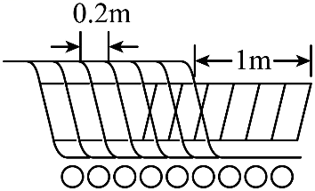 |
| 问题解决 | 问题解决 | 问题解决 |
| 任务1 | 若某商场采购了*n*辆购物车，求车身总长*L*与购物车辆数*n*的表达式； | 若某商场采购了*n*辆购物车，求车身总长*L*与购物车辆数*n*的表达式； |
| 任务2 | 若该商场用直立电梯从一楼运输该批购物车到二楼，已知该商场的直立电梯长为，且一次可以运输两列购物车，求直立电梯一次性最多可以运输多少辆购物车？ | 若该商场用直立电梯从一楼运输该批购物车到二楼，已知该商场的直立电梯长为，且一次可以运输两列购物车，求直立电梯一次性最多可以运输多少辆购物车？ |
| 任务3 | 若该商场扶手电梯一次性可以运输24辆购物车，若要运输100辆购物车，且最多只能使用电梯5次，求：共有多少种运输方案？ | 若该商场扶手电梯一次性可以运输24辆购物车，若要运输100辆购物车，且最多只能使用电梯5次，求：共有多少种运输方案？ |

18. 如图，在中，，为的外接圆，为的切线，为的直径，连接并延长交于点*E*．
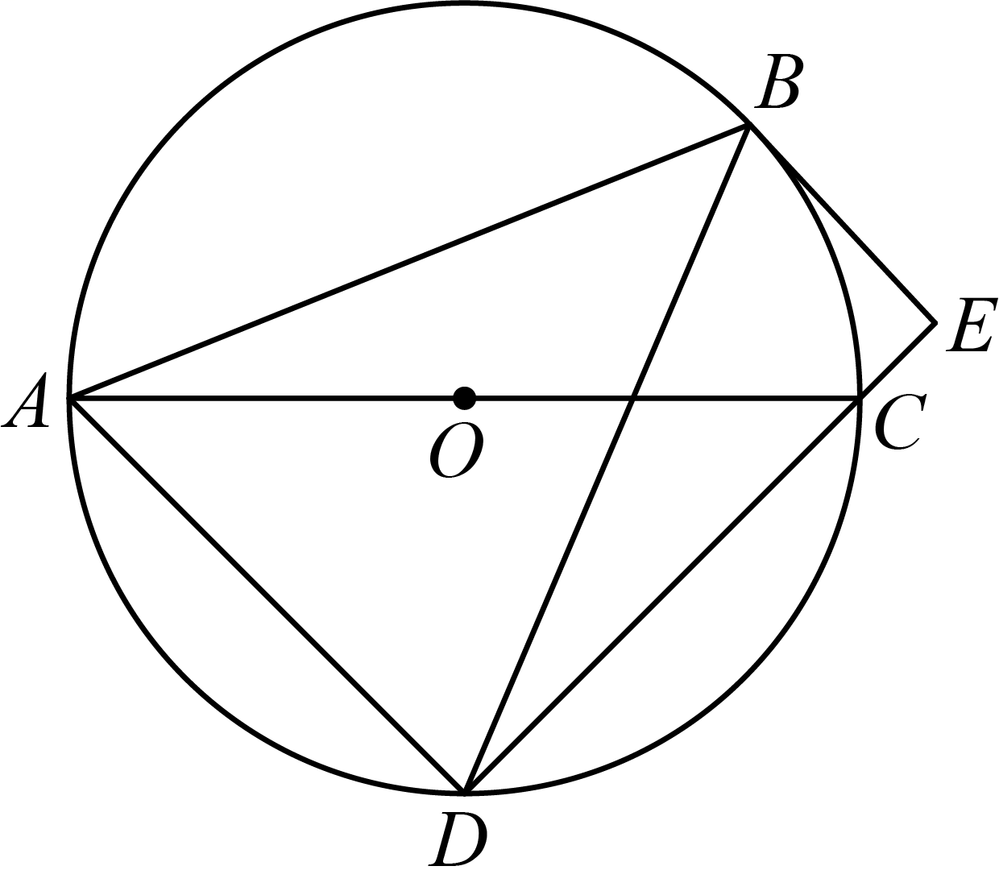
（1）求证：；
（2）若，，求的半径．
19. 为了测量抛物线的开口大小，某数学兴趣小组将两把含有刻度的直尺垂直放置，并分别以水平放置的直尺和竖直放置的直尺为*x*，*y*轴建立如图所示平面直角坐标系，该数学小组选择不同位置测量数据如下表所示，设的读数为*x*，读数为*y*，抛物线的顶点为*C*．
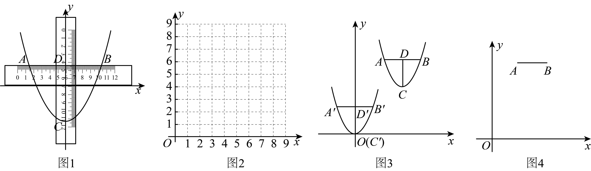
（1）（Ⅰ）列表：
|  | ① | ② | ③ | ④ | ⑤ | ⑥ |
| --- | --- | --- | --- | --- | --- | --- |
| *x* | 0 | 2 | 3 | 4 | 5 | 6 |
| *y* | 0 | 1 | 2.25 | 4 | 6.25 | 9 |

（Ⅱ）描点：请将表格中的描在图2中；
（Ⅲ）连线：请用平滑的曲线在图2将上述点连接，并求出*y*与*x*的关系式；
（2）如图3所示，在平面直角坐标系中，抛物线的顶点为*C*，该数学兴趣小组用水平和竖直直尺测量其水平跨度为，竖直跨度为，且，，为了求出该抛物线的开口大小，该数学兴趣小组有如下两种方案，请选择其中一种方案，并完善过程：
方案一：将二次函数平移，使得顶点*C*与原点*O*重合，此时抛物线解析式为．
①此时点的坐标为________；
②将点坐标代入中，解得________；（用含*m*，*n*的式子表示）
方案二：设*C*点坐标为
①此时点*B*的坐标为________；
②将点*B*坐标代入中解得________；（用含*m*，*n*的式子表示）
（3）【应用】如图4，已知平面直角坐标系中有*A*，*B*两点，，且轴，二次函数和都经过*A*，*B*两点，且和的顶点*P*，*Q*距线段的距离之和为10，求*a*的值．
20. 垂中平行四边形的定义如下：在平行四边形中，过一个顶点作关于不相邻的两个顶点的对角线的垂线交平行四边形的一条边，若交点是这条边的中点，则该平行四边形是“垂中平行四边形”．
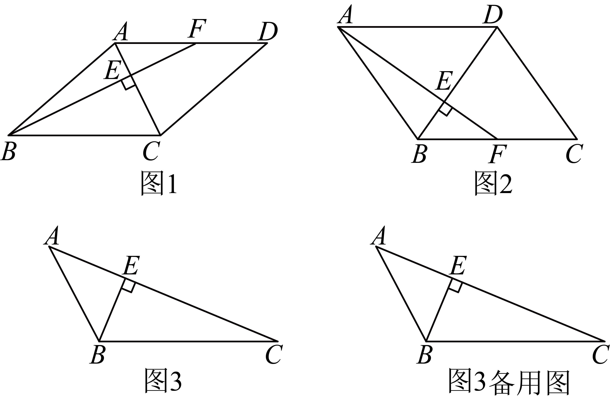
（1）如图1所示，四边形为“垂中平行四边形”，，，则________；________；
（2）如图2，若四边形为“垂中平行四边形”，且，猜想与的关系，并说明理由；
（3）①如图3所示，在中，，，交于点，请画出以为边垂中平行四边形，要求：点在垂中平行四边形的一条边上（**温馨提示：不限作图工具**）；

②若关于直线对称得到，连接，作射线交①中所画平行四边形的边于点，连接，请直接写出的值．
