## **2024****年深圳市初中学业水平测试**
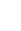
## **数学学科试卷**
**说明：**
**1****．答题前，请将姓名、准考证号和学校用黑色字迹的钢笔或签字笔填写在答题卡定的位置上，并将条形码粘贴好．**
**2****．全卷共****6****页．考试时间****90****分钟，满分****100****分．**
**3****．作答选择题****1-8****，选出每题答案后，用****2B****铅笔把答题卡上对应题目答案标号的信息点框涂黑．如需改动，用橡皮擦干净后，再选涂其它答案．作答非选择题****9—20****，用黑色字迹的钢笔或签字笔将答案（含作辅助线）写在答题卡指定区域内．写在本试卷或草稿纸上，其答案一律无效．**
**4****．考试结束后，请将答题卡交回．**

**第一部分****  ****选择题**

**一、选择题（本大题共****8****小题，每小题****3****分，共****24****分，每小题有四个选项，其中只有一个是正确的）**
1. 下列用七巧板拼成的图案中，为中心对称图形的是（    ）
A. 	B. 	C. 	D.

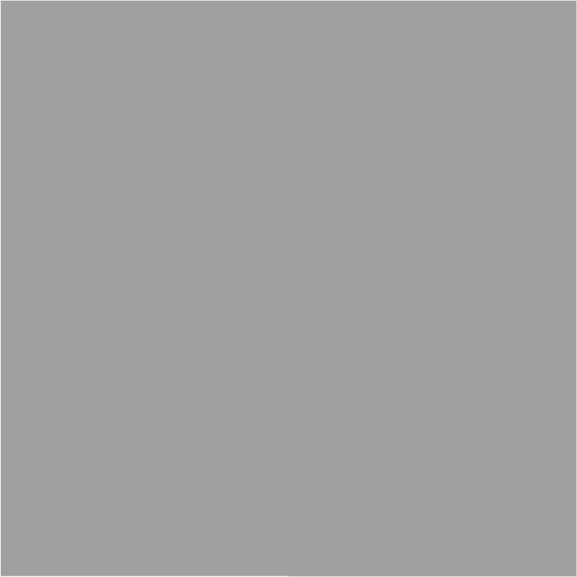
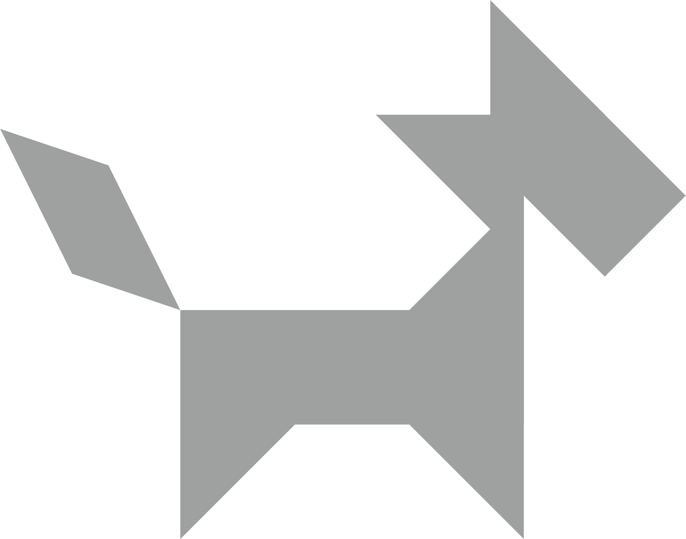
【答案】C
【解析】
【分析】本题主要考查了中心对称图形的识别．在同一平面内，如果把一个图形绕某一点旋转180度，旋转后的图形能和原图形完全重合，那么这个图形就叫做中心对称图形．
【详解】解：选项A、B、D均不能找到这样的一个点，使图形绕某一点旋转180度后和原图形完全重合，所以不是中心对称图形，
选项C能找到这样的一个点，使图形绕某一点旋转180度后和原图形完全重合，所以是中心对称图形，
故选：C．
2. 如图，实数*a*，*b*，*c*，*d*在数轴上表示如下，则最小的实数为（    ）
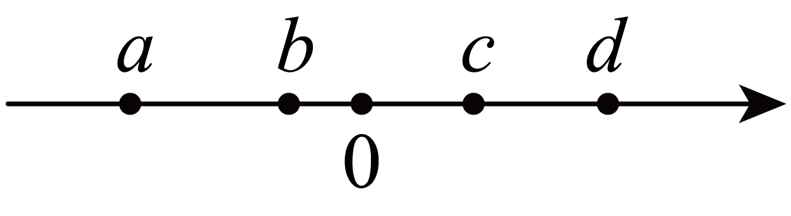
A. *a*	B. *b*	C. *c*	D. *d*
【答案】A
【解析】
【分析】本题考查了根据数轴比较实数的大小．根据数轴上右边的数总比左边的大即可判断．
【详解】解：由数轴知，，
则最小的实数为*a*，
故选：A．
3. 下列运算正确的是（    ）
A. 	B.
C. 	D.
【答案】B
【解析】
【分析】本题考查了合并同类项，积的乘方，单项式乘以单项式，完全平方公式．根据单项式乘以单项式，积的乘方，完全平方公式法则进行计算即可求解．
【详解】解：A、，故该选项不符合题意；
B、，故该选项符合题意；
C、，故该选项不符合题意；
D、，故该选项不符合题意；
故选：B．
4. 二十四节气，它基本概括了一年中四季交替的准确时间以及大自然中一些物候等自然现象发生的规律，二十四个节气分别为：春季（立春、雨水、惊蛰、春分、清明、谷雨），夏季（立夏、小满、芒种、夏至、小暑、大暑），秋季（立秋、处暑、白露、秋分、寒露、霜降），冬季（立冬、小雪、大雪、冬至、小寒、大寒），若从二十四个节气中选一个节气，则抽到的节气在夏季的概率为（    ）
A. 	B. 	C. 	D.
【答案】D
【解析】
【分析】本题考查了概率公式．根据概率公式直接得出答案．
【详解】解：二十四个节气中选一个节气，抽到的节气在夏季的有六个，
则抽到的节气在夏季的概率为，
故选：D．
5. 如图，一束平行光线照射平面镜后反射，若入射光线与平面镜夹角，则反射光线与平面镜夹角的度数为（    ）
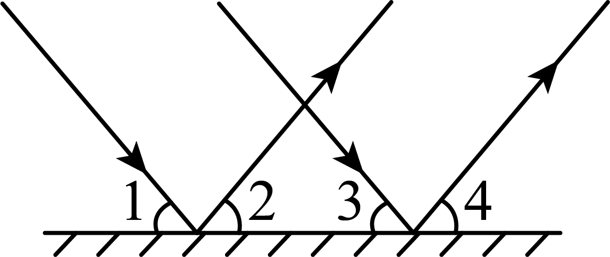
A. 	B. 	C. 	D.
【答案】B
【解析】
【分析】本题考查了平行线的性质，根据，，则，再结合平行线的性质，得出同位角相等，即可作答．
【详解】解：如图：
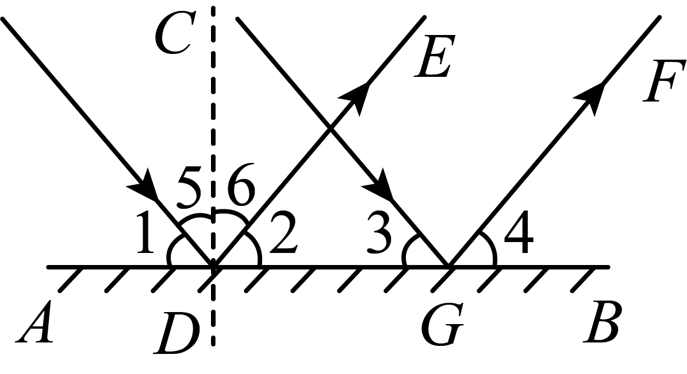
∵一束平行光线照射平面镜后反射，若入射光线与平面镜夹角，
∴，，
∴，
则，
∵光线是平行的，
即，
∴，
故选：B．
6. 在如图的三个图形中，根据尺规作图的痕迹，能判断射线平分的是（    ）
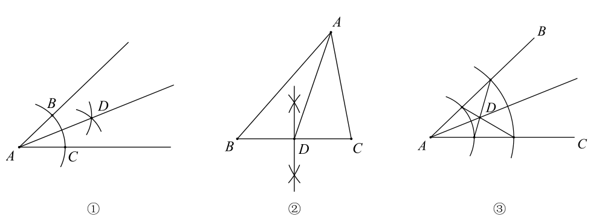
A. ①②	B. ①③	C. ②③	D. 只有①
【答案】B
【解析】
【分析】本题考查了尺规作图，全等三角形的判定与性质，解决问题的关键是理解作法、掌握角平分线的定义．利用基本作图对三个图形的作法进行判断即可．在图①中，利用基本作图可判断平分；在图③中，利用作法得，  可证明，有，可得，进一步证明，得，继而可证明，得，得到是的平分线；在图②中，利用基本作图得到*D*点为的中点，则为边上的中线．
【详解】在图①中，利用基本作图可判断平分；
在图③中，利用作法得，
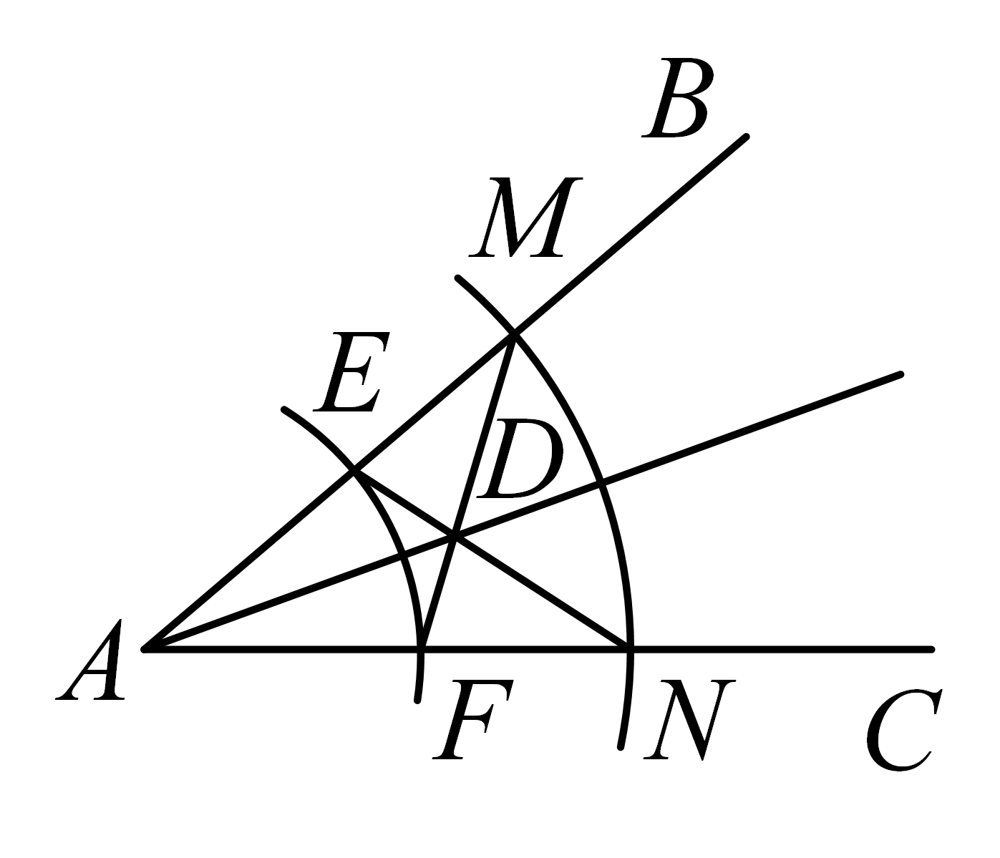
在和中，
，
∴，
∴，
在和中
，
∴，
∴，
∵，
∴，
∴，
∴是的平分线；
在图②中，利用基本作图得到*D*点为的中点，则为边上的中线．
则①③可得出射线平分*．*
故选：B．
7. 在明朝程大位《算法统宗》中有首住店诗：我问开店李三公，众客都来到店中，一房七客多七客，一房九客一房空．诗的大意是：一些客人到李三公的店中住宿，如果每一间客房住7人，那么有7人无房可住；如果每一间客房住9人，那么就空出一间房．设该店有客房*x*间，房客*y*人，则可列方程组为（    ）
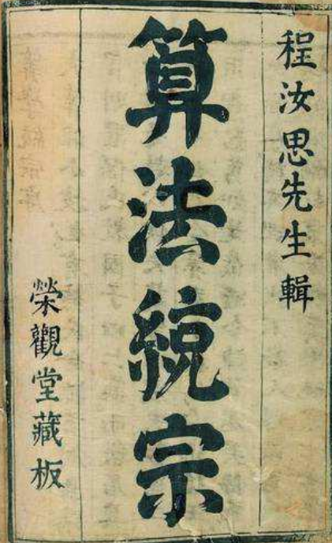
A. 	B.
C. 	D.
【答案】A
【解析】
【分析】本题考查了由实际问题抽象出二元一次方程组．设该店有客房*x*间，房客*y*人；每一间客房住7人，那么有7人无房可住；如果每一间客房住9人，那么就空出一间客房得出方程组即可．
【详解】解：设该店有客房*x*间，房客*y*人；根据题意得：
，
故选：A．
8. 如图，为了测量某电子厂的高度，小明用高的测量仪测得的仰角为，小军在小明的前面处用高的测量仪测得的仰角为，则电子厂的高度为（    ）（参考数据：，，）
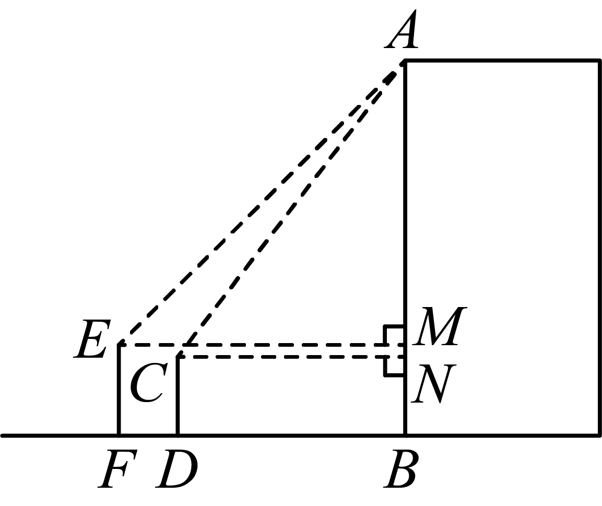
A.  	B.  	C.  	D.
【答案】A
【解析】
【分析】本题考查了与仰角有关的解直角三角形的应用，矩形的判定与性质，先证明四边形、、是矩形，再设，表示，然后在以及运用线段和差关系，即，再求出，即可作答．
【详解】解：如图：延长交于一点，
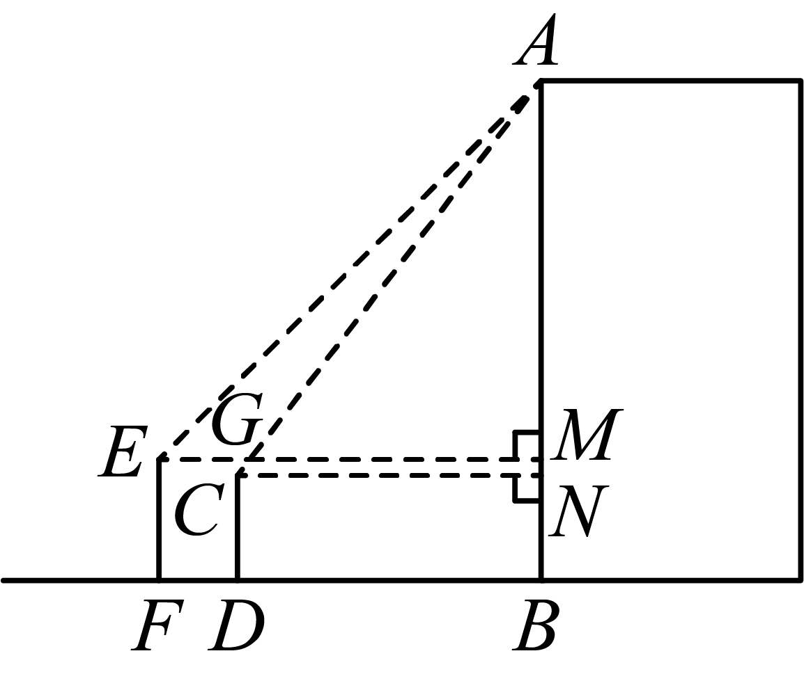
∵
∴四边形是矩形
∵
∴四边形是矩形
同理得四边形是矩形
依题意，得，
∴，
∴
∴设，则
在
∴
即
在
∴
即
∴
∴
∴
∴
故选：A

**第二部分****  ****非选择题**

**二、填空题（本大题共****5****小题，每小题****3****分，共****15****分）**
9. 已知一元二次方程一个根为1，则______．

【答案】
【解析】
【分析】本题考查了一元二次方程解的定义，根据一元二次方程的解的定义，将代入原方程，列出关于的方程，然后解方程即可．
【详解】解：关于的一元二次方程的一个根为，
满足一元二次方程，
，
解得，．
故答案为：．
10. 如图所示，四边形，，均为正方形，且，，则正方形的边长可以是________．（写出一个答案即可）
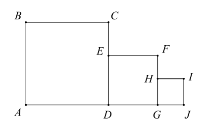
【答案】2（答案不唯一）
【解析】
【分析】本题考查了算术平方根的应用，无理数的估算．利用算术平方根的性质求得，，再根据无理数的估算结合，即可求解．
【详解】解：∵，
∴，
∵，
∴，
∵，即，
∴正方形的边长，即，
∴正方形的边长可以是2，
故答案为：2（答案不唯一）．
11. 如图，在矩形中，，*O*为中点，，则扇形的面积为________．
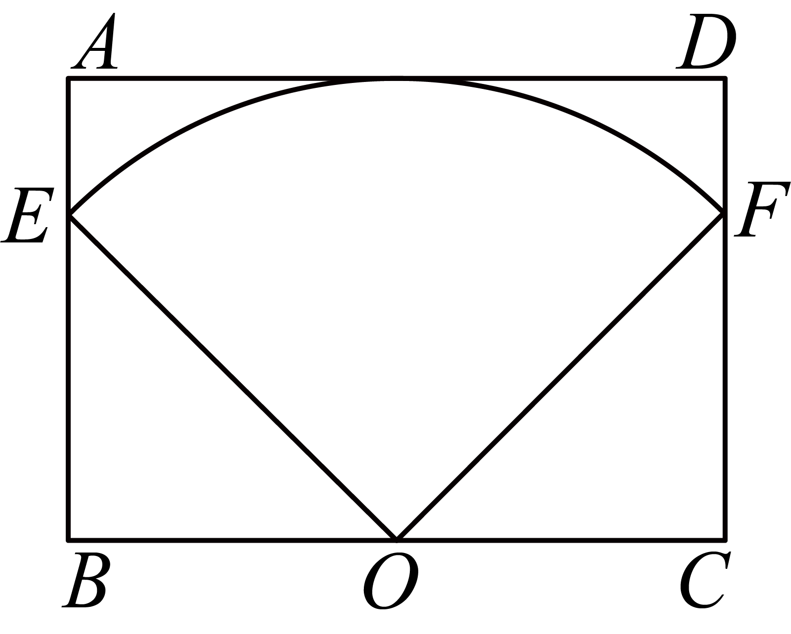
【答案】
【解析】
【分析】本题考查了扇形的面积公式，解直角三角形．利用解直角三角形求得，，得到，再利用扇形的面积公式即可求解．
【详解】解：∵，，
∴，
∵*O*为中点，
∴，
∵，
在中，，
∴，
同理，
∴，
∴扇形的面积为，
故答案为：．
12. 如图，在平面直角坐标系中，四边形为菱形，，且点*A*落在反比例函数上，点*B*落在反比例函数上，则________．
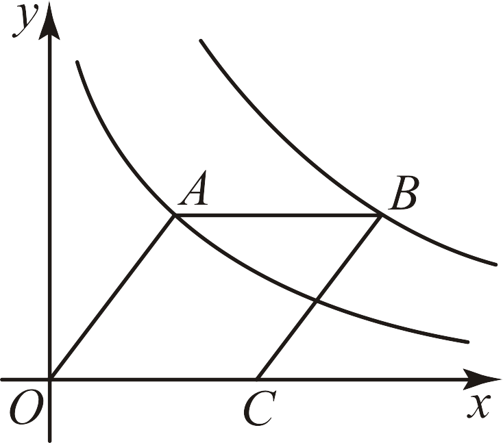
【答案】8
【解析】
【分析】本题主要考查反比例函数与几何的综合及三角函数；过点作轴的垂线，垂足分别为，然后根据特殊三角函数值结合勾股定理求得，，再求得点，利用待定系数法求解即可．
【详解】解：过点作轴的垂线，垂足分别为，如图，
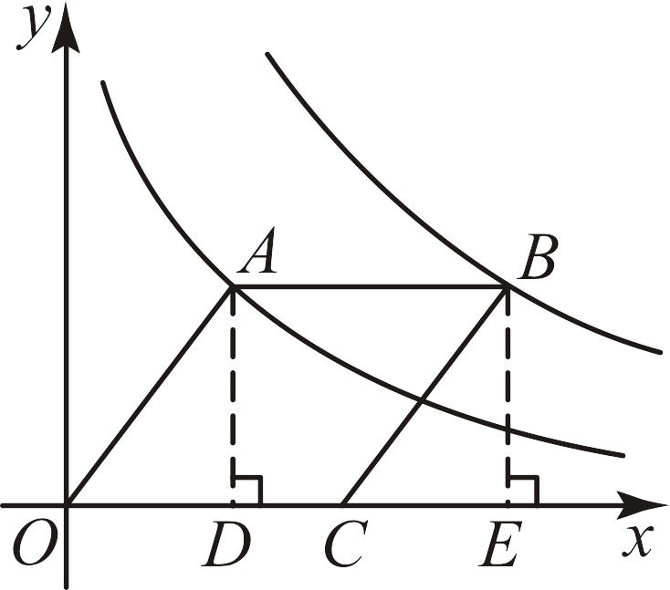
∵，
∴，
∴设，则，
∴点，
∵点*A*在反比例函数上，
∴，
∴（负值已舍），则点，
∴，，
∴，
∵四边形为菱形，
∴，，
∴点，
∵点*B*落在反比例函数上，
∴，
故答案为：8．
13. 如图，在中，，，*D*上一点，且满足，过*D*作交延长线于点*E*，则________．

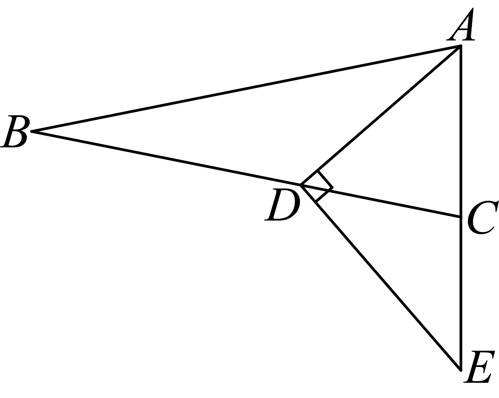
【答案】
【解析】
【分析】本题考查了解直角三角形、勾股定理，平行线分线段成比例，先设，根据，，得出再分别用勾股定理求出，故，再运用解直角三角形得出，，代入，化简即可作答．
【详解】解：如图，过点*A*作垂足为*H,*
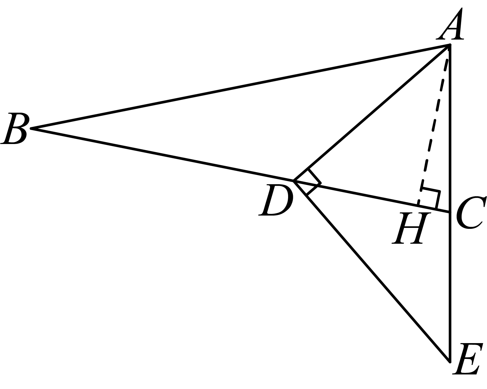
∵，，
设，
∴，
∵，，
∴，
∵，
∴，
解得
∴，，
∴，，
∴，
过点*C*作垂足为*M*，
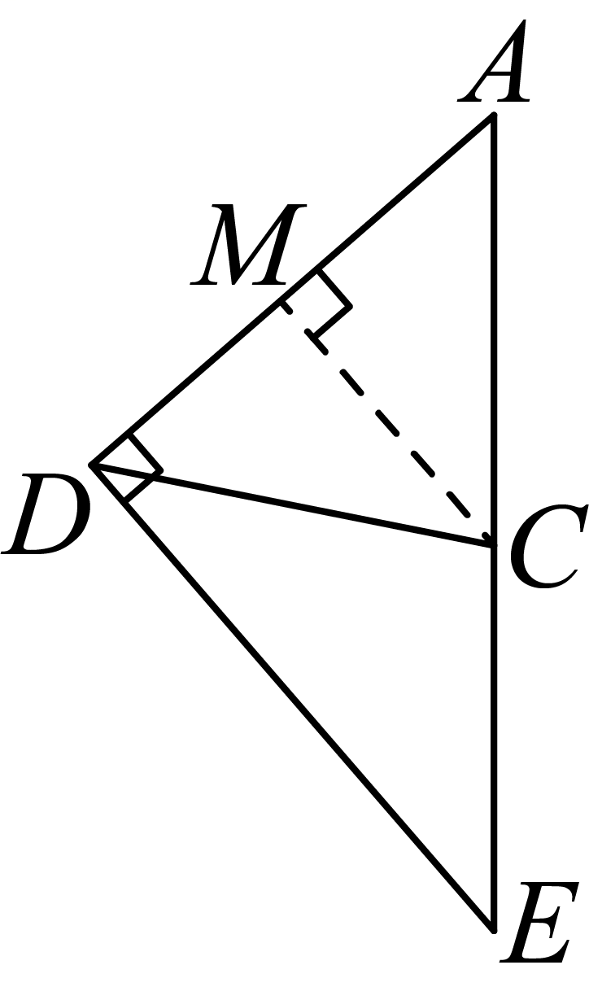
∴，，
∵,，
∴，
∴，
故答案为：．
**三、解答题（本题共****7****小题，其中第****14****题****5****分，第****15****题****7****分，第****16****题****8****分，第****17****题****8****分，第****18****题****9****分，第****19****题****12****分，第****20****题****12****分，共****61****分）**
14. 计算：．
【答案】
【解析】
【分析】本题考查特殊锐角三角函数值，零指数幂，绝对值以及负整数指数幂．先将各项化简，再算乘法，最后从左往右计算即可得
【详解】解：
．
15. 先化简，再求值： ，其中
【答案】，
【解析】
【分析】此题考查了分式的化简求值，熟练掌握分式混合运算的运算顺序和运算法则是解题关键．
原式括号中两项通分并利用同分母分式的减法法则计算，同时利用除法法则变形，约分得到最简结果，把*a*的值代入计算即可求出值．
【详解】解：
=
=
=，
当时，原式=．
16. 据了解，“i深圳”体育场地一键预约平台是市委、市政府打造“民生幸福标杆”城市过程中，推动的惠民利民重要举措，在满足市民健身需求、激发全民健身热情、促进体育消费等方面具有重大意义．按照符合条件的学校体育场馆和社会体育场馆“应接尽接”原则，“i深圳”体育场馆一键预约平台实现了“让想运动的人找到场地，已有的体育场地得到有效利用”．
小明爸爸决定在周六上午预约一所学校的操场锻炼身体，现有*A*，*B*两所学校适合，小明收集了这两所学校过去10周周六上午的预约人数：
学校*A*：28，30，40，45，48，48，48，48，48，50，
学校*B*：
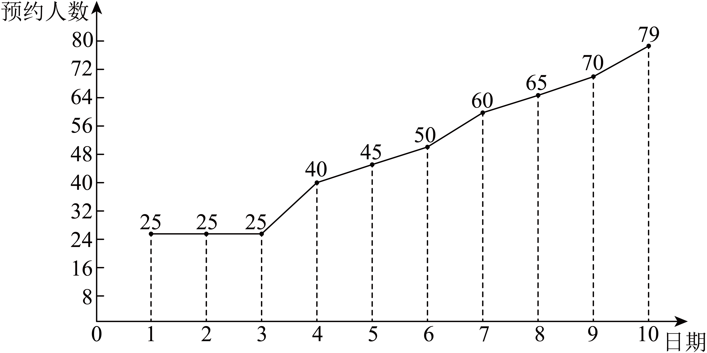
（1）
| 学校 | 平均数 | 众数 | 中位数 | 方差 |
| --- | --- | --- | --- | --- |
| A | ①________ | 48 |  | 83.299 |
| B | 48.4 | ②________ | ③________ | 354.04 |

（2）根据上述材料分析，小明爸爸应该预约哪所学校？请说明你的理由．
【答案】（1）①43.3；②25；③47.5
（2）小明爸爸应该预约学校*A*，理由见解析
【解析】
【分析】本题考查求平均数，中位数和众数，利用方差判断稳定性：
（1）根据平均数，中位数和众数的确定方法，进行求解即可；
（2）根据方差判断稳定性，进行判断即可．
【小问1详解】
解：①；
②数据中出现次数最多的是25，故众数为25；
③数据排序后，排在中间两位的数据为，故中位数为：；
填表如下：
| 学校 | 平均数 | 众数 | 中位数 | 方差 |
| --- | --- | --- | --- | --- |
| A | 43.3 | 48 |  | 83.299 |
| B | 48.4 | 25 | 47.5 | 354.04 |

【小问2详解】
小明爸爸应该预约学校*A*，理由如下：
学校*A*的方差小，预约人数相对稳定，大概率会有位置更好的场地进行锻炼．
17.
| 背景 | 【缤纷618，优惠送大家】 今年618各大电商平台促销火热，线下购物中心也亮出大招，年中大促进入“白热化”．深圳各大购物中心早在5月就开始推出618活动，进入6月更是持续加码，如图，某商场为迎接即将到来的618优惠节，采购了若干辆购物车．  | 【缤纷618，优惠送大家】 今年618各大电商平台促销火热，线下购物中心也亮出大招，年中大促进入“白热化”．深圳各大购物中心早在5月就开始推出618活动，进入6月更是持续加码，如图，某商场为迎接即将到来的618优惠节，采购了若干辆购物车．  |
| --- | --- | --- |
| 素材 | 如图为某商场叠放的购物车，右图为购物车叠放在一起的示意图，若一辆购物车车身长，每增加一辆购物车，车身增加． | 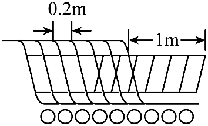 |
| 问题解决 | 问题解决 | 问题解决 |
| 任务1 | 若某商场采购了*n*辆购物车，求车身总长*L*与购物车辆数*n*的表达式； | 若某商场采购了*n*辆购物车，求车身总长*L*与购物车辆数*n*的表达式； |
| 任务2 | 若该商场用直立电梯从一楼运输该批购物车到二楼，已知该商场的直立电梯长为，且一次可以运输两列购物车，求直立电梯一次性最多可以运输多少辆购物车？ | 若该商场用直立电梯从一楼运输该批购物车到二楼，已知该商场的直立电梯长为，且一次可以运输两列购物车，求直立电梯一次性最多可以运输多少辆购物车？ |
| 任务3 | 若该商场扶手电梯一次性可以运输24辆购物车，若要运输100辆购物车，且最多只能使用电梯5次，求：共有多少种运输方案？ | 若该商场扶手电梯一次性可以运输24辆购物车，若要运输100辆购物车，且最多只能使用电梯5次，求：共有多少种运输方案？ |

【答案】任务1：；任务2：一次性最多可以运输18台购物车；任务3：共有3种方案
【解析】
【分析】本题考查了求函数表达式，一元一次不等式的应用，正确掌握相关性质内容是解题的关键．
任务1：根据一辆购物车车身长，每增加一辆购物车，车身增加，且采购了*n*辆购物车，*L*是车身总长，即可作答．
任务2：结合“已知该商场的直立电梯长为，且一次可以运输两列购物车”，得出，再解不等式，即可作答．
任务3：根据“该商场扶手电梯一次性可以运输24辆购物车，若要运输100辆购物车，且最多只能使用电梯5次”，列式，再解不等式，即可作答．
【详解】解：任务1：∵一辆购物车车身长，每增加一辆购物车，车身增加
∴
任务2：依题意，∵已知该商场的直立电梯长为，且一次可以运输两列购物车，
令，
解得：
∴一次性最多可以运输18辆购物车；
任务3：设*x*次扶手电梯，则次直梯，
由题意∵该商场扶手电梯一次性可以运输24辆购物车，若要运输100辆购物车，且最多只能使用电梯5次
可列方程为：，
解得：，
∵*x*为整数，
∴，
方案一：直梯3次，扶梯2次；
方案二：直梯2次，扶梯3次：
方案三：直梯1次，扶梯4次
答：共有三种方案.
18. 如图，在中，，为的外接圆，为的切线，为的直径，连接并延长交于点*E*．
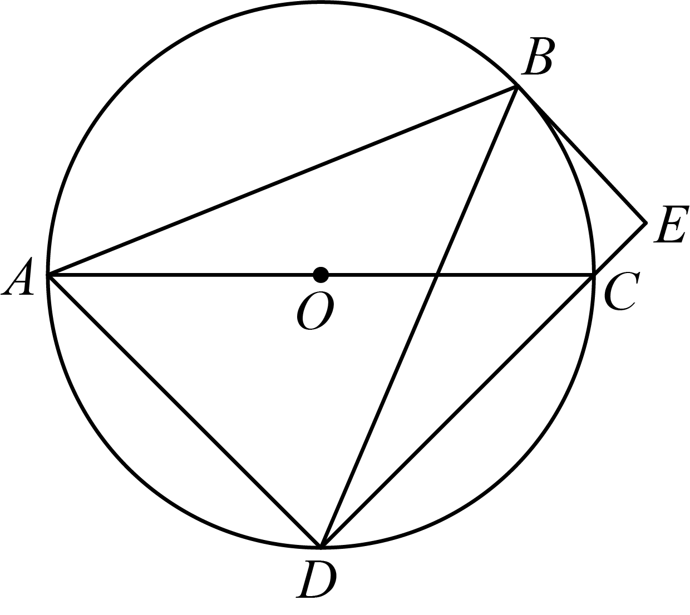
（1）求证：；
（2）若，，求的半径．
【答案】（1）见解析    （2）
【解析】
【分析】本题考查切线的性质，圆周角定理，中垂线的判定和性质，矩形的判定和性质：
（1）连接并延长，交于点，连接，易证垂直平分，圆周角定理，切线的性质，推出四边形为矩形，即可得证；
（2）由（1）可知，勾股定理求出的长，设的半径为，在中，利用勾股定理进行求解即可．
【小问1详解】
证明：连接并延长，交于点，连接，
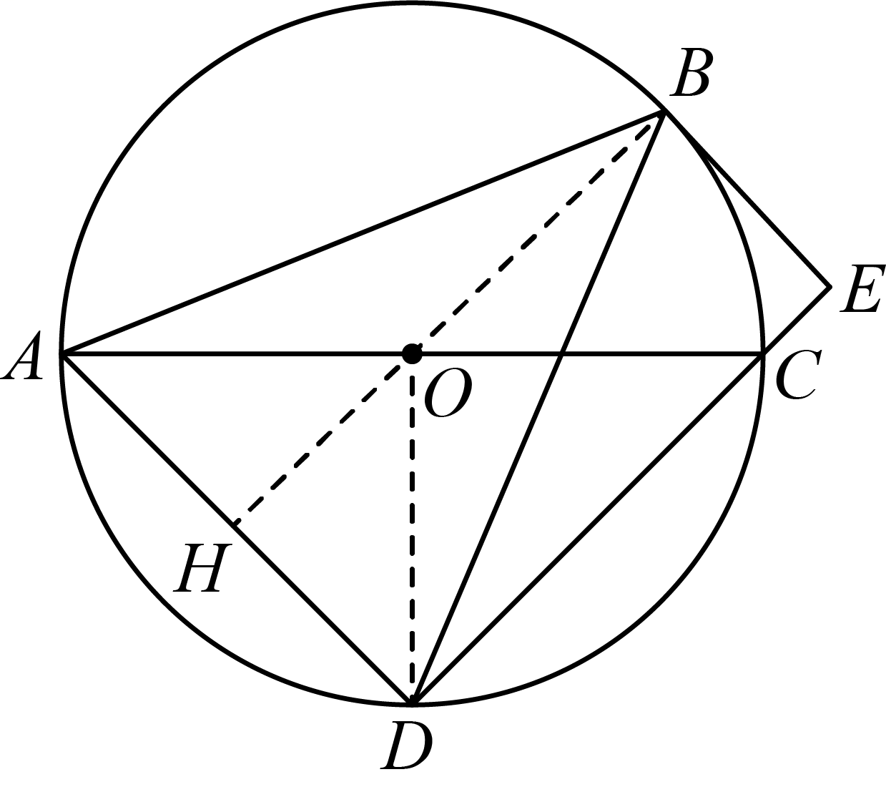
∵，，
∴垂直平分，
∴，，
∵为的切线，
∴，
∵为的直径，
∴，
∴四边形为矩形，
∴；
小问2详解】

由（1）知四边形为矩形，，，
∴，
∴，
设的半径为，则：，
在中，由勾股定理，得：，
解得：；
即：的半径为．
19. 为了测量抛物线的开口大小，某数学兴趣小组将两把含有刻度的直尺垂直放置，并分别以水平放置的直尺和竖直放置的直尺为*x*，*y*轴建立如图所示平面直角坐标系，该数学小组选择不同位置测量数据如下表所示，设的读数为*x*，读数为*y*，抛物线的顶点为*C*．
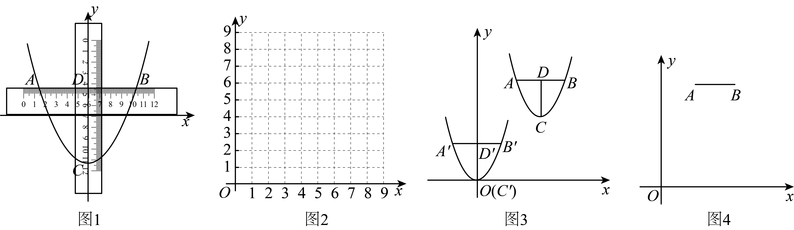
（1）（Ⅰ）列表：
|  | ① | ② | ③ | ④ | ⑤ | ⑥ |
| --- | --- | --- | --- | --- | --- | --- |
| *x* | 0 | 2 | 3 | 4 | 5 | 6 |
| *y* | 0 | 1 | 2.25 | 4 | 6.25 | 9 |

（Ⅱ）描点：请将表格中的描在图2中；
（Ⅲ）连线：请用平滑的曲线在图2将上述点连接，并求出*y*与*x*的关系式；
（2）如图3所示，在平面直角坐标系中，抛物线的顶点为*C*，该数学兴趣小组用水平和竖直直尺测量其水平跨度为，竖直跨度为，且，，为了求出该抛物线的开口大小，该数学兴趣小组有如下两种方案，请选择其中一种方案，并完善过程：
方案一：将二次函数平移，使得顶点*C*与原点*O*重合，此时抛物线解析式．

①此时点的坐标为________；
②将点坐标代入中，解得________；（用含*m*，*n*的式子表示）
方案二：设*C*点坐标为
①此时点*B*的坐标为________；
②将点*B*坐标代入中解得________；（用含*m*，*n*的式子表示）
（3）【应用】如图4，已知平面直角坐标系中有*A*，*B*两点，，且轴，二次函数和都经过*A*，*B*两点，且和的顶点*P*，*Q*距线段的距离之和为10，求*a*的值．
【答案】（1）图见解析，；
（2）方案一：①；②；方案二：①；②；
（3）*a*的值为或．
【解析】
【分析】（1）描点，连线，再利用待定系数法求解即可；
（2）根据图形写出点或点*B*的坐标，再代入求解即可；
（3）先求得，，的顶点坐标为，再求得顶点距线段的距离为，得到的顶点距线段的距离为，得到的顶点坐标为或，再分类求解即可．
【小问1详解】
解：描点，连线，函数图象如图所示，
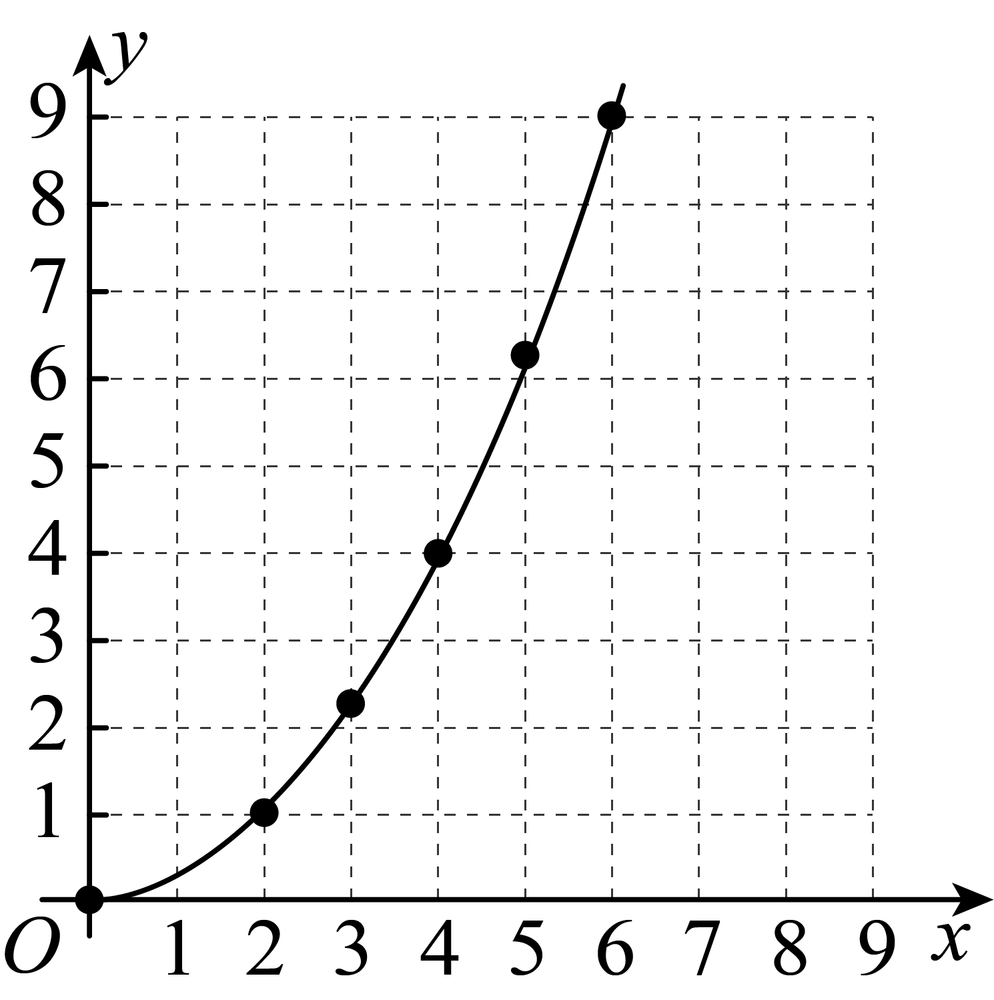
观察图象知，函数为二次函数，
设抛物线的解析式为，
由题意得，
解得，
∴*y*与*x*的关系式为；
【小问2详解】
解：方案一：①∵，，
∴，
此时点的坐标为；
故答案：；

②由题意得，
解得，
故答案为：；
方案二：①∵*C*点坐标为，，，
∴，
此时点*B*的坐标为；
故答案为：；
②由题意得，
解得，
故答案为：；
【小问3详解】
解：根据题意和的对称轴为，
则，，的顶点坐标为，
∴顶点距线段的距离为，
∴的顶点距线段的距离为，
∴的顶点坐标为或，
当的顶点坐标为时，，
将代入得，解得；
当的顶点坐标为时，，
将代入得，解得；
综上，*a*的值为或．
【点睛】本题主要考查二次函数的综合应用，抛物线的平移等，理解题意，综合运用这些知识点是解题关键．
20. 垂中平行四边形的定义如下：在平行四边形中，过一个顶点作关于不相邻的两个顶点的对角线的垂线交平行四边形的一条边，若交点是这条边的中点，则该平行四边形是“垂中平行四边形”．
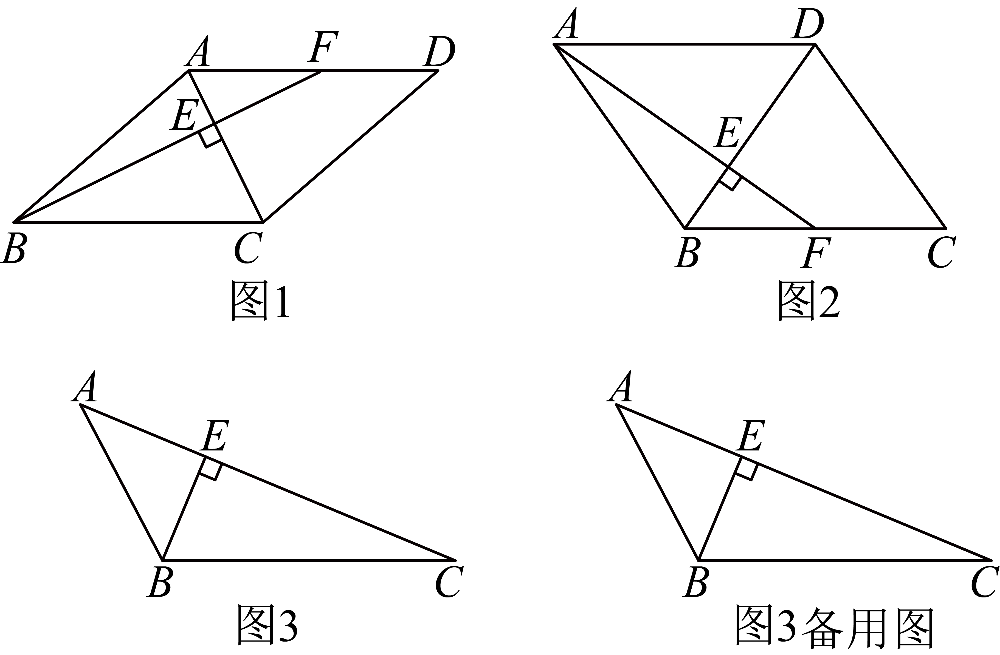
（1）如图1所示，四边形为“垂中平行四边形”，，，则________；________；
（2）如图2，若四边形为“垂中平行四边形”，且，猜想与的关系，并说明理由；
（3）①如图3所示，在中，，，交于点，请画出以为边的垂中平行四边形，要求：点在垂中平行四边形的一条边上（**温馨提示：不限作图工具**）；
②若关于直线对称得到，连接，作射线交①中所画平行四边形的边于点，连接，请直接写出的值．
【答案】（1），
（2），理由见解析
（3）①见解析；②或．
【解析】
【分析】（1）根据题意可推出，得到，从而推出，再根据勾股定理可求得，再求得；
（2）根据题意可推出，得到，设，则，，再利用勾股定理得到，从而推出、，即可求得答案；
（3）①分情况讨论，第一种情况，作的平行线，使，连接，延长交于点；第二种情况，作的平分线，取交的平分线于点，延长交的延长线于点，在射线上取，连接；第三种情况，作，交的延长线于点，连接，作的垂直平分线；
在延长线上取点*F*，使，连接；
②根据①中的三种情况讨论：
第一种情况，根据题意可证得是等腰三角形，作，则，可推出，从而推出，计算可得，最后利用勾股定理即可求得；
第二种情况，延长、交于点，同理可得是等腰三角形，连接，可由，结合三线合一推出，从而推出，同第一种情况即可求得；
第三种情况无交点，不符合题意．
【小问1详解】
解：，为的中点，，，，
，，
，即，解得，
，
；
故答案为：1；；
【小问2详解】
解：，理由如下：
根据题意，在垂中四边形中，，且为的中点，
，；
又，
，
；
设，则，
，
，
，，
，
，
，
；
【小问3详解】
解：①第一种情况：
作的平行线，使，连接，
则四边形为平行四边形；
延长交于点，
，
，
，
，，
，即，
为的中点；
故如图1所示，四边形即为所求的垂中平行四边形：
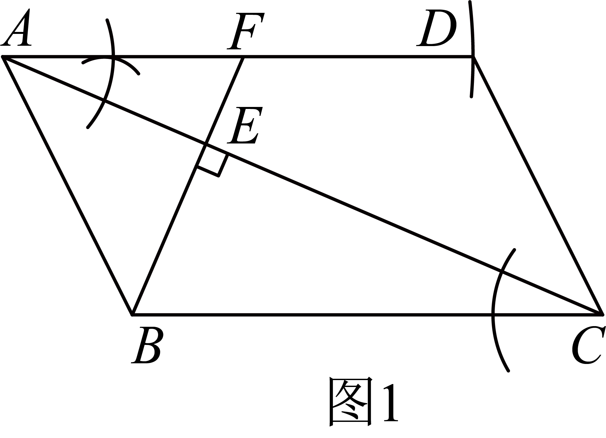
第二种情况：
作的平分线，取交的平分线于点，延长交的延长线于点，在射线上取，连接，
故为的中点；
同理可证明：，
则，
则四边形是平行四边形；
故如图2所示，四边形即为所求的垂中平行四边形：
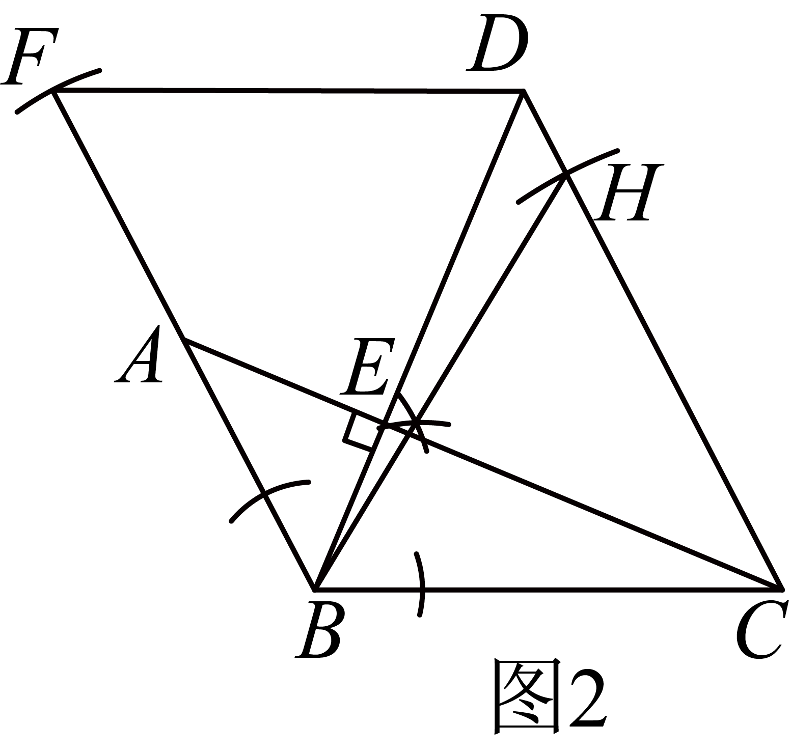
第三种情况：
作，交的延长线于点，连接，作的垂直平分线；
在延长线上取点*F*，使，连接，
则为的中点，
同理可证明，从而，
故四边形是平行四边形；
故如图3所示，四边形即为所求的垂中平行四边形：
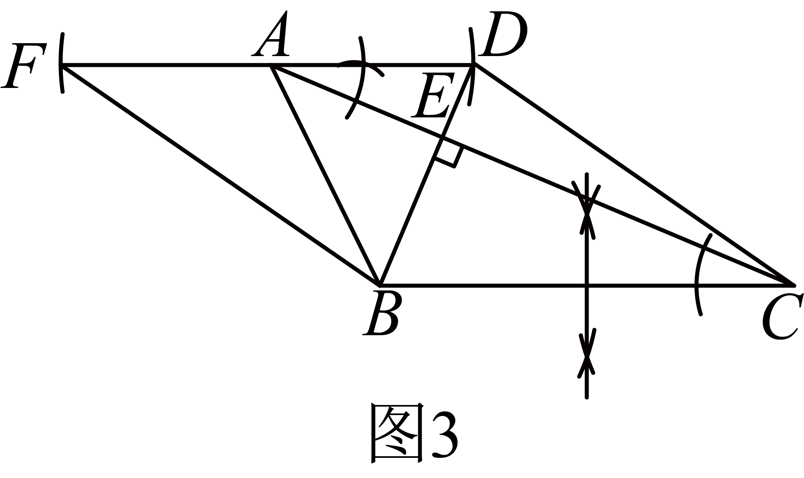
②若按照图1作图，
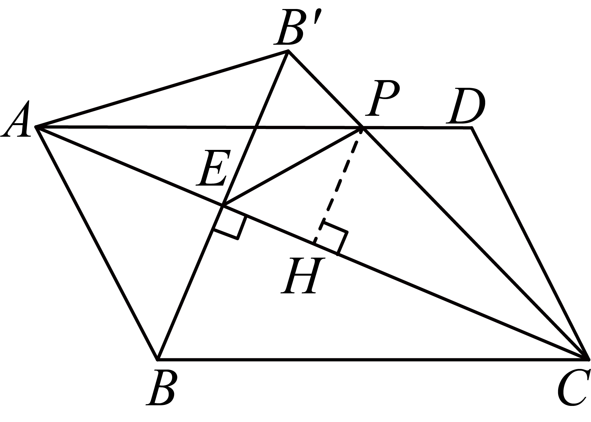
由题意可知，，
四边形是平行四边形，
，
，
是等腰三角形；
过*P*作于*H*，则，
，，
，，
，
；
,，
，
，即
∴
若按照图2作图，
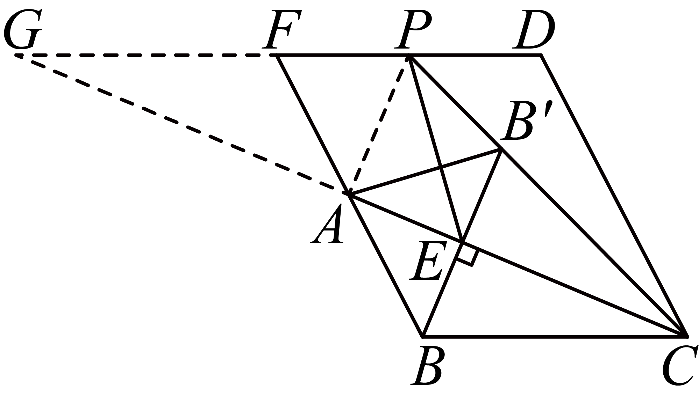
延长、交于点，
同理可得：是等腰三角形，
连接，
，
，
，
，
；
同理，，
，，，
，即，
，
若按照图3作图，则：没有交点，不存在*PE*（不符合题意）
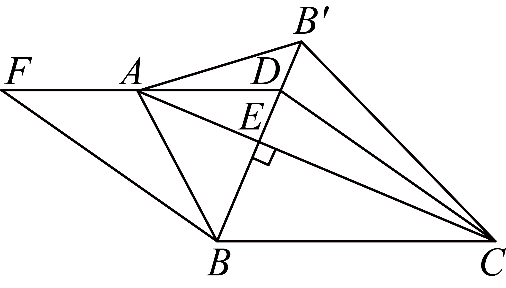
故答案为：或．
【点睛】本题考查了垂中平行四边形的定义，平行四边形的性质与判定，相似三角形的判定与性质，勾股定理，尺规作图，等腰三角形的判定与性质等，熟练掌握以上知识点，读懂题意并作出合适的辅助线是解题的关键．
