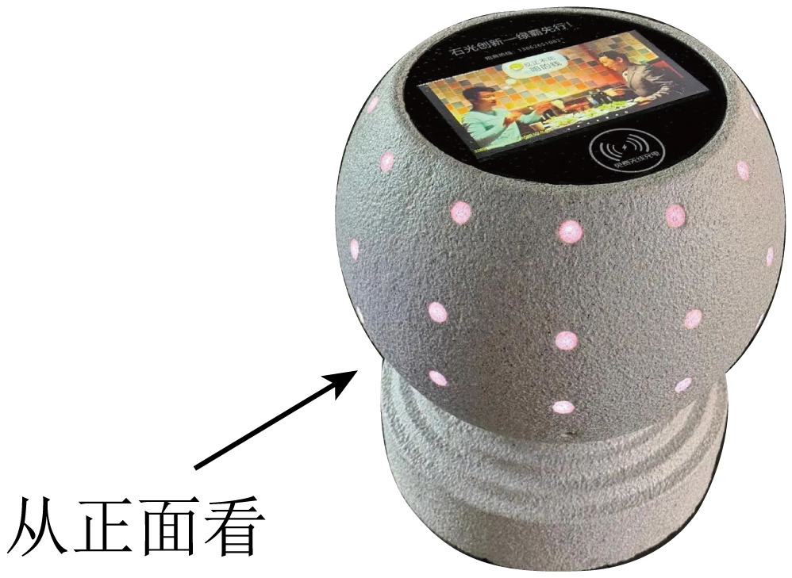
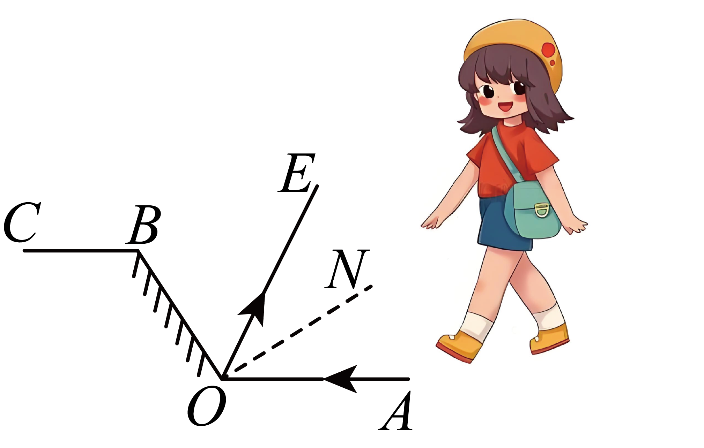
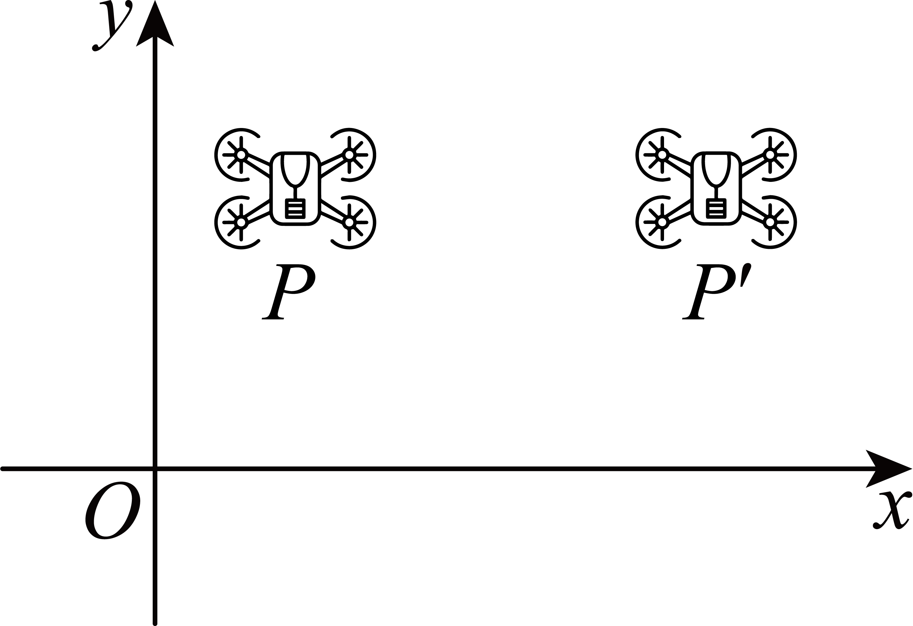
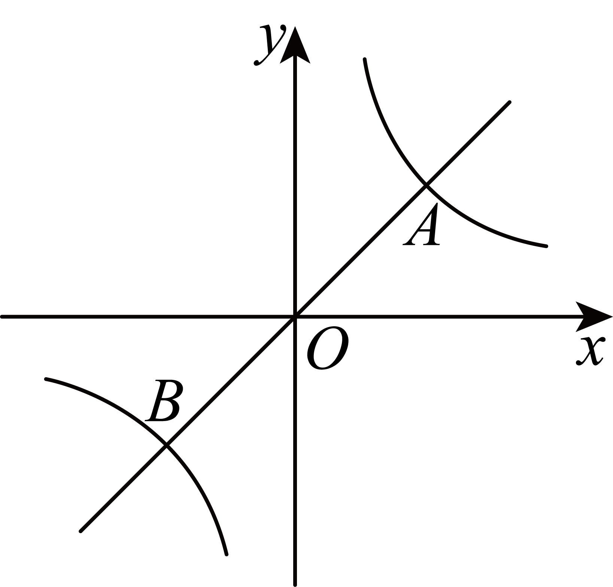
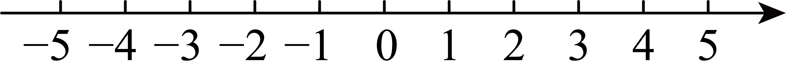
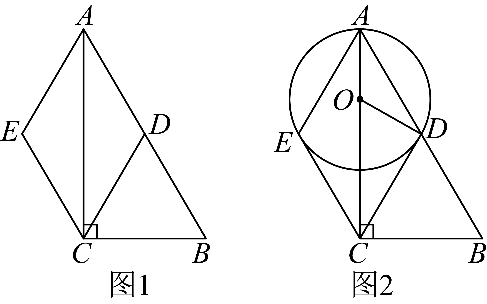
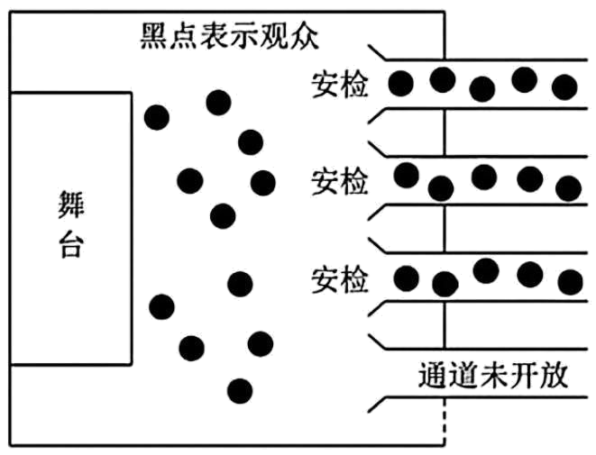
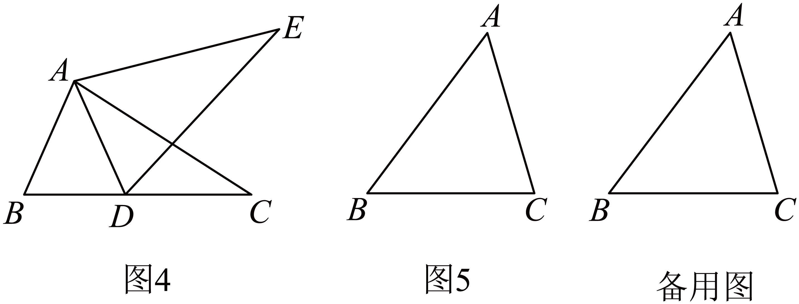

## **深圳市****2025****年初中学业水平考试**

## **数学**
**说明：本卷共****6****页．考试时间****90****分钟，满分****100****分．答题前，请将姓名、考号、考点、考场和座位号填写在答题卡相应的区域，并贴好条形码．考试结束后，请将本卷和答题卡一并上交．**
**一、选择题（本大题共****8****小题，每小题****3****分，共****24****分，每小题有四个选项，其中只有****一个****是正确的）**
1. 节约水5吨记作吨，则浪费水2吨记作（   ）
A. 吨	B. 吨	C. 吨	D. 吨
2. 如图为出现在深圳街头的新型无线充电石墩，关于石墩的三视图的描述，正确的是（   ）

A. 主视图和左视图相同	B. 主视图和俯视图相同
C. 左视图和俯视图相同	D. 三个视图都相同
3. 某校进行《九章算术》，《周髀算经》，《孙子算经》，《算法统宗》四本书的长文本阅读活动，小聪从中任取一本，恰好抽到《九章算术》的概率为（   ）
A. 	B. 	C. 	D.
4. 如图为人行天桥的示意图，若高长为10米，斜道长为30米，则的值为（   ）

A. 	B. 3	C. 	D.
5. 下列计算正确的是（   ）
A. 	B. 	C. 	D.
6. 如图为小颖在试鞋镜前的光路图，入射光线经平面镜后反射入眼，若，，，则入射角的度数为（   ）

A. 	B. 	C. 	D.
7. 某社区植树60棵，实际种植人数是原计划人数的2倍，实际平均每人种植棵树比原计划少了3棵．若设原计划人数为人，则下列方程正确的是（   ）
A. 	B. 	C. 	D.
8. 如图，将正方形沿折叠，使得点与对角线的交点重合，为折痕，则的值为（   ）

A. 	B. 	C. 	D.
**二、填空题（本大题共****5****小题，每小题****3****分，共****15****分）**
9. 若关于的方程的解为，则__________．
10. 如图，将无人机沿着轴向右平移3个单位，若无人机上一点的坐标为，则平移后点的坐标为__________．

11. 计算：__________．
12. 如图，同一平面直角坐标系下的正比例函数与反比例函数相交于点和点．若的横坐标为1，则的坐标为__________．

13. 如图，以矩形的点为圆心，的长为半径作，交于点，点为上一点，连接，将线段绕点顺时针旋转至，点落在上，且点为中点．若，，则的长为__________．

**三、解答题（本题共****7****小题，共****61****分）**
14. 计算：．
15. 解一元一次方程组，并在数轴上表示．
解：由不等式①得：__________，
由不等式②得：__________，
在数轴上表示为：

所以，原不等式组的解集为__________．
16. 某班级拟开展科技主题班会活动，现从“科技安全”，“科技畅想”，“科技生活”，“科技前沿”，“科技故事”中挑选一个主题．全班同学通过投票选出最受欢迎的主题，投票结果的条形统计图与扇形统计图如下：

请根据以上信息，完成下列问题：
（1）本次投票共__________人参与，其中科技安全所占百分比为__________，并补全条形统计图．
（2）为确定班会科技主题，从该班选择7名学生代表为“科技畅想”和“科技故事”打分，分数列表如下：
| 
  科技畅想  
 | 
  10  
 | 
  9  
 | 
  9  
 | 
  9  
 | 
  3  
 | 
  6  
 | 
  6  
 | 
  9  
 | 
  10  
 | 
  10  
 |
| --- | --- | --- | --- | --- | --- | --- | --- | --- | --- | --- |
| 
  科技故事  
 | 
  9  
 | 
  10  
 | 
  10  
 | 
  7  
 | 
  8  
 | 
  6  
 | 
  6  
 | 
  8  
 | 
  8  
 | 
  8  
 |
|  | 
  平均数  
 | 
  平均数  
 | 
  中位数  
 | 
  中位数  
 | 
  中位数  
 | 
  中位数  
 | 
  众数  
 | 
  众数  
 | 
  众数  
 |  |
| 
  科技畅想  
 |  |  |  |  |  |  | 
  9  
 | 
  9  
 | 
  9  
 |  |
| 
  科技故事  
 | 
  8  
 | 
  8  
 | 
  8  
 | 
  8  
 | 
  8  
 | 
  8  
 | 
  *c*  
 | 
  *c*  
 | 
  *c*  
 |  |

求表中数据：________，________，________．

（3）结合上述信息，应该选择哪个科技主题，并说明理由．
17. 某学校采购体育用品，需要购买三种球类．已知某体育用品商店排球的单价为30元/个，篮球，足球的价格如下表：
| 
  ①篮球、足球、排球各买一个的价格为140元  
 |
| --- |
| 
  ②购买2个足球的价格比购买一个篮球多花费40元  
 |
| 
  ③购买5个篮球与购买6个足球花费相同  
 |

（1）请你从上述3个条件中任选2个作为条件，求出篮球和足球的单价；
（2）若该学校要购买篮球，足球共10个，且足球的个数不超过篮球个数的2倍，请问购买多少个篮球时，花费最少，最少费用是多少？
18. 如图1，在中，是的中点，，．

（1）求证：四边形为菱形；
（2）如图2，若点为上一点，且，，三点均在上，连接，与相切于点，
①求__________；
②求的半径；
（3）利用圆规和无刻度直尺在图2中作射线，交于点，保留作图痕迹，不用写出作法和理由．
19 综合与实践

【问题背景】排队是生活中常见的场景，如图，某数学小组针对某次演出，研究了排队人数与安检时间，安排通道数之间的关系．
【研究条件】
条件1：观众进场立即排队安检，在任意时刻都满足：排队人数=现场总人数-已入场人数；
条件2：若该演出场地最多可开放9条安检通道，平均每条通道每分钟可安检6人．
【模型构建】若该演出前30分钟开始进行安检，经研究发现，现场总人数与安检时间之间满足关系式：
结合上述信息，请完成下述问题：
（1）当开通3条安检通道时，安检时间分钟时，已入场人数为__________，排队人数与安检时间的函数关系式为_________.
【模型应用】
（2）在（1）条件下，排队人数在第几分钟达到最大值，最大人数为多少？

（3）已知该演出主办方要求：
①排队人数在安检开始10分钟内（包含10分钟）减少；
②尽量少安排安检通道，以节省开支．
若同时满足以上两个要求，可开设几条安检通道，请说明理由?
总结反思】

函数可刻画生活实际场景，但要注意验证模型正确性，未来可结合更多变量（如突发情况、安检流程优化等）进行更深入的分析，以提高模型的准确性和实用性．

20. 综合与探究
【探索发现】如图1，小军用两个大小不同的等腰直角三角板拼接成一个四边形．
【抽象定义】以等腰三角形为边向外作等腰三角形，使该边所对的角等于原等腰三角形的顶角，此时该四边形称为“双等四边形”，原等腰三角形称为四边形的“伴随三角形”．如图2，在中，，，．此时，四边形是“双等四边形”，是“伴随三角形”．

【问题解决】如图3，在四边形中，，，．求：
①与的位置关系为：__________：
②_____．（填“>”，“”或“”）
【方法应用】①如图4，将绕点逆时针旋转至，点恰好落在边上，求证：四边形是双等四边形．
②如图5，在等腰三角形中，，，，在平面内找一点，使四边形是以为伴随三角形的双等四边形，若存在，请求出的长，若不存在，请说明理由．

