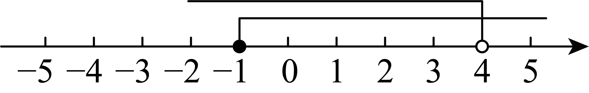
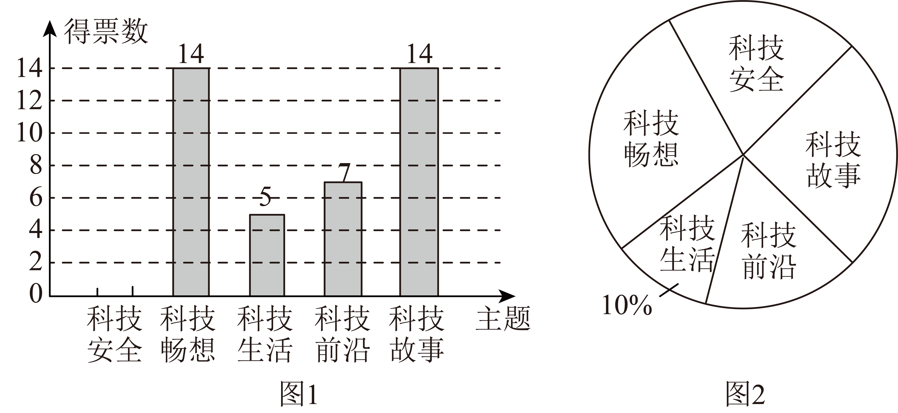
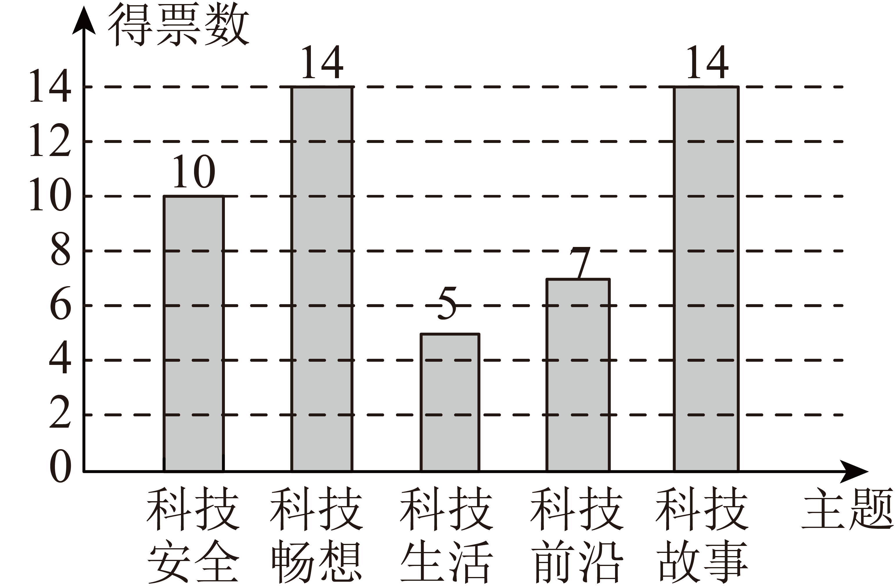
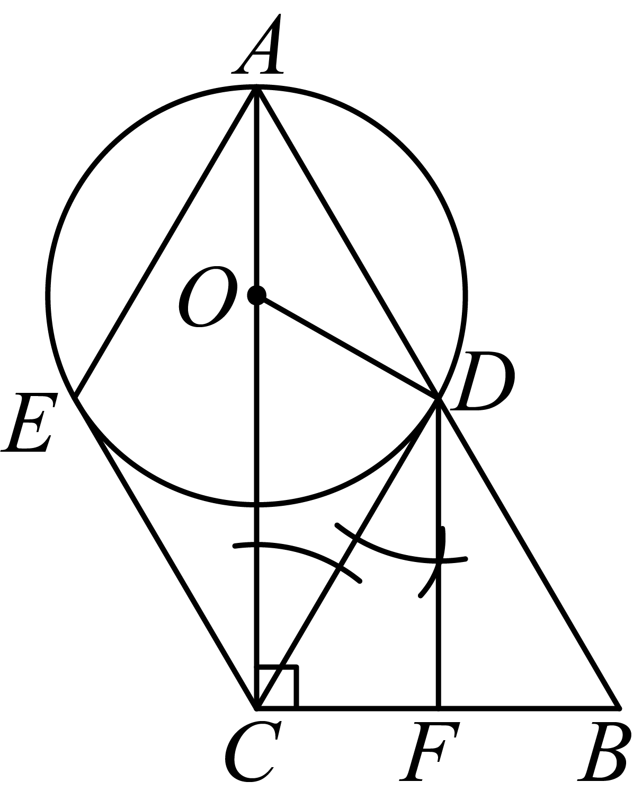
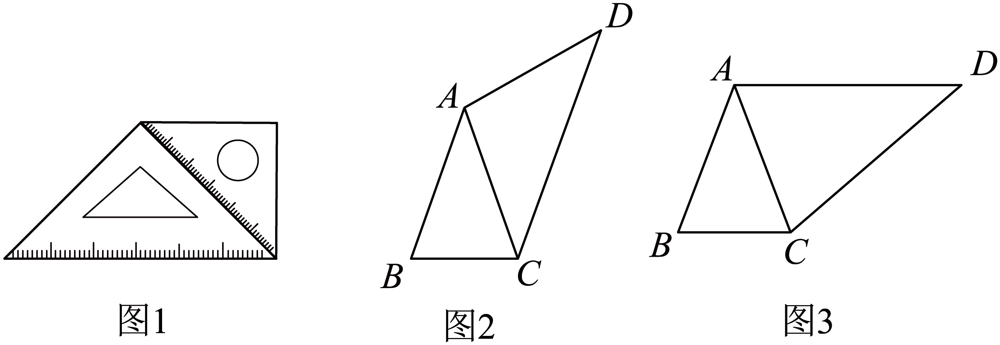
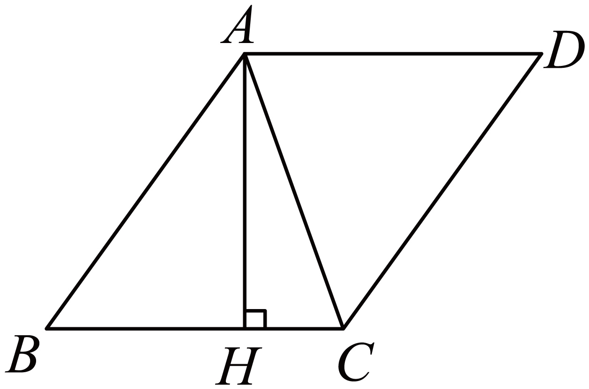
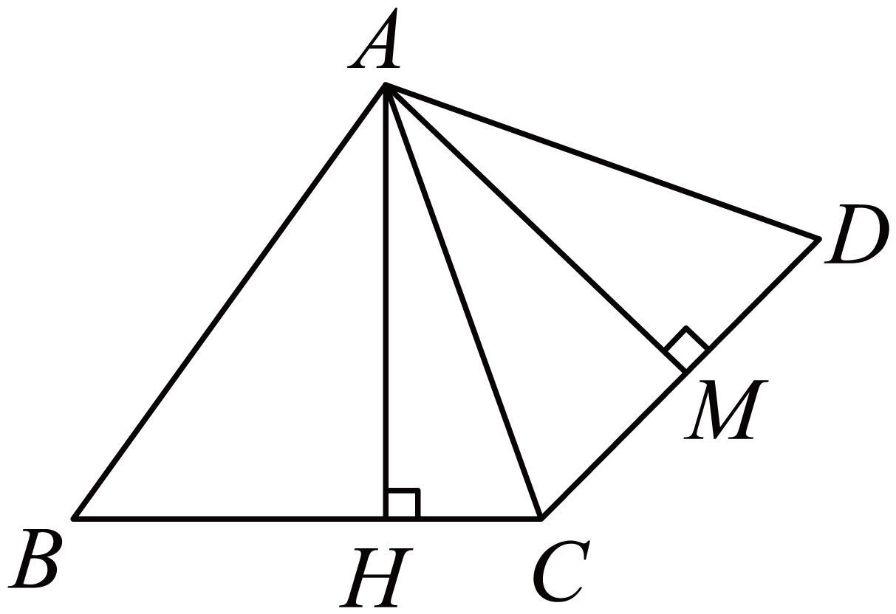
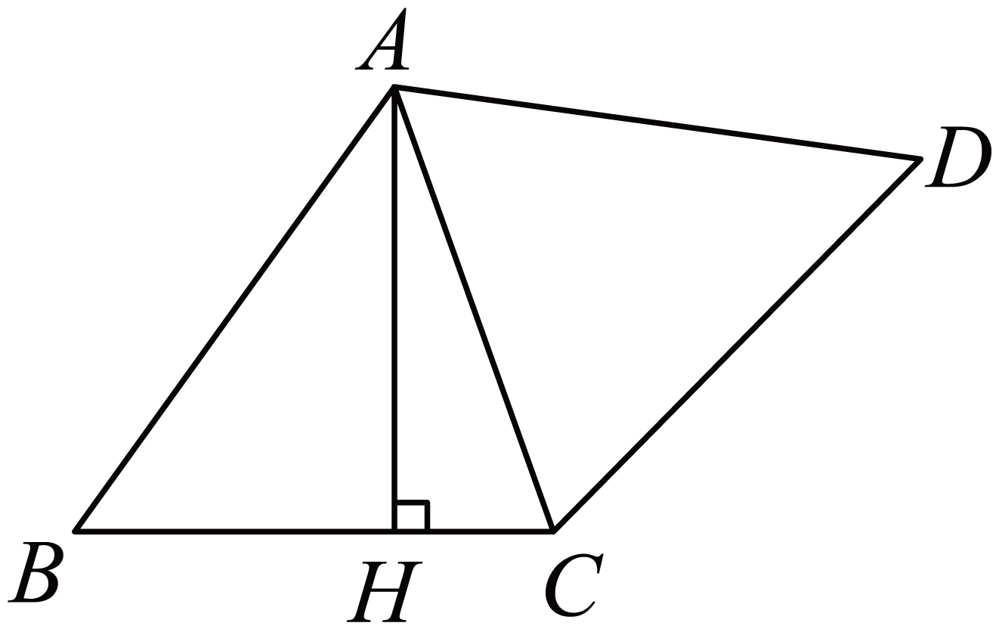

## **深圳市****2025****年初中学业水平考试**

## **数学**
**说明：本卷共****6****页．考试时间****90****分钟，满分****100****分．答题前，请将姓名、考号、考点、考场和座位号填写在答题卡相应的区域，并贴好条形码．考试结束后，请将本卷和答题卡一并上交．**
**一、选择题（本大题共****8****小题，每小题****3****分，共****24****分，每小题有四个选项，其中只有****一个****是正确的）**
1. 节约水5吨记作吨，则浪费水2吨记作（   ）
A. 吨	B. 吨	C. 吨	D. 吨
【答案】C
【解析】
【分析】本题考查了正数与负数，利用相反意义量的定义判断即可．
【详解】解：如果节约用水5吨记作吨，那么浪费水2吨，记作吨，
故选：C．
2. 如图为出现在深圳街头的新型无线充电石墩，关于石墩的三视图的描述，正确的是（   ）

A. 主视图和左视图相同	B. 主视图和俯视图相同
C. 左视图和俯视图相同	D. 三个视图都相同
【答案】A
【解析】
【分析】本题考查了三种视图，熟知三视图的观察方向是解题的关键．在正面内得到的由前向后观察物体的视图，叫做主视图；在水平面内得到的由上向下观察物体的视图，叫做俯视图；在侧面内得到由左向右观察物体的视图，叫做左视图．仔细观察图中几何体摆放的位置，根据三种视角观察到的图形判定则可．
【详解】解：根据三视图的定义，可知该几何主视图和左视图相同．
故选：A．
3. 某校进行《九章算术》，《周髀算经》，《孙子算经》，《算法统宗》四本书的长文本阅读活动，小聪从中任取一本，恰好抽到《九章算术》的概率为（   ）
A. 	B. 	C. 	D.
【答案】C
【解析】
【分析】本题考查简单的概率计算，根据等可能事件的概率公式求解．
【详解】解：共有4本书，每本书被抽中的可能性相等，
抽到《九章算术》是其中1种可能，
因此概率为成功事件数除以总事件数，即，
故选：C．
4. 如图为人行天桥的示意图，若高长为10米，斜道长为30米，则的值为（   ）

A. 	B. 3	C. 	D.
【答案】D
【解析】
【分析】本题考查了正弦，理解正弦的定义是解题关键．
根据正弦的定义求解即可．
【详解】解：∵长为10米，斜道长为30米，
∴根据题意得：，
故选：D
5. 下列计算正确的是（   ）
A. 	B. 	C. 	D.
【答案】B
【解析】
【分析】本题考查整式的运算，涉及同底数幂的乘法、幂的乘方、合并同类项及完全平方公式，运用相关运算法则计算出各选项的结果再进行判断即可．
【详解】解：A．与的指数不同，无法直接相加，故A计算错误；
B．，原计算正确，符合题意；
C．，原选项计算错误，故不符合题意；
D．，原选项缺少项，故D错误．
故选：B．
6. 如图为小颖在试鞋镜前的光路图，入射光线经平面镜后反射入眼，若，，，则入射角的度数为（   ）

A. 	B. 	C. 	D.
【答案】B
【解析】
【分析】本题考查利用平行线的性质求角的度数，结合图形求解是解题关键．
根据平行线的性质得出，结合图形即可求解．
详解】解：∵

∴，
∵，
∴，
故选：B．
7. 某社区植树60棵，实际种植人数是原计划人数的2倍，实际平均每人种植棵树比原计划少了3棵．若设原计划人数为人，则下列方程正确的是（   ）
A. 	B. 	C. 	D.
【答案】A
【解析】
【分析】本题考查由实际问题抽象出分式方程，设原计划人数为人，则实际人数为人，原计划平均每人种树棵，实际平均每人种树棵，根据题意，实际平均每人种树比原计划少3棵，由此建立方程．
【详解】解：由题意可得，
，
故选：A．
8. 如图，将正方形沿折叠，使得点与对角线的交点重合，为折痕，则的值为（   ）

A. 	B. 	C. 	D.
【答案】D
【解析】
【分析】题目主要考查正方形的性质，折叠的性质，相似三角形的判定和性质，理解题意，综合运用这些知识点是解题关键.
根据折叠得出，，利用相似三角形的判定和性质得出，再由正方形的性质求解即可.
【详解】解：∵正方形沿折叠，
∴，，
∴，
∴，
∴，
∵正方形，
∴，
∴，
故选：D.
**二、填空题（本大题共****5****小题，每小题****3****分，共****15****分）**
9. 若关于的方程的解为，则__________．
【答案】4
【解析】
【分析】本题考查了方程的解的定义、一元一次方程的解法，理解方程的解的意义，得到关于*a*的方程是解题关键．把代入关于*x*的方程，得到关于*a*的方程，解方程即可求解．
【详解】解：∵关于的方程的解为，
∴，
解得：，
故答案为：4．
10. 如图，将无人机沿着轴向右平移3个单位，若无人机上一点的坐标为，则平移后点的坐标为__________．

【答案】
【解析】
【分析】本题考查了坐标与图形平移变换，解题关键在于掌握左右移动改变点的横坐标，左减，右加；上下移动改变点的纵坐标，下减，上加．
根据点的平移规律即可求解．
【详解】解：由题意得：将点沿着轴向右平移3个单位，
∴平移后点坐标为，即，

故答案为：．
11. 计算：__________．
【答案】##
【解析】
【分析】本题考查了同分母分式的减法运算，掌握运算法则是解题的关键．
根据同分母分式的减法运算法则计算即可．
【详解】解：，
故答案为：．
12. 如图，同一平面直角坐标系下的正比例函数与反比例函数相交于点和点．若的横坐标为1，则的坐标为__________．

【答案】
【解析】
【分析】本题考查反比例函数与一次函数图象的交点问题，根据的横坐标为1，求出的值，进而求出点坐标，再根据对称性求出点的坐标即可．
详解】解：令，

∵同一平面直角坐标系下的正比例函数与反比例函数相交于点和点，的横坐标为1，
∴，
∴，
∴，
∴当时，，
∴，
∵正比例函数与反比例函数的图象均关于原点对称，
∴点关于原点对称，
∴；
故答案为：．
13. 如图，以矩形的点为圆心，的长为半径作，交于点，点为上一点，连接，将线段绕点顺时针旋转至，点落在上，且点为中点．若，，则的长为__________．

【答案】6
【解析】
【分析】本题主要考查矩形的性质，旋转的性质以及相似三角形的判定与性质，由矩形的性质得，由勾股定理得，所以，，再证明，可得，设，则，在中由勾股定理得，求出的值即可得到．
【详解】解：∵四边形是矩形，
∴；
在中，，
∴，
∵点是的中点，
∴，
由旋转得，，，
∴，
又，
∴，
又，
∴，
∴，
∵，
∴，即，
设，则，
在中，，
∴，
解得（负值舍去），
∴．
故答案为：6．
**三、解答题（本题共****7****小题，共****61****分）**
14. 计算：．
【答案】7
【解析】
【分析】本题考查实数的混合运算，熟练掌握相关运算法则，是解题的关键：先进行开方，去绝对值，零指数幂和乘方运算，再进行加减运算即可.
【详解】原式
.
15. 解一元一次方程组，并在数轴上表示．
解：由不等式①得：__________，
由不等式②得：__________，
在数轴上表示为：

所以，原不等式组的解集为__________．
【答案】；；；见解析
【解析】
【分析】本题主要考查解一元一次不等式组，分别求出每个不等式的解集，再根据“同大取大，同小取小，大小小大中间找，大大小小无法找”确定不等式组的解集，
【详解】解：，
解不等式①，得：
解不等式②，得：
在数轴上表示如下：

所以不等式组的解集为：，
故答案为：；；
16. 某班级拟开展科技主题班会活动，现从“科技安全”，“科技畅想”，“科技生活”，“科技前沿”，“科技故事”中挑选一个主题．全班同学通过投票选出最受欢迎的主题，投票结果的条形统计图与扇形统计图如下：

请根据以上信息，完成下列问题：
（1）本次投票共__________人参与，其中科技安全所占百分比为__________，并补全条形统计图．
（2）为确定班会科技主题，从该班选择7名学生代表为“科技畅想”和“科技故事”打分，分数列表如下：
| 
  科技畅想  
 | 
  10  
 | 
  9  
 | 
  9  
 | 
  9  
 | 
  3  
 | 
  6  
 | 
  6  
 | 
  9  
 | 
  10  
 | 
  10  
 |
| --- | --- | --- | --- | --- | --- | --- | --- | --- | --- | --- |
| 
  科技故事  
 | 
  9  
 | 
  10  
 | 
  10  
 | 
  7  
 | 
  8  
 | 
  6  
 | 
  6  
 | 
  8  
 | 
  8  
 | 
  8  
 |
|  | 
  平均数  
 | 
  平均数  
 | 
  中位数  
 | 
  中位数  
 | 
  中位数  
 | 
  中位数  
 | 
  众数  
 | 
  众数  
 | 
  众数  
 |  |
| 
  科技畅想  
 |  |  |  |  |  |  | 
  9  
 | 
  9  
 | 
  9  
 |  |
| 
  科技故事  
 | 
  8  
 | 
  8  
 | 
  8  
 | 
  8  
 | 
  8  
 | 
  8  
 | 
  *c*  
 | 
  *c*  
 | 
  *c*  
 |  |

求表中的数据：________，________，________．
（3）结合上述信息，应该选择哪个科技主题，并说明理由．
【答案】（1），补全统计图见解析
（2）8，9，8    （3）见解析（言之有理即可）
【解析】
【分析】本题考查了条形统计图和扇形统计图的信息关联，求中位数、众数、平均数等知识点，正确理解统计图是解题的关键．
（1）由科技生活的人数除以占比得到投票人数，用总人数减去其余的人数求出科技安全的人数，再除以总人数，即可求出占比，以及补全条形统计图；
（2）根据平均数，中位数，众数的定义即可求解；
（3）可以根据中位数和众数分别进行分析即可．
【小问1详解】
解：本次投票人数为：（人），
科技安全人数：（人），

∴占比为：，
补全条形统计图为：

故答案为：；
【小问2详解】
解：，
将“科技畅想”的打分排列为：3，6，9，9，9，10，10，
则中位数；
在“科技故事”打分中，8分出现次数最多，
∴，
故答案为：8，9，8；
【小问3详解】
解：应该选择“科技畅想”，因为给“科技畅想”活动的打高分的人数最多，表示其更受欢迎（答案不唯一）．
17. 某学校采购体育用品，需要购买三种球类．已知某体育用品商店排球的单价为30元/个，篮球，足球的价格如下表：
| 
  ①篮球、足球、排球各买一个的价格为140元  
 |
| --- |
| 
  ②购买2个足球的价格比购买一个篮球多花费40元  
 |
| 
  ③购买5个篮球与购买6个足球花费相同  
 |

（1）请你从上述3个条件中任选2个作为条件，求出篮球和足球的单价；
（2）若该学校要购买篮球，足球共10个，且足球的个数不超过篮球个数的2倍，请问购买多少个篮球时，花费最少，最少费用是多少？
【答案】（1）每个篮球60元，每个足球50元
（2）当购买篮球4个的时候，所花费用最少
【解析】
【分析】本题考查二元一次方程组，一元一次不等式，一次函数的实际应用，正确的列出方程组，不等式和一次函数解析式，是解题的关键：
（1）设每个篮球元，每个足球元，根据表格信息，列出二元一次方程组进行求解即可；
（2）设蓝球有个，购买总费用是元，根据题意，列出不等式求出的范围，列出一次函数解析式，根据一次函数的性质，求最值即可．

【小问1详解】
解：设每个篮球元，每个足球元，由题意，得：
或或，（三个方程组任选一个即可）
解得：；
答：每个篮球60元，每个足球50元．
【小问2详解】
设蓝球有个，则足球有个
，
解得：，
设购买的总费用是元，
，
，
随着的减小而减小；
∵且为整数，
当最小值为4时，最小值为540元；
答：当购买篮球4个的时候，所花费用最少．
18. 如图1，在中，是的中点，，．

（1）求证：四边形为菱形；
（2）如图2，若点为上一点，且，，三点均在上，连接，与相切于点，
①求__________；
②求的半径；
（3）利用圆规和无刻度直尺在图2中作射线，交于点，保留作图痕迹，不用写出作法和理由．
【答案】（1）见解析    （2）①30°；②
（3）见解析
【解析】
【分析】（1）先证明四边形为平行四边形，斜边上的中线得到，即可得证；
（2）①根据菱形的性质，得到，等角对等边得到，三角形的外角得到，切线得到，再根据角的和差关系进行求解即可；②解直角三角形，进行求解即可；
（3）利用尺规作图作，即可．
【小问1详解】
解：，
四边形为平行四边形，
又，且为中点
，
平行四边形为菱形．
【小问2详解】
①四边形为菱形．
，
，
又，
，
，
切于，
，
；
；
②设半径为，
，
，
，，
；
解得：；
【小问3详解】
由题意，作图如下：

【点睛】本题考查菱形的判定和性质，斜边上的中线，切线的性质，解直角三角形，尺规作平行线，熟练掌握相关知识点，是解题的关键．
19. 综合与实践
【问题背景】排队是生活中常见的场景，如图，某数学小组针对某次演出，研究了排队人数与安检时间，安排通道数之间的关系．
【研究条件】
条件1：观众进场立即排队安检，在任意时刻都满足：排队人数=现场总人数-已入场人数；
条件2：若该演出场地最多可开放9条安检通道，平均每条通道每分钟可安检6人．
【模型构建】若该演出前30分钟开始进行安检，经研究发现，现场总人数与安检时间之间满足关系式：
结合上述信息，请完成下述问题：
（1）当开通3条安检通道时，安检时间分钟时，已入场人数为__________，排队人数与安检时间的函数关系式为_________.
【模型应用】
（2）在（1）的条件下，排队人数在第几分钟达到最大值，最大人数为多少？
（3）已知该演出主办方要求：
①排队人数在安检开始10分钟内（包含10分钟）减少；
②尽量少安排安检通道，以节省开支．
若同时满足以上两个要求，可开设几条安检通道，请说明理由?
【总结反思】
函数可刻画生活实际场景，但要注意验证模型的正确性，未来可结合更多变量（如突发情况、安检流程优化等）进行更深入的分析，以提高模型的准确性和实用性．

【答案】（1）；；（2）当时，；（3）最少开7条通道
【解析】
【分析】本题主要考查二次函数的应用，理解题意是解答本题的关键．
（1）根据题意得安检时间为分钟，则已入场人数为（用表示），与的函数表达式为；
（2）根据二次函数的性质可得出结论；
（3）运用二次函数的性质解答即可
【详解】解：（1）若开设3条安检通道，安检时间为分钟，则已入场人数为（用表示），若排队人数为，则与的函数表达式为
（2）
当时，
（3）设开了条通道则：
对称轴为
∵排队人数10分钟（包括10分钟）内减少
，即：
又最多开通9条
为正整数，
最小值为7 ，
最少开7条通道；
20. 综合与探究
【探索发现】如图1，小军用两个大小不同的等腰直角三角板拼接成一个四边形．
【抽象定义】以等腰三角形为边向外作等腰三角形，使该边所对的角等于原等腰三角形的顶角，此时该四边形称为“双等四边形”，原等腰三角形称为四边形的“伴随三角形”．如图2，在中，，，．此时，四边形是“双等四边形”，是“伴随三角形”．

【问题解决】如图3，在四边形中，，，．求：
①与的位置关系为：__________：
②_____．（填“>”，“”或“”）
【方法应用】①如图4，将绕点逆时针旋转至，点恰好落在边上，求证：四边形是双等四边形．
②如图5，在等腰三角形中，，，，在平面内找一点，使四边形是以为伴随三角形的双等四边形，若存在，请求出的长，若不存在，请说明理由．

【答案】问题解决：①互相平行；②=；【方法应用】①见解析；②或或
【解析】
【分析】本题主要考查等腰三角形的性质，旋转的性质以及相似三角形的判定与性质，熟练掌握相关知识是解答本题的关键．
问题解决：①根据等腰三角形的性质得出，从而可得；
②证明得出，即，由可得结论；
方法应用：①根据双等四边形的定义进行证明；②分，或，或，三种情况讨论求解即可．
【详解】解：[问题解决]①∵，
∴，
∴，
∴；
②∵，，
∴，
，
，
，
；
故答案为：①平行；②＝；
方法应用：①为旋转得到，
，
令，则，，
，
由旋转得，，
又，
∴，
，
，
，
四边形为双等四边形；
②作于点，

，，
，，
设，则： ，
在中，，即，
解得：，
，，
若，时，，
若，时，
，
作于点，

∴，
，
，
若，时，如图，

，
，
，
，
．
综上所述：满足条件时，或或．
