## **2019****年深圳市中考物理试卷及答案解析**

**一、选择题（共****16****小题，每小题****1.5****分，共****24****分。在每小题给出的****4****个选项中，只有一项符合题目**
**要求。）**
1. 下列有关光的表述正确的是（    ）
A. “凿壁偷光”——光的直线传播
B. 岸上的人看到水中的鱼——光的镜面反射
C. “海市蜃楼”——光的漫反射
D. 驾驶员看到后视镜中的景物——光的折射
2. 下列与照相机成像原理相同的设备是（    ）
A. 放大镜	B. 近视眼镜	C. 监控摄像头	D. 投影仪
3. 关于下列四幅图的说法正确的是（    ）
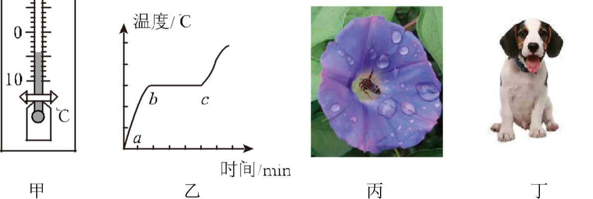
A. 甲图中，温度计的示数为−4℃
B. 乙图中，某晶体熔化图象中*bc*段，晶体内能不变
C. 丙图中，花儿上露珠是水蒸气凝华而成的

D. 丁图中，烈日下小狗伸出舌头降温，是因为水汽化放热
4. 下列说法正确的是（    ）
A. 燃料燃烧越充分，它的热值就越大
B. 内燃机用水做冷却液，是因为水的比热容较大
C. 敲击大小不同的编钟，发出声音的音色不同
D. 在闹市区安装噪声监测装置，可以减弱噪声
5. 甲、乙两物体，同时从同一地点沿直线向同一方向运动，它们的*s*−*t*图象如图所示．下列说法正确的是（）
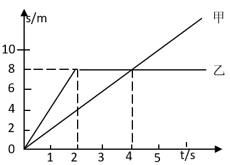
A. 2~4s内乙做匀速直线运动
B. 4s时甲、乙两物体的速度相等
C. 0~4s内乙的平均速度为2m/s
D. 3s时甲在乙的前方
6. 下列数据最接近实际情况的是（    ）
A. 大气对拇指指甲盖的压力约为10N
B. 学生课桌高度约为200cm
C. 让人感觉舒适气温约为37℃

D. 家用节能灯的功率约为1kW
7. 生活中有许多现象都蕴含物理知识．下列说法正确的是（    ）
A. 一块海绵被压扁后，体积变小，质量变小
B. 人在站立和行走时，脚对水平地面的压强相等
C. 乘坐地铁时抓紧扶手，是为了减小惯性
D. 被踢飞的足球，在空中仍受到重力的作用
8. 如图所示，同一木块在同一粗糙水平面上，先后以不同的速度被匀速拉动．甲图中速度为*v*1，乙图中速度为*v*2，丙图中木块上叠放一重物，共同速度为*v*3，且*v*1<*v*2<*v*3，匀速拉动该木块所需的水平拉力分别为*F*甲、*F*乙和*F*丙．下列关系正确的是（）
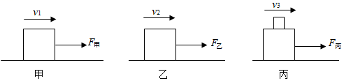
A. *F*甲<*F*乙<*F*丙	B. *F*甲>*F*乙>*F*丙
C. *F*甲=*F*乙<*F*丙	D. *F*甲<*F*乙=*F*丙
9. 水平桌面上两个底面积相同的容器中，分别盛有甲、乙两种液体．将两个完全相同的小球M、N分别放入两个容器中，静止时两球状态如图所示，两容器内液面相平．下列分析正确的是（）

A. 两小球所受浮力*F*M<*F*N
B. 两种液体的密度*ρ*甲<*ρ*乙
C. 两种液体对容器底部的压强*p*甲=*p*乙
D. 两种液体对容器底部的压力*F*甲>*F*乙
10. 如图，弧形轨道*ab*段光滑，*bc*段粗糙，小球从*a*点经最低点*b*运动至*c*点．下列分析正确的是（）
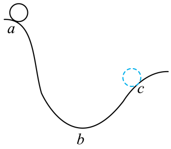
A. 从*a*到*b*的过程中，小球动能转化为重力势能
B. 经过*b*点时，小球动能最大
C. 从*b*到*c*的过程中，小球动能增大
D. 从*a*到*c*的过程中，小球机械能守恒
11. 下列说法正确的是（    ）
A. 电荷的移动形成电流
B. 电路中有电压就一定有电流
C. 把一根铜丝均匀拉长后电阻变小
D. 长时间使用的手机发烫，是因为电流的热效应
12. 在探究“电荷间的相互作用”的实验中，用绝缘细线悬挂两个小球，静止时的状态如图所示．下列判断正确的是（）

A. 两球一定带同种电荷
B. 两球可能带异种电荷
C. 两球可能一个带电，一个不带电
D. 两球均只受两个力
13. 下列对电磁实验现象相应的解释正确的是（    ）
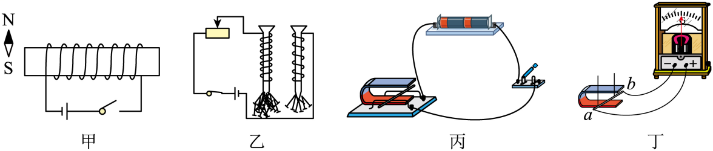
A. 甲图中，闭合开关，小磁针的N极向左偏转
B. 乙图中，线圈匝数多的电磁铁，磁性强
C. 丙图中，该装置用来研究电磁感应现象
D. 丁图中，磁铁放在水平面上，导体*ab*竖直向上运动，电流表指针一定会偏转
14. 关于家庭电路，下列说法正确的是（    ）

A. 甲图中，若保险丝熔断，则一定是短路引起的
B. 甲图中，灯泡与开关的连接符合安全用电原则
C. 甲图中，两孔插座的连接不符合安全用电原则
D. 乙图中，电能表所在电路的总功率不能超过2200W
15. 地磅工作时，重物越重，电表的示数就越大．下列四幅电路图中，*R*′是滑动变阻器，*R*是定值电阻．其中符合地磅工作原理的是（）
A.
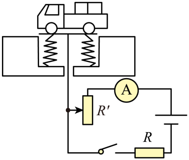
B.
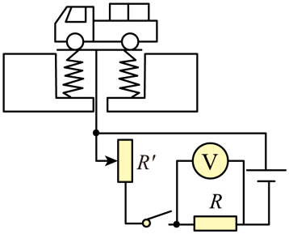
C.
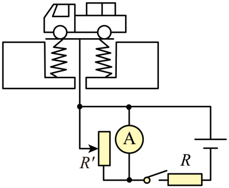
D.
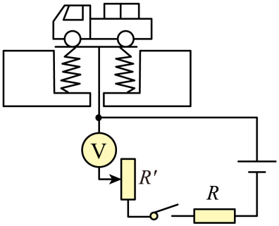
16. 甲图是小灯泡L和电阻*R*的*I*−*U*图象．将小灯泡L和电阻*R*接入乙图所示电路中，只闭合开关S1时，小灯泡L的实际功率为1W．下列说法**错误**的是（        ）
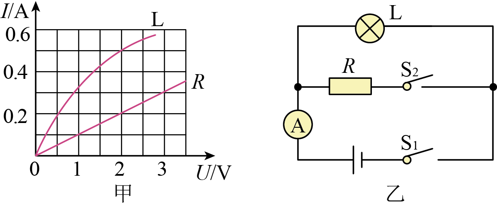
A. 只闭合开关S1时，小灯泡L的电阻为4Ω
B. 再闭合开关S2时，电流表示数增加0.2A
C. 再闭合开关S2时，电路总功率为1.4W
D. 再闭合开关S2后，在1min内电阻*R*产生的热量为240J
**二、非选择题（共****6****小题，共****36****分）**
17. 一束光从空气射入玻璃时的反射光线如图所示，请画出入射光线和大致的折射光线．

18. 如图所示，在*C*点用力把桌腿*A*抬离地面时，桌腿*B*始终没有移动，请在*C*点画出最小作用力的示意图．
（        ）

19. 如图所示，甲图是探究“阻力对物体运动影响”的实验装置，让同一小车从斜面上相同的高度由静止滑下，在粗糙程度不同的水平面上运动．乙图是探究“物体的动能跟哪些因素有关”的实验装置，让同一钢球从斜面上不同的高度由静止滚下，碰到同一木块上．请回答：

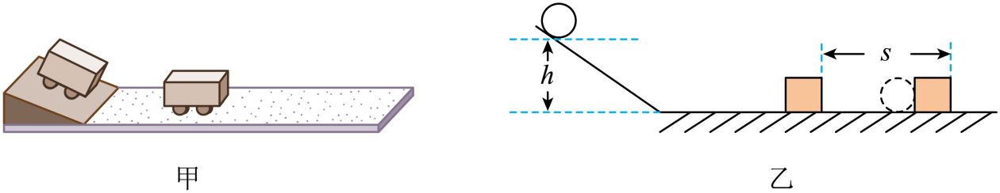
（1）甲实验中，小车在水平面上运动时，在竖直方向上受到的力有________和________；在水平方向上受到摩擦力，且摩擦力越小，小车的速度减小得越________．从而可以推理：如果运动的物体不受力，它将________．
（2）乙实验中的研究对象是________（选填“钢球”或“木块”），实验目的是探究物体的动能大小与________的关系．
20. 如图所示，在“测量小灯泡的电功率”的实验中，电源电压为4.5V，小灯泡的额定电压为2.5V．

（1）请你用笔画线代替导线，将甲图中的实物图连接完整（要求滑动变阻器的滑片P向*B*端移动时小灯泡变暗）．
（        ）
（2）某小组连接好电路后，检查连线正确，但闭合开关后发现小灯泡发出明亮的光且很快熄灭．出现这一故障的原因可能是________．排除故障后，闭合开关，移动滑动变阻器的滑片P到某处，电压表的示数如乙图所示．若要测量小灯泡的额定功率，应将图中的滑片P向________（选填“*A*”或“*B*”）端移动，直到电压表的示数为2.5V，此时电流表的示数如丙图所示，则小灯泡的额定功率为_______W．
（3）测出小灯泡的额定功率后，某同学又把小灯泡两端电压调为额定电压的一半，发现测得的功率并不等于其额定功率的四分之一，其原因是______________．
（4）若将小灯泡换成定值电阻，且电路连接完好，还可以完成实验是________（填标号）．

A．探究电流与电压的关系        B．探究电流与电阻的关系
21. 如图所示，斜面长*s*=8m，高*h*=3m．用平行于斜面*F*=50N的拉力，将重力为*G*=100N的物体，由斜面的底端匀速拉到顶端，用时*t*=10s．求：
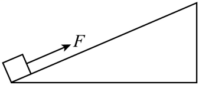
（1）有用功*W*有
（2）拉力做功的功率*P*
（3）物体受到的摩擦力*f*
（4）该斜面的机械效率*η*．
22. “道路千万条，安全第一条；行车不规范，亲人两行泪．”酒后不开车是每个司机必须遵守的交通法规．甲图是酒精测试仪工作电路原理图，电源电压*U*=6V；*R*1为气敏电阻，它的阻值随气体中酒精含量的变化而变化，如乙图所示．气体中酒精含量大于0且小于80mg/100mL为酒驾，达到或者超过80mg/100mL为醉驾．使用前通过调零旋钮（即滑动变阻器*R*2的滑片）对测试仪进行调零，此时电压表示数为*U*1=5V，调零后*R*2的滑片位置保持不变．
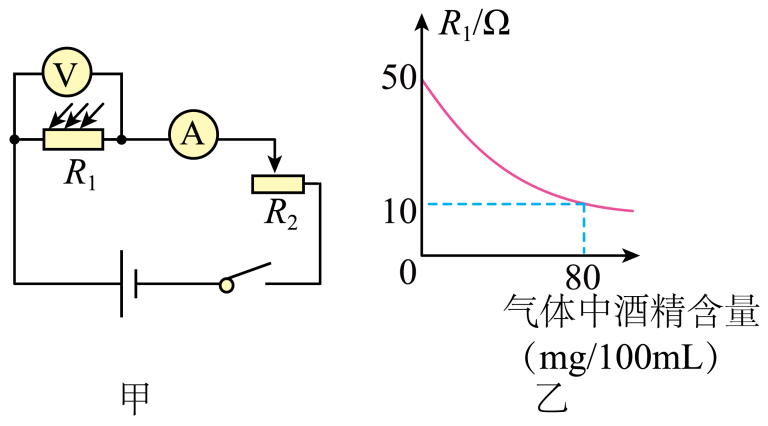
（1）当电压表示数为*U*1=5V时，求*R*1消耗电功率

（2）当电压表示数为*U*1=5V时，求*R*2接入电路中的阻值
（3）某次检测中，电流表示数*I*1′=0.2A，请通过计算，判断此驾驶员属于酒驾还是醉驾．
23. 如甲图所示的电路，闭合开关，两灯均不亮．已知电路连接正确，是其中一个小灯泡损坏了．请你在不拆开原电路的基础上，从乙图所示的实验器材中任选一种连入电路，设计检测方法，找出损坏的小灯泡，并完成表格中相关内容．
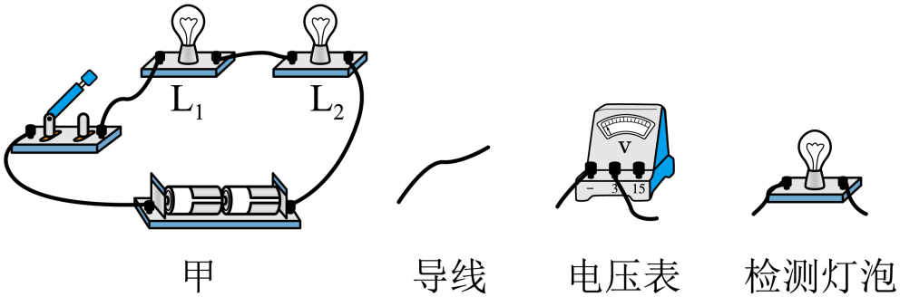
| 
  所选器材  
 | 
  检测**电路图**  
 | 
  现象与结论  
 |
| --- | --- | --- |
|  |  |  |
|  |  |  |

24. 2019年6月5日12时06分，在我国黄海某海域，科技人员使用“长征十一号”运载火箭进行“一箭七星”海上发射技术试验，运载火箭点火后，箭体腾空而起并加速上升，直冲云霄，把卫星顺利送入距离地面600千米高的预定轨道．首次海上发射取得圆满成功，填补了我国运载火箭海上发射的空白．在火箭上升过程中，为了能够近距离拍摄到箭体周围的实况，“长征十一号”火箭上装有高清摄像机，摄像机的镜头是由耐高温的材料制成的．小宇同学观看发射时的电视画面发现：箭体在上升过程中有一些碎片脱落，且脱落的碎片先上升一段距离后才开始下落．
请从上述材料中找出涉及物理知识的内容，模仿范例格式，写出对应的物理知识或规律（任写三条）．
|  | 
  相关描述  
 | 
  物理知识或规律  
 |
| --- | --- | --- |
| 
  范例  
 | 
  火箭加速上升  
 | 
  受非平衡力  
 |
| 
  1  
 |  |  |
| 
  2  
 |  |  |
| 
  3  
 |  |  |
