## **2019****年深圳市中考物理试卷及答案解析**

**一、选择题（共****16****小题，每小题****1.5****分，共****24****分。在每小题给出的****4****个选项中，只有一项符合题目**
**要求。）**
1. 下列有关光的表述正确的是（    ）
A. “凿壁偷光”——光的直线传播
B. 岸上的人看到水中的鱼——光的镜面反射
C. “海市蜃楼”——光的漫反射
D. 驾驶员看到后视镜中的景物——光的折射
【答案】A
【解析】
【详解】A．“凿壁偷光”指光从破损的墙壁穿出形成光斑，属于光的直线传播现象，故A正确；
B．岸上的人看到水中的鱼属于光从一种介质进入另一种介质，是光的折射现象，不是镜面反射现象，故B错误；
C．“海市蜃楼”属于光的折射现象，不是光的漫反射现象，故C错误；
D．通过后视镜观察景物，属于光的反射现象，不是光的折射现象，故D错误．
2. 下列与照相机成像原理相同的设备是（    ）
A. 放大镜	B. 近视眼镜	C. 监控摄像头	D. 投影仪
【答案】C
【解析】
【详解】根据凸透镜成像特点，当物距大于两倍焦距时，凸透镜能够成倒立缩小的实像为照相机原理．
A．放大镜是利用凸透镜成正立放大虚像的原理，故A错误；
B．近视眼镜利用了凹透镜对光线的发散作用，故B错误；
C．监控摄像头是利用凸透镜成倒立缩小的实像的原理，故C正确；
D．投影仪是利用凸透镜成倒立放大实像的原理，故D错误．
3. 关于下列四幅图的说法正确的是（    ）

A. 甲图中，温度计的示数为−4℃
B. 乙图中，某晶体熔化图象中*bc*段，晶体内能不变
C. 丙图中，花儿上的露珠是水蒸气凝华而成的
D. 丁图中，烈日下小狗伸出舌头降温，是因为水汽化放热
【答案】A
【解析】
【详解】A．温度计读数，液柱所在刻度在0℃下方，且分度值为1℃，故读为−4℃，故A正确；
B．此图像为晶体熔化图像，晶体熔化时吸热，故内能增大，故B错误；
C．花儿上露珠是水蒸气液化形成的，不是凝华，故C错误；

D．小狗伸舌头降温是利用水汽化吸热原理，不是放热，故D错误．

4. 下列说法正确的是（    ）
A. 燃料燃烧越充分，它的热值就越大
B. 内燃机用水做冷却液，是因为水的比热容较大
C. 敲击大小不同的编钟，发出声音的音色不同
D. 在闹市区安装噪声监测装置，可以减弱噪声
【答案】B
【解析】
【详解】A．燃料的热值是某种燃料完全燃烧时放出的热量与其质量之比，与实际燃烧情况无关，故A错误；
B．水比热容比较大，与质量相等其它物质相比，在升高相同温度时，水吸收的热量多，适合作为内燃机的冷却液，故B正确；

C．敲击大小不同的编钟，是音调不同，相同乐器发出的声音的音色相同，故C错误；
D．噪声监测装置只能监测噪声等级，不能减弱，故D错误．
5. 甲、乙两物体，同时从同一地点沿直线向同一方向运动，它们的*s*−*t*图象如图所示．下列说法正确的是（）
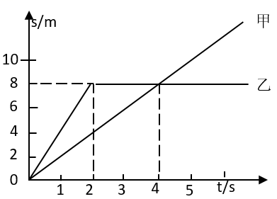
A. 2~4s内乙做匀速直线运动
B. 4s时甲、乙两物体的速度相等
C. 0~4s内乙的平均速度为2m/s
D. 3s时甲在乙的前方
【答案】C
【解析】
【详解】此图像为*s-t*图像，先明确甲乙的运动状态，甲一直保持匀速直线运动，乙是先匀速直线运动后静止
A．2~4s内，乙是静止状态，故A错误；
B．4s时甲有一定的速度，乙是静止状态，速度不同，故B错误；
C．0~4s乙运动的路程是8m，时间是4s，平均速度为==2m/s，故C正确；
D．3s时，乙运动的路程是8m，甲运动的路程是6m，乙在甲前方，故D错误．
6. 下列数据最接近实际情况的是（    ）
A. 大气对拇指指甲盖的压力约为10N
B. 学生课桌高度约为200cm
C. 让人感觉舒适气温约为37℃

D. 家用节能灯的功率约为1kW
【答案】A
【解析】
【详解】A．一标准大气压约为1×105Pa，手指甲的面积大约1cm2，大气对拇指指甲盖的压力*F*=*pS*=1×105Pa×1×10-4m2=10N，故A正确；
B．学生课桌高度大约为80cm，故B错误；
C．让人舒适的环境温度为23℃，37℃为人体正常体温，故C错误；
D．家用节能灯功率大约20W左右，故D错误．
7. 生活中有许多现象都蕴含物理知识．下列说法正确的是（    ）
A. 一块海绵被压扁后，体积变小，质量变小
B. 人在站立和行走时，脚对水平地面的压强相等
C. 乘坐地铁时抓紧扶手，是为了减小惯性
D. 被踢飞的足球，在空中仍受到重力的作用
【答案】D
【解析】
【详解】A．质量是物体的属性，与物体的形状无关，故A错误；
B．人站立时双脚接触地面，行走时会单脚接触地面，压力相同，脚与地面的接触面积不同，由*p*=得到压强不同，故B错误；
C．惯性是物体的属性，只与物体的质量有关，抓紧扶手是为了减小惯性带来的危害，故C错误；
D．被踢飞的足球在空中仍受到重力作用，故最终会下落到地面，故D正确．
8. 如图所示，同一木块在同一粗糙水平面上，先后以不同的速度被匀速拉动．甲图中速度为*v*1，乙图中速度为*v*2，丙图中木块上叠放一重物，共同速度为*v*3，且*v*1<*v*2<*v*3，匀速拉动该木块所需的水平拉力分别为*F*甲、*F*乙和*F*丙．下列关系正确的是（）
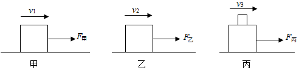
A. *F*甲<*F*乙<*F*丙	B. *F*甲>*F*乙>*F*丙
C. *F*甲=*F*乙<*F*丙	D. *F*甲<*F*乙=*F*丙
【答案】C
【解析】
【详解】滑动摩擦力与接触面的粗糙程度和压力大小有关，与速度大小无关．由于甲乙丙三图中，接触面的粗糙程度相同，甲乙对水平面的压力相同，丙稍大，故摩擦力*f*甲=*f*乙<*f*丙，因为三图中木块都在做匀速直线运动，故*F*=*f*，即*F*甲=*F*乙<*F*丙．
9. 水平桌面上两个底面积相同的容器中，分别盛有甲、乙两种液体．将两个完全相同的小球M、N分别放入两个容器中，静止时两球状态如图所示，两容器内液面相平．下列分析正确的是（）
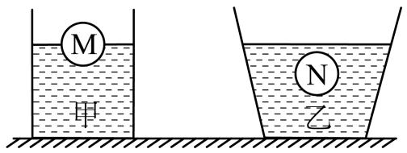
A. 两小球所受浮力*F*M<*F*N
B. 两种液体的密度*ρ*甲<*ρ*乙
C. 两种液体对容器底部的压强*p*甲=*p*乙
D. 两种液体对容器底部的压力*F*甲>*F*乙
【答案】D
【解析】
【详解】A．小球M在甲液体中漂浮，则浮力*F*M=*G*M，小球N在乙液体中悬浮，则浮力*F*N=*G*N，由于小球M、N完全相同，即*G*M=*G*N，则有*F*M=*F*N，故A错误；
B．小球M在甲液体中漂浮，则密度*ρ*M＜*ρ*甲，小球N在乙液体中悬浮，则密度*ρ*N=*ρ*乙，由于小球M、N完全相同，即*ρ*M=*ρ*N，则有*ρ*甲＞*ρ*乙，故B错误；
C．由B选项分析得*ρ*甲＞*ρ*乙，两容器液面相平即容器底部深度*h*相同，根据液体压强计算公式*p*=*ρgh*可知，*p*甲＞*p*乙，故C错误；
D．由C选项分析得容器底部液体压强*p*甲＞*p*乙，两容器底面积相同，由压力计算公式*F*=*pS*得，容器底部受到液体压力*F*甲＞*F*乙，故D正确．
10. 如图，弧形轨道*ab*段光滑，*bc*段粗糙，小球从*a*点经最低点*b*运动至*c*点．下列分析正确的是（）
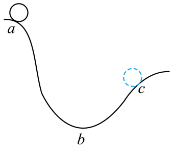
A. 从*a*到*b*的过程中，小球动能转化为重力势能
B. 经过*b*点时，小球动能最大
C. 从*b*到*c*的过程中，小球动能增大
D. 从*a*到*c*的过程中，小球机械能守恒
【答案】B
【解析】
【详解】A．从*a*到*b*的过程中，小球高度降低，重力势能转化为动能，故A错误；
B．小球从*a*运动到*b*动能增大；从*b*运动到*c*动能减小，则在*b*点处小球动能最大，故B正确；
C．小球从*b*到*c*的过程中，高度增加，同时克服摩擦力做功，速度减小，则小球的动能减小，故C错误；
D．*bc*段弧形轨道粗糙，因此小球在*bc*段运动时会克服摩擦力做功，会有一部分机械能转化为内能，则机械能会减小，故D错误．
11. 下列说法正确的是（    ）
A. 电荷的移动形成电流
B. 电路中有电压就一定有电流
C. 把一根铜丝均匀拉长后电阻变小
D. 长时间使用的手机发烫，是因为电流的热效应
【答案】D
【解析】
【详解】A．电荷定向移动形成电流，缺少“定向”二字，故A错误；
B．电路中有电压时，要形成电流还必须保证电路通路，故B错误；
C．铜丝被均匀拉长之后，铜丝的横截面积变小，长度变长，则铜丝的电阻增大，故C错误；
D．因为手机电路中的元件有电阻，所以长时间使用后，由于电流的热效应会使得手机发热，故D正确．
12. 在探究“电荷间的相互作用”的实验中，用绝缘细线悬挂两个小球，静止时的状态如图所示．下列判断正确的是（）
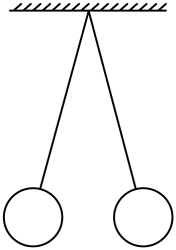
A. 两球一定带同种电荷
B. 两球可能带异种电荷
C. 两球可能一个带电，一个不带电
D. 两球均只受两个力
【答案】A
【解析】
【详解】A．同种电荷互相排斥，两带电小球表现出排斥现象，故A正确；
B．异种电荷互相吸引，两带电小球没有吸引紧贴，故B错误；
C．带电体会吸引不带电的物体，若一个带电一个不带电，则两球会相互吸引紧贴，故C错误；
D．由受力分析可得，两小球均受到重力、绳子给的拉力、小球所带同种电荷间的排斥力，故两球均受三个力，故D错误．
13. 下列对电磁实验现象相应的解释正确的是（    ）
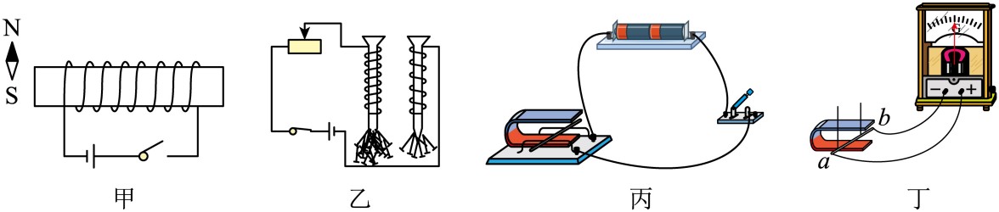
A. 甲图中，闭合开关，小磁针的N极向左偏转
B. 乙图中，线圈匝数多的电磁铁，磁性强
C. 丙图中，该装置用来研究电磁感应现象
D. 丁图中，磁铁放在水平面上，导体*ab*竖直向上运动，电流表指针一定会偏转
【答案】B
【解析】
【详解】A．由安培定则可得，通电螺线管右端为N极，左端为S极，则小磁针N极受到螺线管左端的S极吸引向右偏转，故A错误；
B．电磁铁的磁性与电流大小和线圈匝数有关，电流相同时，线圈匝数越多，磁性越强，故B正确；
C．图中装置为研究通电导体在磁场中受力的作用，与电磁感应现象无关，故C错误；
D．丁图中，蹄形磁铁的磁感线方向为竖直方向，当导体*ab*竖直向上运动时，不能切割磁感线，也就不会产生感应电流，故D错误．
14. 关于家庭电路，下列说法正确的是（    ）
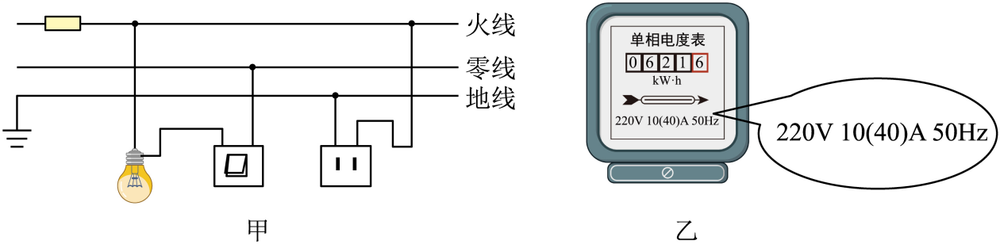
A. 甲图中，若保险丝熔断，则一定是短路引起的
B. 甲图中，灯泡与开关的连接符合安全用电原则
C. 甲图中，两孔插座的连接不符合安全用电原则
D. 乙图中，电能表所在电路的总功率不能超过2200W
【答案】C
【解析】
【详解】A．甲图为家庭电路的一部分，家庭电路中保险丝熔断是由于电流过大导致，电流过大的原因有可能是短路或用电器总功率过大引起，故A错误；
B．家庭电路中，开关应连接在火线和用电器之间，故B错误；
C．两孔插座的连接应当遵循“左零右火”的原则，甲图中插座连接错误，故C正确；
D．电能表上标有10(40)A，即家庭电路允许通过的最大电流为40A，则最大总功率应为*P*=*UI*=220V×40A=8800W，故D错误．
15. 地磅工作时，重物越重，电表的示数就越大．下列四幅电路图中，*R*′是滑动变阻器，*R*是定值电阻．其中符合地磅工作原理的是（）
A.

B.

C.
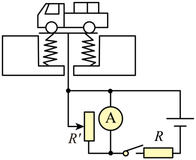
D.

【答案】B
【解析】
【详解】A．重物越重，滑片向下滑动，*R’*电阻变大，电路中电流变小，则电流表读数变小，不符合电表示数越大的要求，故A错误；
B．重物越重，滑片向下滑动，*R’*电阻变小，电路中电流变大，则定值电阻*R*两端电压变大，电压表示数变大，故B正确；
C．电流表把*R’*短路，电流不经过*R’*，所以无论重物怎么变化，电流表读数都不变，故C错误；
D．电压表串联接入电路，电压表相当于测电源电压，读数不变，故D错误．
16. 甲图是小灯泡L和电阻*R*的*I*−*U*图象．将小灯泡L和电阻*R*接入乙图所示电路中，只闭合开关S1时，小灯泡L的实际功率为1W．下列说法**错误**的是（        ）
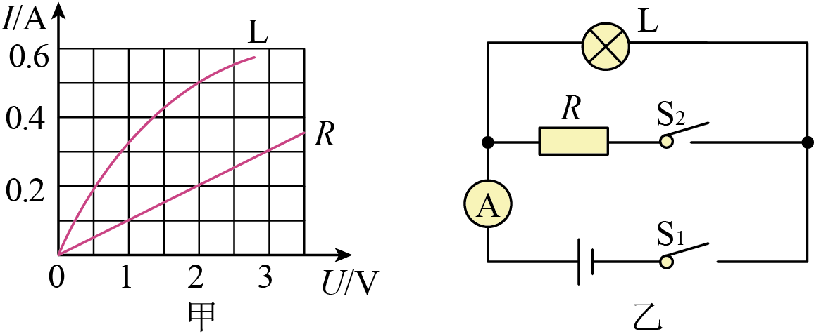
A. 只闭合开关S1时，小灯泡L的电阻为4Ω
B. 再闭合开关S2时，电流表示数增加0.2A
C. 再闭合开关S2时，电路总功率为1.4W
D. 再闭合开关S2后，在1min内电阻*R*产生的热量为240J
【答案】D
【解析】
【详解】A．只闭合S1时，电路中只接入L，L的实际功率为1W，由*P*=*UI*得，在甲图中找出L符合*U*、*I*乘积为1W的图像，则*U*=2V，*I*=0.5A，则小灯泡L的电阻*R*==4Ω，故A错误；
B．由A选项分析得电源电压*U*=2V，再闭合S2后，*R*与L并联接入电路，电压为2V，在甲图中找出*R*此时对应电流为0.2A，用并联电路电流的特点可知电流表示数增大0.2A，故B错误；
C．再闭合S2时，电源电压为2V，*R*的电流为0.2A，L的电流为0.5A，电路中总电流为*I*总=0.2A+0.5A=0.7A，故总功率*P*=*U*总*I*总=2V×0.7A=1.4W，故C错误；
D．再闭合S2时，电阻*R*的电压为2V，电流为0.2A，通电1min即60s，产生热量*Q*=*W*=*UIt*=2V×0.2A×60s=24J，故D正确．
**二、非选择题（共****6****小题，共****36****分）**
17. 一束光从空气射入玻璃时的反射光线如图所示，请画出入射光线和大致的折射光线．
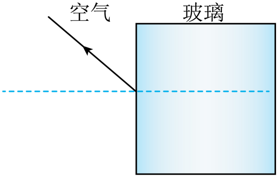
【答案】
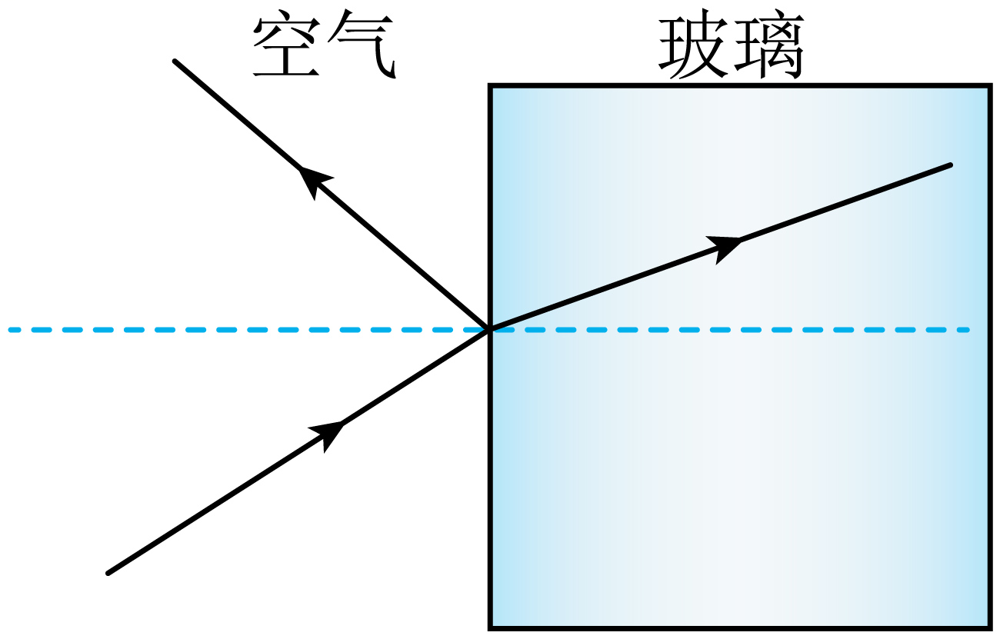
【解析】
【详解】图中法线已经画出，根据光的反射定律，反射角等于入射角在法线下侧画出入射光线；根据光从空气斜射入玻璃时，折射角小于入射角，在玻璃内部发现上侧作出折射光线；如图所示：

18. 如图所示，在*C*点用力把桌腿*A*抬离地面时，桌腿*B*始终没有移动，请在*C*点画出最小作用力的示意图．
（        ）
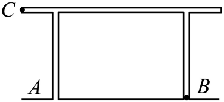
【答案】
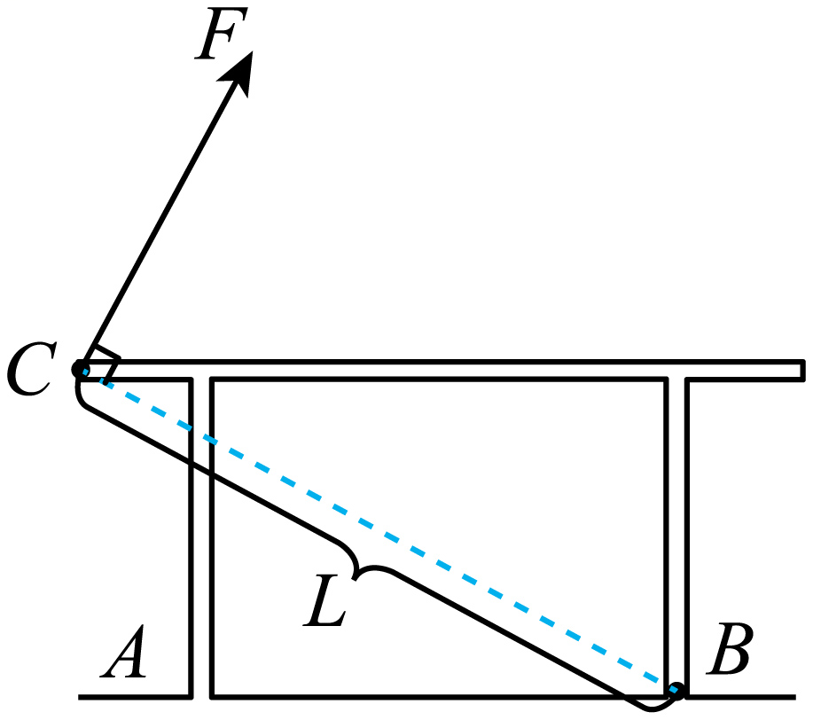
【解析】
【详解】用力把桌腿*A*抬离地面时整个桌子绕*B*点旋转，即*B*为杠杆的支点，直接连接*BC*即为最长的动力臂，根据力与力臂垂直，结合实际情况即可做出最小力*F*．

19. 如图所示，甲图是探究“阻力对物体运动的影响”的实验装置，让同一小车从斜面上相同的高度由静止滑下，在粗糙程度不同的水平面上运动．乙图是探究“物体的动能跟哪些因素有关”的实验装置，让同一钢球从斜面上不同的高度由静止滚下，碰到同一木块上．请回答：
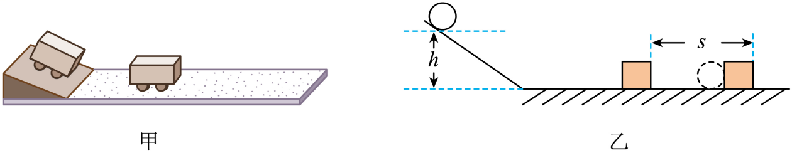
（1）甲实验中，小车在水平面上运动时，在竖直方向上受到的力有________和________；在水平方向上受到摩擦力，且摩擦力越小，小车的速度减小得越________．从而可以推理：如果运动的物体不受力，它将________．
（2）乙实验中的研究对象是________（选填“钢球”或“木块”），实验目的是探究物体的动能大小与________的关系．
【答案】    ①. 重力    ②. 支持力    ③. 慢    ④. 做匀速直线运动    ⑤. 钢球    ⑥. 速度大小
【解析】
【详解】（1）小车在竖直方向上受到向下的重力和地面对小车向上的支持力的作用，在水平方向上受到摩擦力越小，力改变物体运动状态的就越慢，小车的速度减小得越慢，由牛顿第一定律可知如果运动的物体不受力，它将做匀速直线运动一直运动下去；
（2）让钢球从斜面上由静止滚下，获得初始速度，进而获得动能，进行研究，因而乙实验中的研究对象是钢球，钢球由不同的高度由静止滚下，到达斜面底端的初始速度不同，因此实验目的是探究物体的动能大小与速度大小的关系．
20. 如图所示，在“测量小灯泡的电功率”的实验中，电源电压为4.5V，小灯泡的额定电压为2.5V．
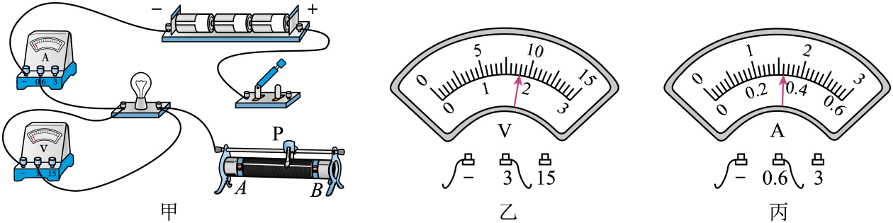
（1）请你用笔画线代替导线，将甲图中的实物图连接完整（要求滑动变阻器的滑片P向*B*端移动时小灯泡变暗）．
（        ）
（2）某小组连接好电路后，检查连线正确，但闭合开关后发现小灯泡发出明亮的光且很快熄灭．出现这一故障的原因可能是________．排除故障后，闭合开关，移动滑动变阻器的滑片P到某处，电压表的示数如乙图所示．若要测量小灯泡的额定功率，应将图中的滑片P向________（选填“*A*”或“*B*”）端移动，直到电压表的示数为2.5V，此时电流表的示数如丙图所示，则小灯泡的额定功率为_______W．
（3）测出小灯泡的额定功率后，某同学又把小灯泡两端电压调为额定电压的一半，发现测得的功率并不等于其额定功率的四分之一，其原因是______________．
（4）若将小灯泡换成定值电阻，且电路连接完好，还可以完成的实验是________（填标号）．
A．探究电流与电压的关系        B．探究电流与电阻的关系
【答案】    ①.     ②. 滑动变阻器的滑片未调到最大阻值处    ③. *A*    ④. 0.8    ⑤. 灯泡电阻随温度发生变化    ⑥. A
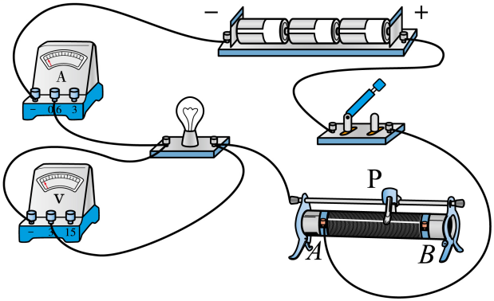
【解析】
【详解】（1）滑动变阻器的滑片P向*B*端移动时小灯泡变暗，小灯泡变暗即小灯泡的实际功率降低，由 可知电阻不变，电压减小，功率降低，即滑片P向*B*端移动时灯泡分得的电压减小，由串联电路电压比等于电阻比可知，此时滑动变阻器阻值增大，即接入电路的电阻丝长度增加，因此应将开关与*A*位置相连；
（2）小灯泡发出明亮的光说明灯泡实际功率过大，由 可知此时灯泡分得的电压过大，由串联电路电压比等于电阻比可知，此时滑动变阻器电阻过小，即滑动变阻器的滑片未调到最大阻值处；
（3）由图乙可知此时小灯泡电压为1.8V，小于额定电压，因此应增加小灯泡两端的电压，由串联电路电压比等于电阻比可知，此时滑动变阻器接入的电阻太大应当调小，即滑片P向*A*端移动，调整好后，由图丙知小灯泡的电流为0.32A，则额定功率为 ；
（3）若将小灯泡换成定值电阻，移动滑动变阻器滑片，可改变定值电阻两端的电压和电流，探究电流与电压的关系，电阻阻值不变，不能探究电流与电阻的关系．
21. 如图所示，斜面长*s*=8m，高*h*=3m．用平行于斜面*F*=50N的拉力，将重力为*G*=100N的物体，由斜面的底端匀速拉到顶端，用时*t*=10s．求：

（1）有用功*W*有
（2）拉力做功的功率*P*
（3）物体受到的摩擦力*f*
（4）该斜面的机械效率*η*．
【答案】（1）300J（2）40W（3）12.5N（4）75%．
【解析】
【详解】（1）有用功为*W*有=*Gh*=100N×3m=300J；
（2）拉力所做功为*W*总=*Fs*=50N×8m=400J，拉力的功率为==40W；

（3）额外功为*W*额=*W*总−*W*有=400J−300J=100J，由*W*额=*fs*得：物体受到的摩擦力==12.5N；
（4）斜面的机械效率为==75%．
22. “道路千万条，安全第一条；行车不规范，亲人两行泪．”酒后不开车是每个司机必须遵守的交通法规．甲图是酒精测试仪工作电路原理图，电源电压*U*=6V；*R*1为气敏电阻，它的阻值随气体中酒精含量的变化而变化，如乙图所示．气体中酒精含量大于0且小于80mg/100mL为酒驾，达到或者超过80mg/100mL为醉驾．使用前通过调零旋钮（即滑动变阻器*R*2的滑片）对测试仪进行调零，此时电压表示数为*U*1=5V，调零后*R*2的滑片位置保持不变．

（1）当电压表示数为*U*1=5V时，求*R*1消耗的电功率
（2）当电压表示数为*U*1=5V时，求*R*2接入电路中的阻值
（3）某次检测中，电流表示数*I*1′=0.2A，请通过计算，判断此驾驶员属于酒驾还是醉驾．
【答案】（1）0.5W （2）10Ω （3）此驾驶员为酒驾．
【解析】
【详解】（1）由图可知，当气体中酒精含量为0mg/100mL时，*R*1的阻值为50Ω由*P*=*UI*，得：*P*1===0.5W；
（2）通过*R*1的电流为：*I*1===0.1A，因为*R*2与*R*1串联，所以通过*R*2的电流为：*I*2*=I*1=0.1A，由*U*总=*U*1+*U*2得*R*2两端的电压为：*U*2=*U*总−*U*1=6V−5V=1V，由得*R*2===10Ω；
（3）由得*R’*总===30Ω，因为*R*1与*R*2串联，则*R*总=*R*1+*R*2，此时*R*1的阻值为*R*1′=*R*总′−*R*2=30Ω−10Ω=20Ω，由图可知，*R*1的阻值随气体中酒精含量减小而增加，当*R*1=10Ω时，气体中酒精含量为80mg/100mL，则当*R*1′=20Ω时，气体中酒精含量大于0mg/100mL且小于80mg/100mL，故此驾驶员为酒驾．
23. 如甲图所示的电路，闭合开关，两灯均不亮．已知电路连接正确，是其中一个小灯泡损坏了．请你在不拆开原电路的基础上，从乙图所示的实验器材中任选一种连入电路，设计检测方法，找出损坏的小灯泡，并完成表格中相关内容．

| 
  所选器材  
 | 
  检测**电路图**  
 | 
  现象与结论  
 |
| --- | --- | --- |
|  |  |  |
|  |  |  |

【答案】闭合开关，若电压表有示数，则L1断路；若电压表无示数，则L2断路
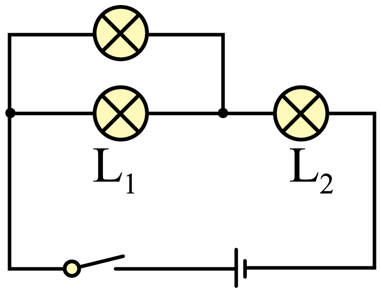
闭合开关，若检测灯泡发光，则L1断路；若检测灯泡不发光，则L2断路

【解析】
【详解】由图像可知两灯串联，闭合开关，两灯均不亮，且其中一个小灯泡损坏，说明其中一只小灯泡断路，因此可选择电压表与L1并联，闭合开关，若L1断路，则电压表与L2串联，电压表有示数，若L2断路电压表无示数，或选择小灯泡与L1并联，闭合开关，若L1断路，则灯泡与L2串联，灯泡发光，若L2断路灯泡不发光．
24. 2019年6月5日12时06分，在我国黄海某海域，科技人员使用“长征十一号”运载火箭进行“一箭七星”海上发射技术试验，运载火箭点火后，箭体腾空而起并加速上升，直冲云霄，把卫星顺利送入距离地面600千米高的预定轨道．首次海上发射取得圆满成功，填补了我国运载火箭海上发射的空白．在火箭上升过程中，为了能够近距离拍摄到箭体周围的实况，“长征十一号”火箭上装有高清摄像机，摄像机的镜头是由耐高温的材料制成的．小宇同学观看发射时的电视画面发现：箭体在上升过程中有一些碎片脱落，且脱落的碎片先上升一段距离后才开始下落．
请从上述材料中找出涉及物理知识的内容，模仿范例格式，写出对应的物理知识或规律（任写三条）．
|  | 
  相关描述  
 | 
  物理知识或规律  
 |
| --- | --- | --- |
| 
  范例  
 | 
  火箭加速上升  
 | 
  受非平衡力  
 |
| 
  1  
 |  |  |
| 
  2  
 |  |  |
| 
  3  
 |  |  |

【答案】详见解析
【解析】
【详解】该材料中涉及到多种物理知识，例如火箭点火，燃料化学能转化为内能；火箭上升过程中，火箭重力势能越来越大；火箭上装有高清摄像机，凸透镜成像；摄像机镜头耐高温，材料熔点高；碎片先上升后降落，碎片具有惯性等等．
