## **2022****年广东省深圳市中考物理试卷**

**一、单选题（本题共****5****小题，每小题****2****分，共****10****分。在每小题给出的四个选项中，只有一项是符合题意的）**
1. 深圳市是全国文明城市，公民应该控制噪声，下列不属于在声源处减弱噪声的做法是（　　）
A. 不高声喧哗	B. 调低跳舞音响设备音量

C. 在公路上不鸣笛	D. 在学校周围植树
2. 白露是中华传统二十四节气之一，露珠的形成属于（　　）
A. 熔化	B. 凝固	C. 液化	D. 凝华
3. 下列说法错误的是（　　）
A. 月亮是光源	B. 灯光秀的光----光的直线传播
C. 桥的倒影----光的反射	D. 彩虹------光的色散
4. 《天工开物》是我国第一部关于农业和手工业全书，蕴含了大量的物理知识，下列是《天工开物》中的场景，错误的是（　　）
| A、拉弓 | B、独轮推车 | C、制糖 | D、桔槔 |
| --- | --- | --- | --- |
| 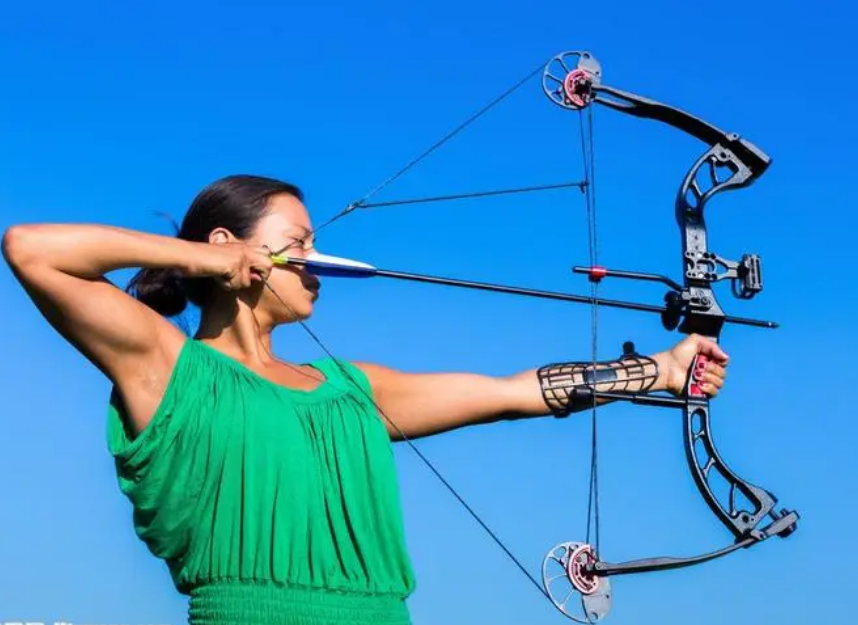 |  |  | 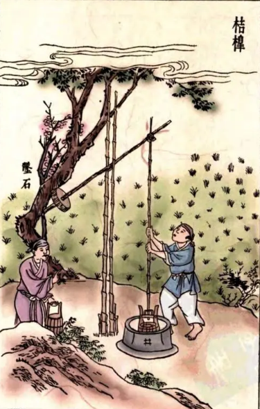 |
| 拉弓拉满了，说明力可以改变物体的形状 | 独轮推车，匀速推动，此时推理大于摩擦力 | 往桶里加水，水对桶底压强逐渐变大 | 用桔槔装水，运用了杠杆原理 |

A. A	B. B	C. C	D. D
5. 如图所示为油量表示意图，当油量减少时，下列说法正确的是（　　）

A *R*不断减小	B. *R*总不断减小

C. *I*总不断减小	D. *R*两端电压不断减小
**二、双项选题（本题共****5****小题，每小题****2****分，共****10****分。在每小题给出的四个选项中，有二个选项是符合题意的，漏选的得****1****分，错选或多选不得分）**
6. 下列说法正确的是（　　）
A. 未来理想能源必须安全、清洁，不能严重影响环境
B. 使用过的核废料不会造成污染可以简单填埋
C. 电视、广播、手机都是用电磁波来传递信息的
D. 二极管是半导体，具有双向导电性
7. 2022年6月5日10时44分，搭载神州十四号载人飞船的长征二号F遥十四运载火箭在酒泉卫星发射中心点火发射。以下说法正确的是（　　）
A. 火箭发射前内能为零	B. 火箭的燃料热值大
C. 火箭燃料的化学能全部转化为机械能	D. 加速升空过程中火箭的机械能增大
8. 如图为冬奥会男子滑雪过程中，空气阻力不计，下列正确的是（　　）
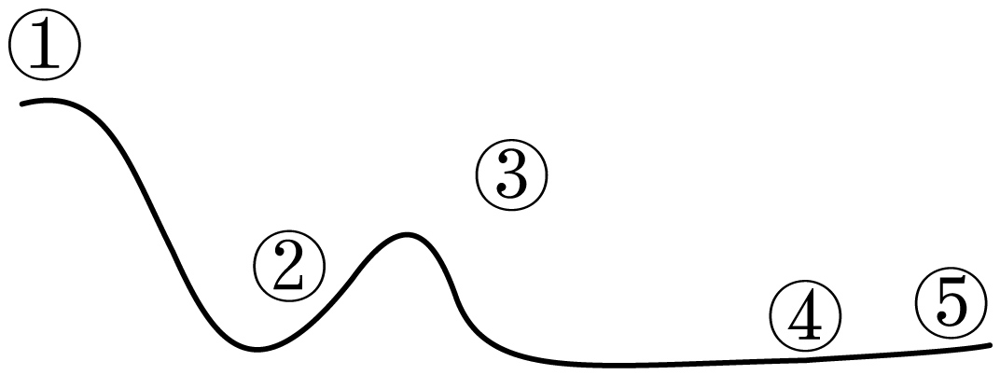
A. ①到②，重力势能全部转化为动能	B. ③只受到重力作用
C. ④到⑤，停下来是因为摩擦力的作用	D. ⑤失去惯性
9. 以下属于电动机工作原理的是（　　）
A. 	B. 	C. 	D.
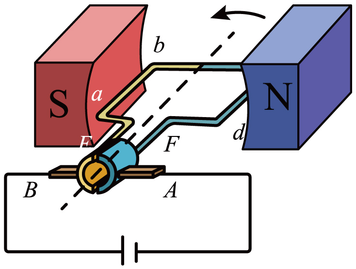
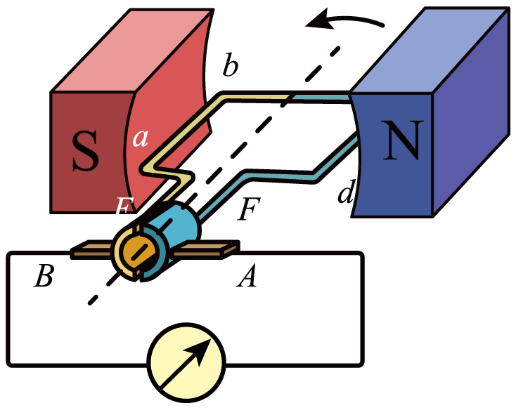

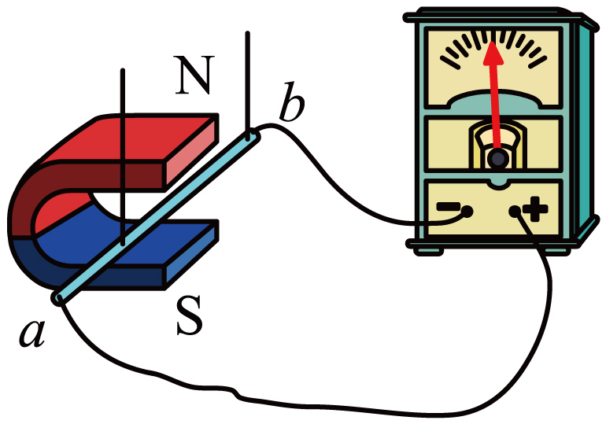
10. 某爱心团队去养老院送电暖气，电暖气有低、中、高三挡，已知*R*1=55*Ω*，*R*2=44*Ω*，以下说法正确是（　　）

A. 使用“低温档”只需要闭合S2
B. 使用“高温档”要闭合S1、S2
C. 闭合S1、S2时，通过*R*1、*R*2的电流之比为5:4
D. 中温档正常工作1分钟，产生的热量为6.6×104J
**三、作图题（本题共****2****小题，每题****2****分，共****4****分）**
11. 画出小球受到的重力*G*及拉力*F*。

12. 如图是某实物连接电路，请根据实物图在方框内画出对应的电路图。
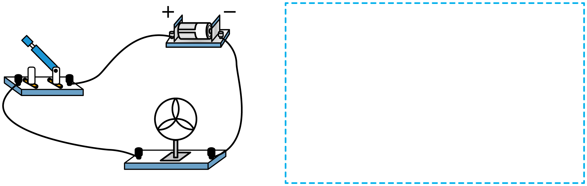
**四、实验探究题（本题共****4****小题，每空****1****分，共****22****分）**
13. 如图甲乙丙，读数分别为
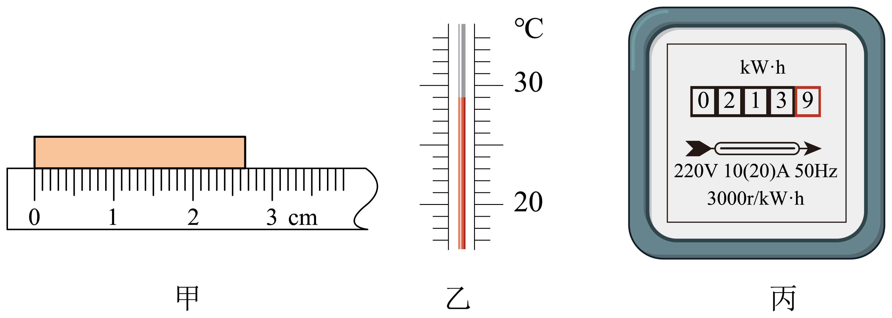
（1）长度为___________cm；
（2）温度计读数___________；
（3）电能表示数为___________。
14. 探究平面镜成像实验：
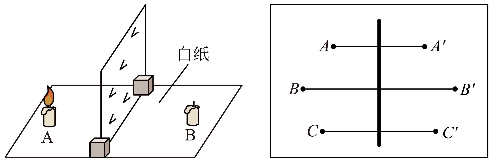
（1）平面镜成像实验选择的是___________（选择“平面镜”或“玻璃板”）；
（2）来回移动蜡烛的位置是为了确定___________的位置；
（3）将物像连线连接在纸上，继续分析和研究，得出平面镜成像特点___________；
（4）图中哪里存在错误：___________。
15. 小红在游玩时见了一些石头，拿了其中一块来做实验。

（1）天平放在水平桌面上指针如甲图所示，平衡螺母应向___________（选填“左”或“右”）调，直至平衡；
（2）如图乙，小石头的质量为___________g，可求得小石块的密度为___________g/cm3；
（3）砝码磨损，按照以上步骤，测得小石块密度___________（选填“偏大”“偏小”或“不变”）；
（4）若使用弹簧测力计测量石头密度，如图：
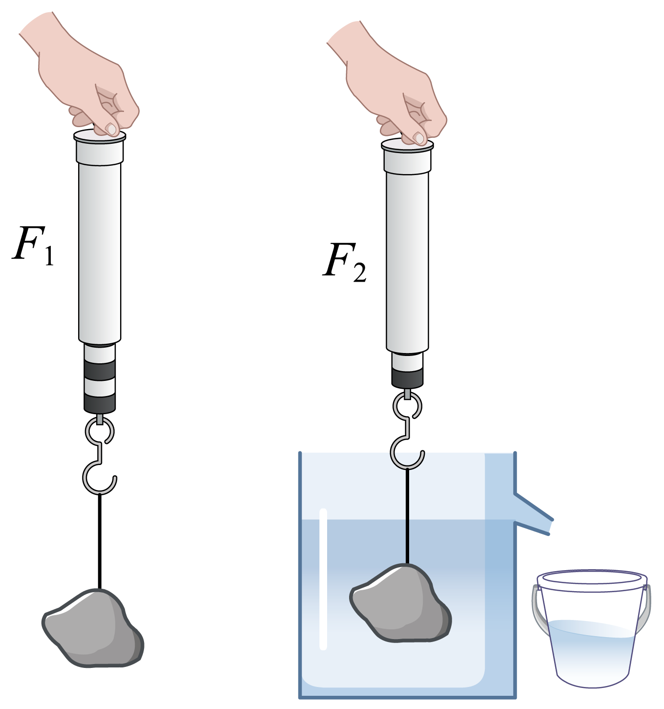
___________（水的密度为，用已知物理量符号表示）。
16. 小明需要测量小灯泡的额定功率，灯泡铭牌是“3.8V，1.15W”。
| 
  电压表示数  
 | 
  电流表示数  
 |
| --- | --- |
| 
  3.0V  
 | 
  0.32A  
 |
| 
  3.8V  
 | 
  0.4A  
 |
| 
  4.5V  
 |  |

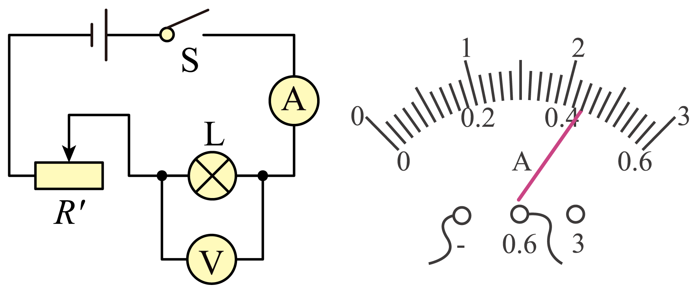
（1）小明连接电路后，发现灯泡不亮，下列哪种方法可以一次性解析多项问题（      ）
A.检查电源                        B.检查导线连接
C.检查电流表和电压表的示数        D.调节滑动变阻器观察灯泡亮度
（2）实验过程中，小明发现小灯泡较暗，如果要让小灯泡正常发光，他应将滑动变阻器向___________（左或右）滑动；
（3）如图乙所示，当电压表示数为4.5V时，电流表示数为___________A；
（4）从上表可以求出，当灯泡正常发光时电阻为___________Ω；
（5）通过计算，判断出这只小灯泡铭牌上的参数___________（合格，不合格）；在这个实验中，可能会观察到小灯泡出现的现象是___________（一点即可）
**五、计算题（本题共****2****小题，****17****题****7****分，****18****题****9****分，共****16****分）**
17. 一校车质量为30t，车轮与地面总接触面积为0.5m2，水平匀速行驶时校车受到阻力为重力的0.03倍，校车匀速行驶200米，问：

（1）求车对地面的压强；
（2）校车2小时内行驶了150km，问平均速度超不超过限速（限速80km/h）；
（3）整个过程牵引力做功多少？
18. 小明设计了如图甲的模拟智能测温报警电路：电源电压调为12V，报警器（电阻不计）通过的电流超过10mA时就会报警，热敏电阻*R*T其阻值随温度*T*的变化关系如图乙所示。要求：当所测温度达到或超过37.3℃时，系统报警。
（1）计算*R*0；
（2）38℃时电流约为多少？
（3）36℃到40℃的过程中，电路最大总功率。

**六、综合分析题（本题共****1****小题，每空****1****分，共****8****分）**
19. （1）小明检测到家庭最大电流为5A，要买一个电热水壶，一个为“220V，1000W”，一个为“220V，1500W”，小明选了1000W的，请根据计算说出为什么不选1500W的？___________
（2）电热水壶的电线很短，因此电阻___________产生热量___________，更加安全；
（3）小明把一个电热水壶插进插座，打开开关，突然家里的用电器都不工作了，请写出可能的两个原因：①___________；②___________；
（4）比较电热水壶和电炉的加热效率，请从下图中选择一组___________。
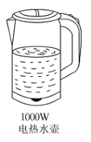
A.        B.        C.

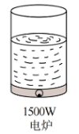
（5）实验：将1L水加热至沸腾，探究电热水壶效率。求：设计实验方案并写出效率表达式。

| 物理量 | 方法（应说明测量道具、物理量） | 结论（用题目所给物理量表示） |
| --- | --- | --- |
| 水的密度*ρ* 水的比热容*c* 热水壶额定功率*P* | ___________ | *η*=___________ |
