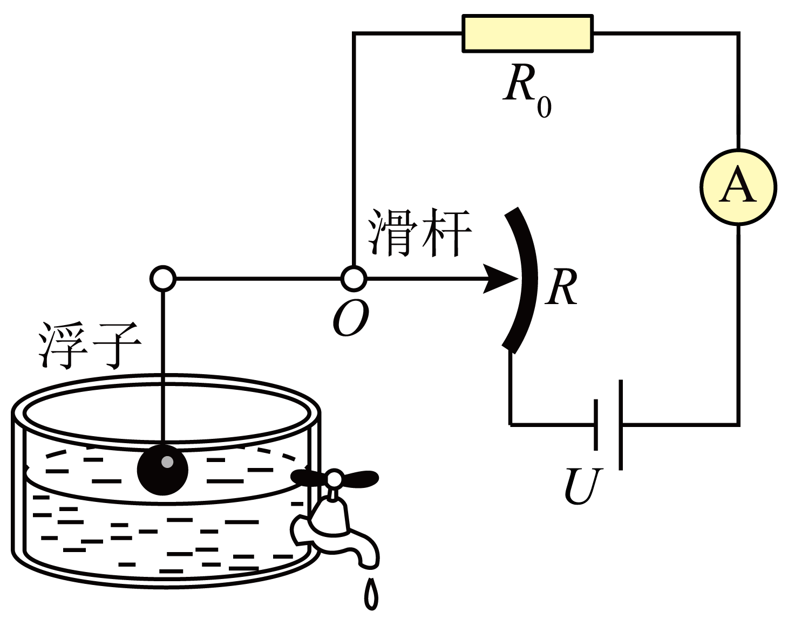
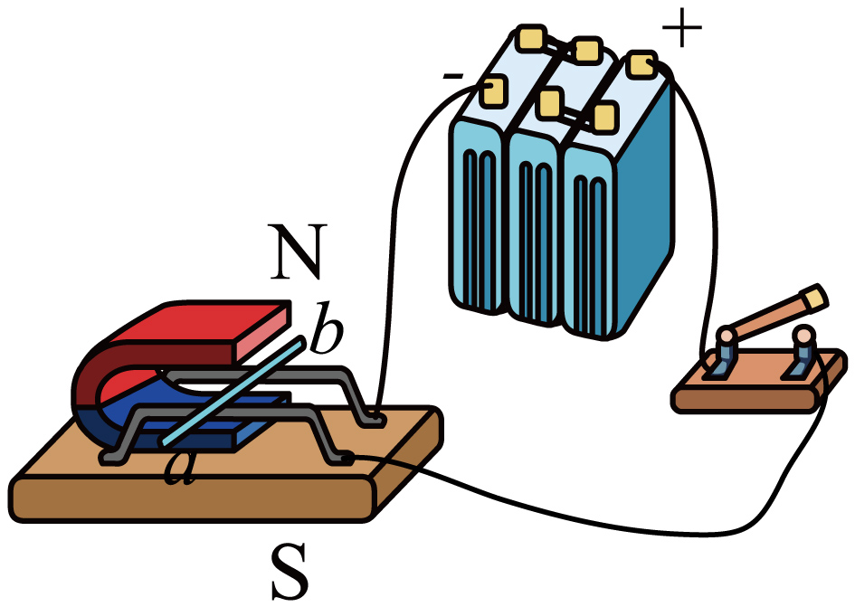
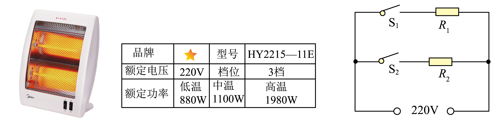
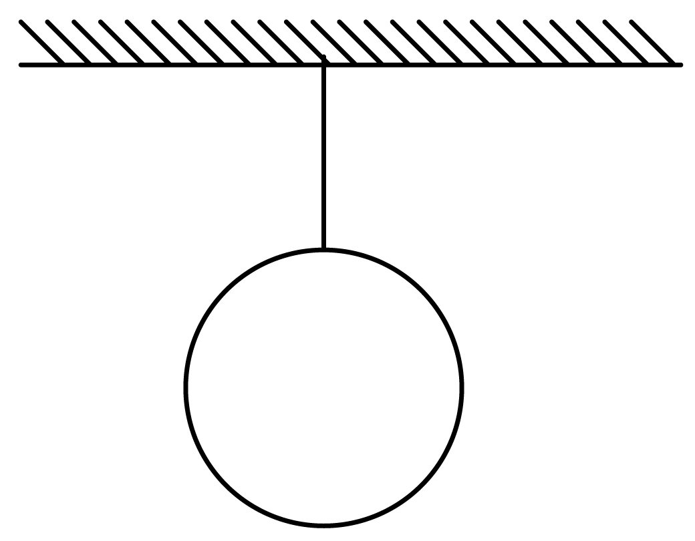
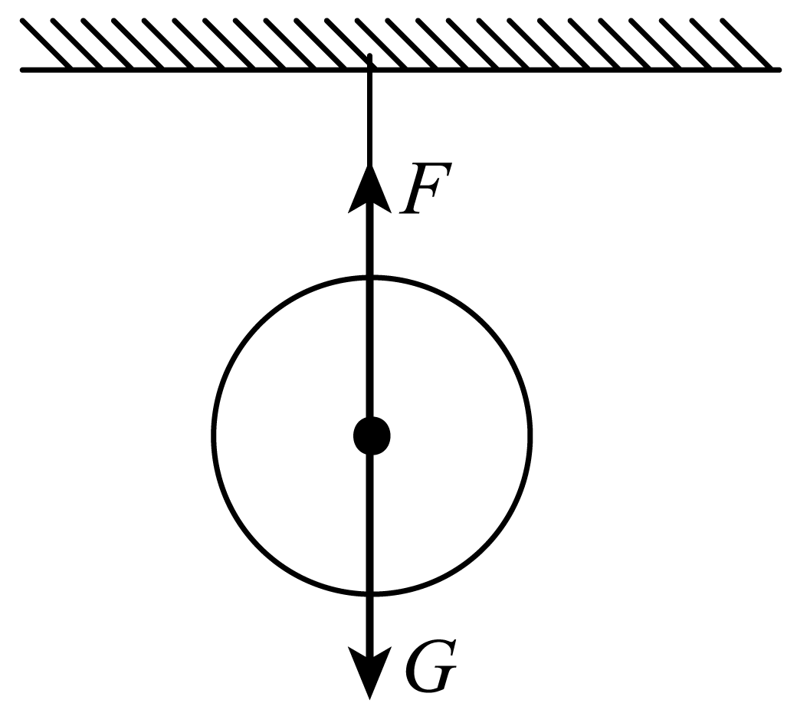
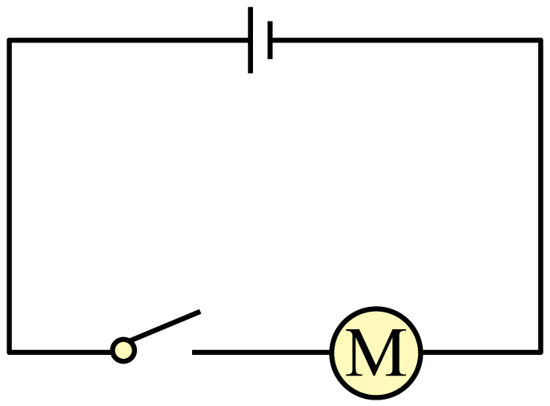
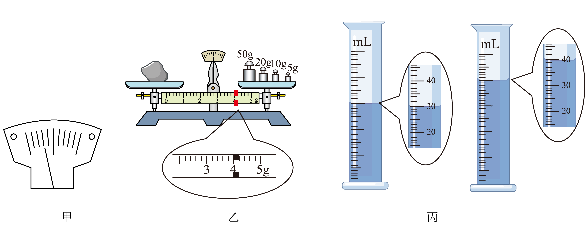
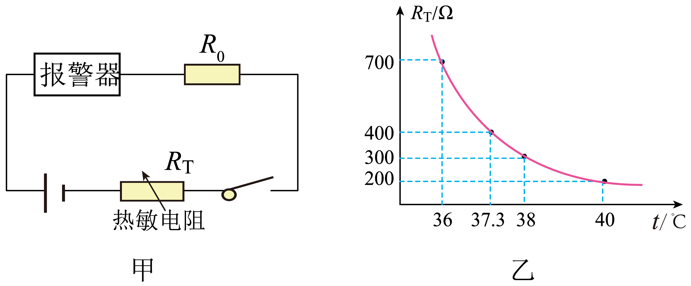
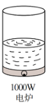
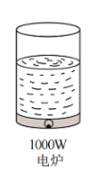

## **2022****年广东省深圳市中考物理试卷**

**一、单选题（本题共****5****小题，每小题****2****分，共****10****分。在每小题给出的四个选项中，只有一项是符合题意的）**
1. 深圳市是全国文明城市，公民应该控制噪声，下列不属于在声源处减弱噪声的做法是（　　）
A. 不高声喧哗	B. 调低跳舞音响设备的音量
C. 在公路上不鸣笛	D. 在学校周围植树
【答案】D
【解析】
【详解】A．不高声喧哗是在声源处减弱噪音，故A不符合题意；
B．调低跳舞音响设备的音量在声源处减弱噪音，故B不符合题意；
C．在公路上不鸣笛在声源处减弱噪音，故C不符合题意；
D．在学校周围植树是在传播过程中减弱噪音，故D符合题意。
故选D。
2. 白露是中华传统二十四节气之一，露珠的形成属于（　　）
A. 熔化	B. 凝固	C. 液化	D. 凝华
【答案】C
【解析】
【详解】露珠是液态的小水滴，是由于水蒸气遇冷液化而成的，故C符合题意，ABD不符合题意。
故选C。
3. 下列说法错误的是（　　）
A. 月亮是光源	B. 灯光秀的光----光的直线传播
C. 桥的倒影----光的反射	D. 彩虹------光的色散
【答案】A
【解析】
【详解】A．自身能发光的物体叫做光源，月亮本身不发光，在夜晚能看见月亮，那是因为月亮是反射太阳的光，故A错误；
B．我们能看到灯光秀的光是由于光的直线播，故B正确；
C．桥的倒影属于平面镜成像，是光的反射现象，故C正确；
D．雨后，空气中有大量小水滴，太阳光经些水滴折射后可分解成七种色光，这就是光色散现象，故D正确。
故选A。
4. 《天工开物》是我国第一部关于农业和手工业全书，蕴含了大量的物理知识，下列是《天工开物》中的场景，错误的是（　　）
| A、拉弓 | B、独轮推车 | C、制糖 | D、桔槔 |
| --- | --- | --- | --- |
|  |  |  |  |
| 拉弓拉满了，说明力可以改变物体的形状 | 独轮推车，匀速推动，此时推理大于摩擦力 | 往桶里加水，水对桶底压强逐渐变大 | 用桔槔装水，运用了杠杆原理 |

A. A	B. B	C. C	D. D
【答案】B
【解析】
【详解】A．用力拉弓，弓被拉弯，说明力可以改变物体的形状，故A正确，不符合题意；
B．因为独轮推车做匀速直线运动，车受到平衡力的作用，故推力等于车所受的摩擦力，故B错误，符合题意；
C．往桶里加水，水的深度增加，由*p*=*ρgh*可知，水对桶底压强逐渐变大，故C正确，不符合题意；
D．由图可知，桔槔有一个固定不动的点和一个可绕其固定点转动的硬棒组成，是杠杆的应用，利用了杠杆原理，故D正确，不符合题意。
故选B。
5. 如图所示为油量表示意图，当油量减少时，下列说法正确的是（　　）

A. *R*不断减小	B. *R*总不断减小
C. *I*总不断减小	D. *R*两端电压不断减小
【答案】C
【解析】
【详解】由电路图可知，*R*0与*R*串联，电流表测量电路中的电流。当油量减少时，浮子下降，滑杆右端向上滑动，*R*接入电阻增大，串联电路中，电路的总电阻等于各个电阻之和，所以电路中总电阻*R*总增大，根据可知，电压不变时，电流*I*总减小；*R*接入电阻增大，根据串联正比分压可知，*R*两端电压不断增大，故C正确，ABD错误。
故选C。
**二、双项选题（本题共****5****小题，每小题****2****分，共****10****分。在每小题给出的四个选项中，有二个选项是符合题意的，漏选的得****1****分，错选或多选不得分）**
6. 下列说法正确的是（　　）
A. 未来理想能源必须安全、清洁，不能严重影响环境
B. 使用过的核废料不会造成污染可以简单填埋
C. 电视、广播、手机都是用电磁波来传递信息的
D. 二极管是半导体，具有双向导电性
【答案】AC
【解析】
【详解】A．未来理想能源应比常规能源更具有优越性，取得方便、清洁、安全、并且要便宜，使多数人能用得起，不能严重影响环境，故A正确；
B．核电站使用过的核废料中仍然含有放射性物质，仍会有放射性，会污染环境，必须谨慎处理，不能随便排放，故B错误；
C．在现代通信中电磁波有着广泛的应用，电视、广播、手机都是用电磁波来传递信息的，故C正确；
D．二极管是半导体，具有单向导电性，故D错误。
故选AC。
7. 2022年6月5日10时44分，搭载神州十四号载人飞船的长征二号F遥十四运载火箭在酒泉卫星发射中心点火发射。以下说法正确的是（　　）
A. 火箭发射前内能为零	B. 火箭的燃料热值大
C. 火箭燃料的化学能全部转化为机械能	D. 加速升空过程中火箭的机械能增大
【答案】BD
【解析】
【详解】A．任何物体都具有内能，火箭发射前也有内能，故A错误；
B．火箭燃料使用液态氢，是因为它的热值大，完全燃烧相同质量的氢时，可以释放出更多的热量，故B正确；
C．火箭燃料燃烧产生高温高压燃气，化学能转化为内能，根据力的作用是相互的原理，高温高压燃气推动火箭上升，内能转化为机械能；在整个过程中有能量损失，只有一部分转化为机械能，故C错误；
D．机械能包括动能和势能，动能与物体的质量和速度有关，重力势能与物体的质量和高度有关；火箭在加速升空过程中，速度和高度都变大，所以动能和重力势能都变大，机械能变大，故D正确。
故选BD。
8. 如图为冬奥会男子滑雪过程中，空气阻力不计，下列正确的是（　　）

A. ①到②，重力势能全部转化为动能	B. ③只受到重力作用
C. ④到⑤，停下来是因为摩擦力的作用	D. ⑤失去惯性
【答案】BC
【解析】
【详解】A．①到②的过程中，运动员质量不变、高度减小、速度增大，其重力势能大部分转化为动能，由于受到雪地的摩擦，还会有一部分转化为内能，故A错误；
B．由于不计空气阻力，③位置，即运动员在空中，此时运动员只受重力，故B正确；

C．④到⑤过程中，因为摩擦力作用运动员停下来，是摩擦力改变了运动员的运动状态，故C正确；

D．惯性是一切物体保持原来运动状态不变的性质，一切物体都具有惯性，因此在⑤位置时，运动员仍有惯性，故D错误。
故选BC。
9. 以下属于电动机工作原理的是（　　）
A. 	B. 	C. 	D.

【答案】AC
【解析】
【详解】A．图中有电源，线圈中有电流，原理是通电导体在磁场中会转动，是电动机原理，故A符合题意；
B．由图可知，该装置中若线圈转动，会做切割磁感线而产生感应电流，是发电机原理图，不属于电动机的原理，故B不符合题意；
C．由图可知，电路中有电源，是研究通电导体受到磁场力的作用发生运动的，属于电动机的原理，故C符合题意；
D．由图可知，在外力作用下使导体左右移动，切割磁感应线，则电流表指针发生偏转，说明此时有感应电流产生，这是电磁感应现象，属于发电机的原理，故D不符合题意。
故选AC。
10. 某爱心团队去养老院送电暖气，电暖气有低、中、高三挡，已知*R*1=55*Ω*，*R*2=44*Ω*，以下说法正确的是（　　）

A. 使用“低温档”只需要闭合S2
B. 使用“高温档”要闭合S1、S2
C. 闭合S1、S2时，通过*R*1、*R*2的电流之比为5:4
D. 中温档正常工作1分钟，产生的热量为6.6×104J
【答案】BD
【解析】
【详解】AB．根据可知，当电压一定时，*R*越大，*P*越小，为低温挡，*R*越小，*P*越大，为高温挡。由电路图可知，S1、S2同时闭合时，*R*1、*R*2并联，电阻最小，功率最大，为高温挡；由于*R*1>*R*2，所以只闭合S1时，电阻最大，功率最小，为低温挡；只闭合S2时，为中温挡。故A错误，B正确；
C．当S1、S2都闭合时，*R*1与*R*2并联，由并联分流可知通过*R*1、*R*2的电流之比为
故C错误；
D．中温挡正常工作，*R*2接入电路，1分钟产生的热量为
故D正确。
故选BD。
**三、作图题（本题共****2****小题，每题****2****分，共****4****分）**
11. 画出小球受到重力*G*及拉力*F*。

【答案】

【解析】
【详解】过球心作竖直向下的重力和沿绳子向上的拉力，二力大小相等，方向相反，如图所示：

12. 如图是某实物连接电路，请根据实物图在方框内画出对应的电路图。

【答案】

【解析】
【详解】实物图中电源、开关和电动机串联，所以电路图与实物图对应，作串联电路图，如下图所示：

**四、实验探究题（本题共****4****小题，每空****1****分，共****22****分）**
13. 如图甲乙丙，读数分别为

（1）长度为___________cm；
（2）温度计读数___________；
（3）电能表示数为___________。
【答案】    ①. 2.65    ②. 29℃    ③.
【解析】
【详解】（1）[1]如图，刻度尺的分度值为0.1cm，读数时要估读到分度值的下一位，读数为2.65cm。
（2）[2]如图，温度计的分度值为1℃，液柱的上表面在0℃以上，读数为29℃。
（3）[3]如图，电能表的示数由几位整数和一位小数组成，最后一位是小数，示数为。
14. 探究平面镜成像实验：

（1）平面镜成像实验选择的是___________（选择“平面镜”或“玻璃板”）；
（2）来回移动蜡烛的位置是为了确定___________的位置；
（3）将物像连线连接在纸上，继续分析和研究，得出平面镜成像特点___________；
（4）图中哪里存在错误：___________。
【答案】    ①. 玻璃板    ②. 像    ③. 像到镜面的距离等于物体到镜面的距离    ④. 像距会有误差
【解析】
【详解】（1）[1]平面镜成像实验选择使用平面镜，只能成像，而不能透光，不容易确定像的位置，用薄平板玻璃时，既能成像，又能透光，便于确定出像的位置。
（2）[2]来回移动蜡烛的位置，当B蜡烛与A的像完全重合时，便能确定像的位置。
（3）[3]将物像连线连接在纸上，可以测出像距和物距，通过分析和研究二者的关系可以得出：平面镜成像特点是：像到镜面的距离等于物体到镜面的距离。
（4）[4]玻璃板有厚度，直接用连线长度表示物距和像距，像距会有误差。
15. 小红在游玩时见了一些石头，拿了其中一块来做实验。

（1）天平放水平桌面上指针如甲图所示，平衡螺母应向___________（选填“左”或“右”）调，直至平衡；

（2）如图乙，小石头的质量为___________g，可求得小石块的密度为___________g/cm3；
（3）砝码磨损，按照以上步骤，测得小石块密度___________（选填“偏大”“偏小”或“不变”）；
（4）若使用弹簧测力计测量石头密度，如图：

___________（水的密度为，用已知物理量符号表示）。
【答案】    ①. 右    ②. 89    ③. 8.9    ④. 偏大    ⑤.
【解析】
【详解】（1）[1]天平放在水平桌面上指针如甲图所示，指针偏左，说明左侧质量更大，因此应该将平衡螺母向右调，直至天平平衡。
（2）[2]如图乙所示，小石头质量为砝码质量加上游码示数，标尺上每一小格代表0.2g，故石块质量为

[3]石块体积为
故石头密度为
（3）[4]砝码磨损，则测量的质量比实际质量更大，根据可知，体积不变时，所测密度偏大。
（4）[5]石头浸没在水中所受浮力为
根据阿基米德原理可知，石头的体积为
石头质量为
则石头密度为
16. 小明需要测量小灯泡的额定功率，灯泡铭牌是“3.8V，1.15W”。
| 
  电压表示数  
 | 
  电流表示数  
 |
| --- | --- |
| 
  3.0V  
 | 
  0.32A  
 |
| 
  3.8V  
 | 
  0.4A  
 |
| 
  4.5V  
 |  |

（1）小明连接电路后，发现灯泡不亮，下列哪种方法可以一次性解析多项问题（      ）
A.检查电源                        B.检查导线连接
C.检查电流表和电压表的示数        D.调节滑动变阻器观察灯泡亮度
（2）实验过程中，小明发现小灯泡较暗，如果要让小灯泡正常发光，他应将滑动变阻器向___________（左或右）滑动；
（3）如图乙所示，当电压表示数为4.5V时，电流表示数为___________A；
（4）从上表可以求出，当灯泡正常发光时电阻为___________Ω；
（5）通过计算，判断出这只小灯泡铭牌上的参数___________（合格，不合格）；在这个实验中，可能会观察到小灯泡出现的现象是___________（一点即可）
【答案】    ①. C    ②. 左    ③. 0.44    ④. 9.5    ⑤. 不合格    ⑥. 小灯泡发光较亮，灯丝烧断
【解析】
【详解】（1）[1] A．检查电源，若电源正常而小灯泡仍然不亮，则不能确定电路中出现的别的问题，故A不符合题意；
B．检查导线连接，若导线没问题而小灯泡仍然不亮，则不能确定别的问题，故B不符合题意；
C．检查电流表和电压表的示数，若电流表和电压表都无示数，则可能是电路中除小灯泡外的某处发生断路；若电流表无示数而电压表有示数，则可能是小灯泡灯丝断了；若电流表有示数而电压表无示数，则可能是小灯泡处发生短路了，所以，通过检查电流表和电压表可以一次性解析多项问题，故C符合题意；
D．调节滑动变阻器观察灯泡亮度，若灯泡仍然不亮，则有可能是灯泡处短路、断路，或者其他地方发生断路，不能确定多项问题，故D不符合题意。
故选C。
（2）[2]小灯泡较暗，是因为小灯泡两端分配的电压过小，根据串联电路的分压原理可知，此时应将滑动变阻器滑片向左移动，减小滑动变阻器两端的电压，使小灯泡两端电压增大为额定电压，小灯泡即可正常发光。
（3）[3]图乙中，电流表选择了“0～0.6A”量程，一大格0.2A，一小格0.02A，读数为0.44A。
（4）[4]当小灯泡正常发光时，两端电压*U*=3.8V，电流*I*=0.4A，则小灯泡的电阻
（5）[5][6]由表中数据可知，小灯泡的额定功率

*P*=*UI*=3.8V×0.4A=1.52W>1.15W

这个数值与小灯泡铭牌上的参数不相符，说明小灯泡铭牌上的参数不合格；由于计算得出的电功率大于小灯泡铭牌上的数据，故在这个实验中，可能会观察到小灯泡发光较亮，灯丝烧断。
**五、计算题（本题共****2****小题，****17****题****7****分，****18****题****9****分，共****16****分）**
17. 一校车质量为30t，车轮与地面总接触面积为0.5m2，水平匀速行驶时校车受到的阻力为重力的0.03倍，校车匀速行驶200米，问：
（1）求车对地面的压强；
（2）校车2小时内行驶了150km，问平均速度超不超过限速（限速80km/h）；
（3）整个过程牵引力做功多少？
【答案】（1）6×105Pa；（2）不超过；（3）1.8×106J
【解析】
【详解】解：（1）校车质量

*m*=30t=3×104kg

校车的重力
校车对地面压强
（2）校车行驶的平均速度
因为75km/h小于限速80km/h，所以校车的平均速度不超过限速。
（3）水平匀速行驶时校车受到的阻力为重力的0.03倍，所以牵引力
整个过程牵引力做功
答：（1）车对地面的压强为6×105Pa；
（2）校车2小时内行驶了150km，平均速度不超过限速；
（3）整个过程牵引力做功1.8×106J。
18. 小明设计了如图甲的模拟智能测温报警电路：电源电压调为12V，报警器（电阻不计）通过的电流超过10mA时就会报警，热敏电阻*R*T其阻值随温度*T*的变化关系如图乙所示。要求：当所测温度达到或超过37.3℃时，系统报警。
（1）计算*R*0；
（2）38℃时电流约为多少？
（3）36℃到40℃的过程中，电路最大总功率。

【答案】（1）800Ω；（2）0.011A；（3）0.144W
【解析】
【详解】解：（1）如图甲，两个电阻串联，当所测温度达到或超过37.3℃时，系统报警，此时电路中的电流为10mA；由图乙可知， 此时热敏电阻*R*T的阻值为400Ω；热敏电阻*R*T两端的电压为
电阻*R*0两端的电压为
*R*0的阻值为
（2）由图乙可知，38℃时热敏电阻*R*T的阻值为300Ω；则电路中的电流为
（3）由图乙可知，温度在36℃到40℃的过程中热敏电阻*R*T的阻值在变小，当温度在40℃时，阻值最小为200Ω；此时电路中的电功率最大为
答：（1）*R*0的阻值为800Ω；
（2）38℃时电流约为0.011A；
（3）36℃到40℃的过程中，电路最大总功率为0.144W。
**六、综合分析题（本题共****1****小题，每空****1****分，共****8****分）**
19. （1）小明检测到家庭最大电流为5A，要买一个电热水壶，一个为“220V，1000W”，一个为“220V，1500W”，小明选了1000W的，请根据计算说出为什么不选1500W的？___________
（2）电热水壶的电线很短，因此电阻___________产生热量___________，更加安全；
（3）小明把一个电热水壶插进插座，打开开关，突然家里的用电器都不工作了，请写出可能的两个原因：①___________；②___________；
（4）比较电热水壶和电炉的加热效率，请从下图中选择一组___________。

A.        B.        C.

（5）实验：将1L水加热至沸腾，探究电热水壶的效率。求：设计实验方案并写出效率表达式。
| 物理量 | 方法（应说明测量道具、物理量） | 结论（用题目所给物理量表示） |
| --- | --- | --- |
| 水的密度*ρ* 水的比热容*c* 热水壶额定功率*P* | ___________ | *η*=___________ |

【答案】    ①. 见详解    ②. 小    ③. 少    ④. 电热水壶内部电路短路    ⑤. 电热水壶功率过大    ⑥. B    ⑦. 见详解    ⑧.
【解析】
【详解】（1）[1]“220V，1000W”的电热水壶的额定电流为
“220V，1500W”的电热水壶的额定电流为
因为家庭最大电流为5A，*I*1<5A，*I*2>5A，故不选择1500W的电热水壶。
（2）[2]由导体电阻的影响因素可知，导体越短，其电阻越小。
[3]根据焦耳定律可知，在电流和通电时间一定的情况下，导体电阻越小，导体放出的热量越少，电热壶就更加安全。
（3）[4][5]导致家里的用电器都不工作的原因有两个，分别是用电器内部电路短路或用电器功率过大，使得家庭电路中总电流过大导致空气开关跳闸或保险丝烧断。
（4）[6]比较电热水壶和电炉的加热效率，应控制加热功率和被加热水的质量相同，故应选择B图所示电炉。
（5）[7]1L水的体积为
1L水的质量为
用天平和烧杯称量出1kg的水倒入电热水壶中，用温度计测量并记录此时的温度为*t*1，闭合电热水壶开关，用秒表记录加热至沸腾的时间*t*，用温度计测量并记录沸腾时的温度为*t*2。
[8]电热水壶放出的热量为
水吸收的热量为
电热水壶的加热效率为
