## **2023****年深圳中考物理卷**

**本卷满分****70****分，考试时间****60****分钟**

**注：本套试卷所有****g****取****10N/kg**

**一、单项选择题（本题共****10****小题，每小题****2****分，共****20****分。在每小题给出的四个选项中，只有一项是符合题意的）**
1. 琴琴同学握笔如图所示。下列关于铅笔的描述正确的是（    ）

A. 铅笔的长度约50cm	B. 铅笔的质量约为50g
C. 静止在桌面上的铅笔受平衡力	D. 写字时铅笔和纸间的摩擦力是滚动摩擦力
2. 下列说法正确的是（　　）
A. 在学校内禁止鸣笛，这是在声音的传播过程中减弱噪音
B. 响铃声音大是因为音调高
C. 校内广播属于信息传播
D. 同学们“唰唰”写字的声音是次声波
3. 下列符合安全用电常识是（　　）

A. 用专用充电桩给电动车充电	B. 亮亮同学更换灯泡无需断开开关
C. 电器起火可以用水灭火	D. 导线绝缘层破损只要不触碰就可以继续使用
4. 端午节煮粽子是中华文化的传统习俗，下列说法正确的是（　　）
A. 燃料燃烧为内能转化为化学能	B. 打开锅盖上面的白雾是水蒸气
C. 加热粽子是利用做功增加内能	D. 闻到粽子的香味是因为扩散现象
5. 下列属于费力杠杆的是（　　）
A.   汽车方向盘
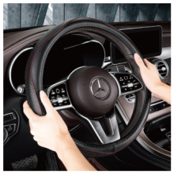
B.     门把手

C.  小白同学家的水龙头

D.   雨刮器

6. 新型纯电动无人驾驶小巴车，是全球首款获得德国“红点奖”的智能驾驶汽车，配备激光雷达和多个高清摄像头，根据预设站点自动停靠，最高时速可达40公里，除了随车的一名安全员亮亮，一辆车可容纳9名乘客。下列关于新型小巴车描述正确的是（    ）
A. 小巴车定位系统利用电磁波传递信息	B. 小巴车的高清摄像头是凹透镜
C. 小巴车的速度为114m/s	D. 当小巴车开始行驶时，乘客受到惯性向前倾
7. 下列现象中可以证明地磁场客观存在的是（　　）
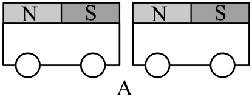

A. 如图A两个绑着磁铁的小车他们相对的两面分别是N级和S级他们相互吸引
B. 如图B“司南之杓，投之于地，其柢指南”
C. 如图C通电螺线管吸引铁钉
D. 如图D小白同学制作的手摇发电机
8. 如图，是一张大厦的照片，关于下列说法正确的是（　　）

A. 照相机的镜头对光线有发散作用	B. 照相机程倒立放大的虚像
C. 水中的像是光的反射造成的	D. 在太阳下的大楼是光源
9. 已知，，琴琴同学分别按图甲和图乙两种方式将两电阻连接在一起，则（    ）

A. 图甲中*R*1与*R*2的电流比	B. 图乙中*R*1与*R*2的电压比
C. 图甲与图乙的总功率比	D. 图甲与图乙的总功率比
10. 如图，亮亮同学将盛水的烧杯放在电子台秤上，台秤的示数如图甲所示；将一个物块投入水中，漂浮时台秤示数为375g（如图乙），物体上表面始终保持水平，用力将物块压入全部浸没在水中，此时台秤示数为425g（如图丙）；将物块继续下压，从丙到丁物块下表面受到水的压力增加了0.8N，整个过程水始终未溢出，请问说法正确的是（　　）

A. 木块的质量为125g
B. 木块密度为

C. 从图丙到图丁，瓶底水的压强逐渐增大
D. 从图丙到图丁，物体上表面受到水的压力增加了0.8N
**三、作图题（本题共****2****小题，每题****2****分，共****4****分）**
11. 小白同学用斜向右上的拉力拉动物体向右做匀速运动，请在图中：
①画出绳子对手的拉力*F*，
②物块受到的摩擦力*f*。
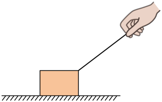
12. 画出两条光线经透镜折射后的光路。
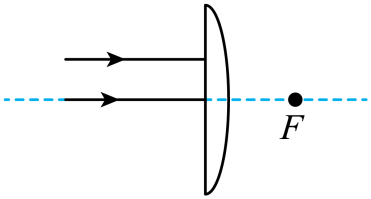
**四、填空题（本题共****4****小题，每空****1****分，共****22****分）**
13. 如图所示，亮亮同学做了如下测量：
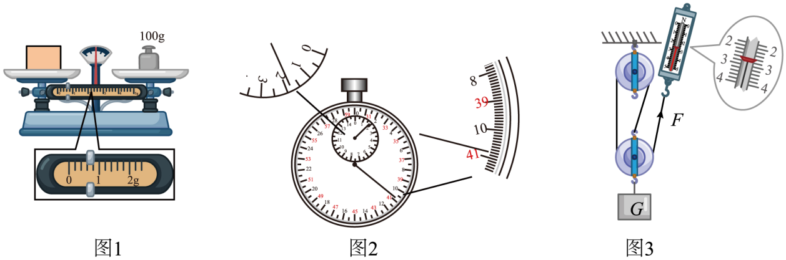
如图1，物体质量为：______g；
如图2，停表读数为：______s；
如图3，弹簧测力计读数为：______N。
14. 如图甲，A、B是两个完全相同的物体，琴琴同学分别将A、B两物体拉到斜面顶端，对物体做功情况如图乙所示，请问对物体A做的有用功是______J，对物体B做的额外功是______J。

15. 已知：电源电压为3V，小灯泡额定电压为2.5V，滑动变阻器（30Ω，1.2A）
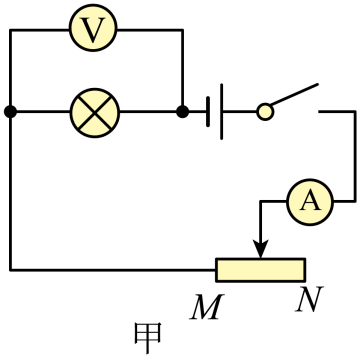
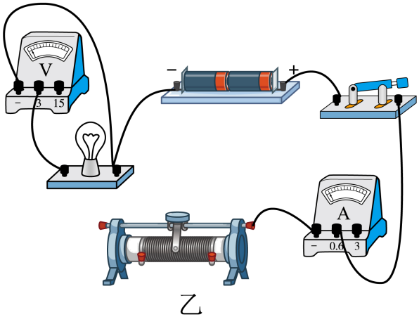
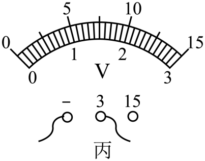
（1）请帮助亮亮根据电路图，连接实物图；（要求：滑片在最右端时，电阻最大。）（        ）
（2）在闭合开关前，滑动变阻器滑片需要调到端______（选填“M”或“N”）；
（3）亮亮同学检查电路连接正确，并且电路元件没有故障后，闭合开关，发现小灯泡不发光，电流表偏转角度很小，请问故障原因是：______，接下来亮亮同学提作方法是：______；

（4）实验数据如下图：
| 电压U/V | 1 | 1.5 | 2 | 2.5 | 2.8 |
| --- | --- | --- | --- | --- | --- |
| 电流I/A | 0.14 | 0.21 | 0.27 | 0.3 | 0.31 |

请问：正常发光时，小灯泡的电阻是：______Ω；
（5）由实验数据说明：小灯泡的电阻随电压的增大而______ ；（选填：“增大”，“变小”或“不变”）
（6）小白同学在电路连接正确后，闭合开关，小灯泡亮了一下之后就熄灭，电流表无示数，电压表有示数，请在图丙中，画出电压表指针指的位置。（用带箭头的线段表示）（         ）
16. 琴琴同学探究压强与受力面积的关系，得出一个错误的结论。

（1）谁的压力大______，谁的受力面积大______ ；（选填“海绵的大”“沙坑的大”“两个相等”）
（2）改进这两个实验的意见：______；
（3）对比甲图选择下面一个______对比探究压强和压力大小的关系。
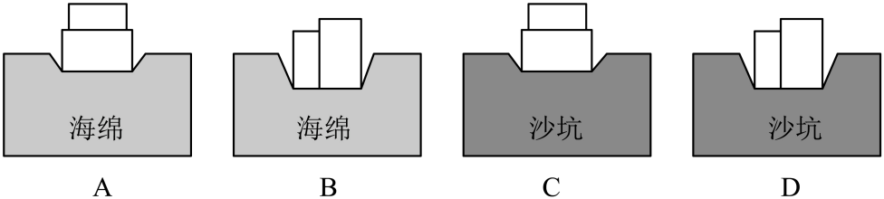
17. 如图甲所示，琴琴同学探究“水的沸腾与加热时间的关系”，水的质量为100g，实验过程中温度随时间变化的关系如下表。
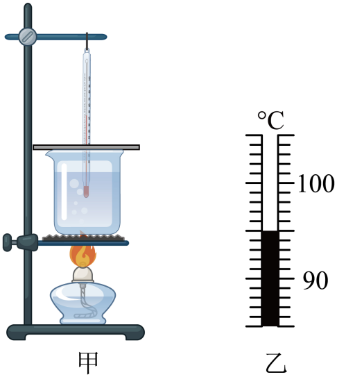
| 
  min  
 | 
  0  
 | 
  0.5  
 | 
  1  
 | 
  1.5  
 | 
  2  
 | 
  ......  
 | 
  12  
 |
| --- | --- | --- | --- | --- | --- | --- | --- |
| 
  ℃  
 | 
  94  
 | 
  ？  
 | 
  96  
 | 
  97  
 | 
  98  
 | 
  ......  
 | 
  98  
 |

（1）当加热0.5min时，温度计示数如图乙，读数为______℃；
（2）根据示数研究得出水沸腾时的温度变化特征是：水沸腾时持续吸热，温度______；（选填“升高”、“降低”或“不变”）
（3）琴琴同学实验过程中，水沸腾时温度小于100℃，原因是______；
（4）如何减少加热时间，请给琴琴同学提个建议：______；
（5）水在1分钟内吸收的热量为______J；
（6）根据第（5）步进一步探究，水沸腾后继续加热了10分钟，水的质量少了4g，探究蒸发1克水吸收了多少热量？（忽略热量损失）（        ）
**五、计算题（本题共****2****小题，****17****题****7****分，****18****题****9****分，共****16****分）**
18. 如图1是古时劳动人民亮亮同学用工具抬起木料的情景，如图二中已知其中，木料的体积为，木块的密度为。
（1）求木材所受重力？
（2）如图2，在*B*端有一木材对绳子的力*F*1为，当*F*2为大时，木料刚好被抬起？
（3）随着时代发展，亮亮同学发现吊车能更方便地提起重物。如图3用一吊车匀速向上提起木材，已知提升功率为，那这个吊车在10s内可以将该木料提升的高度为多高？

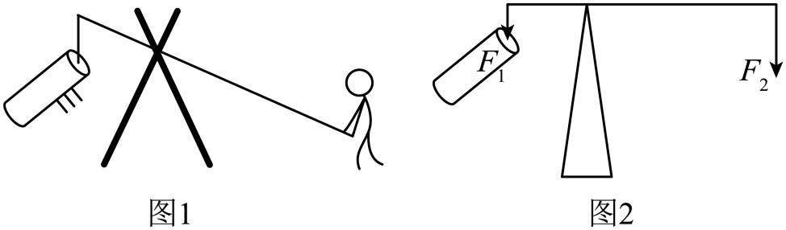
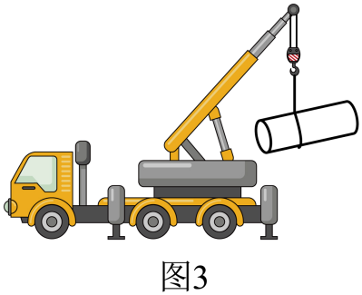
19. *R*是一个随推力*F*变化而变化的电阻，*F*与*R*的关系如图甲所示。现有如图乙，丙的两个电路，为定值电阻，阻值为20Ω，电源电压恒为6V，电流表量程为0~0.6A。
（1）当小白同学推力为0时，求电阻*R*阻值；

（2）用300N的力推电阻，求的电功率（图乙）；
（3）图丙中，当干路电流不超过电流表量程时，小白同学推力*F*的最大值。

**六、综合题（本题共****1****小题，每空****1****分，共****8****分）**
20. 阅读下列文字，回答下列问题：
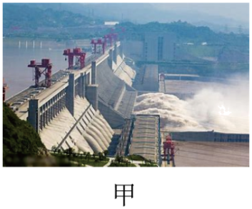

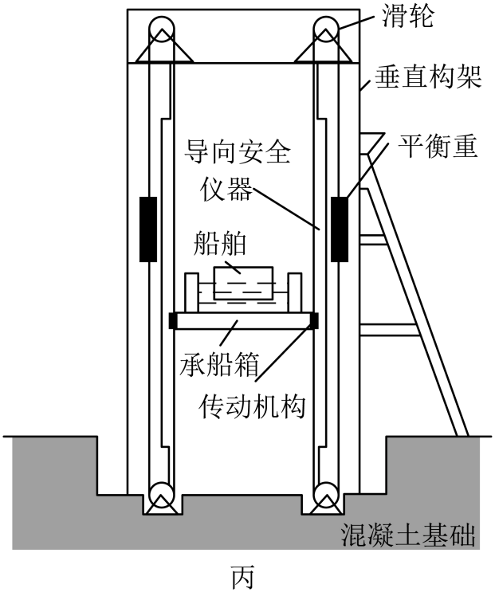
（1）船闸的工作原理是______，图乙中船相对于大坝是______（填运动或静止）；
（2）图丙中定滑轮的作用是______ ；
（3）琴琴同学在大坝上看到水面波光，是因为水面部分区域发生了______反射，一艘重2000吨的轮船驶入河中，受到的浮力为______ ；
（4）图丙的电梯：船上升速度为18m/min，则重物下降速度为______m/s，若船与江水总重为1.5万吨，则电梯功率为______ ；
（5）如图丁所示，已知：电梯中4个发电机的电能与机械能的转换比为10∶6，已知电源电压恒定为*U*，求时通过每个发电机的电流为______ 。
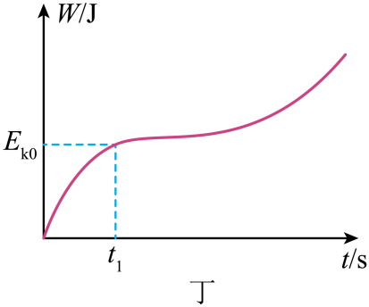
