## **2023****年深圳中考物理卷**

**本卷满分****70****分，考试时间****60****分钟**

**注：本套试卷所有****g****取****10N/kg**

**一、单项选择题（本题共****10****小题，每小题****2****分，共****20****分。在每小题给出的四个选项中，只有一项是符合题意的）**
1. 琴琴同学握笔如图所示。下列关于铅笔的描述正确的是（    ）

A. 铅笔的长度约50cm	B. 铅笔的质量约为50g
C. 静止在桌面上的铅笔受平衡力	D. 写字时铅笔和纸间的摩擦力是滚动摩擦力
【答案】C
【解析】
【详解】A．铅笔的长度约为20cm，故A错误；
B．铅笔的质量约为0.01kg，合10g，故B错误；
C．静止在桌面上的铅笔，是一种平衡状态，受平衡力，故C正确；
D．写字时铅笔和纸间的摩擦力是滑动摩擦力，故D错误。
故选C。
2. 下列说法正确的是（　　）
A. 在学校内禁止鸣笛，这是在声音的传播过程中减弱噪音
B. 响铃声音大是因为音调高
C. 校内广播属于信息传播
D. 同学们“唰唰”写字的声音是次声波
【答案】C
【解析】
【详解】A．在学校内禁止鸣笛，是禁止声源发出声音，这是在声源处减弱噪音，故A错误；
B．响铃声音大是指声音的音量大，即响度大，故B错误；
C．校内广播是通过声音告诉学生信息，故属于信息传播，故C正确；
D．次声波是人类听觉范围以外的声音，同学们“唰唰”写字的声音能被听见，所以不是次声波，故D错误。
故选C。
3. 下列符合安全用电常识的是（　　）
A. 用专用充电桩给电动车充电	B. 亮亮同学更换灯泡无需断开开关
C. 电器起火可以用水灭火	D. 导线绝缘层破损只要不触碰就可以继续使用
【答案】A
【解析】
【详解】A．用专用充电桩给电动车充电，防止电流过大，引起火灾，故A符合题意；
B．更换灯泡必须断开开关，防止发生触电事故，故B不符合题意；
C．由于水是导体，所以电器起火不能用水灭火，防止触电，故C不符合题意；
D．导线绝缘层破损，会造成短路，不能继续使用，故D不符合题意。
故选A。
4. 端午节煮粽子是中华文化的传统习俗，下列说法正确的是（　　）
A. 燃料燃烧为内能转化为化学能	B. 打开锅盖上面的白雾是水蒸气
C. 加热粽子是利用做功增加内能	D. 闻到粽子的香味是因为扩散现象
【答案】D
【解析】
【详解】A．燃料燃烧时发生化学反应，并释放出热量，所以是化学能转化为内能，故A错误；
B．打开锅盖上面的白雾是水蒸气液化形成的小水滴，故B错误；
C．加热粽子时，开水放出热量，粽子吸收热量，所以是通过热传递增加内能，故C错误；
D．闻到粽子的香味是香味分子不停地做无规则运动，是扩散现象，故D正确。
故选D。
5. 下列属于费力杠杆的是（　　）
A.   汽车方向盘

B.     门把手

C.  小白同学家的水龙头

D.   雨刮器
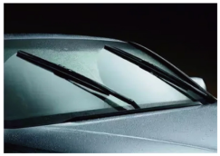
【答案】D
【解析】
【详解】ABC．汽车方向盘、门把手、水龙头属于轮轴，是轮转动带动轴转动，动力臂大于阻力臂，相当于省力杠杆，故ABC不符合题意；
D．雨刮器属于轮轴，是轴转动带轮转动，故阻力臂大于动力臂，相当于费力杠杆，故D符合题意。
故选D。
6. 新型纯电动无人驾驶小巴车，是全球首款获得德国“红点奖”的智能驾驶汽车，配备激光雷达和多个高清摄像头，根据预设站点自动停靠，最高时速可达40公里，除了随车的一名安全员亮亮，一辆车可容纳9名乘客。下列关于新型小巴车描述正确的是（    ）
A. 小巴车定位系统利用电磁波传递信息	B. 小巴车的高清摄像头是凹透镜
C. 小巴车的速度为114m/s	D. 当小巴车开始行驶时，乘客受到惯性向前倾
【答案】A
【解析】
【详解】A．电磁波可以在真空中传播，定位系统是利用电磁波传递信息的，故A正确；
B．摄像头的镜头是凸透镜，故B错误；
C．最高时速可达40公里，表示40km/h，则
故C错误；
D．惯性是物体的一种固有属性，不能说受到惯性，故D错误。
故选A。
7. 下列现象中可以证明地磁场客观存在的是（　　）

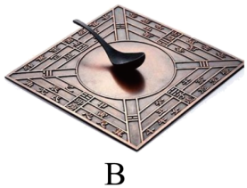
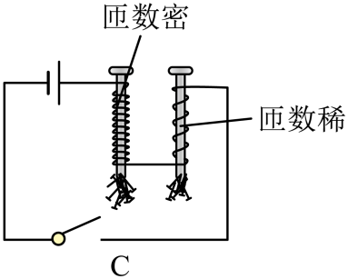
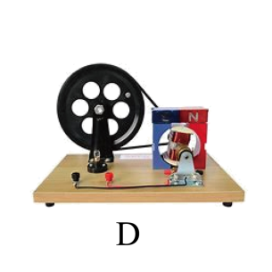
A. 如图A两个绑着磁铁的小车他们相对的两面分别是N级和S级他们相互吸引
B. 如图B“司南之杓，投之于地，其柢指南”
C. 如图C通电螺线管吸引铁钉
D. 如图D小白同学制作的手摇发电机
【答案】B
【解析】
【详解】A．两个绑着磁铁的小车他们相对的两面分别是N级和S级他们相互吸引，证明异名磁极相吸引，故A不符合题意；
B．“司南之杓，投之于地，其柢指南”，杓的柄始终指南是受到地磁场的作用，证明地磁场客观存在，故B符合题意；
C．通电螺线管吸引铁钉，证明电流具有磁效应，故C不符合题意；
D．手摇发电机证利用电磁感应现象，证明导体切割磁感线，能产生感应电流，故D不符合题意。
故选B。
8. 如图，是一张大厦的照片，关于下列说法正确的是（　　）

A. 照相机的镜头对光线有发散作用	B. 照相机程倒立放大的虚像
C. 水中的像是光的反射造成的	D. 在太阳下的大楼是光源
【答案】C
【解析】
【详解】A．照相机的镜头是凸透镜，凸透镜对光线有会聚作用，故A错误；
B．使用照相机时，物距大于二倍焦距，所以成倒立缩小的实像，故B错误；
C．水中的像是平面镜成像现象，是光的反射造成的，故C正确；
D．光源能自己发光，大楼反射太阳光，大楼自己不会发光，所以大楼不是光源，故D错误。
故选C。
9. 已知，，琴琴同学分别按图甲和图乙两种方式将两电阻连接在一起，则（    ）
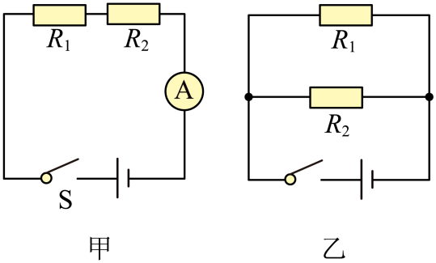
A. 图甲中*R*1与*R*2电流比	B. 图乙中*R*1与*R*2的电压比

C. 图甲与图乙的总功率比	D. 图甲与图乙的总功率比
【答案】C
【解析】
【详解】A．图甲中两电阻串联，根据串联电路中电流处处相等可知，通过与的电流相等，即
故A不符合题意；
B．图乙中两电阻并联，根据并联电路的电压规律可知， 与两端的电压相等，则
故B不符合题意；
CD．根据电功率的公式
可得
图甲与图乙的总功率比
故C符合题意，D不符合题意。
故选C。
10. 如图，亮亮同学将盛水的烧杯放在电子台秤上，台秤的示数如图甲所示；将一个物块投入水中，漂浮时台秤示数为375g（如图乙），物体上表面始终保持水平，用力将物块压入全部浸没在水中，此时台秤示数为425g（如图丙）；将物块继续下压，从丙到丁物块下表面受到水的压力增加了0.8N，整个过程水始终未溢出，请问说法正确的是（　　）
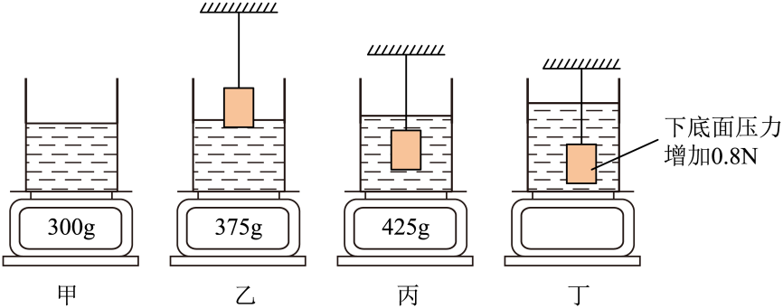
A. 木块的质量为125g
B. 木块的密度为
C. 从图丙到图丁，瓶底水的压强逐渐增大
D. 从图丙到图丁，物体上表面受到水的压力增加了0.8N
【答案】D
【解析】
【详解】A．将盛水的烧杯放在电子台秤上，示数为300g，则烧杯和水的质量为300g，将物块投入水中，漂浮时台秤示数为375g，则烧杯、水和物体的质量为375g，所以物体的质量

*m*=375g-300g=75g

故A错误；
B．用力将物块压入全部浸没在水中，此时台秤示数为425g，则排开水的重力

*m*排=425g-300g=125g

则物体的体积
则物体的密度
故B错误；
C．从图丙到图丁，物体始终浸没在水中，水面不再升高，由*p*=*ρgh*可知，瓶底水的压强不变，故C错误；
D．从图丙到图丁，物块下表面受到水的压力增加了0.8N，由于物体上表面和物块下表面变化的深度相同，所以物体上表面受到水的压力也增加了0.8N，故D正确。
故选D。
**三、作图题（本题共****2****小题，每题****2****分，共****4****分）**
11. 小白同学用斜向右上的拉力拉动物体向右做匀速运动，请在图中：
①画出绳子对手的拉力*F*，
②物块受到的摩擦力*f*。

【答案】
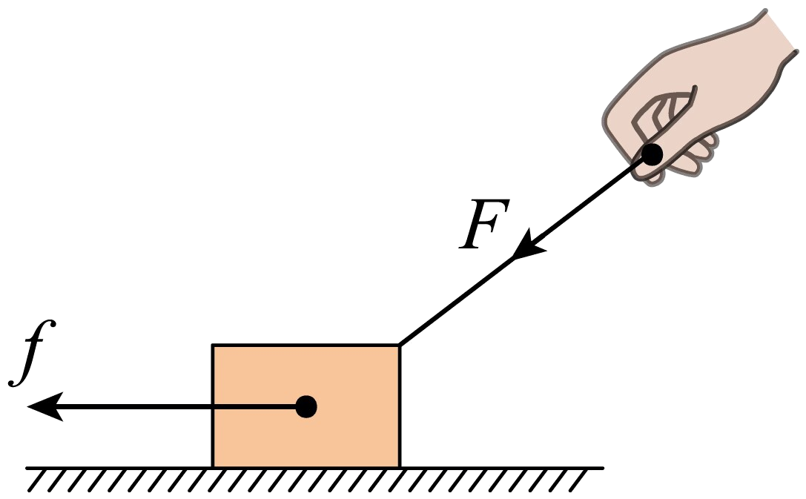
【解析】
【详解】小白同学用斜向右上的拉力拉动物体，根据力的作用的相互性，绳子对手的拉力沿着绳子向下；物体沿水平面向右匀速运动，物块受到的摩擦力水平向左。如图所示：

12. 画出两条光线经透镜折射后的光路。

【答案】
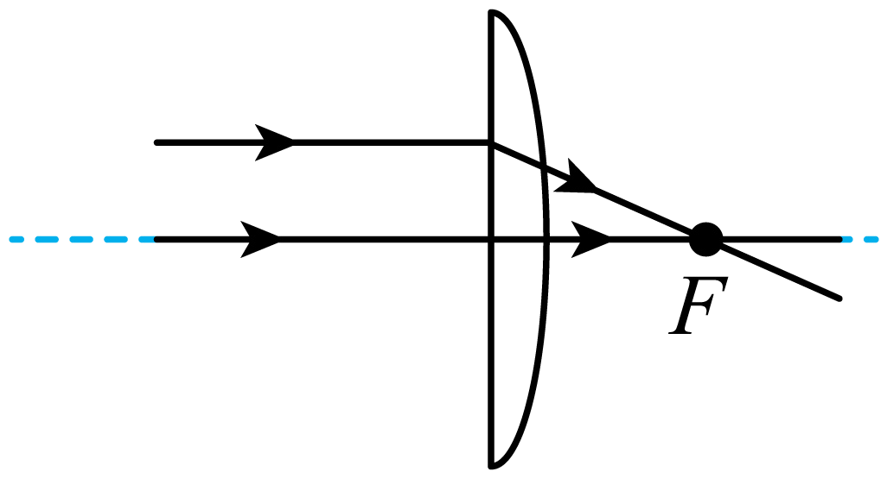
【解析】
【详解】由于凸透镜能将平行光会聚到焦点上，所以平行于主光轴的光，经过凸透镜折射，经过焦点；经过光心的光，不发生折射，沿原来的传播方向传播，如下图所示：

**四、填空题（本题共****4****小题，每空****1****分，共****22****分）**
13 如图所示，亮亮同学做了如下测量：

如图1，物体质量为：______g；
如图2，停表读数为：______s；
如图3，弹簧测力计读数为：______N。
【答案】    ①. 100.6    ②. 100.8    ③. 2.6
【解析】
【详解】[1]标尺分度值为0.2g，天平称得物体质量为

*m*=100g+0.6g=100.6g

[2]由图2可得小表盘中读数为1min，指针偏过中间刻度线，所以大表盘读数为40.8s，则停表读数为100.8s。
[3]弹簧测力计的分度值为0.2N，由图知弹簧测力计的读数为2.6N。
14. 如图甲，A、B是两个完全相同的物体，琴琴同学分别将A、B两物体拉到斜面顶端，对物体做功情况如图乙所示，请问对物体A做的有用功是______J，对物体B做的额外功是______J。
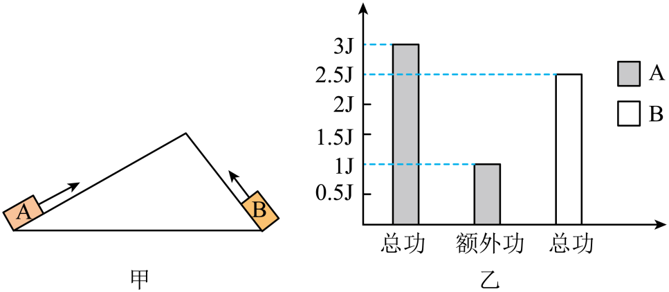
【答案】    ①. 2    ②. 0.5
【解析】
【详解】[1]由图乙可知，对物体A做的总功为3J，额外功为1J，故对物体A做的有用功

*W*有=*W*A总-*W*A额=3J-1J=2J

[2] A、B是两个完全相同的物体，都拉到斜面顶端，故对物体B做的有用功和对物体A做的有用功相同；由图乙可知，对物体B做的总功为2.5J，故对物体B做的额外功

*W*B额=*W*B总-*W*有=2.5J-2J=0.5J

15. 已知：电源电压为3V，小灯泡额定电压为2.5V，滑动变阻器（30Ω，1.2A）

（1）请帮助亮亮根据电路图，连接实物图；（要求：滑片在最右端时，电阻最大。）（        ）
（2）在闭合开关前，滑动变阻器滑片需要调到端______（选填“M”或“N”）；
（3）亮亮同学检查电路连接正确，并且电路元件没有故障后，闭合开关，发现小灯泡不发光，电流表偏转角度很小，请问故障原因是：______，接下来亮亮同学的提作方法是：______；
（4）实验数据如下图：
| 电压U/V | 1 | 1.5 | 2 | 2.5 | 2.8 |
| --- | --- | --- | --- | --- | --- |
| 电流I/A | 0.14 | 0.21 | 0.27 | 0.3 | 0.31 |

请问：正常发光时，小灯泡的电阻是：______Ω；
（5）由实验数据说明：小灯泡的电阻随电压的增大而______ ；（选填：“增大”，“变小”或“不变”）
（6）小白同学在电路连接正确后，闭合开关，小灯泡亮了一下之后就熄灭，电流表无示数，电压表有示数，请在图丙中，画出电压表指针指的位置。（用带箭头的线段表示）（         ）
【答案】    ①.       ②. N    ③. 灯泡的实际功率很小    ④. 移动滑动变阻器滑片    ⑤. 8.3    ⑥. 增大    ⑦.
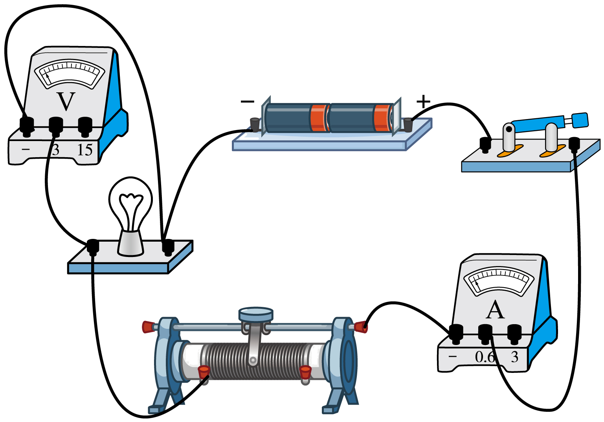
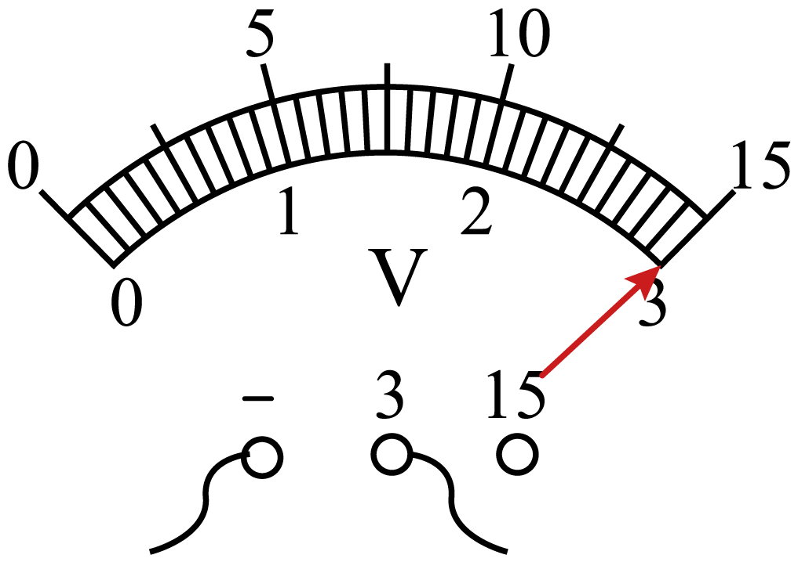
【解析】
【详解】（1）[1]滑动变阻器滑片在最右端时阻值最大，所以滑动变阻器应接左下接线柱，如图所示：

（2）[2]在闭合开关前，滑动变阻器滑片需要调到*N*端，使得滑动变阻器为最大阻值，保护电路。
（3）[3]闭合开关前，滑动变阻器接入电路的阻值为最大阻值，闭合开关，由于电路总电阻很大，电路电流较小，灯泡的实际功率很小，可能不足以引起灯泡发光。
[4]闭合开关后，如果灯泡不亮，应移动滑动变阻器滑片，减小电路的总电阻，使电灯泡发光。
（4）[5]由题意可知小灯泡的额定电压是2.5V，所以小灯泡正常发光时，电压为2.5V，而电流由表中数据得0.3A，所以小灯泡电阻为
（5）[6]由表中数据得电压为1V，电流为0.14A，小灯泡电阻为
由表中数据得电压为1.5V，电流为0.21A，小灯泡电阻为
由表中数据得电压为2V，电流为0.27A，小灯泡电阻为
由表中数据得电压为2.8V，电流为0.31A，小灯泡电阻为
所以小灯泡的电阻随电压的增大而增大。
（6）[7]闭合开关，小灯泡亮了一下之后就熄灭，电流表无示数，电压表有示数，说明小灯泡断路了，电压表测电源的电压示数接近电源电压3V，如图所示：

16. 琴琴同学探究压强与受力面积的关系，得出一个错误的结论。
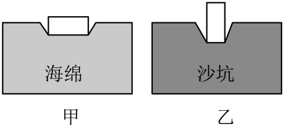
（1）谁的压力大______，谁的受力面积大______ ；（选填“海绵的大”“沙坑的大”“两个相等”）
（2）改进这两个实验的意见：______；
（3）对比甲图选择下面一个______对比探究压强和压力大小的关系。

【答案】    ①. 两个相等    ②. 海绵的大    ③. 都用海绵（或沙坑）来进行实验    ④. A
【解析】
【详解】（1）[1]两个实验中都是同一个物体，对海绵或沙坑的压力一样大。
[2]海绵中物体横放，沙坑中物体竖放，由图可得，海绵的受力面积大。
（2）[3]实验为探究压强与受力面积，应只改变受力面积大小，下面的受力物体保持不变，故改进意见为：甲、乙都用海绵进行实验或甲、乙都用沙坑进行实验。
（3）[4] 要探究压强和压力大小的关系，应保持受力面积相同，受力物体相同，只改变压力大小，对比甲图，应该选择A。
17. 如图甲所示，琴琴同学探究“水的沸腾与加热时间的关系”，水的质量为100g，实验过程中温度随时间变化的关系如下表。

| 
  min  
 | 
  0  
 | 
  0.5  
 | 
  1  
 | 
  1.5  
 | 
  2  
 | 
  ......  
 | 
  12  
 |
| --- | --- | --- | --- | --- | --- | --- | --- |
| 
  ℃  
 | 
  94  
 | 
  ？  
 | 
  96  
 | 
  97  
 | 
  98  
 | 
  ......  
 | 
  98  
 |

（1）当加热0.5min时，温度计示数如图乙，读数为______℃；
（2）根据示数研究得出水沸腾时的温度变化特征是：水沸腾时持续吸热，温度______；（选填“升高”、“降低”或“不变”）
（3）琴琴同学实验过程中，水沸腾时温度小于100℃，原因是______；
（4）如何减少加热时间，请给琴琴同学提个建议：______；
（5）水在1分钟内吸收的热量为______J；
（6）根据第（5）步进一步探究，水沸腾后继续加热了10分钟，水的质量少了4g，探究蒸发1克水吸收了多少热量？（忽略热量损失）（        ）
【答案】    ①. 95    ②. 不变    ③. 当地大气压小于1标准大气压    ④. 减少水的质量    ⑤. 840    ⑥. 2100J
【解析】
【详解】（1）[1]由乙图可知，温度计的分度值为1℃，温度计示数为95℃。
（2）[2]由表中数据可知，从第2min开始，水温保持98℃不变，所以可得出水沸腾时的温度变化特征是：水沸腾时持续吸热，温度不变。
（3）[3]由于在1标准大气压下，水的沸点为100℃，水的沸点随气压的降低而降低，所以当气压小于1标准大气压时，水沸腾时温度小于100℃。
（4）[4]为了减少加热时间，可以用初温较高的热水，或者减小水的质量。
（5）[5]由表中数据可知，水在1min内，温度由94℃上升至96℃，则水在1分钟内吸收的热量
（6）[6]水沸腾后继续加热了10分钟，水的质量少了4g，则蒸发1克水吸收的热量
**五、计算题（本题共****2****小题，****17****题****7****分，****18****题****9****分，共****16****分）**
18. 如图1是古时劳动人民亮亮同学用工具抬起木料的情景，如图二中已知其中，木料的体积为，木块的密度为。
（1）求木材所受重力？
（2）如图2，在*B*端有一木材对绳子的力*F*1为，当*F*2为大时，木料刚好被抬起？
（3）随着时代发展，亮亮同学发现吊车能更方便地提起重物。如图3用一吊车匀速向上提起木材，已知提升的功率为，那这个吊车在10s内可以将该木料提升的高度为多高？

【答案】（1）2×104N；（2）2×103N；（3）5m
【解析】
【详解】解：（1）木料的体积为，木块的密度为，则木材所受重力
（2）在*B*端有一木材对绳子的力*F*1为，由杠杆平衡条件可得
由于
则木料刚好被抬起时，力*F*2大小
（3）提升的功率为，由
得，吊车匀速向上提起木材，拉力等于木料重力，则提升速度
吊车在10s内可以将该木料提升的高度
答：（1）木材所受重力为2×104N；
（2）当*F*2为2×103N，木料刚好被抬起；
（3）吊车在10s内可以将该木料提升的高度为5m。
19. *R*是一个随推力*F*变化而变化的电阻，*F*与*R*的关系如图甲所示。现有如图乙，丙的两个电路，为定值电阻，阻值为20Ω，电源电压恒为6V，电流表量程为0~0.6A。
（1）当小白同学推力为0时，求电阻*R*的阻值；
（2）用300N力推电阻，求的电功率（图乙）；

（3）图丙中，当干路电流不超过电流表量程时，小白同学推力*F*的最大值。
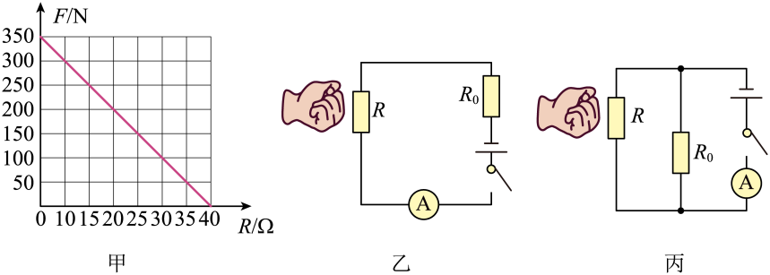
【答案】（1）40Ω；（2）08W；（3）200N

【解析】
【详解】解：（1）由题图甲可知，当推力为0时，电阻*R*的阻值为40Ω。
（2）用300N的力推电阻时，电阻*R*的阻值为10Ω，电路中的电流
的电功率
（3）图丙电路中，通过的电流
电流表允许通过的最大电流为0.6A，因为*R*与并联，则通过*R*的最大电流
根据欧姆定律可得，*R*的阻值最小
由题图甲可知，此时的推力为200N，随着推力的增大，*R*的阻值减小，故最大推力为200N。
答：（1）推力为0时，电阻*R*的阻值为40Ω；
（2）图乙中的电功率为0.8W；
（3）小白同学推力*F*的最大值为200N。
**六、综合题（本题共****1****小题，每空****1****分，共****8****分）**
20. 阅读下列文字，回答下列问题：

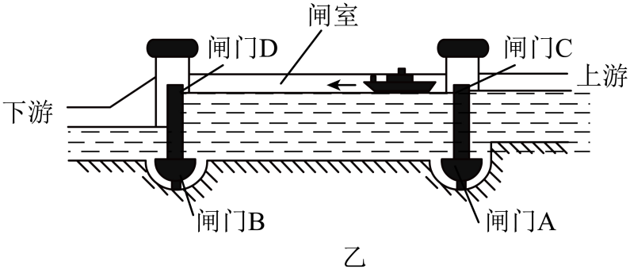

（1）船闸的工作原理是______，图乙中船相对于大坝是______（填运动或静止）；
（2）图丙中定滑轮的作用是______ ；
（3）琴琴同学在大坝上看到水面波光，是因为水面部分区域发生了______反射，一艘重2000吨的轮船驶入河中，受到的浮力为______ ；
（4）图丙的电梯：船上升速度为18m/min，则重物下降速度为______m/s，若船与江水总重为1.5万吨，则电梯功率为______ ；
（5）如图丁所示，已知：电梯中4个发电机的电能与机械能的转换比为10∶6，已知电源电压恒定为*U*，求时通过每个发电机的电流为______ 。

【答案】    ①. 连通器    ②. 运动    ③. 改变力的方向    ④. 镜面    ⑤.     ⑥. 0.3    ⑦.     ⑧.
【解析】
【详解】（1）[1]船闸利用连通器原理工作的。
[2]船在船闸内向左运动，相对于大坝位置发生改变，所以是运动的。
（2）[3]图中定滑轮的作用是可以改变力的方向。
（3）[4]在大坝上看到水面波光，是因为水面部分区域发生镜面发射，有大量的光反射进眼睛，使水面看起来波光粼粼。
[5] 一艘重2000吨的轮船驶入河中，船漂浮在水面，受到的浮力大小等于重力的大小
（4）[6]重物下降的速度等于船的上升速度，则重物下降的速度
[7] 船与江水可以看做匀速上升，由二力平衡知识可知，电梯对船与江水的力等于船与江水受到的重力
电梯的功率
（5）时电梯的机械能功率为*P*，则4个发电机的电能与机械能的转换比为10∶6，设每个发电机的功率为，则
则
根据可得
