## **2024****年深圳中考物理卷**

**本卷满分****70****分，考试时间****60****分钟。**

**主题一：物理与传统文化**
1. 2024年6月 10日是我国传统节日端午节，端午节划龙舟是传统的习俗，弘扬中国传统文化是我们义不容辞的责任。思考乐月月同学踊跃参加了划龙舟比赛，比赛中，思考乐月月同学判断龙舟尾部的旗杆是静止的，所选的参照物是（　　）

A. 龙头	B. 船桨	C. 河岸	D. 鼓槌
【答案】A
【解析】
【详解】A．以龙头为参照物，龙舟尾部的旗杆相对于龙头的位置没有改变，龙舟尾部的旗杆是静止的，故A符合题意；
B．以船桨为参照物，龙舟尾部的旗杆相对于船桨的位置改变，龙舟尾部的旗杆是运动的，故B不符合题意；
C．以河岸为参照物，龙舟尾部的旗杆相对于河岸的位置改变，龙舟尾部的旗杆是运动的，故C不符合题意；
D．以鼓槌为参照物，龙舟尾部的旗杆相对于鼓槌的位置改变，龙舟尾部的旗杆是运动的，故D不符合题意。
故选A。
2. 2024年6月 10日是我国传统节日端午节，端午节划龙舟是传统的习俗，弘扬中国传统文化是我们义不容辞的责任。端午节赛龙舟时，赛事激烈，思考乐财财同学的欢呼声越来越大，这个“越来越大”是指（　　）
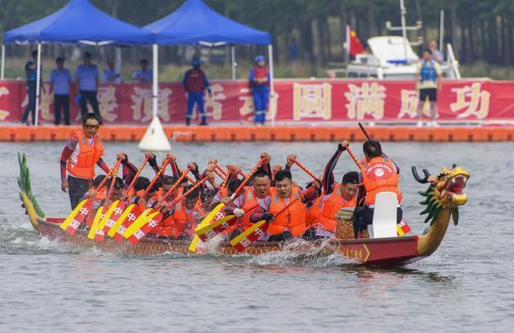
A. 音色	B. 音调	C. 响度	D. 速度
【答案】C
【解析】
【详解】响度是指声音的大小，同学的欢呼声越来越大，说明声音较大，声音的响度大。
故选C。
3. 2024年6月 10日是我国传统节日端午节，端午节划龙舟是传统的习俗，弘扬中国传统文化是我们义不容辞的责任。思考乐丽丽同学发现划龙舟的船桨改成碳纤维的原因（　　）

A. 导热好	B. 可导电	C. 密度小	D. 耐高温
【答案】C
【解析】
【详解】划龙舟的船桨改成碳纤维，因为碳纤维的密度较小，与体积相同的其它物体相比，由*m=ρV*可知质量减小，使用时更省力。
故选C。
4. 2024年6月 10日是我国传统节日端午节，端午节划龙舟是传统的习俗，弘扬中国传统文化是我们义不容辞的责任。思考乐佳佳同学发现并行的龙舟不能靠的太近，其中蕴含的原理跟以下哪个一样？（　　）

A. 用吸管吸饮料	B. 地铁站里有安全线
C. 高压锅煮饭	D. 佳佳在骑车时需要带头盔
【答案】B
【解析】
【详解】当两船靠近时，两船之间水流速将会变大，而压强会减小，所以易发生事故。
A．用吸管吸饮料时，用力吸的作用是排出管内空气，使吸管内气压小于外界大气压，在大气压的作用下饮料被压入吸管，故A不符合题意；
B．地铁安全线是根据流体压强与流速关系设置的，地铁进站时，若人站在安全线内，人靠近地铁一侧的空气流速大，压强小，人远离地铁一侧的空气流速小，压强大，使人受到一个向前的压强差，可能引发安全事故，故候车时，乘客应站在安全线外，故B符合题意；
C．高压锅煮饭是利用气压高水的沸点高的原理，故C不符合题意；
D．佳佳在骑车时需要带头盔，如果骑车摔倒，头盔可以保护头部，故D不符合题意。
故选B。
5. 2024年6月 10日是我国传统节日端午节，端午节划龙舟是传统的习俗，弘扬中国传统文化是我们义不容辞的责任。运动员停止划桨后，龙舟会向前运动，小丁同学觉得是因为（　　）

A. 具有摩擦力向前运动	B. 具有惯性向前运动
C. 受到重力停止运动	D. 受到质量停止运动
【答案】B
【解析】
【详解】运动员停止划桨后，龙舟由于具有惯性保持原有运动状态，能够继续向前运动。
故选B。
**主题二：物理与航天**
6. 2024年6月2日，嫦娥六号探测器成功着陆月背面南极艾特肯盆地，这是人类历史上首次登陆月球背面，图是嫦娥六号探测器，成功着陆月球背面3D动画模拟图。嫦娥六号从月球带回月壤，月壤（　　）

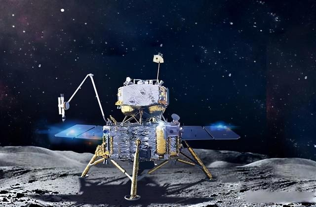
A. 质量不变	B. 质量变小	C. 重力变小	D. 重力不变
【答案】A
【解析】
【详解】AB．质量是物体的一种属性，与位置无关，嫦娥六号从月球带回月壤，月壤的质量不变，故A符合题意，B不符合题意；
CD．月壤的质量不变，地球的引力常数大于月球，从月球带回的月壤重力变大，故CD不符合题意。
故选A。
7. 2024年 6月 2 日，嫦娥六号探测器成功着陆月背面南极艾特肯盆地，这是人类历史上首次登陆月球背面，图是嫦娥六号探测器，成功着陆月球背面3D动画模拟图。“嫦娥六号”着落架下方安装圆盘型“脚”，其目的是（　　）
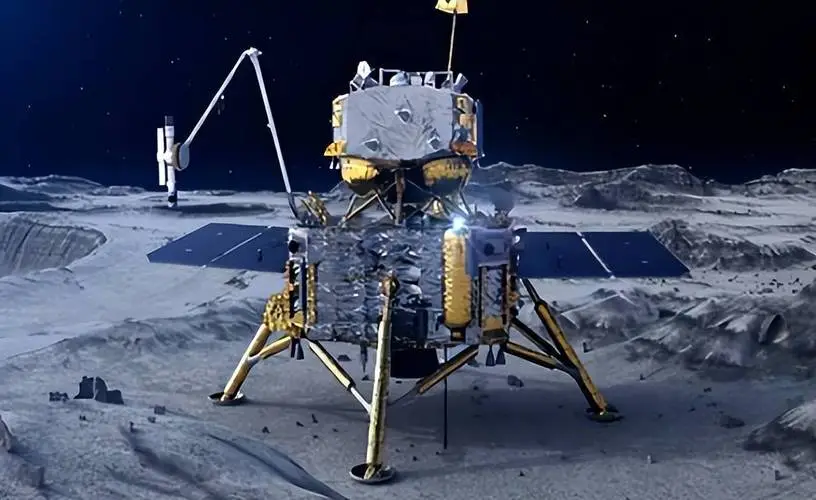
A. 减小压力	B. 增大压力	C. 减小压强	D. 增大压强
【答案】C
【解析】
【详解】“嫦娥六号”着落架下方安装圆盘型“脚”，是在压力一定时，通过增大受力面积来减小对月球表面压强。
故选C。
**主题三：物理与生活**
8. 图甲是飞鸟经过无背索斜拉桥的情景。图乙是其简化的模型，用S表示飞鸟，用*F*表示桥塔上端收到钢索的拉力。请帮助思考乐亮亮同学在图乙画出：
（1）飞鸟S经水面反射形成的虚像S'
（2）拉力*F*对应的力臂*l*（*O*是支点）
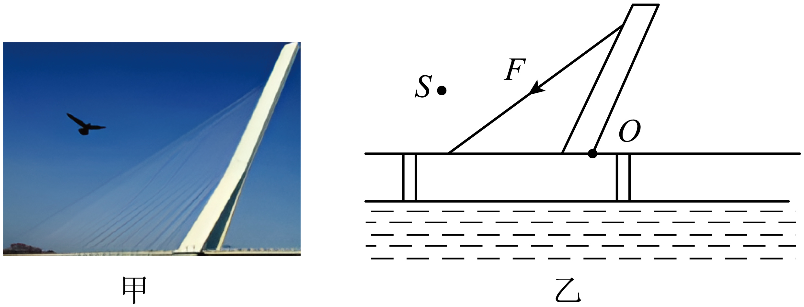
【答案】
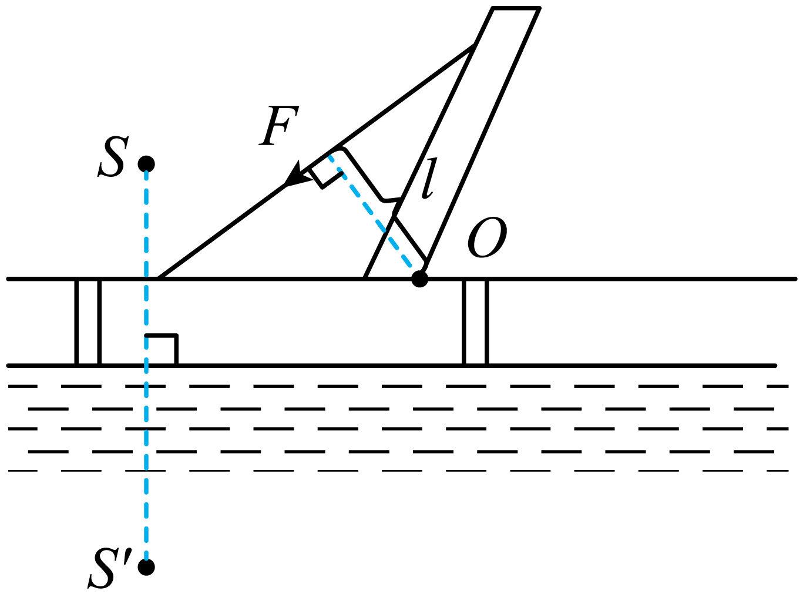
【解析】
【详解】（1）平静的水面相当于平面镜，根据平面镜成的像与物关于镜面对称，作出飞鸟S经水面反射形成的虚像S'，如下所示：
（2）*O*是支点，从支点向力的作用线作垂线段即为拉力*F*对应的力臂*l*，如下所示：

9. 用航标灯发出的光来让海上的船只看清方位说明光能传递_________，_________是正极，是_________能转换为电能。
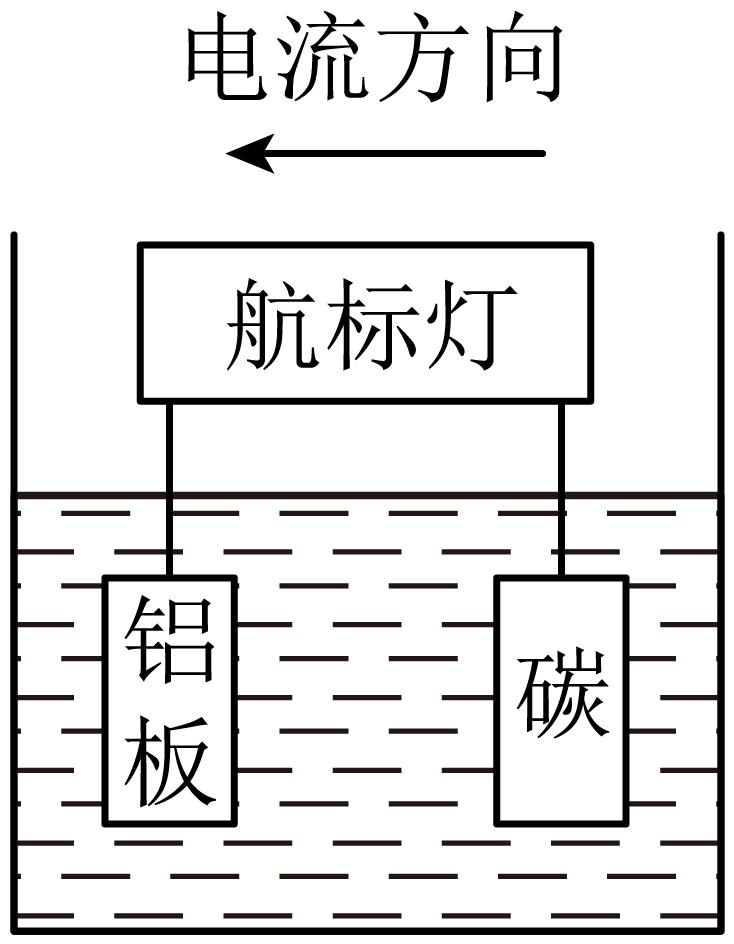
【答案】    ①. 信息    ②. 碳    ③. 化学
【解析】
【详解】[1]光在同种均匀介质中沿直线传播，航标灯发出的光沿直线传播，海上的船只看清方位，说明光能传递信息。
[2][3]电源的外部电流从电源的正极出发回到负极，由图中电流方向可知碳是正极，电池将化学能转化为电能。
10. 巴黎奥运会即将开幕，爱思考的乐达达同学去巴黎旅游,发现奥运五环被挡住看不见是因为光沿_________传播，埃菲尔铁塔无灯的栏杆被人看见是因为栏杆_________的光进入达达同学的眼睛。
【答案】    ①. 直线    ②. 反射
【解析】
【详解】[1][2]光在同种均匀介质中沿直线传播。巴黎奥运会即将开幕，爱思考的乐达达同学去巴黎旅游，发现奥运五环被挡住看不见是因为光沿直线传播；埃菲尔铁塔无灯的栏杆不是光源，埃菲尔铁塔无灯的栏杆被人看见是因为栏杆反射的光进入达达同学的眼睛。
11. 结合生活，回答下列问题：
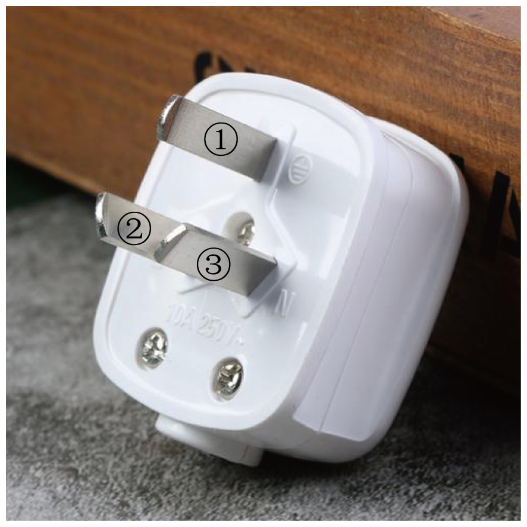
（1）细心的思考乐视枧同学发现插头上的①比较长，应该连接家庭电路_________线；
（2）思考乐视枧同学煮粽子时闻到粽子的香味，说明分子热运动与_________有关；
（3）白气是水蒸气_________形成的（填物态变化名称），过程中_________（选填“吸热”或“放热”）
【答案】    ①. 地    ②. 温度    ③. 液化    ④. 放热
【解析】
【详解】（1）[1]插头上的①比较长，是为了保证在插电源插头时最先接触地线，在拔电源插头时最后分离地线，从而更好起到地线保护作用。
（2）[2]思考乐视枧同学煮粽子时闻到粽子的香味，说明分子热运动与温度有关，温度越高，分子热运动越剧烈。
（3）[3][4]白气是水蒸气遇冷液化形成的，液化放热。
12. 思考乐田田同学想要测量质量为6.9g的筷子密度，筷子很长，因此田田将筷子分成高度一样的两部分，中间画上一条横线，把筷子一段浸入量筒中，横线在图甲与水面重合时读出体积*V*1，取出；然后再把筷子另一段放入水中，横线在图乙与水面重合时读出体积*V*2。
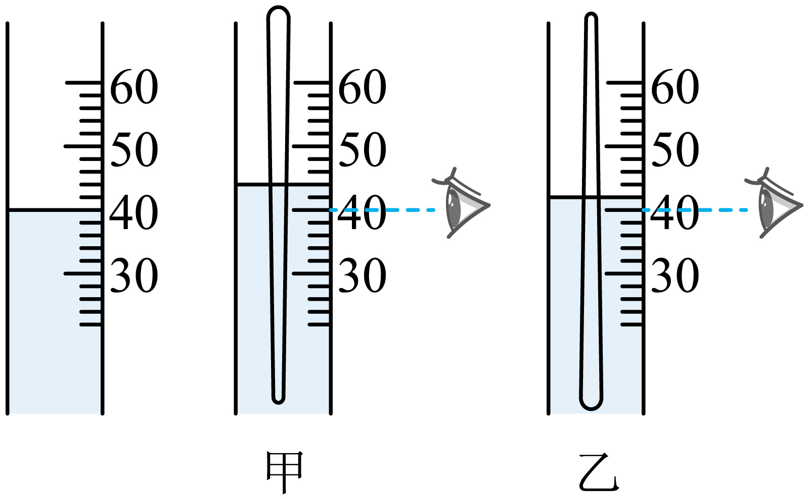
（1）筷子的体积是_________ cm3，思考乐田田同学通过计算得出密度= _________g/cm3；
（2）这样求出的密度_________（填偏大还是偏小）；
（3）请帮助思考乐田田同学思考如何用现有装置来改进实验。_________。
【答案】    ①. 6    ②. 1.15    ③. 偏大    ④. 见解析
【解析】
【详解】（1）[1]筷子一段浸入量筒中，由图甲可知，体积是44mL，原来水的体积是40mL，筷子一段体积

*V*1=44mL-40mL=4mL=4cm3

由图乙可知，体积是42mL，原来水的体积是40mL，筷子一段体积

*V*2=42mL-40mL=2mL=2cm3

筷子的体积是

*V*=*V*1+*V*2=4cm3+2cm3=6cm3

[2]筷子密度

（2）[3]第一次将筷子取出，筷子带出一部分水，水的体积减小，小于40mL，再把筷子另一段放入水中，求筷子的体积时还按照原来水的体积是40mL，得到体积减小，质量不变，由密度的公式可知密度偏大。
（3）[4]将筷子另一段放入水中之前，把量筒中的水补充到40mL刻度处，这样测量的体积比较准确，得到的密度比较准确。
**主题四：物理探究与实践**
13. 思考乐佳乐同学在探究电流与电阻实验中：

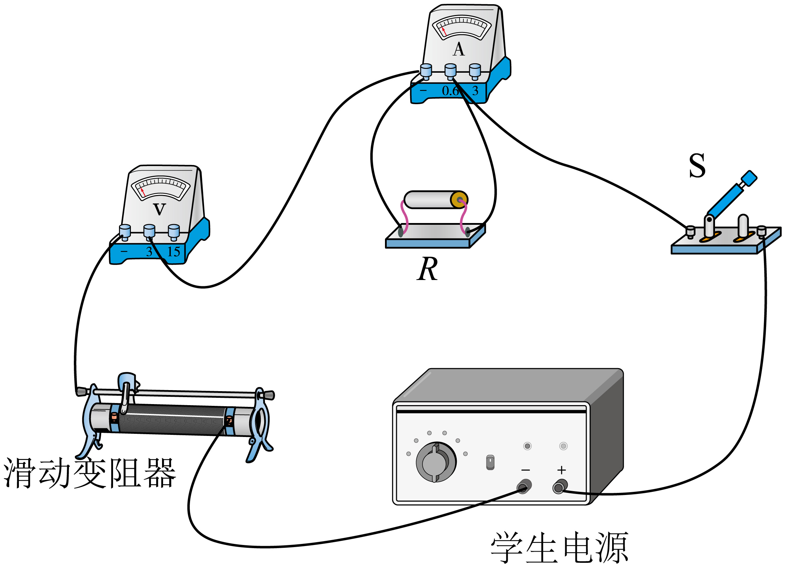
（1）思考乐佳乐同学连接电路如图所示，他检查电路时，发现存在错误。请把接错的那一根导线找出来并打上“×”，再画线把它改到正确的位置上______；
（2）纠正错误后，保持定值电阻两端电压为2V不变，得到实验数据如下表所示。其中有一组数据是错误的，思考乐佳乐同学发现错误数据的序号是_________；
| 
  数据序号  
 | 
  1  
 | 
  2  
 | 
  3  
 | 
  4  
 | 
  5  
 | 
  6  
 |
| --- | --- | --- | --- | --- | --- | --- |
| 
  电阻*R*/Ω  
 | 
  30  
 | 
  25  
 | 
  20  
 | 
  15  
 | 
  10  
 | 
  5  
 |
| 
  电流 *I*/A  
 | 
  0.07  
 | 
  0.08  
 | 
  0.10  
 | 
  0.70  
 | 
  0.20  
 | 
  0.40  
 |

（3）整理表中数据可得结论：导体两端电压一定时，导体中的电流与导体电阻成反比，请写出成反比的依据是什么？_________
（4）思考乐佳乐同学在做第五次实验时，调节滑动变阻器使电压表示数为2V，用时8s完成电流表读数，这8s内，定值电阻*R*消耗的电能是_________J。
【答案】    ①.     ②. 4    ③. 见解析    ④. 3.2
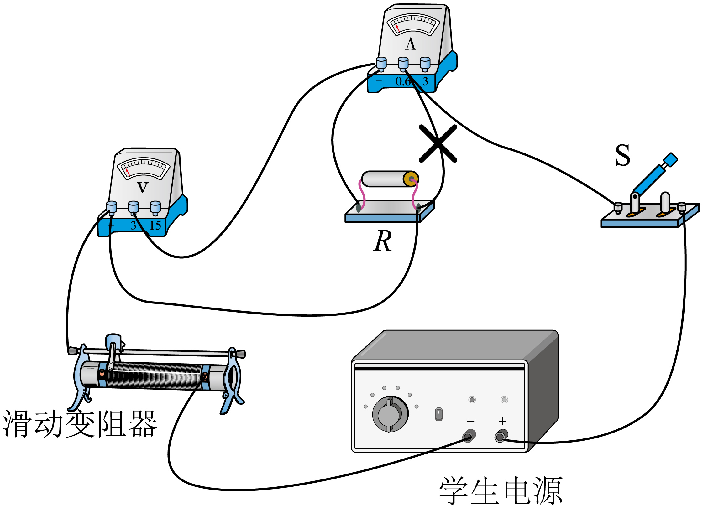
【解析】
【详解】（1）[1]图中电压表串联在电路中，电流表和电阻并联，是错误的，应该将电压表和电阻并联，电流表串联在电路中，如图所示：

（2）[2]由表中数据可知，第4次数据电压表的示数为

0.7A×15Ω=10.5V

其它各数据电压表的示数为

*U*V=0.08A×25Ω=2V

所以第4次数据错误。
（3）[3]由表中数据可知，电流和电阻的乘积不变，为2V，所以导体两端电压一定时，导体中的电流与导体电阻成反比。
（4）[4]定值电阻*R*消耗的电能

*W=UIt*=2V×0.2A×8s=3.2J

14. 学习“液体压强”时，老师展示了如图甲所示的实验，辉辉同学观察实验后，得出结论：深度越大，水的压强越大，水喷出的最远距离就越大。下课后，辉辉将自己的结论告诉老师，老师表扬了辉辉爱思考的好习惯，然后和辉辉一起到了思考乐实验室，另找一个矿泉水瓶，在侧边扎了两个小圆孔C和D（圆孔A、B、C、D的直径相同），并进行了以下实验：观察得*s**c*小于*s**d*。
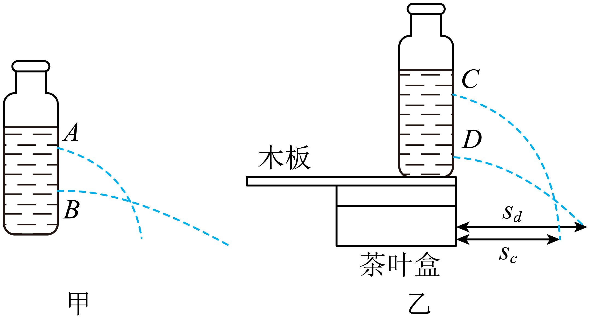
（1）现已知*h**c*<*h**d*，求*p**c*________*p**d*；
（2）其他条件不变，将木板向右移，最远的水流依然落在木板上，请用虚线在图中画出木板上表面平移后的位置________；
（3）*s**c*'和*s**d*'分别为现在的最远距离，现在求*s**c*'_______*s**d*'；
（4）思考乐辉辉同学的结论是否正确？请说出你的判断和理由___________。
【答案】    ①. <    ②.     ③. >    ④. 见解析
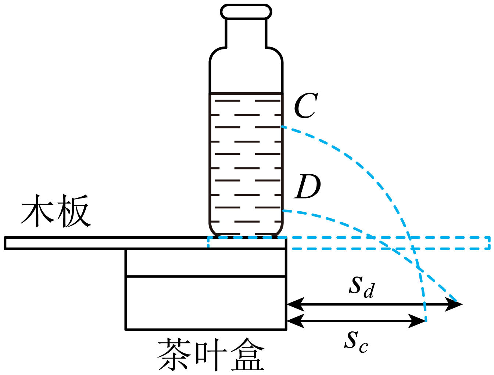
【解析】
【详解】（1）[1]已知

*h*c<*h*d

由*p=ρgh*可知液体压强的关系

*p*c<*p*d

（2）[2]其他条件不变，将木板向右移，最远的水流依然落在木板上，将木板的左侧和矿泉水瓶左侧对齐，木板静止，如图所示：

（3）[3]*s*c'和*s*d'分别为现在的最远距离，由上图可知

*s*c'>*s*d'

（4）[4]由上述实验可知，保持其他条件不变，仅将木板向右移，因此水流由C和D两孔流出的速度和方向不变，由于D点较低，因此水流到木板的时间较短，因为木板挡住了水流，导致从D孔流出的水流在水平方向运动距离减小，才出现

*s**c*'>*s**d*'

因此辉辉同学的结论是正确的。
**主题五：物理应用**
15. “海葵一号”是中国自主设计并建造的亚洲首艘浮式生产储卸型装置，“海葵一号”漂浮在大海上工作，从空中俯瞰像一朵绽放的葵花。思考乐傲傲同学查阅资料得知：“海葵一号”的质量是3.7×107kg，满载时排开海水的质量是1.0×108kg（g 取10N/kg， 海水的密度为 1.0×103kg/m3） 根据已知信息求：
（1）“海葵一号”满载时受到的浮力；
（2）“海葵一号”一次最多能储存石油的质量；
（3）当一架3×104N的直升机停放在“海葵一号”的水平停机坪上时，直升机与停机坪接触的面积是0.06m2，请帮助傲傲同学求出直升机对停机坪的压强。
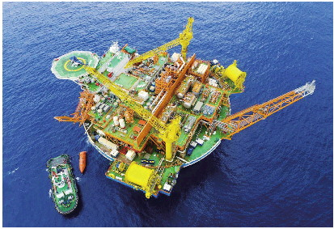
【答案】（1）1.0×109N；（2）6.3×107kg；（3）
【解析】
【详解】解：（1）“海葵一号”满载时受到的重力
“海葵一号”漂浮在海面上，根据二力平衡，“海葵一号”满载时受到的浮力
（2）“海葵一号”一次最多能储存石油的质量
（3）直升机在水平停机坪上，对停机坪的压力
直升机对停机坪的压强
答：（1）“海葵一号”满载时受到的浮力为1.0×109N；
（2）“海葵一号”一次最多能储存石油的质量为6.3×107kg；
（3）直升机对停机坪的压强为5×105Pa。
16. 图甲是某款鸡蛋孵化器，底部装有加热器。通电后，加热器对水加热，水向上方鸡蛋传递热量，提供孵化所需能量。孵化器简化电路如图乙，*R*1、*R*2都是发热电阻，孵化器相关参数如下表所示。
（1）孵化器在保温挡正常工作，通过*R*2的电流是多少？
（2）*R*2的阻值是多少？
（3）孵化器在加热挡正常工作5min消耗电能是多少？思考乐芳芳同学算出水在这段时间吸收热量2.16×104J，则孵化器对水加热的效率是多少？
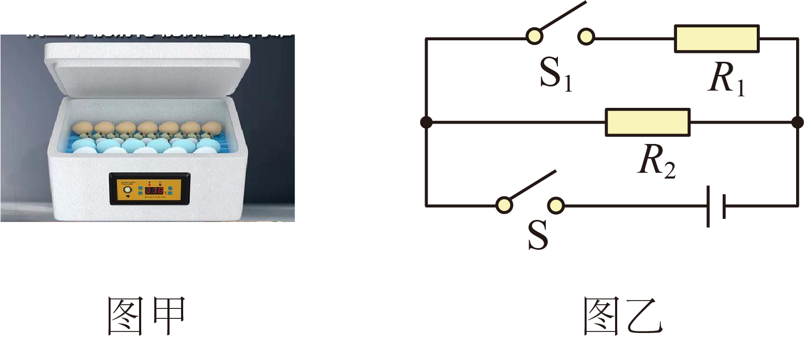
|  | 
  额定电压  
 | 
  220V  
 |
| --- | --- | --- |
| 
  额定功率  
 | 
  加热挡  
 | 
  80W  
 |
| 
  额定功率  
 | 
  保温挡  
 | 
  22W  
 |

【答案】（1）0.1A；（2）2200Ω；（3）2.4×104J，90%
【解析】
【详解】解：（1）孵化器在保温挡正常工作，通过*R*2电流

（2）由图乙可知，闭合开关S，只有*R*2的简单电路，电路的总电阻较大，由可知电路的总功率较小，处于保温挡，*R*2的阻值
（3）孵化器消耗的电能

*W*=*P*加*t*=80W×5×60s=2.4×104J

孵化器对水加热的效率
答：（1）孵化器在保温挡正常工作，通过*R*2的电流是0.1A；
（2）*R*2的阻值是2200Ω；
（3）孵化器在加热挡正常工作5min消耗电能是2.4×104J，思考乐芳芳同学算出水在这段时间吸收热量2.16×104J，则孵化器对水加热的效率是90%。
17. 胶囊胃镜机器人
“胶囊胃镜”全称为“遥控胶囊内镜系统”，被誉为“完美胃部检查的胶囊内镜机器人”。胶囊机器人另一个名字为磁控胶囊内镜，重为0.05N。它只需患者随水吞下，经过15 分钟左右便可完成胃部检查。典型的胶囊内窥镜包含几个主要组件：外壳，光学窗口，LED阵列，光学透镜，CMOS图像传感器，射频发射器，天线和电源。医生通过胶囊胃镜系统，可以实时精确操控的体外磁场来控制胶囊机器人在胃内的运动，改变胶囊姿态，按照需要的角度对病灶重点拍摄照片，从而达到全面观察胃黏膜并做出诊断的目的。在这个过程中，图像被5G无线传输至便携记录器，数据导出后，还可继续回放以提高诊断的准确率。
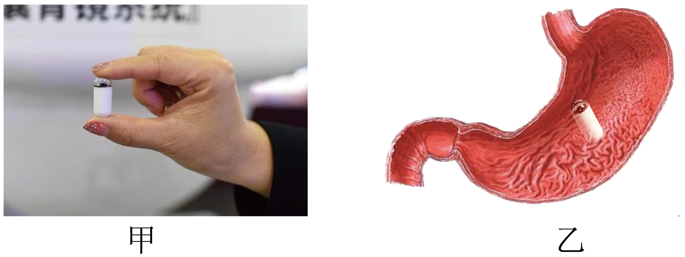
（1）思考乐小白同学口服一个胶囊机器人，这个胶囊机器人长约2.7_________（填单位）；
（2）如图所示，画出胶囊机器人在胃中所受重力示意图_________；
（3）胶囊机器人在胃中每下降1cm，重力做功*W*=_________；
（4）如果小白医生想扫描更大范围时，应操作机器人_________（靠近/远离）此区域；
（5）小白医生在远程无线操控机器人时，通过_________波来传递信号。
【答案】    ①. cm    ②.     ③. 5×10-4J    ④. 远离    ⑤. 电磁
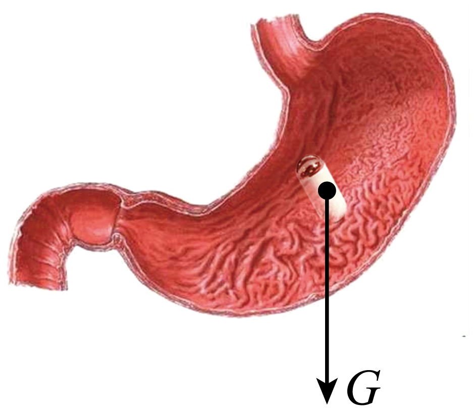
【解析】
【详解】（1）[1]由图甲可知，胶囊机器人长大约等于两个手指的宽度，约2.7cm。
（2）[2]从胶囊机器人的重心沿竖直向下画出重力的示意图，如图所示：

（3）[3]胶囊机器人在胃中每下降1cm，重力做功

*W*=*Gh*=0.05N×0.01m=5×10-4J

（4）[4]凸透镜成实像，物距变大，像变小，如果小白医生想扫描更大范围时，让像小一些，应操作机器人远离此区域。
（5）[5]电磁波可以传递信息，医生在远程无线操控机器人，通过电磁波来传递信号。
18. 已知某品牌混动飞行汽车电池容量20kW·h。当汽车功率为20kW时，以100km/h 的速度行驶； 当汽车功率为10kW时，以70km/h速度行驶。A 为车耗电与电池总容量之比。当A为80%时，车将采取“强制保电”措施关闭纯电模式，不再由纯电驱动。已知：*s*3：（*s*2+*s*4）=5：3
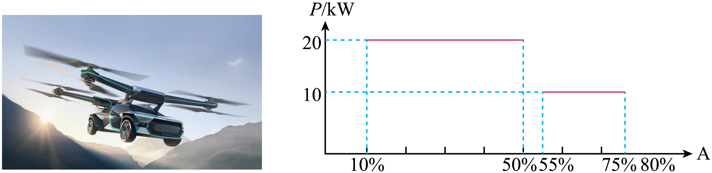
| 
  A  
 | 
  0~10%  
 | 
  10~50%  
 | 
  50~55%  
 | 
  55~75%  
 | 
  75~80%  
 |
| --- | --- | --- | --- | --- | --- |
| 
  *s*  
 | 
  16km  
 | 
  *s*1  
 | 
  *s*2  
 | 
  *s*3  
 | 
  *s*4  
 |

（1）亮亮发现：飞行汽车匀速上升时动能_________，机械能_________；（均填“增大”、“减小”或“不变”）
（2）当用电柱给飞行汽车充电时，蓄电池作为_________（选填“开关”、“用电器”或“电源”）。下面哪个图与电动机的原理相同？_________；
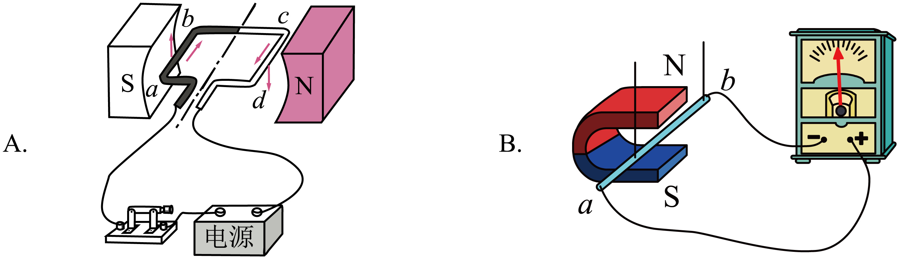
（3）帮助思考乐亮亮同学思考飞行汽车在现实生活中可以应用的场景_________；
（4）下图是内燃机的_________冲程；
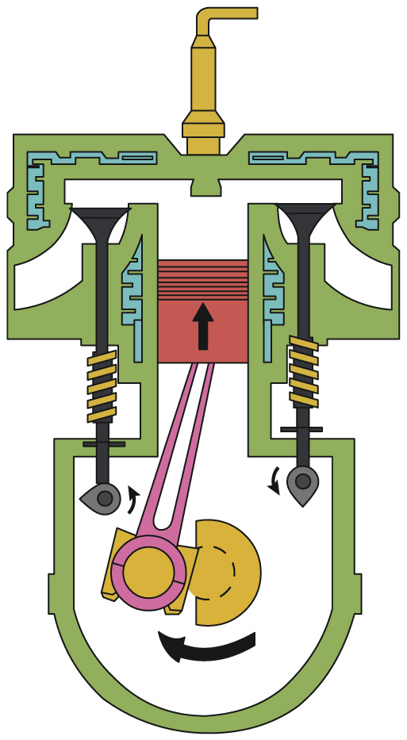
（5）若此次测试后充电，电费为1.1元/度，从测试结束的电量充电，充满电需要的电费为_________元；
（6）求帮助亮亮算出此次“纯电制动”时距离为_________ km。
【答案】    ①. 不变    ②. 增大    ③. 用电器    ④. A    ⑤. 上班    ⑥. 压缩    ⑦. 17.6    ⑧. 100.8
【解析】
【详解】（1）[1][2]亮亮发现：飞行汽车匀速上升时质量不变，速度不变，动能不变，高度升高，重力势能增大，机械能为动能与势能的总和，则机械能增大。
（2）[3]当用电柱给飞行汽车充电时，蓄电池消耗电能，作为用电器。
[4]电动机的工作原理为通电导体在磁场中受力的作用。
A．通电线圈的在磁场中受力的作用运动，故A符合题意；
B．闭合电路中的部分导线切割磁感线会产生感应电流，是电磁感应现象，故B不符合题意。
故选A。
（3）[5]飞行汽车适合较近距离的运输，可以用于上班或者上学。
（4）[6]下图冲程两气阀关闭，活塞向上移动，是内燃机的压缩冲程。

（5）[7]当A为80%时，车将采取“强制保电”措施关闭纯电模式，不再由纯电驱动，则从测试结束的电量充电，充满电需要的电费为
（6）[8]由图像得，A为10~50%时，功率为20kW，此过程中汽车消耗的电能为
由得，此过程汽车飞行的时间为
由得，此过程中汽车运动的路程
由图像得，A为55~75%时，功率为10kW，此过程中汽车消耗的电能为
由得，此过程汽车飞行的时间为
由得，此过程中汽车运动的路程
依题意得
则
此次“纯电制动”时距离为
