## **2025****年广东省深圳市中考物理试卷**

**主题一物理与农业生产**
民为国垒，谷为民命，粮食事关国运民生。粮食安全是国家安全的重要基础。如图是两台收割机正在收割小麦的场景。完成1～4题。
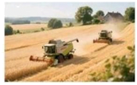
1. 德顺同学和紫琦同学分别驾驶甲、乙收割机以同一速度同一方向运动，判断甲收割机里面的德顺同学静止所选的参照物是（　　）
A. 车前小麦	B. 地面
C. 远处的树	D. 乙收割机的紫琦同学
【答案】D
【解析】
【详解】德顺同学和紫琦同学分别驾驶甲、乙收割机以同一速度同一方向运动，故甲、乙收割机相对静止，以紫琦同学所开的收割机为参照物，甲收割机里面的德顺同学相对于参照物没有位置的变化，是静止的，而以车前小麦、地面、远处的树为参照物时，德顺是运动的，故ABC不符合题意，D符合题意。
故选D。
2. 善于思考的索希同学和赢胜同学发现收割机上有很多花纹，收割机轮胎上设有凹凸不平花纹的目的是（　　）
A. 增大摩擦力	B. 减小摩擦力
C. 增大压力	D. 减小压力
【答案】A
【解析】
【详解】滑动摩擦力与接触面的压力、接触面的粗糙程度有关，收割机轮胎上设有凹凸不平花纹是在压力一定时，通过增大接触面的粗糙程度增大摩擦力的，故A符合题意，BCD不符合题意。
故选A。
3. 炎丽同学和悦悦同学发现小麦在进仓前需要烘干，炎丽同学提出思考：烘干使小麦中的水（　　）
A 液化	B. 熔化	C. 汽化	D. 升华

【答案】C
【解析】
【详解】烘干使小麦中的水变为水蒸气，是汽化现象，故C符合题意，ABD不符合题意。
 故选C。
4. 晓凤同学提出问题：收割机用四冲程柴油机提供动力，其中压缩冲程过程中，柴油机汽缸内气体（　　）
A. 质量变大	B. 内能减小	C. 体积变大	D. 温度升高
【答案】D
【解析】
【详解】四冲程柴油机中的压缩冲程，活塞向上移动，汽缸内气体体积变小，气体质量不变，压缩冲程将机械能转化为内能，内能变大，温度升高，故D符合题意，ABC不符合题意。
 故选D。
**主题二物理与传统文化**
春节申遗成功后，潮汕英歌舞登上春晚舞台，让世界看到中华文化“燃”到骨子里的生命力。如图所示，完成5～6题。
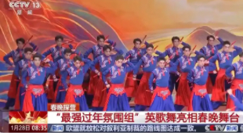
5. 志豪同学和铭泽同学听到“鼓声”和“英歌（潮汕英歌舞）鼓槌打声”的碰撞，分辨原因是（　　）
A. 音调	B. 音色	C. 频率	D. 响度
【答案】B
【解析】
【详解】音色是由发声体的材料、结构决定的，不同发声体发出声音的音色不同。“鼓声”和“潮汕英歌舞鼓槌打声”，其发声体不同，鼓是鼓面振动发声，英歌舞鼓槌是鼓槌敲击物体发声，材料和结构等不同，所以声音的音色不同，人们可以根据音色来分辨不同的声音，故B符合题意，ACD不符合题意。
故选B。
6. 演员对着镜子画脸谱，镜子里面呈现出了演员的像，大圣同学和吴斌同学对此现象解释正确的是（　　）
A. 光沿直线传播	B. 光的反射
C. 光的折射	D. 光的色散
【答案】B
【解析】
【详解】镜子中的像是平面镜所成的像，其原理是光的反射。物体射到平面镜的光线，被平面镜反射，反射光线进入人的眼睛，视觉会逆着反射光线反向延长线的方向看，反射光线的反向延长线的交点就是物体在平面镜中的像点。所以演员对着镜子画脸谱，镜子里呈现出演员的像，是光的反射现象，故B正确，ACD错误。
故选B。
**主题三物理与科技创新**
7.
（1）AI机器人逐渐进入我们的生活，如图为月月同学购买的某款机器人站立在水平地面上，在图中画出月月同学买的机器人受到的重力的示意图。（点*O*为机器人的重心）
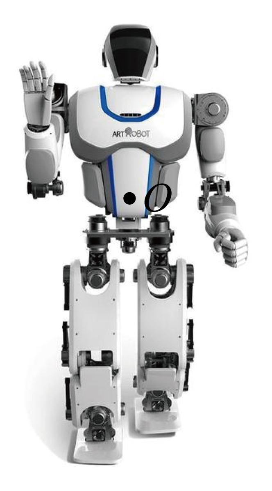
（2）金辉同学若通过三孔插座给机器人充电，插座由单独的开关控制。请在图中用笔画线表示导线将三孔摇座和开关连接在家庭电路中。
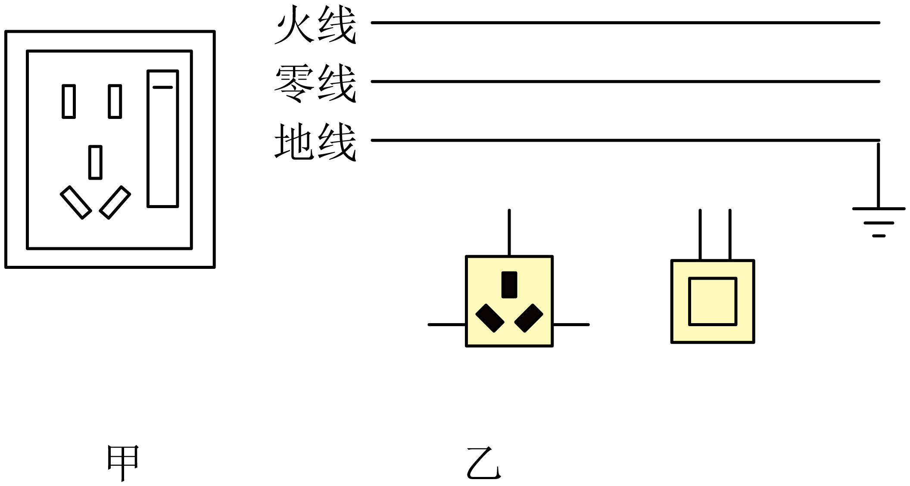
【答案】（1）    （2）
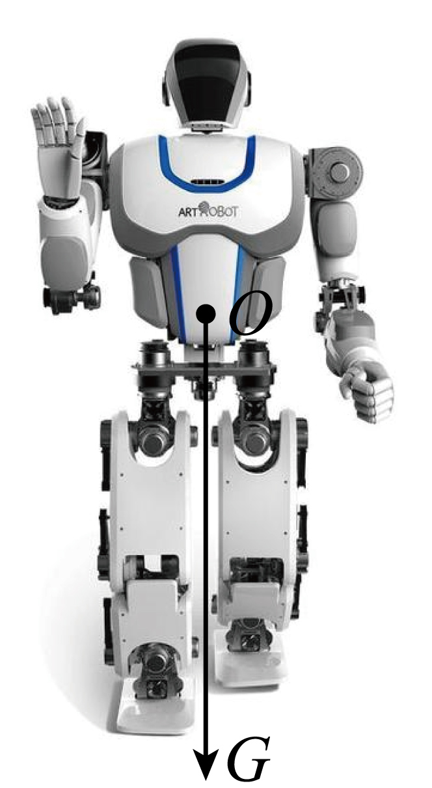
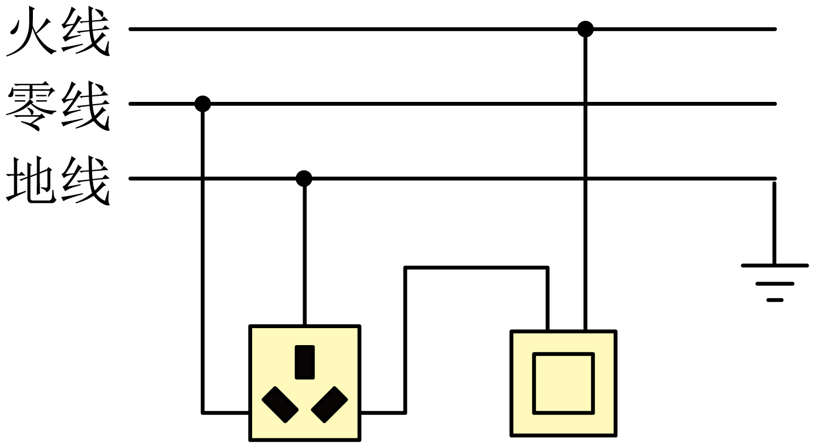
【解析】
【小问1详解】
重力的方向竖直向下，作用点在*O*点，故从图中*O*点作一条竖直向下的线段，在线段的末端标上箭头，表示重力的方向，并在旁边标注*G*，如图所示；
【小问2详解】

家庭电路中，三孔插座的接法是左孔接零线，右孔接火线，上孔接地线；开关的接法是一端接火线，一端接用电器；要求插座由单独的开关控制，故接法为：三孔插座：左孔接零线，右孔接开关的一端，上空接地线；开关：左端接插座的右孔，右端接火线；如图所示：

8. 5月29日，我国探月工程天宫一号顺利升空，琴琴和小林同学一起观看了这一过程，琴琴同学提出：火箭加速上升过程中，燃料燃烧放出热量_______（全部/部分）转化为机械能，天宫一号进入轨道后，_____（有/无）惯性。
【答案】    ①. 部分    ②. 有
【解析】
【详解】[1]火箭加速上升过程中，受到大气的阻力，燃料燃烧放出热量会有一部分转化为火箭表面的内能，会有一部分转化为机械能。
[2]一切物体在任何情况下都有惯性，天宫一号进入轨道后有惯性。
9. 如图所示，第九届亚洲冬奥会，擅于思考的欣航同学发现用阳光点燃火炬使用的是________（凸透镜/凹透镜），太阳是__________（可再生能源/不可再生能源），凸透镜的直径是60_______（填写单位）。
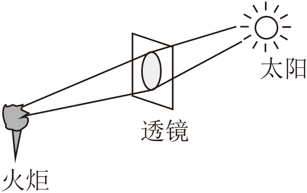
【答案】    ①. 凸透镜    ②. 可再生能源    ③. cm
【解析】
【详解】[1]凸透镜对光线有会聚作用，能将平行的太阳光会聚到一点（焦点），使该点温度升高，达到可燃物的着火点，从而点燃火炬。而凹透镜对光线有发散作用，无法实现会聚阳光点火的效果。因此，此处应填 凸透镜。
[2]可再生能源是指自然界中可以不断再生、永续利用的能源，太阳的能量来源于其内部的核聚变反应，只要太阳存在，就会持续释放能量，属于可再生能源。因此，此处应填 可再生能源。
[3]结合实际情况，用于点燃火炬的凸透镜需要足够大才能有效会聚足够的阳光，60 毫米（mm）过小，60 米（m）过大，60 厘米（cm）是合理的尺寸。因此，此处应填 cm。
10. 全磁悬浮“人工心脏”已研发成功，其核心部件是个带有叶轮的泵，通电后叶轮可高速旋转，带动血液流动。图乙是叶轮悬浮原理简化图，元元同学思考后发现：螺线管通电后，周围存在_______，叶轮受斥力悬浮，叶轮下端的磁极是_____极。
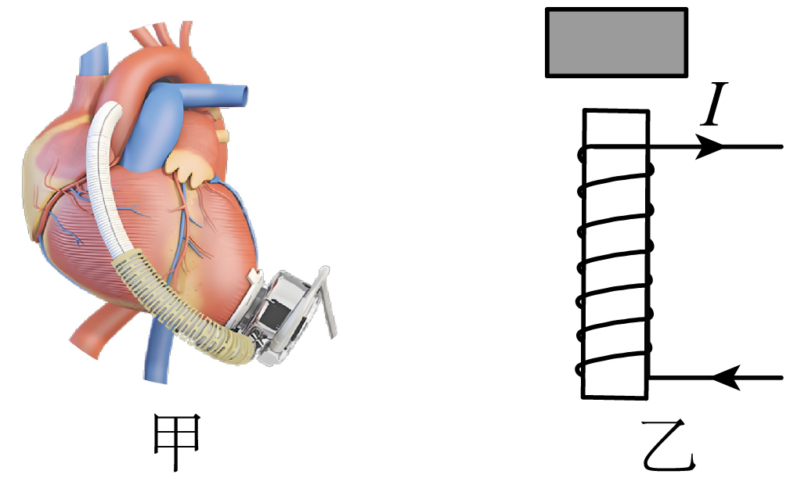
【答案】    ①. 磁场    ②. N
【解析】
【详解】[1]由奥斯特实验的结论可知，通电导体周围存在磁场，所以螺线管通电后，周围存在磁场。
[2]由图乙可知，电流从右侧螺线管的下端流入、上端流出，根据安培定则可知，螺线管的上端为N极，叶轮受斥力悬浮，由同名磁极相互排斥可知，叶轮下端的磁极是N极。
**主题四物理与工程实践**
11. 枧枧同学用如图所示的装置来探究杠杆的平衡条件。（注：实验中所用钩码的规格相同）
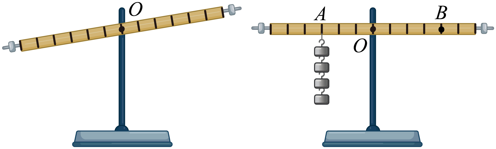
（1）实验前，枧枧同学将组装好的杠杆放在水平桌面上，她发现杠杆静止时情况如图所示，此时枧枧同学判断杠杆处于_______（填“平衡”或“非平衡”）状态；
（2）欣月同学指出：在探究实验过程中，必须把杠杆调到水平位置平衡，这样做的目的是便于测量_______；

（3）龙龙同学在杠杆两侧挂上钩码，设右侧钩码对杠杆施加的力为动力*F*1，左侧钩码对杠杆施加的力为阻力*F*2，测出杠杆平衡时的动力臂*l*1和阻力臂*l*2；多次换用不同数量的钩码，并改变钩码在杠杆上的位置，得到实验数据如表：
| 
  实验次数  
 | 
  动力*F*1/N  
 | 
  动力臂*l*1/cm  
 | 
  阻力*F*2/N  
 | 
  阻力臂*l*2/cm  
 |
| --- | --- | --- | --- | --- |
| 
  1  
 | 
  0.5  
 | 
  20.0  
 | 
  1.0  
 | 
  10.0  
 |
| 
  2  
 | 
  1.0  
 | 
  20.0  
 | 
  1.0  
 | 
  20.0  
 |
| 
  3  
 | 
  15  
  | 
  10.0  
 | 
  1.0  
 | 
  15.0  
 |
| 
  4  
 | 
  2.0  
 | 
  15.0  
 | 
  0.5  
 | 
  20.0  
 |

龙龙同学通过分析表格中的数据，可以得到杠杆的平衡条件。
龙龙同学说：生活中用钢丝钳剪钢丝，与实验_____中原理相同；
（4）一鸣同学认为，仅用人眼来确定杠杆是否水平，这样做不够科学。请任选实验器材，运用物理知识，写出判断杠杆水平的实验过程和方法；____________________
（5）《墨经》中记载了杠杆的平衡条件，如图，已知*OA*∶*OB*＝2∶9，秤砣质量为100g，则重物所受的重力为________N。（*g*取10N/kg）
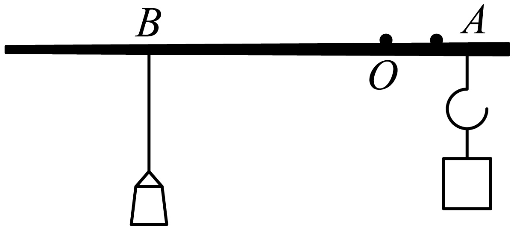
【答案】（1）平衡    （2）力臂
（3）1    （4）见解析
（5）4.5
【解析】
【小问1详解】
根据杠杆平衡状态的定义，杠杆处于静止状态或匀速转动状态时，就处于平衡状态。实验前杠杆虽然倾斜，但处于静止状态，所以此时杠杆处于平衡状态。
【小问2详解】
在探究杠杆平衡条件实验中，把杠杆调到水平位置平衡，此时力臂与杠杆重合，可以直接从杠杆上读出力臂的大小，目的是便于测量力臂。
【小问3详解】
钢丝钳剪钢丝时，动力臂大于阻力臂，是省力杠杆。分析表格数据，实验1中的动力臂大于阻力臂，为省力杠杆，与钢丝钳原理相同。
【小问4详解】
可选用重垂线来判断杠杆是否水平。实验过程和方法为：将重垂线固定在杠杆的支点上方，使重垂线自然下垂。观察杠杆，若杠杆与重垂线垂直，则杠杆处于水平位置；若不垂直，则杠杆不水平。
【小问5详解】
秤砣重力*G*砣=*m*砣*g*=0.1kg×10N/kg=1N
根据杠杆平衡条件得到*G*砣×*OB*=*G*×*OA*
物体的重力
12. 小虞同学利用如图所示装置探究“电流与电压的关系”。
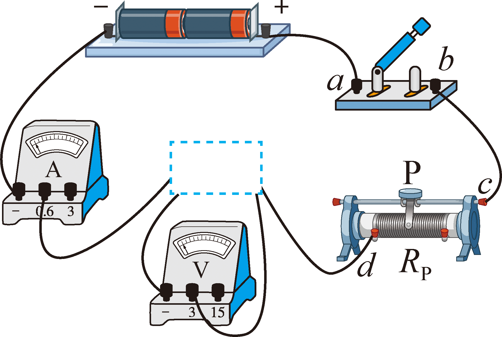
（1）在如图所示的虚线框内，小虞同学应填入_________（填一种用电器）。
（2）在开关闭合前，俊俊同学指出应将滑动变阻器的滑片P移到最_____（填“左”或“右”）端。
（3）在闭合开关后，志诚同学发现电流表指针无偏转，电压表指针有较大偏转，若电路中只有一处故障，则可能是___________。
| 
  实验次数  
 | 
  1  
 | 
  2  
 | 
  3  
 | 
  4  
 |
| --- | --- | --- | --- | --- |
| 
  电压*U*/V  
 | 
  1  
 | 
  1.6  
 | 
  2.4  
 | 
  2.8  
 |
| 
  电流*I*/A  
 | 
  0.2  
 | 
  0.32  
 | 
  0.48  
 | 
  0.56  
 |

（4）由上面表格数据可知，电压与电流的比值_______，小虞由此得出结论，“在电阻一定时，通过导体的电流与导体两端的电压成正比”。
（5）分析如图坐标图，小虞同学发现导致甲组数据与乙和丙不同的原因是________________。
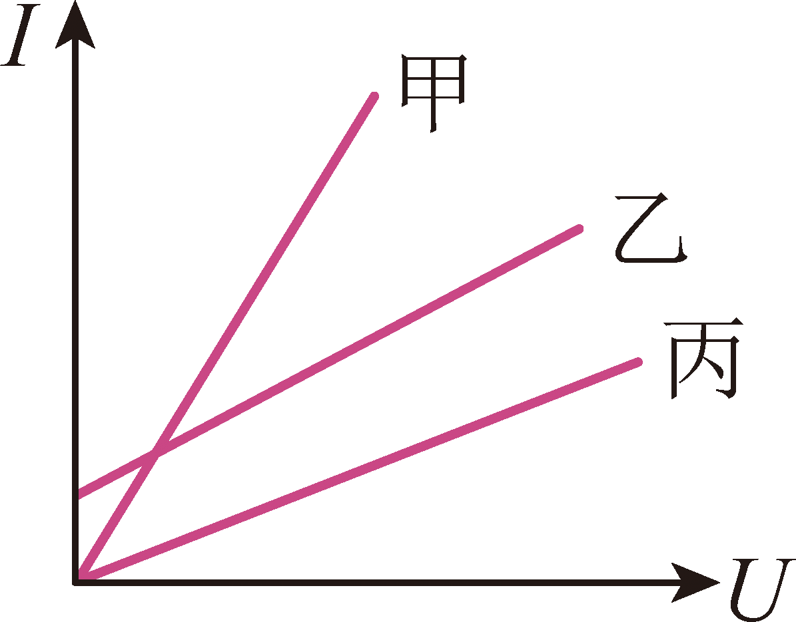
【答案】（1）定值电阻
（2）右    （3）定值电阻断路
（4）不变    （5）选用的定值电阻不同
【解析】
【小问1详解】
探究电流与电压的关系时，应控制电阻不变，通过改变电压来测量电流，所以电路中需要接入定值电阻。
【小问2详解】
闭合开关前，为保护电路，应将滑动变阻器的滑片移到阻值最大处。由图可知，滑片在最右端时，滑动变阻器接入电路的电阻丝最长，阻值最大。
【小问3详解】
电流表无示数，说明电路中有断路故障；电压表指针有较大偏转，说明电压表与电源连通，所以故障可能是与电压表并联的定值电阻断路。
【小问4详解】
根据表格数据，分别计算电压与电流的比值为：
可知电压与电流的比值不变。
【小问5详解】
导致甲组数据与乙和丙不同的原因是选用的定值电阻阻值不同。根据欧姆定律可知，当定值电阻阻值不同时，在相同电压下，通过导体的电流不同，所以会导致*I*﹣*U*图象不同。
**主题五物理与生活运用**
13. 某简易植物工厂，为了给植物提供光和热，君君、辉辉、阳阳共同设计了如图所示的电路图。小灯泡L的规格是“12V，6W”。电源电压为12V，*R*为加热电阻，阻值大小为6Ω，求：
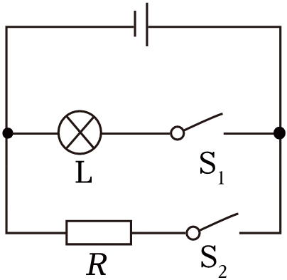
（1）请帮助君君同学算出只闭合S2通过*R*的电流；
（2）请帮助辉辉同学算出只闭合S1灯泡L的电阻；
（3）阳阳同学闭合S1、S2后，通电10min，求*R*产生的热量和电路消耗的总电能。
【答案】（1）2A    （2）24Ω
（3）1.44×104J；1.8×104J
【解析】
【小问1详解】
只闭合S2，通过*R*的电流
【小问2详解】
只闭合S1，灯泡L的电阻
【小问3详解】
阳阳同学闭合S1、S2后，通电10min，*R*产生的热量
灯泡支路的电流
干路中的电流*I*＝*I*L+*I*R＝0.5A+2A＝2.5A
电路消耗的总电能*W*＝*UIt*＝12V×2.5A×10×60s＝1.8×104J
14. 如图是深圳号在海上航行，田田同学乘坐了这艘船出海游玩。田田发现这艘船最大吃水高度是9米，最大排水量是70000吨，船上一汽车用钢打造，钢的体积0.1立方米。（已知：钢的密度是7.9×103kg/m3，海水密度1×103kg/m3），求：

（1）钢质量；

（2）求轮船满载时所受的浮力；
（3）船底面积是1×103m2，求轮船底部受到的压力。
【答案】（1）790kg
（2）7×108N    （3）9×107N
【解析】
【小问1详解】
钢的质量*m*钢=*ρ*钢*V*钢=7.9×103kg/m3×0.1m3=790kg
【小问2详解】
根据阿基米德原理可得，轮船满载时所受的浮力*F*浮=*G*排=*m*排*g*=70000×103kg×10N/kg=7×108N
【小问3详解】
轮船底部受到的海水压强*p**=**ρgh*=1×103kg/m3×10N/kg×9m=9×104Pa
轮船底部受到的压力*F**=**pS**=*9×104Pa×1×103m2=9×107N
15. 蓄冷剂是食品运输和保鲜过程中的重要降温试剂。现有A、B两种蓄冷剂，财财同学和明海同学为了探究其蓄冷效果，进行了如下的实验探究：财财首先将质量均为100g的两种蓄冷剂分别装入完全相同的冰袋中，标明A、B，放入冰箱中冷冻为温度相同的固体。在容器1、2中分别加入质量为500g且温度相同的水，将冰袋从冰箱中拿出放入水中，并用隔热材料密封。明海同学通过温度传感器每隔一定时间测量蓄冷剂及水的温度，如图是明海记录的A、B两蓄冷剂及容器①、②中水的温度随时间的变化曲线。
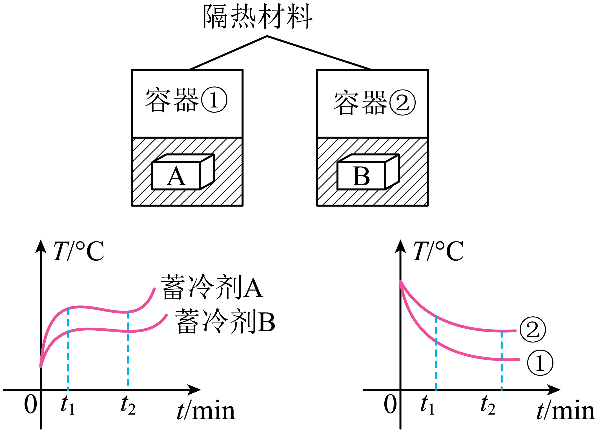
（1）露露同学发现：蓄冷剂熔化前温度在升高，其分子热运动速度变_____；
（2）0∼*t*1，水和蓄冷剂之间发生热传递，宇婷同学说其热传递方向为___________；
（3）0∼*t*1，蓄冷剂_____吸热更快；
（4）*t*1∼*t*2，容器①中水的温度降低10℃，若热量全部被冰袋吸收，经过计算，汉欢同学发现每克蓄冷剂A吸收的热量为_________；
（5）汉欢同学在深圳市内配送蛋糕时，选择蓄冷剂_____更好，理由是___________________。
【答案】（1）大    （2）从水到蓄冷剂
（3）A    （4）210J
（5）    ①. B    ②. 见解析
【解析】
【小问1详解】
分子的热运动与温度有关，温度越高，分子热运动越剧烈，分子热运动速度越快。蓄冷剂熔化前温度在升高，所以其分子热运动速度变快。
【小问2详解】
热传递的条件是存在温度差，热量总是从温度高的物体传递到温度低的物体。由图像可知，0∼*t*1​，水的温度高于蓄冷剂的温度，所以热传递方向为水向蓄冷剂传递热量。
【小问3详解】
根据题图可知：0∼*t*1，容器①中水温下降更快，容器中水的质量和初温均相同，则在相同的时间内容器①中水放热更多，而水所放热被蓄冷剂吸收，说明蓄冷剂A吸热更快。
【小问4详解】
水的温度降低10℃，水放出的热量为
若热量全部被冰袋吸收，每克蓄冷剂A吸收的热量为
【小问5详解】
[1][2]由图像可知，在相同时间内，蓄冷剂B使水的温度降低得慢，说明蓄冷剂B释放冷量的速度较慢，能更长时间地保持低温，所以在深圳市内配送蛋糕时，选择蓄冷剂B更好，理由是蓄冷剂B能更长时间保持低温，更好地保证蛋糕的品质。
16. 深圳大力推动无人机事业发展，已经将无人机用于运送急救AED装置。
苏华同学发现无人机搭配北斗卫星导航，有四个旋翼，每个旋翼搭配独立的电动机驱动，相邻旋翼之间旋转方向相反；无人机空载总质量（含电池，不含AED）为9kg，电池能量密度为200W·h/kg，（质量能量密度是指满电时电池能量与电池质量之比）。
俊宇同学购买了一台无人机，无人机满电开始测试；飞行分为前往过程和返回过程，前往和返回过程都分为竖直上升过程，水平匀速运动过程，竖直下降过程，且消耗能量相同；无人机前往过程中竖直上升和竖直下降过程消耗的总能量为3.2×104J，水平匀速移动过程飞行每秒消耗的能量为2500J，总用时160s，无人机用于驱动飞行的电能转化效率为60%，无人机竖直下降后电池剩余总容量的50%，测试结束。
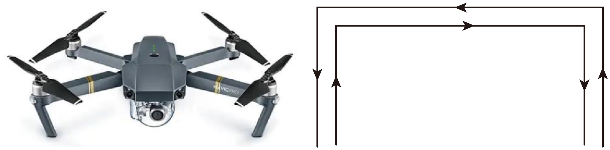
（1）璐璐同学指出：无人机的信号传输是通过________传递；
（2）粤鹏同学说ADE电击时为什么不能碰人，因为人体________；
（3）当俊宇购买的无人机空载时匀速向下降落2m，重力做功________J；
（4）无人机螺旋桨飞行时向下，无人机向上飞，善于观察的苏华同学发现通过桨叶旋转空气提供升力，这体现了力的作用是 ________ ；
（5）顺顺同学经过观察，指出无人机各电动机之间是 _____ 联的；
（6）满电时，无人机的电池质量占空载质量的百分比 __________ （保留一位小数）；
（7）为了更快运送急救AED装置，请你帮助璐璐同学对无人机设计提出一条建议？_____________ ；如何去更改螺旋桨的旋转方向？_________________ 。
【答案】（1）电磁波    （2）是导体
（3）180    （4）相互的
（5）并    （6）22.2%
（7）    ①. 增大电动机的功率    ②. 改变通过电动机的电流方向
【解析】
【小问1详解】
无人机的信号传输是通过电磁波传递的，因为电磁波可以在空气中传播，且传播速度快，能实现远距离的信息传输。
【小问2详解】
人体是导体，容易导电；当AED电击时，电流会通过人体，可能会对人体造成伤害。
【小问3详解】
无人机空载总质量（含电池，不含AED）为9kg，空载时匀速向下降落2m，重力做功*W*＝*Gh*＝*mgh*＝9kg×10N/kg×2m＝180J
【小问4详解】
无人机螺旋桨飞行时向下，无人机向上飞，这是因为桨叶旋转时对空气施加向下的力，同时空气对桨叶施加向上的反作用力，使无人机向上飞，这体现了力的作用是相互的。
【小问5详解】
因为每个旋翼搭配独立的电动机驱动，且相邻旋翼之间旋转方向相反，各电动机之间互不影响，所以无人机各电动机之间是并联的。
小问6详解】

无人机前往过程中竖直上升和竖直下降过程消耗的总能量为3.2×104J，水平匀速移动过程飞行每秒消耗的能量为2500J，总用时160s，无人机用于驱动飞行的电能转化效率为60%，则飞行消耗的电能是
此时此过程消耗了1-50%＝50%的电能，说明原来储存了400W·h电能；故电池的质量
故无人机的电池质量占空载质量的百分比为
【小问7详解】
[1]为了更快运送急救AED装置，需要缩短做功的时间，而做功多少不变，根据功率可知，增大电动机的功率可缩短运送时间，使急救AED装置能更快运送到指定地点。
[2]电动机的转动方向与电流方向有关，改变电流方向，电动机的转动方向就会改变。因此可以通过改变电动机的电流方向来更改螺旋桨的旋转方向。
