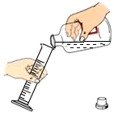
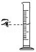
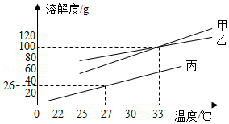
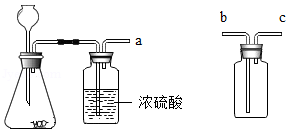
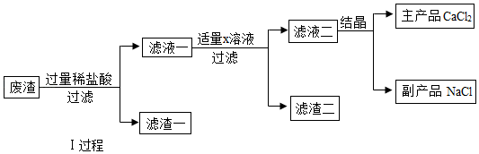

## **2021年广东省深圳市中考化学试卷**
**一、单项选择题Ⅰ（本大题共8小题，每小题1.5分，共12分，在每小题列出的四个选项中，只有一个选项最符合题意）**
1．（1.5分）化学在我们的日常生活中随处可见，下列说法错误的是（　　）
A．天然气燃烧是物理变化
B．使用可降解塑料可以减少“白色污染”
C．棉花里的纤维素是有机物
D．用洗洁精清洗餐具上的油污会出现乳化现象
2．（1.5分）下列化学用语正确的是（　　）
A．汞元素hg
B．五氧化二磷P5O2
C．钠离子Na﹣
D．镁在氧气中燃烧的方程式2Mg+O22MgO

3．（1.5分）量取2mL NaOH溶液，下列操作错误的是（　　）
A．倾倒液体	B．量取液体

C．滴加液体	D．加热液体

4．（1.5分）硅和锗都是良好的半导体材料。已知锗原子序数为32，相对原子质量为72.59。以下说法错误的是（　　）

A．硅为非金属
B．硅的相对原子质量为28.09
C．①为72.59
D．锗原子是由原子核和核外电子构成的
5．（1.5分）水是生活中最常见与最重要的物质，下列说法正确的是（　　）
A．人体的必须：水是人体中重要的营养剂
B．生活的必须：由汽油引起的大火用水来扑灭
C．实验的必须：溶液的溶剂一定是水
D．实验的认识：电解水说明了水是由H2与O2组成的
6．（1.5分）如图所示，下列说法错误的（　　）

A．反应Ⅰ前后原子数目不变
B．反应中甲与乙的分子个数比为1：1
C．反应Ⅱ丙中N的化合价﹣3价
D．想要得到更多H2，应减少反应Ⅱ的发生
7．（1.5分）如图所示实验，下列说法错误的是（　　）

A．由甲图可知，O2占空气质量的21%
B．由乙图可知，磷燃烧需要和空气接触
C．薄铜片上的白磷燃烧，冒出白烟
D．点燃红磷后，要迅速放入集气瓶中
8．（1.5分）抗坏血酸是一种食品保鲜剂，下列有关说法正确的是（　　）

A．抗坏血酸和脱氢抗坏血酸都是氧化物
B．抗坏血酸由6个C原子、8个H原子、6个O原子构成
C．脱氢抗坏血酸中C、H、O元素质量比为1：1：1
D．物质中，C元素质量分数：抗坏血酸＜脱氧抗坏血酸
**二、单项选择题Ⅱ(本大题共4小题，每小题2分，共8分，在每小题列出的四个选项中，只有一个选项最符合题意。)**
9．（2分）以下实验方案错误的是（　　）
| 
  选项  
 | 
  实验目的  
 | 
  实验方案  
 |
| --- | --- | --- |
| 
  A  
 | 
  除去红墨水中的色素  
 | 
  过滤  
 |
| 
  B  
 | 
  区分O2和空气  
 | 
  将燃着的木条伸入集气瓶  
 |
| 
  C  
 | 
  区分真黄金与假黄金  
 | 
  放在空气中灼烧  
 |
| 
  D  
 | 
  比较Ag与Cu的活泼性  
 | 
  把洁净铜丝放入AgNO3中  
 |

A．A	B．B	C．C	D．D
10．（2分）有关如图溶解度曲线，下列说法正确的是（　　）

A．甲、乙、丙三种物质的溶解度关系为S甲＞S乙＞S丙
B．乙物质的溶解度随温度变化最大
C．27℃时，往26g丙里加 100g水，形成不饱和溶液
D．33℃时，甲、乙两种物质溶解度相等
11．（2分）小明在探究稀硫酸性质时，下列说法正确的是（　　）
A．稀H2SO4与紫色石蕊试液反应后，溶液变蓝
B．若能与X反应制取H2，则X是Cu
C．和金属氧化物反应，有盐和水生成
D．若与Y发生中和反应，则Y一定是NaOH
12．（2分）下列说法错误的是（　　）

A．铁钉是由铁合金制成的
B．根据甲图，铁钉生锈过程中O2体积不变
C．根据甲图，铁钉在潮湿环境更容易生锈
D．根据乙图，铁钉生锈过程中温度升高
**三、非选择题（本大题共4小题，共30分)。**
13．（5分）如图实验装置，完成实验。

（1）X的名称 <u>　    　</u>；
（2）用固体混合物制取O2，选用 <u>　    　</u>装置（选填“A”“B”“C”）；
（3）用B装置制O2的化学方程式 <u>　    　</u>；
用如图装置制取干燥CO2气体。

（4）制取干燥CO2气体，导管口a接 <u>　    　</u>（选填“b”或“c”）；
（5）写出实验室制取CO2的化学方程式 <u>　    　</u>。
14．（8分）用如图所示装置进行实验：
（1）丙装置作用 <u>　                　</u>；
（2）如乙中澄清石灰水变浑浊，甲中发生反应的化学方程式为 <u>　                　</u>；
（3）探究反应后甲中黑色固体成分。
已知：Fe3O4不与CuSO4反应。
猜想一：黑色固体成分为Fe；
猜想二：黑色固体成分为Fe3O4；
猜想三：<u>　                　</u>。
步骤一：
| 
  加热/s  
 | 
  通入CO/s  
 | 
  样品  
 |
| --- | --- | --- |
| 
  90  
 | 
  30  
 | 
  A  
 |
| 
  90  
 | 
  90  
 | 
  B  
 |
| 
  180  
 | 
  90  
 | 
  C  
 |

步骤二：向样品A、B、C中分别加入足量 CuSO4溶液。
| 
  样品  
 | 
  现象  
 | 
  结论  
 |
| --- | --- | --- |
| 
  A  
 | 
  无明显现象  
 | 
  <u>　                　</u>正确  
 |
| 
  B  
 | 
  有红色固体析出，有少量黑色固体剩余  
 | 
  <u>　                　</u>正确  
 |
| 
  C  
 | 
  <u>　                　</u>，无黑色固体生成  
 | 
  <u>　                　</u>正确  
 |

若通入CO时间为90s，要得到纯铁粉，则加热时间 <u>　                　</u>s。

15．（8分）某科学兴趣小组，用废渣（主要为CaCO3，还含有C、Fe2O3、MgO等少量杂质）去制作CaCl2，反应过程如图所示。

（1）Ⅰ过程中加过量稀盐酸溶液的目的是 <u>　                　</u>。
（2）Ⅰ过程中MgO发生反应的化学反应方程式 <u>　                　</u>，此反应为 <u>　                　</u>反应（填基本反应类型）。
（3）滤渣①的成分为 <u>　                　</u>（填化学式）。
（4）X溶液为 <u>　                　</u>（填化学式）。
（5）NaCl在生活中的用处：<u>　                　</u>（写一例）。
（6）已知CaCl2与焦炭、BaSO4在高温下生成BaCl2和CO和CaS，写出该反应的方程式：<u>　                　</u>。
16．（9分）质量相等的两份Zn粉，分别与质量相同、质量分数不同的稀盐酸反应。
（1）配制盐酸时有白雾，说明盐酸具有 <u>　   　</u>性。
（2）两种稀盐酸反应生成氢气的图象如图所示，两种稀盐酸的浓度比较：Ⅰ<u>　   　</u>Ⅱ（填“＞”“＜”“＝”）。
（3）氢气的体积所对应的质量如表：
| 
  H2（V/L）  
 | 
  1.11  
 | 
  1.67  
 | 
  2.22  
 | 
  2.78  
 |
| --- | --- | --- | --- | --- |
| 
  H2（m/g）  
 | 
  0.10  
 | 
  0.15  
 | 
  0.20  
 | 
  0.25  
 |

①恰好反应完全，产生H2的质量为 <u>　   　</u>g。
②完全反应时，加入稀盐酸Ⅱ的质量为100g，求稀盐酸Ⅱ中溶质的质量分数。

