## **2021****年广东省深圳市中考化学试卷**
**一、单项选择题Ⅰ（本大题共****8****小题，每小题****1.5****分，共****12****分，在每小题列出的四个选项中，只有一个选项最符合题意）**
1．（1.5分）化学在我们的日常生活中随处可见，下列说法错误的是（　　）
A．天然气燃烧是物理变化
B．使用可降解塑料可以减少“白色污染”
C．棉花里的纤维素是有机物
D．用洗洁精清洗餐具上的油污会出现乳化现象
2．（1.5分）下列化学用语正确的是（　　）
A．汞元素hg
B．五氧化二磷P5O2
C．钠离子Na﹣
D．镁在氧气中燃烧的方程式2Mg+O22MgO

3．（1.5分）量取2mL NaOH溶液，下列操作错误的是（　　）
A．倾倒液体	B．量取液体

C．滴加液体	D．加热液体

4．（1.5分）硅和锗都是良好的半导体材料。已知锗原子序数为32，相对原子质量为72.59。以下说法错误的是（　　）
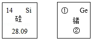
A．硅为非金属
B．硅的相对原子质量为28.09
C．①为72.59
D．锗原子是由原子核和核外电子构成的
5．（1.5分）水是生活中最常见与最重要的物质，下列说法正确的是（　　）
A．人体的必须：水是人体中重要的营养剂
B．生活的必须：由汽油引起的大火用水来扑灭
C．实验的必须：溶液的溶剂一定是水
D．实验的认识：电解水说明了水是由H2与O2组成的
6．（1.5分）如图所示，下列说法错误的（　　）

A．反应Ⅰ前后原子数目不变
B．反应中甲与乙的分子个数比为1：1
C．反应Ⅱ丙中N的化合价﹣3价
D．想要得到更多H2，应减少反应Ⅱ的发生
7．（1.5分）如图所示实验，下列说法错误的是（　　）
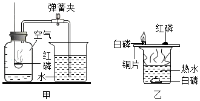
A．由甲图可知，O2占空气质量的21%
B．由乙图可知，磷燃烧需要和空气接触
C．薄铜片上的白磷燃烧，冒出白烟
D．点燃红磷后，要迅速放入集气瓶中
8．（1.5分）抗坏血酸是一种食品保鲜剂，下列有关说法正确的是（　　）
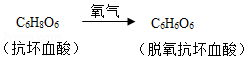
A．抗坏血酸和脱氢抗坏血酸都是氧化物
B．抗坏血酸由6个C原子、8个H原子、6个O原子构成
C．脱氢抗坏血酸中C、H、O元素质量比为1：1：1
D．物质中，C元素质量分数：抗坏血酸＜脱氧抗坏血酸
**二、单项选择题Ⅱ****(****本大题共****4****小题，每小题****2****分，共****8****分，在每小题列出的四个选项中，只有一个选项最符合题意。****)**
9．（2分）以下实验方案错误的是（　　）
| 
  选项  
 | 
  实验目的  
 | 
  实验方案  
 |
| --- | --- | --- |
| 
  A  
 | 
  除去红墨水中的色素  
 | 
  过滤  
 |
| 
  B  
 | 
  区分O2和空气  
 | 
  将燃着的木条伸入集气瓶  
 |
| 
  C  
 | 
  区分真黄金与假黄金  
 | 
  放在空气中灼烧  
 |
| 
  D  
 | 
  比较Ag与Cu的活泼性  
 | 
  把洁净铜丝放入AgNO3中  
 |

A．A	B．B	C．C	D．D
10．（2分）有关如图溶解度曲线，下列说法正确的是（　　）

A．甲、乙、丙三种物质的溶解度关系为S甲＞S乙＞S丙
B．乙物质的溶解度随温度变化最大
C．27℃时，往26g丙里加 100g水，形成不饱和溶液
D．33℃时，甲、乙两种物质溶解度相等
11．（2分）小明在探究稀硫酸性质时，下列说法正确的是（　　）
A．稀H2SO4与紫色石蕊试液反应后，溶液变蓝
B．若能与X反应制取H2，则X是Cu
C．和金属氧化物反应，有盐和水生成
D．若与Y发生中和反应，则Y一定是NaOH
12．（2分）下列说法错误的是（　　）
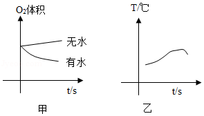
A．铁钉是由铁合金制成的
B．根据甲图，铁钉生锈过程中O2体积不变
C．根据甲图，铁钉在潮湿环境更容易生锈
D．根据乙图，铁钉生锈过程中温度升高
**三、非选择题（本大题共****4****小题，共****30****分****)****。**
13．（5分）如图实验装置，完成实验。
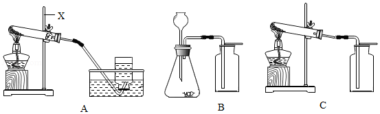
（1）X的名称 <u>　</u><u>    </u><u>　</u>；
（2）用固体混合物制取O2，选用 <u>　</u><u>    </u><u>　</u>装置（选填“A”“B”“C”）；
（3）用B装置制O2的化学方程式 <u>　</u><u>    </u><u>　</u>；
用如图装置制取干燥CO2气体。

（4）制取干燥CO2气体，导管口a接 <u>　</u><u>    </u><u>　</u>（选填“b”或“c”）；
（5）写出实验室制取CO2的化学方程式 <u>　</u><u>    </u><u>　</u>。
14．（8分）用如图所示装置进行实验：
（1）丙装置作用 <u>　</u><u>                </u><u>　</u>；
（2）如乙中澄清石灰水变浑浊，甲中发生反应的化学方程式为 <u>　</u><u>                </u><u>　</u>；
（3）探究反应后甲中黑色固体成分。
已知：Fe3O4不与CuSO4反应。
猜想一：黑色固体成分为Fe；
猜想二：黑色固体成分为Fe3O4；
猜想三：<u>　</u><u>                </u><u>　</u>。
步骤一：
| 
  加热/s  
 | 
  通入CO/s  
 | 
  样品  
 |
| --- | --- | --- |
| 
  90  
 | 
  30  
 | 
  A  
 |
| 
  90  
 | 
  90  
 | 
  B  
 |
| 
  180  
 | 
  90  
 | 
  C  
 |

步骤二：向样品A、B、C中分别加入足量 CuSO4溶液。
| 
  样品  
 | 
  现象  
 | 
  结论  
 |
| --- | --- | --- |
| 
  A  
 | 
  无明显现象  
 | 
  <u>　</u><u>                </u><u>　</u>正确  
 |
| 
  B  
 | 
  有红色固体析出，有少量黑色固体剩余  
 | 
  <u>　</u><u>                </u><u>　</u>正确  
 |
| 
  C  
 | 
  <u>　</u><u>                </u><u>　</u>，无黑色固体生成  
 | 
  <u>　</u><u>                </u><u>　</u>正确  
 |

若通入CO时间为90s，要得到纯铁粉，则加热时间 <u>　</u><u>                </u><u>　</u>s。
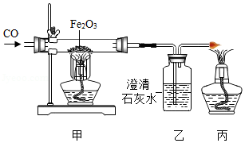
15．（8分）某科学兴趣小组，用废渣（主要为CaCO3，还含有C、Fe2O3、MgO等少量杂质）去制作CaCl2，反应过程如图所示。

（1）Ⅰ过程中加过量稀盐酸溶液的目的是 <u>　</u><u>                </u><u>　</u>。
（2）Ⅰ过程中MgO发生反应的化学反应方程式 <u>　</u><u>                </u><u>　</u>，此反应为 <u>　</u><u>                </u><u>　</u>反应（填基本反应类型）。
（3）滤渣①的成分为 <u>　</u><u>                </u><u>　</u>（填化学式）。
（4）X溶液为 <u>　</u><u>                </u><u>　</u>（填化学式）。
（5）NaCl在生活中的用处：<u>　</u><u>                </u><u>　</u>（写一例）。
（6）已知CaCl2与焦炭、BaSO4在高温下生成BaCl2和CO和CaS，写出该反应的方程式：<u>　</u><u>                </u><u>　</u>。
16．（9分）质量相等的两份Zn粉，分别与质量相同、质量分数不同的稀盐酸反应。
（1）配制盐酸时有白雾，说明盐酸具有 <u>　</u><u>   </u><u>　</u>性。
（2）两种稀盐酸反应生成氢气的图象如图所示，两种稀盐酸的浓度比较：Ⅰ<u>　</u><u>   </u><u>　</u>Ⅱ（填“＞”“＜”“＝”）。
（3）氢气的体积所对应的质量如表：
| 
  H2（V/L）  
 | 
  1.11  
 | 
  1.67  
 | 
  2.22  
 | 
  2.78  
 |
| --- | --- | --- | --- | --- |
| 
  H2（m/g）  
 | 
  0.10  
 | 
  0.15  
 | 
  0.20  
 | 
  0.25  
 |

①恰好反应完全，产生H2的质量为 <u>　</u><u>   </u><u>　</u>g。
②完全反应时，加入稀盐酸Ⅱ的质量为100g，求稀盐酸Ⅱ中溶质的质量分数。
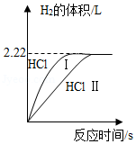
## **2021****年广东省深圳市中考化学试卷**

**试题解析**

**一、单项选择题Ⅰ（本大题共****8****小题，每小题****1.5****分，共****12****分，在每小题列出的四个选项中，只有一个选项最符合题意）**
1．【解答】解：A、天然气燃烧会生成新物质水和二氧化碳，所以天然气燃烧是化学变化，故A错误；
B、塑料制品任意丢弃会造成白色污染，所以使用可降解塑料可以减少“白色污染”，故B正确；
C、棉花里的纤维素是含碳元素的化合物，所以属于有机物，故C正确；
D、洗洁精具有乳化油污的作用，所以用洗洁精清洗餐具上的油污会出现乳化现象，故D正确。
故选：A。
2．【解答】解：A、书写元素符号注意“一大二小”，汞的元素符号是Hg，故选项化学用语错误。
B、五氧化二磷的化学式为P2O5，故选项化学用语错误。
C、由离子的表示方法，在表示该离子的元素符号或原子团的右上角，标出该离子所带的正负电荷数，数字在前，正负符号在后，带1个单位电荷时，1要省略，钠离子可表示为Na+，故选项化学用语错误。
D、该化学方程式书写完全正确，故选项正确。
故选：D。
3．【解答】解：A、倾倒液体的方法：将瓶塞倒放在桌面上，标签向着手心，量筒倾斜，故A操作正确；
B、量筒的读数方法：视线与凹液面最低处保持水平，故B操作正确；
C、胶头滴管不能伸入试管内，要垂悬在试管口上方，故C操作错误；
D、给试管内液体加热的注意事项：试管内液体量不能超过试管容积的三分之一，用外焰加热，故D操作正确。
故选：C。
4．【解答】解：A、硅带“石”字旁，属于固态非金属元素，则硅为非金属，故选项说法正确。
B、根据硅元素周期表中的一格可知，汉字下面的数字表示相对原子质量，该元素的相对原子质量为28.09，故选项说法正确。
C、根据元素周期表中的一格可知，左上角的数字表示原子序数，①为32，故选项说法错误。
D、原子是由原子核和核外电子构成的，锗原子是由原子核和核外电子构成的，故选项说法正确。
故选：C。
5．【解答】解：A.人体所需六大营养素为：蛋白质、糖类、油脂、维生素、水和无机盐，所以水是人体中重要的营养剂。故A正确。
B.汽油燃烧造成火灾时，不能用水来灭火的原因是：汽油难溶于水，且密度比水小，能浮在水面上，水不能使汽油隔绝空气，油随水流动甚至还能扩大着火面积，故B错误。
C.能溶解其它物质的物质是溶剂，溶液的溶剂不一定是水，如碘酒中酒精是溶剂，故C错误。
D．水在通电的条件下分解为氢气和氧气，氢气是由氢元素组成的，氧气是由氧元素组成的，由质量守恒定律可知，水是由氢元素与氧元素组成的，故D错误。
故选：A。
6．【解答】解：A、由微粒的变化可知，反应Ⅰ属于化学变化，化学变化都遵守质量守恒定律，反应前后原子数目不变，故A说法正确；
B、由微粒的变化可知，反应中甲与乙的分子个数比为2：1，故B说法错误；
C、由分子的模型图可知，反应Ⅱ中丙N为氨气，氢元素显+1价，可推出N的化合价﹣3价，故C说法正确；
D、由微粒的变化可知，想要得到更多H2，应减少反应Ⅱ的发生，故D说法正确。
故选：B。
7．【解答】解：A、由甲图可知，O2占空气体积（而不是质量）的21%，故选项说法错误。
B、铜片上的白磷燃烧，红磷不燃烧，水中的白磷不能燃烧，薄铜片上的白磷能与氧气接触，温度能达到着火点，水中的白磷不能与氧气接触，红磷温度没有达到着火点；可得出燃烧需要与空气接触，且温度达到着火点，故选项说法正确。
C、薄铜片上的白磷燃烧，冒出白烟，故选项说法正确。
D、点燃红磷后，要迅速放入集气瓶中，若缓慢伸入，会使集气瓶中的气体受热膨胀排出一部分，会导致实验结果偏大，故选项说法正确。
故选：A。
8．【解答】解：A、抗坏血酸和脱氢抗坏血酸均是由碳、氢、氧三种元素组成的化合物，均不属于氧化物，故选项说法错误。
B、抗坏血酸是由抗坏血酸分子构成的，1个抗坏血酸分子由6个C原子、8个H原子、6个O原子构成，故选项说法错误。
C、脱氢抗坏血酸中C、H、O元素质量比为（12×6）：（1×6）：（16×6）≠1：1：1，故选项说法错误。
D、1个抗坏血酸和脱氢抗坏血酸分子中均含有6个碳原子，脱氧抗坏血酸的其它原子的相对原子质量之和小，则物质中，C元素质量分数：抗坏血酸＜脱氧抗坏血酸，故选项说法正确。
故选：D。
**二、单项选择题Ⅱ****(****本大题共****4****小题，每小题****2****分，共****8****分，在每小题列出的四个选项中，只有一个选项最符合题意。****)**
9．【解答】解：A、过滤只能除去水中的不溶性杂质，不能除去红墨水中的色素，故选项实验方案错误。
B、将燃着的木条伸入集气瓶，能使木条燃烧更旺的是氧气，能使木条正常燃烧的是空气，可以鉴别，故选项实验方案正确。
C、黄铜中的铜在加热条件下能与氧气反应生成氧化铜，放在空气中灼烧，颜色逐渐变黑的是黄铜，无明显现象的是黄金，可以鉴别，故选项实验方案正确。
D、把洁净铜丝放入AgNO3中，能置换出银，可用于比较Ag与Cu的活泼性，故选项实验方案正确。
故选：A。
10．【解答】解：A、在比较物质的溶解度时，需要指明温度，温度不能确定，溶解度也不能确定，故A错误；
B、甲物质的溶解度曲线最陡，所以甲物质的溶解度随温度变化最大，故B错误；
C、27℃时，丙物质的溶解度是26g，所以往26g丙里加100g水，只能溶解26g的晶体，形成饱和溶液，故C错误；
D、通过分析溶解度曲线可知，33℃时，甲、乙两种物质溶解度相等，故D正确。
故选：D。
11．【解答】解：A、稀H2SO4与紫色石蕊试液反应后，溶液变红色，故选项说法错误。
B、若能与X反应制取H2，则X不可能是Cu，在金属活动性顺序中，铜的位置排在氢的后面，不与稀硫酸反应，故选项说法错误。
C、稀硫酸和金属氧化物反应，有盐和水生成，故选项说法正确。
D、若与Y发生中和反应，但Y不一定是NaOH，也可能是氢氧化钙等碱，故选项说法错误。
故选：C。
12．【解答】解：A、铁钉是由铁合金制成的，该选项说法正确；
B、铁生锈过程中，氧气和水、铁不断反应，因此氧气体积减少，该选项说法不正确；
C、根据甲图，铁钉在潮湿环境更容易生锈，该选项说法正确；
D、根据乙图，铁钉生锈过程中温度升高，即铁生锈过程中放热，该选项说法正确。
故选：B。
**三、非选择题（本大题共****4****小题，共****30****分****)****。**
13．【解答】解：（1）X的名称是铁架台；
（2）实验室常用加热氯酸钾和二氧化碳的混合物制取氧气，属于固、固加热型，试管口不用塞棉花，氧气的密度比空气大，适合用装置C制取；
（3）B装置属于固、液常温型，适合用过氧化氢制取氧气，过氧化氢在二氧化锰的催化作用下生成水和氧气，反应的化学方程式为：2H2O22H2O+O2↑；
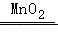
（4）二氧化碳的密度比空气大，制取干燥CO2气体，导管口a接b，；
（5）实验室常用大理石（或石灰石）和稀盐酸反应制取二氧化碳，碳酸钙和稀盐酸反应生成氯化钙、水和二氧化碳，反应的化学方程式为：CaCO3+2HCl＝CaCl2+H2O+CO2↑。
故答案为：
（1）铁架台；
（2）C；
（3）2H2O22H2O+O2↑；

（4）b；
（5）CaCO3+2HCl＝CaCl2+H2O+CO2↑。
14．【解答】解：（1）丙装置作用：把一氧化碳转化成二氧化碳，防止污染环境。
故填：把一氧化碳转化成二氧化碳，防止污染环境。
（2）如乙中澄清石灰水变浑浊，甲中高温条件下氧化铁和一氧化碳反应生成铁和二氧化碳，发生反应的化学方程式为：Fe2O3+3CO2Fe+3CO2。

故填：Fe2O3+3CO2Fe+3CO2。

（3）猜想一：黑色固体成分为Fe；
猜想二：黑色固体成分为Fe3O4；
猜想三：黑色固体成分为Fe、Fe3O4。
故填：黑色固体成分为Fe、Fe3O4。
步骤二：
| 
  样品  
 | 
  现象  
 | 
  结论  
 |
| --- | --- | --- |
| 
  A  
 | 
  无明显现象，说明黑色固体是四氧化三铁  
 | 
  猜想二正确  
 |
| 
  B  
 | 
  有红色固体析出，有少量黑色固体剩余，说明固体中含有铁和四氧化三铁  
 | 
  猜想三正确  
 |
| 
  C  
 | 
  有红色固体析出，无黑色固体生成  
 | 
  猜想一正确  
 |

若通入CO时间为90s，要得到纯铁粉，则加热时间180s，是因为热时间是180s时氧化铁完全转化成铁。
故填：猜想二；猜想三；有红色固体析出；猜想一；180。
15．【解答】解：（1）Ⅰ过程中加过量稀盐酸溶液的目的是使碳酸钙、氧化铁、氧化镁完全反应。
故填：使碳酸钙、氧化铁、氧化镁完全反应。
（2）Ⅰ过程中MgO和盐酸反应生成氯化镁和水，反应的化学反应方程式：MgO+2HCl═MgCl2+H2O，此反应为复分解反应。
故填：MgO+2HCl═MgCl2+H2O；复分解。
（3）滤渣①的成分为C。
故填：C。
（4）X溶液为氢氧化钠溶液，用来除去铁离子、镁离子。
故填：NaOH。
（5）NaCl在生活中可以用作调味品。
故填：用作调味品。
（6）CaCl2与焦炭、BaSO4在高温下生成BaCl2和CO和CaS，该反应的方程式：CaCl2+4C+BaSO4BaCl2+4CO↑+CaS。

故填：CaCl2+4C+BaSO4BaCl2+4CO↑+CaS。

16．【解答】解：（1）配制盐酸时有白雾，是盐酸挥发出的氯化氢气体与空气中的水蒸气形成的盐酸小液滴，由此说明盐酸具有挥发性；故填：挥发；
（2）反应物的浓度越大，反应速率越快，从图中可以看出完全反应时Ⅰ消耗的时间短，因此两种稀盐酸的浓度比较，Ⅰ＞Ⅱ；故填：＞；
（3）①从图象可以看出产生氢气的体积为2.22L，对应表格中的质量为0.2g；故填：0.2g；
②设稀盐酸Ⅱ中溶质的质量为x
 Zn+2HCl═ZnCl2+H2↑
        73                2
        x                 0.2g
＝
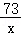
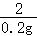
x＝7.3g
稀盐酸Ⅱ中溶质的质量分数为×100%＝7.3%
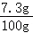
答：稀盐酸Ⅱ中溶质的质量分数为7.3%。
