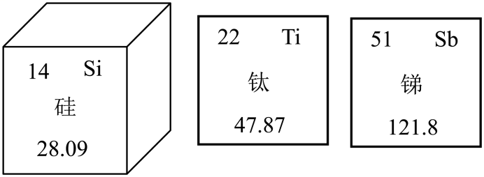
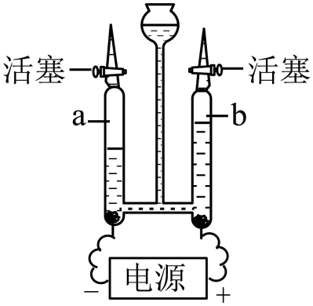
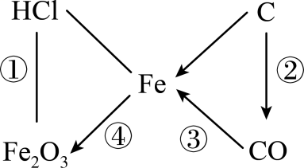
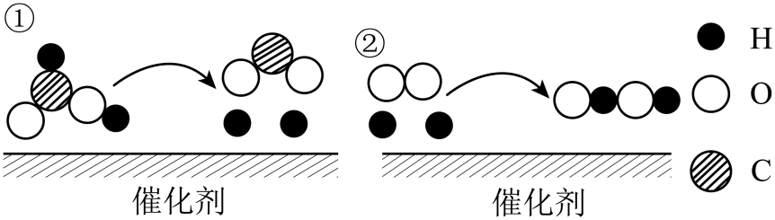
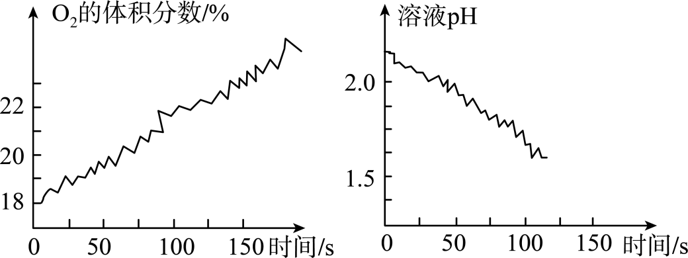
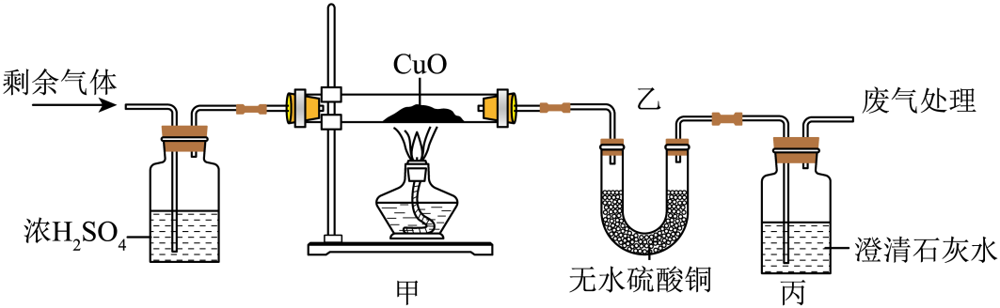
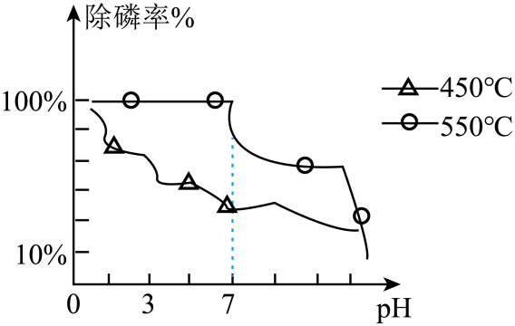
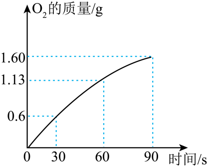

## **2023****年中考化学试卷**

**（本卷共****16****小题，满分****50****分，考试用时****40****分钟）**

**本卷可能用到相对原子质量：****H-1  Zn-65  C1-35.5  Fe-56  O-16  C-12  Mg-24  Cu-64  S-32**
**一、单项选择题：本题共****12****小题，前八题每小题****1.5****分，共****12****分，后四题每小题****2****分，共****8****分。在每小题给出的四个选项中，只有一项是符合题目要求的。**
1. 化学和生活中资源，材料，生活，健康密切相关，下列说法正确是

A. 深圳海洋资源丰富，可以随意开发
B. 生活中纯金属的使用一定比合金广
C. 为减少污染，应禁止使用化肥和农药
D. 为均衡膳食，应摄入合理均衡营养
2. 下列化学用语表达错误的是
A. 两个氦原子2He	B. 氯离子：Cl+
C. 三氧化硫分子：SO3	D. 碳酸钠：Na2CO3
3. 有关NaOH说法错误的是
A. NaOH固体溶解时放出热量	B. NaOH包装箱上张贴的标识是

C. NaOH是所有气体的干燥剂	D. NaOH应密封保存
4. 下列说法错误的是

A. 这三种都是金属	B. 硅相对原子质量是28.09

C. 钛的核外电子数为22	D. 锑的原子序数为51
5. 下列说法正确的是

A. a和b质量比为2：1	B. H2具有助燃性
C. 水是由氢元素和氧元素组成的	D. 水的电解是物理变化
6. 桃金娘烯醇C10H16O是生物化工领域的一种产品，下列关于桃金娘烯醇说法正确的是：
A. 桃金娘烯醇是氧化物
B. 桃金娘烯醇是由10个碳原子，16个氢原子，1个氧原子构成的
C. 桃金娘烯醇中碳与氢质量比5：8
D. 桃金娘烯醇中碳元素质量分数最高

7. 下列日常生活与解释说明相符的是
|  | 
  日常生活  
 | 
  解释说明  
 |
| --- | --- | --- |
| 
  A  
 | 
  用铅笔写字  
 | 
  石墨具有导电性  
 |
| 
  B  
 | 
  节约用电  
 | 
  亮亮同学践行低碳的生活理念  
 |
| 
  C  
 | 
  用蜡烛照明  
 | 
  蜡烛燃烧生成CO2和H2O  
 |
| 
  D  
 | 
  晾晒湿衣服  
 | 
  水分子的质量和体积都很小  
 |

A. A	B. B	C. C	D. D
8. “一”表示物质可以发生反应，“→”表示物质可以转换，下列说法不正确的是

A. ①的现象是有气泡产生	B. ②可用于碳的不完全燃烧
C. ③可用于工业炼铁	D. 隔绝氧气或者水可以防止④的发生
9. 在通电条件下，甲酸与氧气的反应微观图如下，说法错误的是（

A. 由此实验可知，分子是化学变化的最小粒子
B. 两个氢原子和一个氧分子结合形成H2O2
C. 反应的化学方程式：
D. 催化剂在反应前后的化学性质和质量不变
10. 下图是亮亮看到的NH4H2PO4和MgSO4溶解度曲线，下列说法正确的是：

A. 搅拌，可以使溶解度变大
B. 20℃时，在100g水中加33.7 gNH4H2PO4形成不饱和溶液
C. 40℃时，NH4H2PO4的溶解度大于MgSO4的溶解度
D. NH4H2PO4溶液降温一定有晶体析出
11. 下列做法与目的不符的是
| 
  A  
 | 
  鉴别空气与呼出气体  
 | 
  将燃着的小木条放入集气瓶中  
 |
| --- | --- | --- |
| 
  B  
 | 
  鉴别水和食盐水  
 | 
  观察颜色  
 |
| 
  C  
 | 
  比较铝合金和铝硬度  
 | 
  相互刻画  
 |
| 
  D  
 | 
  实验室制备纯净的水  
 | 
  蒸馏自来水  
 |

A. A	B. B	C. C	D. D
12. 某同学在验证次氯酸（HClO）光照分解产物数字实验中，HClO所发生反应的方程式为，容器中O2的体积分数的溶液的pH随时间变化的情况如图所示，下列说法错误的是

A. 光照前，容器内已有O2	B. 反应过程中，溶液的酸性不断增强
C. 反应前后氯元素的化合价不变	D. 该实验说明HClO化学性质不稳定
**二、综合题：**
13. 实验室现有KMnO4，块状大理石，稀盐酸，棉花

（1）亮亮根据现有药品制取氧气，方程式为______。制取一瓶较干燥的O2应选择的发生装置和收集装置是______。（标号）
（2）根据现有药品选用______和稀盐酸反应制取CO2，化学方程式为______。
（3）实验废液不能直接倒入下水道，取少量制备CO2后的废液于试管中，加入滴______（选填“紫色石蕊溶液”或“无色酚酞溶液”），溶液变红，则溶液显酸性。
14. 已知H2与菱铁矿（主要成分FeCO3其他成分不参与反应）反应制成纳米铁粉。某小组进行探究并完成如下实验：
查阅资料：①H2能与CuO反应生成H2O，H2O能使无水硫酸铜变蓝
②CO2与无水硫酸铜不反应
（1）某同学探究反应后气体成分，先将反应后气体通入无水硫酸铜，无水硫酸铜变蓝，证明气体中含有______，再通入足量的澄清石灰水，澄清石灰水变浑浊，反应方程式为______。
（2）对剩余气体成分进行以下猜想：
猜想一：H2    猜想二：______    猜想三：CO和H2

浓H2SO4的作用：______。
| 甲中现象：______。 乙中无水CuSO4变蓝 丙中变浑浊 | 猜想______正确 |
| --- | --- |

（3）热处理后的纳米铁粉能够除去地下水中的磷元素，如图所示450℃或者550℃热处理纳米铁粉的除磷率以及pH值如图所示，分析______℃时以及______（酸性或碱性）处理效果更好。

15. 某同学以金泥（含有Au、CuS、ZnS等）为原料制备（Au）和Cu流程如图所示：

琴琴同学查阅资料已知：
①预处理的主要目的是将含硫化合物转化为氧化物。
②热空气流充分加热的目的是将Cu、Zn转化为氧化物，并完全分离出ZnO烟尘。
（1）“预处理”中会产生SO2，若SO2直接排放会导致______。
（2）“过程Ⅱ”产生的固体a中，除CuO外一定还有的物质是______。
（3）“过程Ⅲ”分离Au的操作是______，加入过量稀硫酸的目的是______。
（4）“系列进程”中有一步是向滤液中加入过量铁粉，这一步生成气体的化学方程式为______，该反应属于______反应（填写基本反应类型）。
（5）ZnO烟尘可用NaOH溶液吸收，该反应生成偏锌酸钠（Na2ZnO2）和H2O的化学方程式为______。
16. 定性实验和定量实验是化学中常见的两种实验方法。
（1）铝和氧气生成致密______。

（2）打磨后的铝丝放入硫酸铜溶液中发生反应，出现的反应现象：______。
（3）如图是探究白磷燃烧条件的图像：

从图中得知白磷燃烧的条件是______。
（4）某同学向相同体积的5%H2O2分别加入氧化铁和二氧化锰做催化剂，现象如下表：
| 
  催化剂  
 | 
  现象  
 |
| --- | --- |
| 
  MnO2  
 | 
  有大量气泡  
 |
| 
  Fe2O3  
 | 
  少量气泡  
 |

根据气泡生成多少可以得到什么化学启示：______。
（5）某同学在H2O2溶液中加入MnO2做催化剂时，反应生成气体的质量与时间的关系如图所示，求反应90s时消耗H2O2的质量。（写出计算过程）

