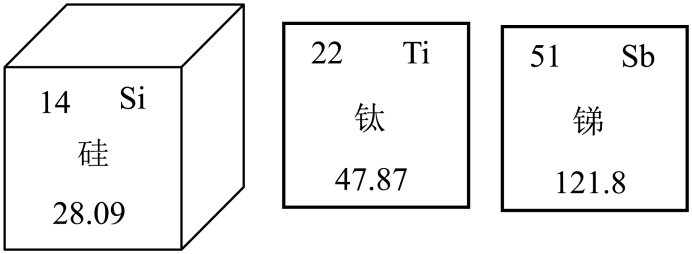
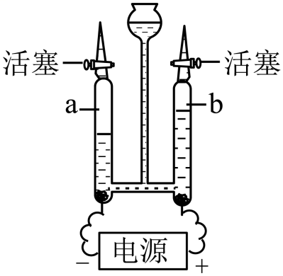
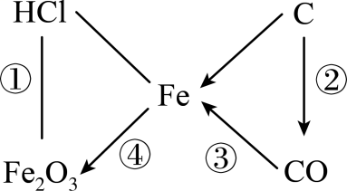
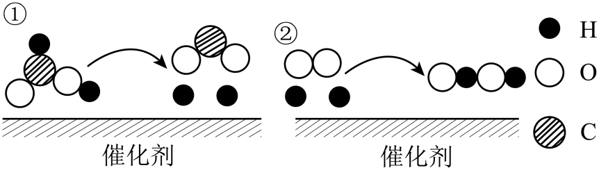
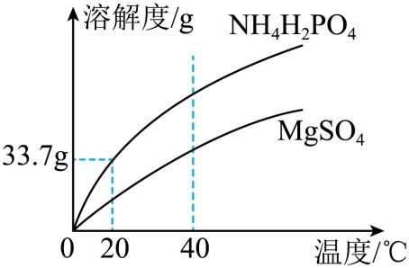
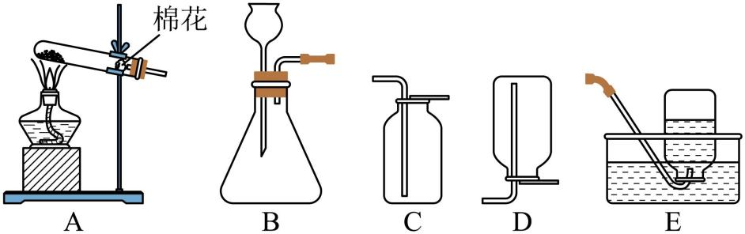
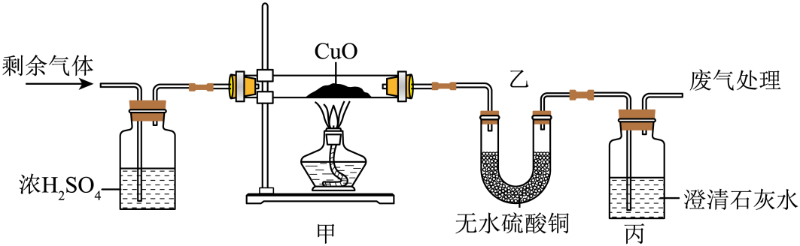
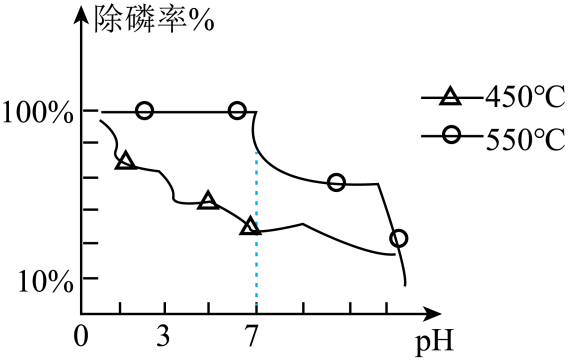
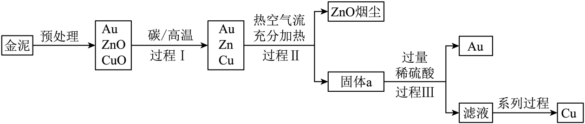
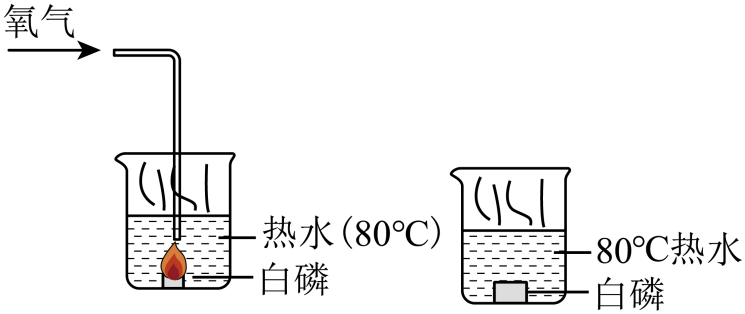

## **2023****年中考化学试卷**

**（本卷共****16****小题，满分****50****分，考试用时****40****分钟）**

**本卷可能用到相对原子质量：****H-1  Zn-65  C1-35.5  Fe-56  O-16  C-12  Mg-24  Cu-64  S-32**
**一、单项选择题：本题共****12****小题，前八题每小题****1.5****分，共****12****分，后四题每小题****2****分，共****8****分。在每小题给出的四个选项中，只有一项是符合题目要求的。**
1. 化学和生活中资源，材料，生活，健康密切相关，下列说法正确的是
A. 深圳海洋资源丰富，可以随意开发
B. 生活中纯金属的使用一定比合金广
C. 为减少污染，应禁止使用化肥和农药
D. 为均衡膳食，应摄入合理均衡营养
【答案】D
【解析】
【详解】A、海洋是人类社会可持续发展的宝贵财富，虽然海洋资源丰富，也不可以随意开发，要合理适度开发海洋资源，故A说法错误；
B、合金比其组成金属的性能更优越，所以生活中合金的使用比纯金属广泛，故B说法错误；
C、化肥农药可以提高农作物的产量，所以为减少污染，应合理使用化肥和农药，故C说法错误；
D、为均衡膳食，应摄入合理均衡营养，保障身体健康，故D说法正确；
故选D。
2. 下列化学用语表达错误的是
A. 两个氦原子2He	B. 氯离子：Cl+
C. 三氧化硫分子：SO3	D. 碳酸钠：Na2CO3
【答案】B
【解析】
【详解】A、原子的表示方法，用元素符号来表示一个原子，表示多个该原子，就在其元素符号前加上相应的数字。两个氦原子表示为2He，故A正确；
B、离子的表示方法，在表示该离子的元素符号右上角，标出该离子所带的正负电荷数，数字在前，正负符号在后，带1个电荷时，1要省略，若表示多个该离子，就在其离子符号前加上相应的数字。氯离子带有1个单位负电荷，表示为Cl-，故B错误；
C、分子的表示方法，正确书写物质的化学式，表示多个该分子，就在其化学式前加上相应的数字。三氧化硫分子表示为SO3，故C正确；
D、根据化合物的化学式书写：显正价的元素其符号写在左边，显负价的写在右边，化合价的绝对值交叉约简，得化学式右下角的数字，数字为1时不写。碳酸钠中钠元素显示+1价，碳酸根显示-2价，化学式为Na2CO3，故D正确；
故选B。
3. 有关NaOH说法错误的是
A. NaOH固体溶解时放出热量	B. NaOH包装箱上张贴的标识是

C. NaOH是所有气体的干燥剂	D. NaOH应密封保存
【答案】C
【解析】
【详解】A、氢氧化钠固体溶于水，放出热量，故A说法正确；
B、氢氧化钠具有强腐蚀性，属于腐蚀品，故B说法正确；
C、氢氧化钠易吸收水分而潮解，可用作某些气体的干燥剂，但是不是所有气体的干燥剂，氢氧化钠显碱性，不能干燥二氧化碳、二氧化硫等酸性气体，故C说法错误；
D、氢氧化钠易吸收水分而潮解，易吸收二氧化碳而变质，所以氢氧化钠应该密封保存，故D说法正确；
故选C。
4. 下列说法错误的是

A. 这三种都是金属	B. 硅的相对原子质量是28.09
C. 钛的核外电子数为22	D. 锑的原子序数为51
【答案】A
【解析】
【详解】A、硅带有石字旁，属于非金属元素，钛和锑带有金字旁，属于金属元素，故A说法错误；
B、由元素周期表中的一格可知，汉字下方的数字表示相对原子质量，硅的相对原子质量为28.09，故B说法正确；
C、由元素周期表中的一格可知，左上角的数字表示原子序数，钛的原子序数为22，根据在原子中，质子数=核外电子数=原子序数，故钛的核外电子数为22，故C说法正确；
D、由元素周期表中的一格可知，左上角的数字表示原子序数，锑的原子序数为51，故D说法正确；
故选A。
5. 下列说法正确的是

A. a和b质量比为2：1	B. H2具有助燃性
C. 水是由氢元素和氧元素组成的	D. 水的电解是物理变化
【答案】C
【解析】
【详解】A、电解水实验中，根据正氧负氢，氧一氢二，a管与电源的负极相连，产生的是氢气，b管与电源的正极相连，产生的是氧气，a（氢气）和b（氧气）体积比为2：1，水通电分解生成氢气和氧气，该反应方程式为：，a（氢气）和b（氧气）质量比为4：32=1：8，故A说法错误；
B、氢气具有可燃性，氧气具有助燃性，故B说法错误；
C、水通电分解生成氢气和氧气，氢气是由氢元素组成的，氧气是由氧元素组成的，根据反应前后元素种类不变，则水是由氢元素和氧元素组成的，故C说法正确；
D、水通电分解生成氢气和氧气，有新物质生成，属于化学变化，故D说法错误；
故选C。
6. 桃金娘烯醇C10H16O是生物化工领域的一种产品，下列关于桃金娘烯醇说法正确的是：
A. 桃金娘烯醇是氧化物
B. 桃金娘烯醇是由10个碳原子，16个氢原子，1个氧原子构成的
C. 桃金娘烯醇中碳与氢质量比5：8
D. 桃金娘烯醇中碳元素的质量分数最高
【答案】D
【解析】
【详解】A、氧化物是指含有两种元素，且一种元素为氧元素的化合物，而桃金娘烯醇中含有三种元素，不属于氧化物，该选项说法不正确；
B、桃金娘烯醇是由分子构成的，1个分子是由10个碳原子，16个氢原子，1个氧原子构成的，该选项说法不正确；
C、桃金娘烯醇中碳与氢质量比（12×10）：（1×16）=15：2，而5：8原子个数比，该选项说法不正确；

D、元素的质量分数=，而其中碳、氢、氧元素的质量比为（12×10）：（1×16）：16=15：2：2，则碳的质量分数最大，该选项说法正确。
故选D。
7. 下列日常生活与解释说明相符的是
|  | 
  日常生活  
 | 
  解释说明  
 |
| --- | --- | --- |
| 
  A  
 | 
  用铅笔写字  
 | 
  石墨具有导电性  
 |
| 
  B  
 | 
  节约用电  
 | 
  亮亮同学践行低碳的生活理念  
 |
| 
  C  
 | 
  用蜡烛照明  
 | 
  蜡烛燃烧生成CO2和H2O  
 |
| 
  D  
 | 
  晾晒湿衣服  
 | 
  水分子的质量和体积都很小  
 |

A. A	B. B	C. C	D. D
【答案】B
【解析】
【详解】A、用石墨制作铅笔芯是利用了石墨质软，能在纸上留下灰黑色痕迹，与导电性无关，日常生活与解释说明不相符，选项不符合题意；
B、践行低碳生活理念，日常生活中可以节约用电等，日常生活与解释说明相符，符合题意；
C、用蜡烛照明，是因为蜡烛燃烧发光，日常生活与解释说明不相符，不符合题意；
D、晾晒湿衣服，是因为水分子在不断运动，运动到空气中，日常生活与解释说明不相符，不符合题意；
故选B。
8. “一”表示物质可以发生反应，“→”表示物质可以转换，下列说法不正确的是

A. ①的现象是有气泡产生	B. ②可用于碳的不完全燃烧
C. ③可用于工业炼铁	D. 隔绝氧气或者水可以防止④的发生
【答案】A
【解析】
【详解】A、①是氧化铁与盐酸反应生成氯化铁和水，该反应无气体产生，所以不会有气泡产生，故A说法不正确；
B、②是碳不完全燃烧生成一氧化碳，故B说法正确；
C、③可以是一氧化碳高温下还原氧化铁生成铁和二氧化碳，可用于工业炼铁，故C说法正确；
D、④是铁与氧气和水同时作用生成氧化铁，隔绝氧气或者水可以防止④的发生，故D说法正确；
故选A。
9. 在通电条件下，甲酸与氧气的反应微观图如下，说法错误的是（

A. 由此实验可知，分子是化学变化的最小粒子
B. 两个氢原子和一个氧分子结合形成H2O2
C. 反应的化学方程式：
D. 催化剂在反应前后的化学性质和质量不变
【答案】A
【解析】
【详解】A、化学反应的实质是分子的分裂和原子的重组，原子是化学变化中的最小粒子，故A说法错误；
B、由②可知，两个氢原子和1个氧分子结合形成H2O2，故B说法正确；
C、由图可知，HCOOH与O2在铂催化剂和通电的条件下反应生成H2O2和CO2，该反应的化学方程式为：，故C说法正确；
D、催化剂在反应前后质量和化学性质不变，故D说法正确；
故选A。
10. 下图是亮亮看到的NH4H2PO4和MgSO4溶解度曲线，下列说法正确的是：

A. 搅拌，可以使溶解度变大
B. 20℃时，在100g水中加33.7 gNH4H2PO4形成不饱和溶液
C. 40℃时，NH4H2PO4的溶解度大于MgSO4的溶解度
D. NH4H2PO4溶液降温一定有晶体析出
【答案】C
【解析】
【详解】A、固体溶解度受温度影响，搅拌不能改变溶解度大小，该选项说法不正确；
B、由图可知，20℃时，NH4H2PO4的溶解度为33.7g，则在100g水中加33.7 gNH4H2PO4形成饱和溶液，该选项说法不正确；
C、由图可知，40℃时，NH4H2PO4的溶解度大于MgSO4的溶解度，该选项说法正确；
D、将NH4H2PO4饱和溶液降温一定有晶体析出，但将其不饱和溶液降温不一定有晶体析出，该选项说法不正确。
故选C。
11. 下列做法与目的不符的是
| 
  A  
 | 
  鉴别空气与呼出气体  
 | 
  将燃着的小木条放入集气瓶中  
 |
| --- | --- | --- |
| 
  B  
 | 
  鉴别水和食盐水  
 | 
  观察颜色  
 |
| 
  C  
 | 
  比较铝合金和铝硬度  
 | 
  相互刻画  
 |
| 
  D  
 | 
  实验室制备纯净的水  
 | 
  蒸馏自来水  
 |

A. A	B. B	C. C	D. D
【答案】B
【解析】
【详解】A、呼出气体中二氧化碳含量高（二氧化碳不能燃烧且不支持燃烧），所以将燃着的木条放入集气瓶中，木条正常燃烧的是空气，木条熄灭的是呼出气体，现象不同，可以鉴别，故A做法与目的相符，不符合题意；
B、水和食盐水都是无色，观察颜色不能鉴别，故B做法与目的不符，符合题意；
C、合金的硬度比组成它的纯金属的硬度大，所以相互刻画，留下划痕明显的是铝，相互刻画可以鉴别铝合金和铝的硬度，故C做法与目的相符，不符合题意；
D、蒸馏可以除去水中的所有杂质，实验室可以通过蒸馏制备纯净的水，故D做法与目的相符，不符合题意；
故选B。
12. 某同学在验证次氯酸（HClO）光照分解产物数字实验中，HClO所发生反应的方程式为，容器中O2的体积分数的溶液的pH随时间变化的情况如图所示，下列说法错误的是

A. 光照前，容器内已有O2	B. 反应过程中，溶液的酸性不断增强
C. 反应前后氯元素的化合价不变	D. 该实验说明HClO化学性质不稳定
【答案】C
【解析】
【详解】A、由图可知，光照前，氧气的体积分数为18%，即光照前，容器内已有氧气，故A说法正确；
B、由溶液的pH变化可知，反应过程中，溶液的pH逐渐减小，说明反应过程中，溶液的酸性不断增强，故B说法正确；
C、反应物HClO中氢元素显示+1价，氧元素显示-2价，根据在化合物中正负化合价代数和为0，则氯元素的化合价为+1价，生成物HCl中，氢元素显示+1价，则氯元素显示-1价，反应前后氯元素的化合价改变，故C说法错误；
D、次氯酸在光照下易分解生成氯化氢和氧气，所以该实验说明HClO化学性质不稳定，故D说法正确；
故选C。
**二、综合题：**
13. 实验室现有KMnO4，块状大理石，稀盐酸，棉花

（1）亮亮根据现有药品制取氧气，方程式为______。制取一瓶较干燥的O2应选择的发生装置和收集装置是______。（标号）
（2）根据现有药品选用______和稀盐酸反应制取CO2，化学方程式为______。
（3）实验废液不能直接倒入下水道，取少量制备CO2后的废液于试管中，加入滴______（选填“紫色石蕊溶液”或“无色酚酞溶液”），溶液变红，则溶液显酸性。
【答案】（1）    ① 
    ②. AC##CA

（2）    ①. 块状大理石    ②.
（3）紫色石蕊溶液
【解析】
【小问1详解】
根据现有药品，可选择高锰酸钾制取氧气，高锰酸钾加热分解生成锰酸钾、二氧化锰和氧气，该反应的化学方程式为；
该反应为固体加热型，发生装置可选择A，氧气密度比空气大，可选择向上排空气法收集，氧气不易溶于水，可选择排水法收集，而排水法收集的氧气较排空气法纯净，排空气法收集的氧气较干燥，所以收集干燥的氧气可选择C，故可选择的装置组合为AC；
【小问2详解】
根据现有药品选用块状大理石（主要成分碳酸钙）和稀盐酸反应制取CO2，碳酸钙与稀盐酸反应生成氯化钙、二氧化碳和水，该反应的化学方程式为；
【小问3详解】
根据酸性溶液可以使紫色石蕊变红，酸性溶液不能使无色酚酞变色，所以取少量制备CO2后的废液于试管中，加入滴紫色石蕊溶液，溶液变红，则溶液显酸性。
14. 已知H2与菱铁矿（主要成分FeCO3其他成分不参与反应）反应制成纳米铁粉某小组进行探究并完成如下实验：

查阅资料：①H2能与CuO反应生成H2O，H2O能使无水硫酸铜变蓝
②CO2与无水硫酸铜不反应
（1）某同学探究反应后气体成分，先将反应后气体通入无水硫酸铜，无水硫酸铜变蓝，证明气体中含有______，再通入足量的澄清石灰水，澄清石灰水变浑浊，反应方程式为______。
（2）对剩余气体成分进行以下猜想：
猜想一：H2    猜想二：______    猜想三：CO和H2

浓H2SO4的作用：______。
| 甲中现象：______。 乙中无水CuSO4变蓝 丙中变浑浊 | 猜想______正确 |
| --- | --- |

（3）热处理后纳米铁粉能够除去地下水中的磷元素，如图所示450℃或者550℃热处理纳米铁粉的除磷率以及pH值如图所示，分析______℃时以及______（酸性或碱性）处理效果更好。

【答案】（1）    ①. 水蒸气##H2O    ②.
（2）    ①. 一氧化碳##CO    ②. 干燥气体，防止影响氢气的鉴别    ③. 固体由黑色变为红色    ④. 三
（3）    ①. 550    ②. 酸性
【解析】
【小问1详解】
H2O能使无水硫酸铜变蓝，则可证明气体中含有水蒸气；
二氧化碳能与石灰水中的氢氧化钙反应生成碳酸钙沉淀和水，反应的化学方程式为。
【小问2详解】
根据元素守恒，再结合其他猜想可知，剩余的气体还可能为一氧化碳。
浓硫酸具有吸水性，能干燥气体，而氢气能与氧化铜反应生成铜和水，则浓硫酸可干燥气体，防止影响氢气的鉴别。
二氧化碳能使澄清石灰水变浑浊，无水硫酸铜变蓝，则说明混合气体中含有一氧化碳和氢气，则猜想三正确，且甲中氧化铜被还原为铜，则固体由黑色变红色。
【小问3详解】
由图可知，550℃时除磷效果更好，且pH显酸性时效果更好。
15. 某同学以金泥（含有Au、CuS、ZnS等）为原料制备（Au）和Cu的流程如图所示：

琴琴同学查阅资料已知：
①预处理的主要目的是将含硫化合物转化为氧化物。
②热空气流充分加热的目的是将Cu、Zn转化为氧化物，并完全分离出ZnO烟尘。
（1）“预处理”中会产生SO2，若SO2直接排放会导致______。
（2）“过程Ⅱ”产生的固体a中，除CuO外一定还有的物质是______。
（3）“过程Ⅲ”分离Au的操作是______，加入过量稀硫酸的目的是______。
（4）“系列进程”中有一步是向滤液中加入过量铁粉，这一步生成气体的化学方程式为______，该反应属于______反应（填写基本反应类型）。
（5）ZnO烟尘可用NaOH溶液吸收，该反应生成偏锌酸钠（Na2ZnO2）和H2O的化学方程式为______。
【答案】（1）酸雨    （2）金##Au
（3）    ①. 过滤    ②. 将氧化铜完全转化为硫酸铜，提高铜的产率
（4）    ①. 
    ②. 置换
（5）
【解析】
【小问1详解】
若SO2直接排放，与水生成酸性物质，会导致酸雨；
【小问2详解】
热空气流充分加热的目的是将Cu、Zn转化为氧化物，并完全分离出ZnO烟尘，银的化学性质稳定，不与氧气反应，所以“过程Ⅱ”产生的固体a中，除CuO外一定还有的物质是Au；
【小问3详解】
“过程Ⅲ”加入稀硫酸，氧化铜与稀硫酸反应生成硫酸铜和水，银不与硫酸反应，分离固体Au和滤液的操作是过滤，加入过量稀硫酸的目的是将氧化铜完全转化为硫酸铜，提高铜的产率；
【小问4详解】
“系列进程”中有一步是向滤液中加入过量铁粉，发生的反应有：铁与硫酸铜反应生成硫酸亚铁和铜，铁与硫酸反应生成硫酸亚铁和氢气，所以这一步生成气体的化学方程式为；该反应是由一种单质和一种化合物反应生成另一种单质和另一种化合物的反应，属于置换反应；
【小问5详解】
ZnO烟尘可用NaOH溶液吸收，该反应生成偏锌酸钠（Na2ZnO2）和H2O，该反应的化学方程式为。
16. 定性实验和定量实验是化学中常见两种实验方法。

（1）铝和氧气生成致密的______。
（2）打磨后的铝丝放入硫酸铜溶液中发生反应，出现的反应现象：______。
（3）如图是探究白磷燃烧条件的图像：

从图中得知白磷燃烧的条件是______。
（4）某同学向相同体积的5%H2O2分别加入氧化铁和二氧化锰做催化剂，现象如下表：
| 
  催化剂  
 | 
  现象  
 |
| --- | --- |
| 
  MnO2  
 | 
  有大量气泡  
 |
| 
  Fe2O3  
 | 
  少量气泡  
 |

根据气泡生成多少可以得到什么化学启示：______。
（5）某同学在H2O2溶液中加入MnO2做催化剂时，反应生成气体的质量与时间的关系如图所示，求反应90s时消耗H2O2的质量。（写出计算过程）

【答案】（1）氧化铝##Al2O3
（2）铝丝表面有红色物质，溶液由蓝色逐渐变为无色    （3）与氧气接触
（4）二氧化锰的催化效果比氧化铁好（合理即可）
（5）解：由图可知，反应90s时，生成氧气的质量为1.60g，设消耗过氧化氢的质量为*x*，

答：反应90s时消耗H2O2的质量为3.4g。
【解析】
【小问1详解】
铝和氧气生成致密的氧化铝保护膜；
【小问2详解】
打磨后的铝丝放入硫铜溶液中，铝与硫酸铜反应生成硫酸铝和铜，出现的反应现象为铝丝表面有红色物质，溶液由蓝色逐渐变为无色；
【小问3详解】
左边白磷与氧气接触、温度达到白磷的着火点，可以燃，右边白磷没有与氧气接触、温度达到白磷的着火点，不能燃烧，二者对比，说明白磷燃烧的条件是与氧气接触；
【小问4详解】
向相同体积的5%H2O2分别加入氧化铁和二氧化锰做催化剂，加入二氧化锰的产生大量气泡，加入氧化铁的产生少量气泡，根据气泡生成多少，说明二氧化锰的催化效果比氧化铁好（合理即可）；
【小问5详解】
见答案。
