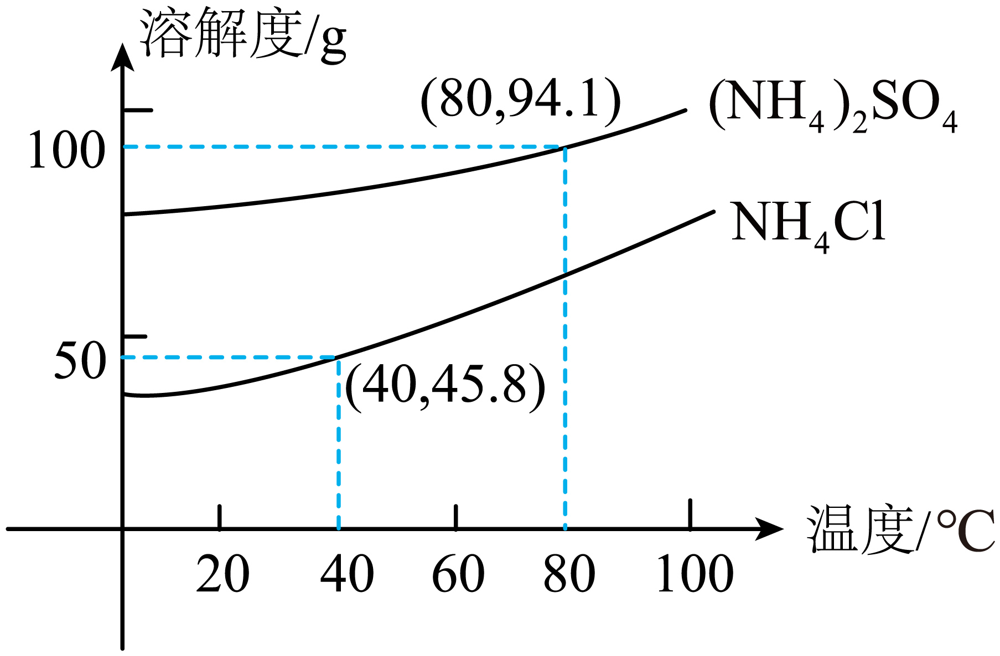
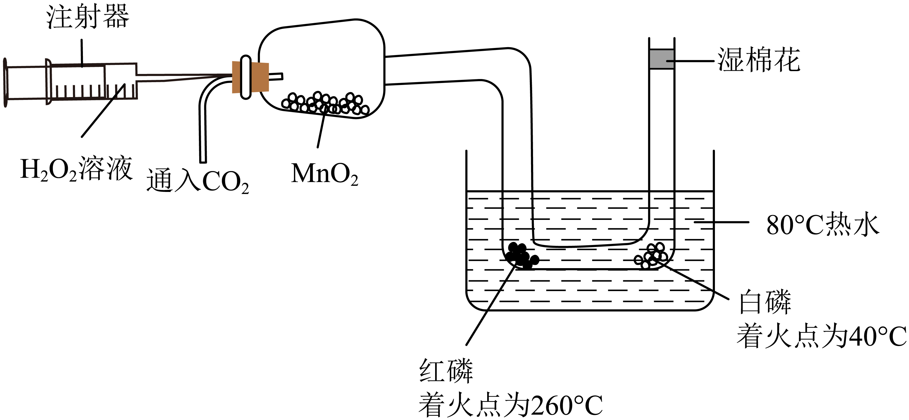
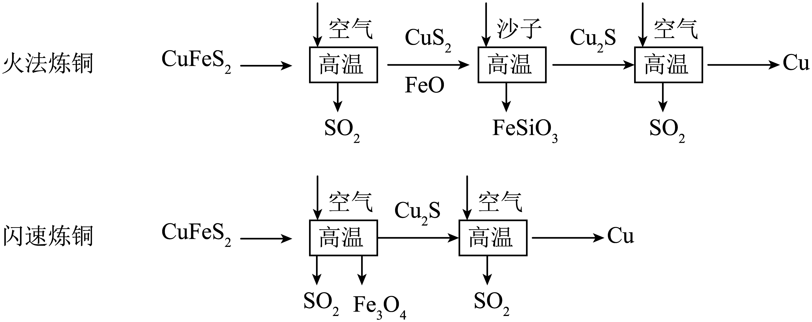
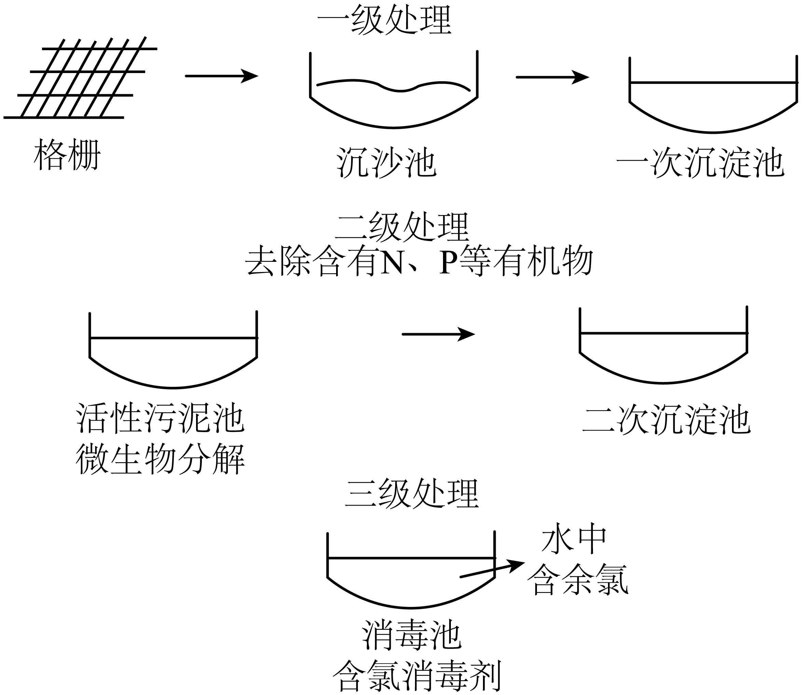

## **2025****年中考化学试卷**

**(****本卷共****16****小题，满分****45****分，考试用时****40****分钟****)**

**本卷可能用到相对原子质量：****H-1  Zn-65  Cl-35.5  Fe-56  O-16  C-12  Mg-24  Cu-64  S-32**
**一、选择题****(****共****10****小题，每小题****1.5****分，共****15****分。在每小题给出的四个选项中，只有一项是符合题目要求的****)**
1. “美丽中国我先行”，思考乐律培和海波同学认为下列不符合该主题的是
A. 在餐厅使用一次性餐具	B. 使用新能源汽车
C. 生活中垃圾分类	D. 污水处理达标后排放
2. 下面化学用语表示正确的是
A. 锌：zn	B. 氯化钙：	C. 镁离子：	D. 四个磷原子：
3. 牡丹花含甘氨酸、维C、纤维素，花籽有大量的油脂，是很好的大豆替代品，思考乐升烨同学和泓锐同学下列说法错误的是
A. 每个甘氨酸分子(化学式)由10个原子构成
B. 维各原子质量比为
C. 纤维素O元素质量分数最大

D. A-亚麻酸甘油酯含有3种元素
4. 碳酸乙二酯可用于生产可降解塑料，我国未来科学工作者思考乐莺莺同学以为主要原料合成的过程如图所示，思考乐海槟下列说法正确的是

A. 反应前后分子种类不变
B. 反应后催化剂质量减小
C. 参与反应的与质量比为
D. 保持化学性质的最小粒子是碳原子与氧原子
5. 下表中，思考乐钊钊同学的陈述1和思考乐召程同学陈述2完全正确且相关联的是
|  | 陈述1 | 陈述2 |
| --- | --- | --- |
| A | 潜水时需要携带氧气瓶 | 氧气具有助燃性 |
| B | 铜和硝酸银反应生成银 | 铜的金属活动性比银强 |
| C | 稀硫酸洒到大理石地面生成气体 | 实验室用稀硫酸和大理石制取二氧化碳 |
| D | 水结成冰后停止流动 | 结冰后，水分子停止运动 |

A. A	B. B	C. C	D. D
6. 海洋资源是我国珍贵的自然资源，如图是思考乐丁丁同学发现的海水的主要成分，箭头表示不同物质间能转换，下列关于海水资源利用过程错误的是

A. 思考乐志雄同学提出步骤①可以通过蒸发实现
B. ②所需的设备需要抗腐蚀性能强
C. ③中低钠食盐含有的KCl可以补充人体中的K元素
D. 若④的产物只有两种单质，则另一种生成物为
7. 和是两种常见的氮肥，二者溶解度曲线如图所示，下列思考乐骥翔同学和思考乐帆帆同学说法正确的是

A. 的溶解度比的溶解度小
B. 将的饱和溶液升温至80℃，溶质质量分数会增大
C. 时饱和溶液质量分数为45.8%
D. 80℃时将加入200g水中，会形成不饱和溶液
8. 下图为探究燃烧条件的微型实验装置示意图，思考乐傲傲同学实验前先通入至充满装置再往烧杯中加热水。下列傲傲同学的说法正确的是

A. 加入热水后，白磷未燃烧，是因为温度未达到白磷着火点
B. 推动注射器活塞，白磷燃烧，红磷仍不燃烧，说明燃烧需要可燃物
C. 白磷燃烧时再通入，白磷停止燃烧，说明隔绝可灭火
D. 思考乐傲傲同学指出本实验制备需要的反应物有2种
9. 下列思考乐佳乐同学和娥冰同学实验中能达到相应实验目的的是
| 实验 | 方法 |
| --- | --- |
| A．除去铁钉表面的铁锈 | 加入过量稀硫酸 |
| B．除去中少量  | 用燃着的木条 |
| C．鉴别碳粉和 | 加水观察是否溶解 |
| D．检验NaOH溶液是否变质 | 加入过量HCl |

A. A	B. B	C. C	D. D
10. 思考乐伟杰同学如图1通过针筒改变试管内压强，图2为少闯同学发现的pH值随气压变化的关系，下列说法错误的是

A. pH随气压增大而减小
B. 当活塞吸气时，pH值变大，发生了反应②
C 当气压小到一定程度时，瓶内pH值会大于7

D. 将剩余的水换成NaOH时，质量会减少
**二、非选择题****(****共****4****题，共****30****分****)**
**【科普阅读】**
11. 阅读短文，回答问题：
探月工程发现月球上有一定量的钛酸亚铁矿，钛酸亚铁矿的主要成分为，思考乐芳芳同学通过研究嫦娥五号月壤不同矿物中的氢含量，提出一种全新的基于高温氧化还原反应生产水的方法。科研人员文丽同学发现，月壤矿物由于太阳风亿万年的辐照，储存了大量氢。氢元素以氢原子的形式嵌在中，氢原子在月壤中可以稳定存在。思考乐玲玲同学听说我国科学家利用氢和氧化亚铁，在高温条件下制得了水和铁。当温度升高至以上时，月壤将会熔化，反应生成的水将以水蒸气的方式释放出来。

（1）中Ti元素化合价为+4价，中Fe化合价为：___________；图中铁原子的质子数是：___________。
（2）___________，请帮助思考乐建豪同学写出电解水的化学方程式：___________，“人造空气”中除有大量少量之外，还有___________
（3）思考乐赵林同学说为了使(2)中制得的铁硬度更大，耐腐蚀性更强，可以将铁制成___________。
12. 回答下列问题。
|  | 室温加水 | 加热 |
| --- | --- | --- |
|  | 生成溶液 | 无明显现象 |
|  | 生成溶液 | 生成二氧化碳 |
|  | 生成溶液和氧气 | 迅速生成氧气，爆炸 |

（1）思考乐世伟同学不慎将洗鼻盐撒到稀盐酸中，有气泡产生，小组成员利梅同学决定探究洗鼻盐的成分，经萧扬同学实验证明，产生的气体无色无味，能使澄清石灰水变浑浊。澄清石灰水变浑浊的化学方程式是________。
（2）再良同学认为可以先对洗鼻水进行加热，然后再进行其余检验，浩浩同学认为不对。请你写出浩浩认为不对的理由________。
洗鼻盐中另有一类含钠元素的盐类是什么？
（3）猜想一：_______；猜想二：；猜想三：。
家乐同学将洗鼻盐加入蒸馏水中，实验现象为大试管中出现水雾，_______(填写现象)，雯俊同学得出结论，猜想三是错误的。
（4）碳酸氢钠加热后能生成二氧化碳，曼妮同学已经把这个洗鼻水放到了大试管中，塞入带导管的橡胶塞，________(写实验操作步骤)，证明猜想二是对的。
（5）碳酸氢钠受热分解产生二氧化碳，请帮助苑婷同学写出化学方程式：_______。
（6）用相同浓度的浓盐水配制等质量的0.9%的盐水A和2.6%的盐水B，请问配制成A溶液加的蒸馏水多，还是配制成B溶液加的蒸馏水多？________
（7）洗鼻盐在_______下保存。
13. 铜具有重要战略价值。古代以黄铜矿(其主要成分为)为原料，运用火法炼铜工艺得到铜。现代在火法炼铜工艺的基础上发展出闪速炼铜工艺。思考乐永浩同学对比二者原理如图：

（1）“闪速炼铜”速率远快于“火法炼铜”，思考乐科科同学由此可知，___________炼铜需要将黄铜矿颗粒粉末研磨得更细。
（2）火法炼铜中，思考乐林达同学发现持续向中鼓入空气并维持高温状态，这说明反应是___________(吸收/放出)热量，反应化学方程式___________。

（3）反应生成的可用于工业制造一种酸，请帮助思考乐嘉煜同学写出这种酸___________(化学式)；可被石灰乳吸收，请说明其吸收效果优于石灰水的原因：___________。
（4）火法炼铜中，炉渣是由2种物质化合生成的，请帮助俊基同学写出沙子提供的物质___________(填化学式)。
（5）对比火法炼铜，思考乐怡妍同学发现闪速炼铜的优势有___________(填序号)。
a．高温更少，节约能源    b．原料更少，节省成本    c．无污染
14. 生活污水任意排放会导致环境污染，需经过处理，符合我国相应的国家标准后才可以排放或者循环使用，思考乐佳佳调查后发现某污水厂处理污水流程如下。

（1）格栅分离的原理类似于思考乐苏苏同学在实验室中___________操作。
（2）思考乐宽宽同学发现上述处理过程中，有化学反应的是___________池(任写一个)
（3）思考乐锐锐发现二级处理前一般不加消毒剂，原因是？
（4）思考乐亚亚和嘉贤用三级处理之后的“中水”(里面含有少量氯气)养鱼，他们为了养观赏鱼，亚亚和嘉贤会使用鱼乐宝净化水，鱼乐宝主要成分，用消除氯气，假设每片药丸含有，请问平均每片鱼乐宝能消除多少氯气？(相对分子质量为158)
（5）什么鱼乐宝使用中有安全隐患？请帮助思考乐桐斌和强飞根据反应原理说明理由___________。

