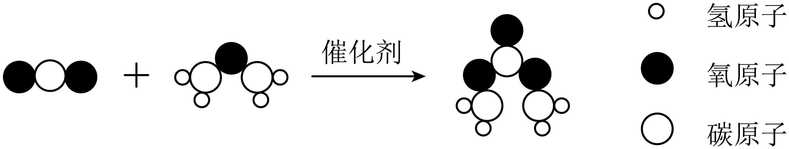
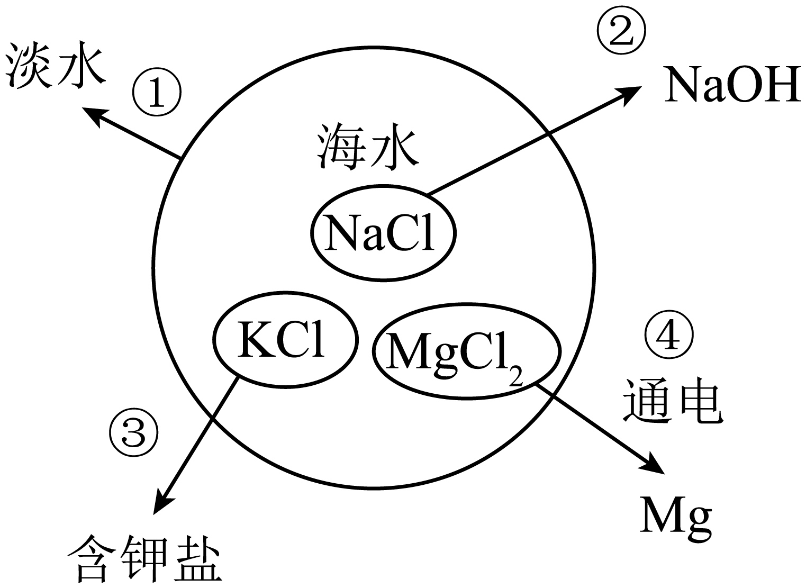
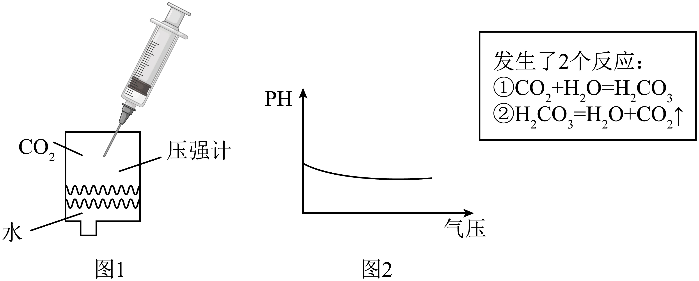
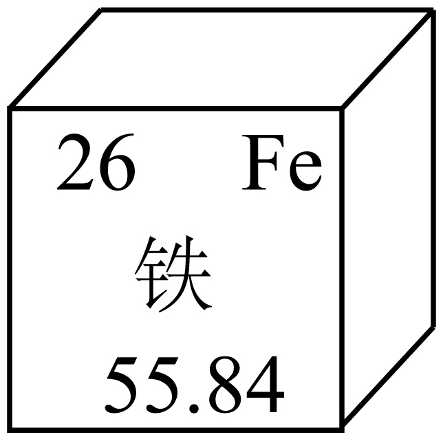

## **2025****年中考化学试卷**

**(****本卷共****16****小题，满分****45****分，考试用时****40****分钟****)**

**本卷可能用到相对原子质量：****H-1  Zn-65  Cl-35.5  Fe-56  O-16  C-12  Mg-24  Cu-64  S-32**
**一、选择题****(****共****10****小题，每小题****1.5****分，共****15****分。在每小题给出的四个选项中，只有一项是符合题目要求的****)**
1. “美丽中国我先行”，思考乐律培和海波同学认为下列不符合该主题的是
A. 在餐厅使用一次性餐具	B. 使用新能源汽车
C. 生活中垃圾分类	D. 污水处理达标后排放
【答案】A
【解析】
【详解】A、使用一次性餐具会产生大量难以降解的垃圾（如塑料），加剧“白色污染”，浪费资源且增加环境负担，故A符合题意；
B、使用新能源汽车，可以减少化石燃料使用和尾气排放，降低空气污染，故B不符合题意；
C、垃圾分类可以提高资源利用率，减少污染和填埋或焚烧压力，故C不符合题意；
D、污水处理达标后排放，可防止水体污染，保护水资源，故D不符合题意。
故选A。
2. 下面化学用语表示正确的是
A 锌：zn	B. 氯化钙：	C. 镁离子：	D. 四个磷原子：

【答案】B
【解析】
【详解】A、根据元素符号的书写方法，第一个字母要大写，第二个字母要小写，则锌元素符号为Zn，故选项化学用语表示不正确；
B、氯化钙中钙元素的化合价为+2，氯元素的化合价为-1，其化学式为，故选项化学用语表示正确；
C、由离子的表示方法，在表示该离子的元素符号右上角，标出该离子所带的正负电荷数，数字在前，正负符号在后，带1个电荷时，1要省略，若表示多个该离子，就在其离子符号前加上相应的数字，则镁离子可表示为Mg2+，故选项化学用语表示不正确；
D、由原子的表示方法，用元素符号来表示一个原子，表示多个该原子，就在其元素符号前加上相应的数字，则四个磷原子可表示为4P，故选项化学用语表示不正确。
故选B

3. 牡丹花含甘氨酸、维C、纤维素，花籽有大量的油脂，是很好的大豆替代品，思考乐升烨同学和泓锐同学下列说法错误的是
A. 每个甘氨酸分子(化学式)由10个原子构成
B. 维各原子质量比为
C. 纤维素的O元素质量分数最大
D. A-亚麻酸甘油酯含有3种元素
【答案】B
【解析】
【详解】A、每个甘氨酸分子(化学式C2H5NO2)由2个碳原子、5个氢原子、1个氮原子、2个氧原子，共2+5+1+2=10个原子构成，故A不符合题意；
B、维生素C（C6H8O6）中碳、氢、氧三种原子的质量比为，故B符合题意；
C、纤维素[(C6H10O5) n]中碳、氢、氧三种元素质量比为，则其中氧元素质量分数最大，故C不符合题意；

D、A-亚麻酸甘油酯（C57H92O6）是由碳、氢、氧三种元素组成，故D不符合题意。
故选B。
4. 碳酸乙二酯可用于生产可降解塑料，我国未来科学工作者思考乐莺莺同学以为主要原料合成的过程如图所示，思考乐海槟下列说法正确的是

A. 反应前后分子种类不变
B. 反应后催化剂质量减小
C. 参与反应的与质量比为
D. 保持化学性质的最小粒子是碳原子与氧原子
【答案】C
【解析】
【详解】A、化学反应前后，分子种类改变，故A错误；
B、根据催化剂的定义可知，催化剂的质量在化学反应前后不变，故B错误；
C、由图可知，该反应为二氧化碳和C2H4O在催化剂作用下反应生成C3H4O3，反应的化学方程式为，参与反应的CO2与C2H4O质量比为，故C正确；
D、由分子构成的物质，分子是保持物质化学性质的最小微粒。二氧化碳是由二氧化碳分子构成，则保持CO2化学性质的最小粒子是二氧化碳分子，故D错误。
故选C。
5. 下表中，思考乐钊钊同学的陈述1和思考乐召程同学陈述2完全正确且相关联的是
|  | 陈述1 | 陈述2 |
| --- | --- | --- |
| A | 潜水时需要携带氧气瓶 | 氧气具有助燃性 |
| B | 铜和硝酸银反应生成银 | 铜的金属活动性比银强 |
| C | 稀硫酸洒到大理石地面生成气体 | 实验室用稀硫酸和大理石制取二氧化碳 |
| D | 水结成冰后停止流动 | 结冰后，水分子停止运动 |

A. A	B. B	C. C	D. D
【答案】B
【解析】
【详解】A、潜水时携带氧气瓶，是因为氧气可供呼吸，与助燃性无关，故选项不符合题意；
B、铜和硝酸银反应生成银，说明铜的金属活动性比银强，故选项符合题意；
C、稀硫酸和大理石反应产生微溶物硫酸钙附着在碳酸钙的表面，阻止反应进一步进行，因此实验室不能用稀硫酸和大理石制取二氧化碳，故选项不符合题意；
D、水结成冰后，水分子仍然在不断运动，故选项不符合题意。
故选B。
6. 海洋资源是我国珍贵的自然资源，如图是思考乐丁丁同学发现的海水的主要成分，箭头表示不同物质间能转换，下列关于海水资源利用过程错误的是

A. 思考乐志雄同学提出步骤①可以通过蒸发实现
B. ②所需的设备需要抗腐蚀性能强
C. ③中低钠食盐含有的KCl可以补充人体中的K元素
D. 若④的产物只有两种单质，则另一种生成物为
【答案】A
【解析】
【详解】A、步骤①是将海水转化为淡水，可以通过蒸馏实现。如果只是蒸发海水，海水中的水蒸发为水蒸气，扩散至空气中，不能直接得到淡水，必须将水蒸气冷凝才能得到淡水，选项A错误；
B、步骤②中涉及到海水中的物质转化，海水具有一定的腐蚀性，所以所需的设备需要抗腐蚀性能强，选项B正确；
C、K是对人体健康有重要作用的常量元素，③中低钠食盐含有的KCl可以补充人体中的K元素，选项C正确；
D、④中反应物氯化镁是由镁和氯元素组成的，若④的产物只有两种单质，根据化学反应前后元素种类不变，这两种单质必须是镁和氯气（Cl2），选项D正确。
故选A。
7. 和是两种常见的氮肥，二者溶解度曲线如图所示，下列思考乐骥翔同学和思考乐帆帆同学说法正确的是

A. 的溶解度比的溶解度小
B. 将的饱和溶液升温至80℃，溶质质量分数会增大
C. 时饱和溶液质量分数为45.8%
D. 80℃时将加入200g水中，会形成不饱和溶液
【答案】D
【解析】
【详解】A、比较溶解度大小需指明温度，未指明温度时，不能直接说NH4Cl的溶解度比(NH4)2SO4的溶解度小，该选项错误；
B、(NH4)2SO4的溶解度随温度升高而增大，将20℃的饱和(NH4)2SO4溶液升温至80℃，(NH4)2SO4溶解度增大，溶液由饱和变为不饱和，但溶质、溶剂质量不变，根据，溶质质量分数不变，该选项错误；
C、40℃时NH4Cl的溶解度是45.8g，其饱和溶液质量分数为，该选项错误；
D、80℃时(NH4)2SO4的溶解度是94.1g，即该温度下100g水中最多溶解94.1g (NH4)2SO4，那么200g水中最多溶解188.2g (NH4)2SO4，将94.1g (NH4)2SO4加入200g水中，形成不饱和溶液，该选项正确。
故选D。
8. 下图为探究燃烧条件的微型实验装置示意图，思考乐傲傲同学实验前先通入至充满装置再往烧杯中加热水。下列傲傲同学的说法正确的是

A. 加入热水后，白磷未燃烧，是因为温度未达到白磷着火点
B. 推动注射器活塞，白磷燃烧，红磷仍不燃烧，说明燃烧需要可燃物
C. 白磷燃烧时再通入，白磷停止燃烧，说明隔绝可灭火
D. 思考乐傲傲同学指出本实验制备需要的反应物有2种
【答案】C
【解析】
【详解】A、加入热水后，白磷未燃烧，是因为装置内先通入CO2，白磷没有与氧气接触，而不是温度未达到着火点（白磷着火点40℃，热水80℃），该选项错误；
B、推动注射器活塞，H2O2在MnO2催化下分解产生O2，白磷燃烧，红磷仍不燃烧（着火点240℃），说明燃烧需要温度达到可燃物的着火点，而不是说明燃烧需要可燃物（白磷和红磷都是可燃物），该选项错误；
C、白磷燃烧时再通入CO2，隔绝了氧气，白磷停止燃烧，说明隔绝O2可灭火，该选项正确；
D、本实验制备O2是H2O2在MnO2催化作用下分解，MnO2是催化剂，不是反应物，反应物只有H2O2一种，该选项错误。
故选C。
9. 下列思考乐佳乐同学和娥冰同学实验中能达到相应实验目的的是
| 实验 | 方法 |
| --- | --- |
| A．除去铁钉表面的铁锈 | 加入过量稀硫酸 |
| B．除去中少量的 | 用燃着的木条 |
| C．鉴别碳粉和 | 加水观察是否溶解 |
| D．检验NaOH溶液是否变质 | 加入过量HCl |

A. A	B. B	C. C	D. D
【答案】D
【解析】
【详解】A、铁锈主要成分是Fe2O3，Fe2O3与稀硫酸反应生成硫酸铁和水，可除去铁锈，但过量稀硫酸会继续与铁反应，腐蚀铁钉，不能达到只除去铁锈的目的，该选项错误；
B、CO2不支持燃烧，大量存在时会使燃着的木条熄灭，不能用燃着的木条除去CO2中少量的O2，该选项错误；
C、碳粉和MnO2都难溶于水，加水观察是否溶解无法鉴别二者，该选项错误；
D、NaOH溶液变质是与空气中CO2反应生成Na2CO3，即，加入过量HCl，若有气泡产生，说明发生反应，溶液中存在Na2CO3，即NaOH溶液已变质，能达到检验目的，该选项正确。
故选D。
10. 思考乐伟杰同学如图1通过针筒改变试管内压强，图2为少闯同学发现的pH值随气压变化的关系，下列说法错误的是

A. pH随气压增大而减小
B. 当活塞吸气时，pH值变大，发生了反应②
C. 当气压小到一定程度时，瓶内pH值会大于7
D. 将剩余的水换成NaOH时，质量会减少
【答案】C
【解析】
【详解】A、由图 2 可知，随着气压增大，pH值减小，该说法正确；
B、当活塞吸气时，气压减小，H2CO3分解为CO2和H2O（反应②），酸性减弱，pH值变大，该说法正确；
C、最初是CO2和水的体系，溶液因CO2与水反应生成碳酸呈酸性，pH<7，当气压小到一定程度，碳酸因分解而减少，溶液仍显酸性，pH不会大于7，该说法错误；
D、将剩余的水换成NaOH时，CO2会NaOH与反应被吸收（），所以CO2质量会减少，该说法正确。
故选C。
**二、非选择题****(****共****4****题，共****30****分****)**
**【科普阅读】**
11. 阅读短文，回答问题：
探月工程发现月球上有一定量的钛酸亚铁矿，钛酸亚铁矿的主要成分为，思考乐芳芳同学通过研究嫦娥五号月壤不同矿物中的氢含量，提出一种全新的基于高温氧化还原反应生产水的方法。科研人员文丽同学发现，月壤矿物由于太阳风亿万年的辐照，储存了大量氢。氢元素以氢原子的形式嵌在中，氢原子在月壤中可以稳定存在。思考乐玲玲同学听说我国科学家利用氢和氧化亚铁，在高温条件下制得了水和铁。当温度升高至以上时，月壤将会熔化，反应生成的水将以水蒸气的方式释放出来。

（1）中Ti元素化合价为+4价，中Fe化合价为：___________；图中铁原子的质子数是：___________。
（2）___________，请帮助思考乐建豪同学写出电解水化学方程式：___________，“人造空气”中除有大量少量之外，还有___________

（3）思考乐赵林同学说为了使(2)中制得的铁硬度更大，耐腐蚀性更强，可以将铁制成___________。
【答案】（1）    ①. +2    ②. 26
（2）    ①. 2H    ②.     ③. 大量氮气、少量水蒸气
（3）合金
【解析】
【小问1详解】
中Ti元素化合价为+4价，O元素化合价为-2价，设铁元素的化合价为*x*，根据化合物中正负化合价代数和为零，得，即铁元素的化合价为+2价；
根据元素周期表一格可知，左上角的数字表示原子序数，即铁的原子序数为26，在原子中，质子数=原子序数，即铁原子的质子数是26；
故填：+2；26；
【小问2详解】
氢原子在月壤中可以稳定存在，我国科学家利用氢和氧化亚铁，在高温条件下制得了水和铁，则化学方程式为；
水在通电的条件下反应生成氢气和氧气，反应的化学方程式为；
空气成分按体积分数计算是：氮气约占78%，氧气约占21%，稀有气体约占0.94%，二氧化碳约占0.03%，还有其他气体和杂质约占0.03%。则“人造空气”中除有大量O2、少量CO2之外，还有大量氮气、少量水蒸气；
故填：2H；；大量氮气、少量水蒸气；
【小问3详解】
合金的硬度大于组成其纯金属的硬度，则为了使(2)中制得的铁硬度更大，耐腐蚀性更强，可以将铁制成合金，故填：合金。
12. 回答下列问题。
|  | 室温加水 | 加热 |
| --- | --- | --- |
|  | 生成溶液 | 无明显现象 |
|  | 生成溶液 | 生成二氧化碳 |
|  | 生成溶液和氧气 | 迅速生成氧气，爆炸 |

（1）思考乐世伟同学不慎将洗鼻盐撒到稀盐酸中，有气泡产生，小组成员利梅同学决定探究洗鼻盐的成分，经萧扬同学实验证明，产生的气体无色无味，能使澄清石灰水变浑浊。澄清石灰水变浑浊的化学方程式是________。
（2）再良同学认为可以先对洗鼻水进行加热，然后再进行其余检验，浩浩同学认为不对。请你写出浩浩认为不对的理由________。
洗鼻盐中另有一类含钠元素的盐类是什么？
（3）猜想一：_______；猜想二：；猜想三：。
家乐同学将洗鼻盐加入蒸馏水中，实验现象为大试管中出现水雾，_______(填写现象)，雯俊同学得出结论，猜想三是错误的。
（4）碳酸氢钠加热后能生成二氧化碳，曼妮同学已经把这个洗鼻水放到了大试管中，塞入带导管的橡胶塞，________(写实验操作步骤)，证明猜想二是对的。
（5）碳酸氢钠受热分解产生二氧化碳，请帮助苑婷同学写出化学方程式：_______。
（6）用相同浓度的浓盐水配制等质量的0.9%的盐水A和2.6%的盐水B，请问配制成A溶液加的蒸馏水多，还是配制成B溶液加的蒸馏水多？________
（7）洗鼻盐在_______下保存。
【答案】（1）
（2）加热可能会发生爆炸
（3）    ①.     ②. 溶液中没有气泡产生
（4）将导气管通入澄清石灰水中，加热洗鼻水，若澄清石灰水变浑浊
（5）
（6）A溶液    （7）干燥阴凉
【解析】
【小问1详解】
二氧化碳能使澄清石灰水变浑浊，二氧化碳能与氢氧化钙反应生成碳酸钙和水，反应的化学方程式为，故填：；
【小问2详解】
结合表中数据，若含有2Na2CO3⋅3H2O2，加热会迅速生成氧气，爆炸，故不能先对洗鼻水进行加热，故填：加热可能会发生爆炸；
【小问3详解】
根据题中信息可知，洗鼻盐中含钠元素的盐类可能是、、，即猜想一为，故填：；
实验结论是猜想三错误，则将洗鼻盐加入蒸馏水中，不会有氧气生成，即无气泡产生，故填：溶液中没有气泡产生；
【小问4详解】
碳酸氢钠受热分解产生二氧化碳，证明猜想二是对的，则需在证明有二氧化碳的生成，实验操作为：把这个洗鼻水放到了大试管中，塞入带导管的橡胶塞，将导气管通入澄清石灰水中，加热洗鼻水，若澄清石灰水变浑浊，证明猜想二是对的，故填：将导气管通入澄清石灰水中，加热洗鼻水，若澄清石灰水变浑浊；
【小问5详解】
碳酸氢钠在加热的条件下分解生成碳酸钠、水和二氧化碳，反应的化学方程式为，故填：；
【小问6详解】
设最终配制的盐水质量为m，则盐水A的蒸馏水质量：，盐水B的蒸馏水质量：，因为0.991m>0.974m，所以配制成A溶液加的蒸馏水多，故填：A溶液；
【小问7详解】
根据以上实验结论可知，洗鼻盐中含有碳酸氢钠，其受热易分解，故需在阴凉干燥处保存，避免高温或潮湿导致变质，故填：干燥阴凉。
13. 铜具有重要战略价值。古代以黄铜矿(其主要成分为)为原料，运用火法炼铜工艺得到铜。现代在火法炼铜工艺的基础上发展出闪速炼铜工艺。思考乐永浩同学对比二者原理如图：

（1）“闪速炼铜”速率远快于“火法炼铜”，思考乐科科同学由此可知，___________炼铜需要将黄铜矿颗粒粉末研磨得更细。
（2）火法炼铜中，思考乐林达同学发现持续向中鼓入空气并维持高温状态，这说明反应是___________(吸收/放出)热量，反应的化学方程式___________。
（3）反应生成的可用于工业制造一种酸，请帮助思考乐嘉煜同学写出这种酸___________(化学式)；可被石灰乳吸收，请说明其吸收效果优于石灰水的原因：___________。
（4）火法炼铜中，炉渣是由2种物质化合生成的，请帮助俊基同学写出沙子提供的物质___________(填化学式)。
（5）对比火法炼铜，思考乐怡妍同学发现闪速炼铜的优势有___________(填序号)。
a．高温更少，节约能源    b．原料更少，节省成本    c．无污染
【答案】（1）闪速    （2）    ①. 吸收    ②.
（3）    ①.     ②. 石灰乳中的浓度更大，能吸收更多
（4）
（5）ab
【解析】
【小问1详解】
“闪速炼铜” 速率远快于 “火法炼铜”，要加快反应速率，可通过增大反应物接触面积实现，所以闪速炼铜需要将黄铜矿颗粒粉末研磨得更细，以增大与空气的接触面积。
【小问2详解】
持续向中鼓入空气并维持高温状态，说明该反应需要不断吸收热量来维持反应进行，所以反应是吸收热量；
Cu2S与氧气在高温下反应生成铜和二氧化硫，化学方程式为。
【小问3详解】
SO2与水反应生成亚硫酸，亚硫酸可通过进一步反应生成硫酸，所以SO2可用于工业制造硫酸（H2SO4）；
氢氧化钙微溶于水，石灰乳是氢氧化钙的悬浊液，石灰水是氢氧化钙的稀溶液，石灰乳中氢氧化钙浓度更大，能与更多的SO2发生反应，所以石灰乳的吸收效果优于石灰水。
【小问4详解】
炉渣FeSiO3由铁、硅、氧元素组成，根据流程图，在火法炼铜中，铁元素来自FeO，沙子提供含硅元素的物质，根据质量守恒定律，化学反应前后原子的种类和个数不变，FeO中Fe、O的原子个数比为1∶1，而FeSiO3中Fe、O的原子个数比为1∶3，可知沙子提供的物质是SiO2。
【小问5详解】
a、从工艺流程看，闪速炼铜步骤相对火法炼铜更简洁，高温环节可能更少，能节约能源，该选项正确；
b、火法炼铜需要使用沙子，而闪速炼铜不需要使用沙子，因此原料更少，能节省成本 ，该选项正确；
c、闪速炼铜过程也会产生SO2等污染物，并非无污染，该选项错误。
故选ab。
14. 生活污水任意排放会导致环境污染，需经过处理，符合我国相应的国家标准后才可以排放或者循环使用，思考乐佳佳调查后发现某污水厂处理污水流程如下。

（1）格栅分离的原理类似于思考乐苏苏同学在实验室中___________操作。
（2）思考乐宽宽同学发现上述处理过程中，有化学反应的是___________池(任写一个)
（3）思考乐锐锐发现二级处理前一般不加消毒剂，原因是？
（4）思考乐亚亚和嘉贤用三级处理之后“中水”(里面含有少量氯气)养鱼，他们为了养观赏鱼，亚亚和嘉贤会使用鱼乐宝净化水，鱼乐宝主要成分，用消除氯气，假设每片药丸含有，请问平均每片鱼乐宝能消除多少氯气？(相对分子质量为158)

（5）为什么鱼乐宝使用中有安全隐患？请帮助思考乐桐斌和强飞根据反应原理说明理由___________。
【答案】（1）过滤    （2）消毒##活性污泥
（3）消毒剂会影响微生物的分解作用
（4）解：平均每片鱼乐宝能消除氯气的质量为*x*。
解得：*x*=56.8mg
答：平均每片鱼乐宝能消除氯气的质量为56.8mg。
（5）鱼乐宝反应生成的HCl和会污染水质，影响水中生物生长
【解析】
【小问1详解】
格栅分离的原理类似于思考乐苏苏同学在实验室中过滤操作，可以将不溶物除去，故填：过滤；
【小问2详解】
沉沙池、一次沉淀池、二次沉淀池中只是不溶物的沉降，无新物质的生成，属于物理变化；活性污泥池中涉及微生物的分解，该过程中有新物质的生成，属于化学变化；消毒池中使用含氯消毒剂，这些消毒剂与水中的微生物反应，生成新的物质，从而完成杀菌过程‌，属于化学变化，故填：消毒或者活性污泥；
【小问3详解】
消毒剂会影响微生物的分解作用，所以在二级处理前一般不加消毒剂，故填：消毒剂会影响微生物的分解作用；
【小问4详解】
详见答案；
【小问5详解】
结合（4）可知，鱼乐宝反应生成的HCl和NaHSO4会污染水质，影响水中生物生长，存在一定的安全隐患，故填：鱼乐宝反应生成的HCl和NaHSO4会污染水质，影响水中生物生长。
