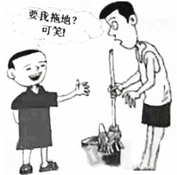
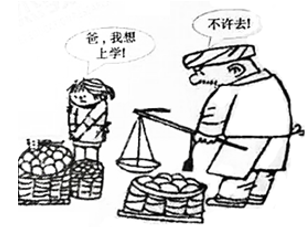
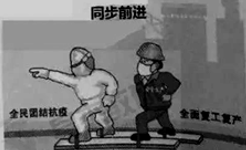

# 2020年广东省深圳市中考道德与法治试卷
### **一､单项选择题****(****本大题共****20****小题****,****每小题****3****分****,****共****60****分｡在各题的四个选项中****,****只有一项是最符合题意要求的答案｡****)**
1.(3分)青春由磨砺而出彩,人生因奋斗而升华｡鲁迅先生说,青年所多的是生力,遇见深林,可以辟成平地;遇见旷野,可以栽种树木;遇见沙漠,可以开掘井泉｡这告诉我们(  )
A.青春的时光是美好的,我们应该珍惜青春	B.青春的力量是无穷的,任何困难都能克服
C.青春有无限的可能,只要肯努力就能成功	D.青春的力量是强大的,在努力奋斗中释放

2.(3分)劳动是成功的必经之路,劳动是成长成才的题中之义｡对如图中孩子的言行认识正确的是(  )
A.孩子没有相应的劳动技能			B.孩子没有正确的劳动态度
C.劳动是获得报酬的重要手段			D.家庭是实施劳动的重要场所
3.(3分)生命安全是一个永恒的话题｡毒品､艾滋病､溺水､交通意外等都可能对青少年的生命安全构成潜在的威胁｡为此,青少年要(  )
①充分认识毒品､艾滋病､溺水等危害	②加大执法力度,减少安全事故的发生
③切实提升自身的安全防护意识和技能	④知险不涉险,遇险能理智科学地处理
A.①②③		B.①②④		C.①③④		D.②③④
4.(3分)在第八届世界围棋巅峰对决上,中国选手柯洁战胜了韩国棋手“第一人”朴廷桓,取得了冠军｡人们总以为他是个“常胜将军”,但恰恰相反,他是一路“输”过来的!这说明(  )
A.生活道路总是不平坦的,人生难免有挫折	B.失利和失败更有利于促使一个人走向成功
C.面对不同的挫折,不同的人有不同的感受	D.挫折往往成为意志坚强的人成功的垫脚石
5.(3分)因公交车急刹车,车上一名小学生手里的豆浆打翻在车厢的地板 上,他立刻拿出纸巾,蹲下来一遍遍地擦拭地上的豆浆,直到擦拭干净｡这名小学生的行为体现了(  )
A.行己有耻的心理品质				B.止于至善的精神追求
C.知错能改的思想意识				D.见贤思齐的行为习惯
6.(3分)家风正,则民心淳;民风正,则社稷安｡每到春节,很多家庭都选择了如“忠厚传家远,孝悌守业长”“成事成名成伟业,立人立德立家风”等对联,对联的字迹虽经风吹日晒或有模糊,但好家风代代相传｡可见好家风(  )
A.是一个家庭文化的延续,是有形的财富	B.是推动全家努力奋斗､名利双收的法宝
C.是家庭兴旺和社会稳定的精神源泉之一	D.是中华民族特有的传统美德和精神支柱
7.(3分)小亮玩微信时结识了一个自称夏先生的人,双方聊得比较投缘｡不久后,夏先生称可以带他一起发财,并通过微信发了一个链接,让小亮下载并注册账户｡你给小亮的合理建议是(  )
A.这是个好机会,应马上下载并注册账户	B.要相信网友,以免伤害彼此之间的感情
C.可先注册账户,一旦发现受骗再退出来	D.要避免轻信盲从,不轻易泄露个人信息
8.(3分)某老板在其餐馆停业之前,逐个打电话､发微信通知在其餐馆办消费卡的会员来退款｡这事在网络传开后,网友们纷纷称赞其为“良心店家”｡这是因为(  )
A.社会缺乏最基本的诚信观念			B.诚信是中华民族的特有美德
C.它印证了当今社会诚信之难			D.商家坚守了诚信经营的美德
9.(3分)十三届全国人大三次会议一审通过新修订的《中华人民共和国未成年人保护法(草案)》,增设了“网络保护”专章,对网络环境管理､网络沉迷防治､网络欺凌及侵害的预防和应对等作出全面规范｡这是为了(  )
A.便于未成年人使用网络进行社交活动		B.方便未成年人通过网络途径收集信息
C.保障和引导未成年人安全合理使用网络	D.让未成年人能够通过网络进行娱乐活动
10.(3分)中学生小雪的一篇小说被一家杂志社录用发表,杂志社给小雪寄来了样刊和稿费汇款单,同时还在备注栏里标明了应纳税的金额｡对此,理解不正确的是(  )
A.公民可以只享有权利不履行义务		B.公民的权利和义务是相统一的
C.公民享有权利同时履行法定义务		D.权利和义务相互依存相互促进
11.(3分)梅梅去一家超市购物,结账后通过安检门时,报警装置鸣叫不停｡超市保安立即将她带到旁边的安保室,强迫其脱下外套接受检查｡保安的行为侵犯了梅梅的(  )
A.财产所有权		B.肖像权		C.人身自由权		D.健康权

12.(3分)对如图所反映的问题,认识正确的是(  )
①爸爸侵犯了女儿的受教育权			②孩子应理解父母,为家长分忧
③女儿应该听爸爸的话不去上学		④相关组织应劝诫和制止爸爸的行为
A.①②			B.①④			C.②③			D.③④
13.(3分)杨先生外出时忘了关好水龙头,导致房间积水并渗入楼下静静家,使得墙皮发霉,客厅沙发､电器浸水毁坏｡静静要求杨先生恢复原状并赔偿损失,遭到拒绝｡对此,静静可以(  )
A.提起民事诉讼来维权	B.提起行政诉讼来维权
C.提起刑事诉讼来维权	D.曝光其个人信息维权
14.(3分)郭某在小区骑车时将一男童撞伤,却想离开现场,受到孙某阻拦,郭某因情绪激动心脏骤停死亡｡郭某家属起诉孙某要求承担赔偿责任｡法院认为孙某对郭某侵害儿童权益的行为进行合理阻止,属于见义勇为行为,判决孙某无需担责｡法院的判决(  )
A.引导公民培养自由的品德			B.营造平等的社会风气
C.杜绝全社会违法犯罪行为			D.捍卫社会的公平正义
15.(3分)十九届四中全会将按劳分配为主体､多种分配方式并存,社会主义市场经济体制等纳入到社会主义基本经济制度之内｡这一调整旨在(  )
A.缩小我国城乡居民收入的贫富差距		B.为经济的高质量发展提供制度保障
C.让市场在资源配置中起基础性作用		D.维护市场公平,刺激经济高速增长
16.(3分)2020年6月23日,我国自主建设,独立运行的由55颗卫星构成的北斗卫星导航系统部署全面完成｡它为全球用户提供全天候､全天时､高精度的定位､导航和授时服务｡这说明(  )
A.科技创新对人类的生产生活方式产生深刻的影响
B.创新是第一生产力,是推动社会变革的决定因素
C.北斗导航系统已完全应用于国计民生的各个领域
D.我国的科技创新能力已经处于世界最先进的水平
17.(3分)在民法典编纂过程中,立法机关10次公开征求意见,累计收到42.5万人次提出的102万条意见和建议,让立法最大范围凝聚社会共识､吸纳各方智慧,形成“最大公约数”｡这体现了(  )
①严格执法②民主立法③科学立法④全民守法
A.①②			B.①④			C.②③			D.③④

18.(3分)2020年6月5日,中国生态环境部正式发布了“中国生态环境保护吉祥物”它以“青山绿水”为设计原型,表达出环境就是民生,决不以牺牲环境为代价去换取一时的经济增长｡吉祥物传达出(  )
A.绿水青山就是金山银山的理念		B.绿色､环保､共享的发展理念
C.节约资源､保护环境的战略方针		D.构建人类卫生健康共同体的方案
19.(3分)2020年6月30日,十三届全国人大常委会全票通过了《中华人民共和国香港特别行政区维护国家安全法》,7月1日在香港生效｡这(  )
A.表明了人民代表大会是我国最高的权力机关
B.体现了我国重视香港特别行政区的经济建设
C.有利于保障香港“一国两制”事业行稳致远
D.表明我国开始贯彻港人治港､高度自治方针
20.(3分)习近平在“一带一路”国际合作高级别视频会议上说,疫情当下,我们愿同合作伙伴一道,把“一带一路”打造成团结应对挑战的合作之路､维护人民健康安全的健康之路､促进经济社会恢复的复苏之路､释放发展潜力的增长之路,这体现了(  )
A.中国在世界舞台上引领国际合作的走向	B.中国秉持着共商共建共享的全球治理观
C.疫情下世界经济的恢复主要依赖于中国	D.中国致力于构建经济全球化的全新格局
### 		**二､非选择题****(****共****40****分****)****	**
21.(10分)阅读材料,回答问题｡
       周一清晨,某校正在举行庄严的升旗仪式｡全校师生面向国旗,肃立致敬,奏唱国歌｡国旗迎着朝阳冉冉升起,嘹亮的国歌声响彻校园｡在整个升旗的过程中,小吴同学既没有致敬,也未唱国歌,事后,班长小军提醒小吴,小吴却说:“致不致敬,唱不唱国歌是我的自由｡”
(1)请列举一部与我国国旗相关的法律｡参加升旗仪式,有利于培养我们的美好情感｡这种美好情感是什么?
(2)请运用“法治与自由”的相关知识,对小吴的言行进行简要评析｡
22.(14分)阅读材料,回答问题｡
       某中学开展研学旅行活动,人文组同学来到敦煌,参观艺术宝库,拜访国宝守护人,研读文献资料｡以下是该组撰写的两则交流汇报材料:
       材料一:从公元4世纪开始,经过持续千年的营造,莫高窟成为世界上保存最完整､规模最宏大的佛教石窟艺术群｡在735个石窟中,保存着4.5万平方米的壁画和2000多身彩塑,5万余件以多种民族语言书写的佛教经卷､社会文书､木版画､绢画､麻布画等｡在壁画和彩塑中,可以清晰地看到不同文明交流､对话和互鉴,有希腊风格和印度风格的塑像,还有这两种风格融合的新造像,佛教的飞天与道教的飞仙,中国的神怪与印度的诸天,在此汇聚一窟,各放异彩｡
       材料二:让千年宝库焕发新生,离不开以樊锦诗为代表的几代莫高窟人一生的坚守｡樊锦诗自北京大学毕业后,舍小家顾大家,精心保护和修复珍贵文物,潜心研究和弘扬敦煌文化艺术,推动专项法规的公布与实施,主持出版《敦煌石窟考古全集》,引入数字化技术,探索解决文物保护和旅游开发的两难问题……她用56年的时光守护敦煌,从青春少女到满头华发｡在新中国成立70周年之际,樊锦诗获得“文物保护杰出贡献者”国家荣誉称号｡
(1)结合材料,分析敦煌文化体现了中华文化的哪些特征?
(2)结合上述材料,分析樊锦诗获得国家荣誉称号的原因｡

23.(16分)阅读材料,回答问题｡
       新型冠状病毒肺炎是近百年来人类遭遇的影响范围最广的全球性大流行病,也是新中国成立以来发生的传播速度最快､感染范围最广､防控难度最大的一次重大突发公共卫生事件,对中国是一次危机,也是一次大考｡
       材料一:2020年6月7日,国务院发布《抗击新冠肺炎疫情的中国行动》白皮书｡白皮书指出,疫情发生后,在中国共产党的领导下,我国前所未有地调集全国人力､物力､财力开展大规模医疗救治,不遗漏一个感染者,不放弃每一位病患｡全国人民万众一心,仅仅用3个月左右的时间,疫情防控阻击战取得重大战略成果｡
       材料二:自2020年1月份以来,受疫情影响,全国一段时间内经济出现下滑甚至短期“停摆”｡不少企业特别是中小企业和个体工商户停工停产,一些贫困主体或低收入者因无法外出务工,严重降低了收入水平｡2020年是脱贫攻坚决战决胜之年,但突发的疫情可能会影响到脱贫攻坚进程｡为此,我国在毫不放松加强疫情防控的同时,有序推动复工复产｡
(1)结合材料一,我国经受住本次疫情的大考体现了什么道理?
(2)结合材料二,说明我国全面复工复产与疫情防控同步前进的必要性｡
(3)结合以上材料,从文明健康生活的角度谈谈我们能做些什么?
解析:
1.题干描述表明青春的力量是强大的,我们在努力奋斗中释放,开创出属于自己的灿烂的人生,D符合题意;A与题意不符;B错误,“任何困难都能克服”绝对;C错误,“只要肯努力就能成功”绝对｡
故选:D｡
2.劳动虽然有分工不同,却没有高低贵贱之分｡凡是在自己的岗位上,勤勤恳恳､兢兢业业为社会创造财富､为人民服务的劳动者,就都是光荣的,应该得到全社会的尊重;“要我拖地可笑”是没有树立起正确的劳动态度,B符合题意;ACD与漫画寓意不符｡
故选:B｡
3.为预防威胁青少年生命安全事件的发生,青少年要充分认识毒品､艾滋病､溺水等危害,树立自我防范意识;掌握自救自护知识,提升自身的安全防护意识和技能,提高自我保护能力;掌握有效处理突发事件的常用方法,知险不涉险,遇险能理智科学地处理,①③④符合题意;②不是青少年的做法｡
故选:C｡
4.中国选手柯洁战胜了韩国棋手“第一人”朴廷桓,取得了冠军｡人们总以为他是个“常胜将军”,其实他是一路“输”过来的!这说明挫折往往成为意志坚强的人成功的垫脚石,挫折孕育成功,D符合题意;AC与题干不符;B错误,失利和失败会阻碍人走向成功｡
故选:D｡
5.题干中小学生的行为,是有知耻之心和底线意识的表现,能对自己的行为负责,弥补不足,体现了行己有耻的心理品质,A说法正确,符合题意;BCD不合题意｡
故选:A｡
6.由题意可知,好家风是家庭兴旺和社会稳定的精神源泉之一,C正确,符合题意;A错误,应该是无形的财富; D错误,好家风是中华民族的传统美德,而不是特有;B错误,不是名利双收的法宝｡
故选:C｡
7.网络具有虚拟性,带有很多不确定的因素,我们要有一定的自我保护意识,小亮应该提高警惕,避免上当受骗,不要轻易泄露个人信息,D正确;ABC中的做法均不利于自我保护,排除｡
故选:D｡
8.材料中老板的行为:“在其餐馆停业之前,逐个打电话､发微信通知在其餐馆办消费卡的会员来退款”,这是诚信的表现,是负责任的表现,选项D是对的;选项A不能从材料中体现出来;选项B说法太绝对了;选项C不对,恰恰相反,而是印证了当今社会诚信的良好风气｡
故选:D｡
9.十三届全国人大三次会议一审通过新修订的《中华人民共和国未成年人保护法(草案)》增设的内容,有利于保障和引导未成年人安全合理使用网络,我们要提高媒介素养,要学会“信息节食”,自觉遵守道德和法律,做一名负责的网络参与者,B是正确的选项;ABD不符合题意｡
故选:C｡
10.“获得稿费”是权利,“纳税”是义务,“在寄来稿费汇款单的同时标明了应纳税的金额”表明公民的权利和义务是相统一的,二者相互依存､相互促进,公民享有权利同时履行法定义务,BCD理解正确;A错误,公民不能只享有权利而不履行义务｡
故选:A｡
11.《宪法》第三十七条规定:“中华人民共和国公民的人身自由不受侵犯｡任何公民,非经人民检察院批准或者决定或者人民法院决定,并由公安机关执行,不受逮捕｡禁止非法拘禁和以其他方法非法剥夺或者限制公民的人身自由,禁止非法搜查公民的身体｡”据此判断,题文材料中保安的行为侵犯了梅梅的人身自由权,C符合题意;ABD与题意不符｡
故选:C｡
12.漫画反映了家长侵犯了女儿的受教育权的现象,针对这类问题,相关部门应劝诫和制止爸爸的行为,依法保护女儿的受教育权,故①④正确;②③错误,孩子应依法维护自己的受教育权｡
故选:B｡
13.静静家因楼上杨先生忘了关水龙头,受到损失,在要求赔偿遭到拒绝的情况下,静静可以到法院打官司,通过民事诉讼来维权,A符合题意;BC错误,不能通过行政诉讼和刑事诉讼的方式来维权;D错误,曝光个人信息,侵犯隐私权｡
故选:A｡
14.社会公平正义就是社会各方面的利益关系得到妥善协调,人民内部矛盾和其他社会矛盾得到正确处理,社会公平和正义得到切实维护和实现｡题文中,法院的判决维护了孙某的合法权益,体现了法律捍卫社会的公平正义,D符合题意;题文涉及维护公平正义,与自由､平等无关,AB排除;杜绝的说法过于绝对,C错误｡
故选:D｡
15.“将按劳分配为主体､多种分配方式并存,社会主义市场经济体制等纳入到社会主义基本经济制度之内”旨在旨在为经济的高质量发展提供制度保障,B符合题意;A与题意不符,C错误,市场在资源配置中起决定性作用;D中“经济高速增长”的说法错误,经济应该是高质量发展｡
 故选:B｡
16.题文材料表明我国高度重视科技创新并取得了积极成果,科技创新对人类的生产生活方式产生深刻的影响,故A正确;B错误,科技是第一生产力;C错误,北斗导航系统还没有完全应用于国计民生的各个领域;D错误,“处于世界最先进的水平”的观点不符合实际｡
故选:A｡
17.从材料中民法典的立法过程来看,可以看出立法过程中,国家尊重和保障人权,人民是国家的主人,②③是对的;①④不能从材料中体现出来｡
故选:C｡
18.吉祥物体现了我国重视经济建设与环境保护协调发展,表明坚持绿色富国,绿色惠民,已经成为我们的共识,坚持人与自然和谐共生,绿水青山就是金山银山,启示我们每个人都是生态环境的保护者､建设者､受益者,要积极践行绿色生产生活方式,共同守护地球家园,A是正确的选项;B材料没有体现共享的发展理念;C错误,节约资源､保护环境的基本国策;D不符合题意｡
 故选:A｡
19.2020年6月30日,我国香港特别行政区公布实施《中华人民共和国香港特别行政区维护国家安全法》,体现了我国坚定支持香港地区的发展和繁荣,有利于全面准确贯彻“一国两制”､“港人治港”､高度自治的方针,保障香港“一国两制”事业行稳致远,C符合题意;A错误,全国人民代表大会是我国最高的权力机关;B与题意不符;D错误,我国一直贯彻港人治港､高度自治方针｡
故选:C｡
20.题文材料表明中国是一个合作的大国,秉持着共商共建共享的全球治理观,推进“一带一路”B正确;AC错误,“引领”“主要依赖”的观点与实际不符;D错误,经济全球化的趋势早已形成｡
故选:B｡
21.(1)本题考查列举一部与我国国旗相关的法律,并写出与其相关的美好情感｡结合实际,可列举《中华人民共和国国旗法》,从中体会爱国的美好情感｡据此作答｡
(2)本题考查对材料中小吴的言行进行简要评析｡首先判断表态:言行是错误的;然后说明理由:依据教材知识,分析材料,可从小吴是有自由的,但自由是相对的,法治标定了自由的界限,奏国歌时要肃立､庄重,小吴没有遵守这一法律定等方面作答｡
故答案为: (1)《中华人民共和国国旗法》;爱国的情感｡ (2)小吴的言行是错误的;小吴拥有自由,但自由是相对的,是法律之内的自由,自由在法律上的体现,就是我们享有的和正当行使的各项权利;奏国歌时,在场人员要肃立､举止庄重,不得有不尊重国歌的行为,这是我国法律的规定｡法治标定了自由的界限,自由的实现不能触碰法律的底线,违反法律可能付出失去自由的代价,这要求小吴必须遵守法律规定,要向国旗致敬,唱国歌｡
22.(1)本题考查对中华文化特征的认识｡结合材料内容及教材知识,从中华文化的源远流长､博大精深､有容乃大的包容力等方面组织答案即可｡
 (2)本题考查樊锦诗获得国家荣誉称号的原因｡结合材料中的人物事迹,可从爱国主义､弘扬中华文化等方面考虑作答,言之有理即可｡
 故答案为: (1)“从公元4世纪开始,经过持续千年的营造”体现了中华文化源远流长的特征;“多种民族语言书写的佛教经卷､社会文书､木版画､绢画､麻布画等”,体现了中华文化博大精深的特征;“在壁画和彩塑中,可以清晰地看到不同文明交流､对话和互鉴”,体现了中华文化有容乃大的包容力｡ (2)樊锦诗有强烈的爱国情感;爱岗敬业;为国家的文化繁荣发展,弘扬中华优秀传统文化无私奉献;保护珍贵文物,为延续文化血脉,铸就中华文化新辉煌做出了巨大贡献｡
23.(1)本题考查中华民族在疫情防控阻击战中取得重大胜利说明的道理｡结合材料一,可从社会主义制度具有优越性,坚持以人民为中心的发展思想,中国共产党的领导,中华民族不屈不饶的民族精神和众志成城的团结力量等方面作答｡
(2)本题考查我国全面复工复产与疫情防控同步前进的必要性｡结合材料二,从全面复工复产提供有力的物质保障､确保完成决战脱贫攻坚目标任务､发展是我国解决一切问题的基础和关键等方面解答｡
(3)本题考查我们怎样培养健康文明的生活方式｡从树立文明健康的生活意识､小事做起､积极配合政府和街道办的工作等方面组织答案｡
故答案为: (1)①面对新冠肺炎疫情这样的大考,中国人民万众一心､众志成城,这是我国国家制度和国家治理体系强大威力､强大治理效能最直接､最生动的体现｡②体现了我们党坚持以人民为中心的发展思想,也体现了我国国家制度和国家治理体系的本质属性｡③体现了中国共产党领导和中国特色社会主义制度的显著优势,展示了强大的综合国力､治理能力和动员能力,展现了中华民族不屈不饶的民族精神和众志成城的团结力量｡ (2)①全面复工复产与疫情防控同步前进关系到为疫情防控提供有力物质保障,关系到民生保障和社会稳定,关系到实现全年经济社会发展目标任务｡②全面复工复产维护经济发展和社会稳定大局,确保完成决战脱贫攻坚目标任务,全面建成小康社会｡③发展是我国解决一切问题的基础和关键,也是抗击疫情最有力､最有效的举措｡ (3)①树立文明健康的生活意识｡②从身边的小事做起,勤洗手､勤消毒,不乱去人口密集的地方｡③积极配合政府､街道办的工作,为文明健康贡献自己的力量｡
