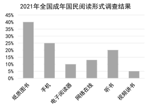
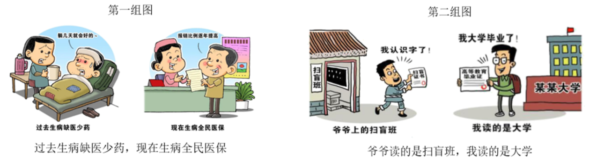

## **2021-2022****年深圳市初中学业水平考试**

## **道德与法治**
1. 青春如诗，岁月如歌。初中生活是丰富多彩的，三年的点点滴滴见证了我们的成长，也承载着对未来的期盼。因此，我们应该（    ）
A. 激发潜能，不断超越自我	B. 顺其自然，生活随遇而安
C. 标新立异，创造生命价值	D. 调适心态，享受当下青春
2. 以下是2021年全国成年国民阅读形式调查结果，请判断以下说法哪个是正确的（   ）

A. 阅读伴随成长，手机阅读成为最多选择
B. 学习点亮明灯，国民学习习惯已经养成
C. 方法催生成功，方法恰当才能提高效率
D. 网络丰富生活，为文化传播搭建新平台
3. 下列对“微行为”的“微点评”恰当的是（    ）
| 选项 | 微行为 | 微点评 |
| --- | --- | --- |
| A | 小江把同桌的秘密告诉自己的好朋友 | 呵护友谊 |
| B | 小军组建“班级打卡小组”进行体能训练 | 小团体主义 |
| C | 小华在“青骄第二课堂”学习禁毒知识 | 守护生命 |
| D | 小肖自觉爱护公共设施，遵守公共秩序 | 自信自强 |

A. A	B. B	C. C	D. D.
4. 劳动课将在2022年秋季学期正式成为全国中小学的一门独立课程，该课程包含整理与收纳、烹饪与营养、传统工艺制作、公益劳动与志愿服务等内容，劳动课程的设置有利于引导中小学生（    ）
①重视课外实践，忽略课堂学习   ②树立劳动观念，养成劳动习惯
③尊重劳动成果，提高劳动素养   ④巩固理论知识，培养批判精神
A. ①②	B. ①④	C. ②③	D. ③④
5. 某中学生放学骑车时，不慎剐蹭到路边的一辆私家车，他主动留下道歉信，并附上联系方式。车主通过所留联系方式，致电询问该学生是否受伤，并接受了他的道歉。这一事例说明（    ）
A. 乐于助人是社会主义新风尚	B. 诚实守信能够促进社会和谐
C. 尊重他人是立身处世的前提	D. 遵纪守法能更好地享有自由
6. 2022年获评全国五好家庭的莫益娟夫妇，13年如一日先后照顾了30个社会孤残儿童，用爱心、耐心、责任心陪伴这些孩子，让他们感受到家的温暖。由此可见，此夫妇（    ）
A 热心公益，赢得他人荣誉赞许

B. 见义勇为，不计个人利益得失
C. 孝亲敬长，履行公民法定义务
D. 关爱他人，传递了社会正能量
7. 确认公民的基本权利并保障其实现，是宪法的核心价值。以下图片生动地展示了这一点，我们可以看出（    ）

①人民幸福的生活是最大的人权
②公民享有广泛政治权利和自由
③宪法是其他法律立法基础

④公民的生活需要宪法的保障
A. ①②	B. ①④	C. ②③	D. ③④
8. 一商家因疫情期间哄抬物价，扰乱市场秩序，受到严厉处罚，这说明（    ）
A. 权利义务相统一，违反法律须担责
B. 行使权利有界限，扰乱市场是犯罪
C. 法无授权不可为，执法权力要用好
D. 社会生活有规律，遵守规则靠他律
9. “米粒虽小，尤见礼义廉耻 ；节俭事微，可助兴国安邦”。粮食安全是“国之大者”，这告诉我们（    ）
①维护国家粮食安全公民基本权利

②节约粮食是中华民族的传统美德
③粮食安全是国家安全观的重要基础
④维护粮食安全有利于维护国家安全
A. ①②	B. ①③	C. ②④	D. ③④
10. 下列三幅漫画所反映的诉讼类型从左到右依次是（   ）

A. 民事诉讼、行政诉讼、刑事诉讼
B 刑事诉讼、行政诉讼、民事诉讼

C. 刑事诉讼、民事诉讼、民事诉讼
D. 民事诉讼、民事诉讼、刑事诉讼
11. 2022年全国两会开幕，广东省深圳市组织“我向两会提建议”活动，广大学生积极参与，提交共2700条建议，其中多条被人大代表和政协采纳。同学们热情参与提议和建议有利于（   ）
①完善基本自治制度
②增强公民参与意识
③促进科学民主决策
④推进民主选举制度
A. ①③	B. ②③	C. ②④	D. ③④
12. 荣获第26届“中国青年五四奖章集体”的“天鲲号”团队成员平均年龄只有32岁，他们精诚合作，常常需要克服极端恶劣天气，连续高强度作业，一次性完成海上吹沙填海造岛任务，用青春和热血征服汹涌巨浪。他们的行动（   ）
①体现了团结一心，敬业创优的精神
②展现了不怕困难，扶危济困的品质
③体现了迎难而上追求卓越的青年担当
④展示了锐意进取改革创新的时代精神
A ①②	B. ①④	C. ②③	D. ②④

13. 2016年以来，深圳通过资金支持。人才支援，产业合作等形式，全方位帮扶广西壮族自治区百色市地区，帮扶百色市7.18万人口脱贫，由此可见，深圳对口帮扶发挥作用路径正确的是（    ）
①多措并举帮助百色地区；
②助力百色地区人口脱贫；
③实现百色地区民族平等；
④促进百色地区经济社会发展
A. ①——③——②	B. ①——②——④
C. ①——④——③	D. ①——④——②
14. 习近平总书记在北京冬奥会、冬残奥会总结表彰大会上指出，开闭幕式精彩纷呈，人类命运共同体主题贯穿始终，中华文化与冰雪元素交相辉映，体现了自然之美、人文之美、运动之美，诠释了新时代中国可信、可爱、可敬的形象，向世界发出了“一起向未来”的时代强音。这表明（   ）
A. 世界多极化深入发展，推进国际关系民主化
B. 中国主导国际事务，展现负责任的大国形象
C. 各国共同倡导合作共赢，消除地区发展差异
D. 中国愿与世界各国携手共进，共享发展机遇
15. 阅读材料，回答问题。
[共话发展之路]
中学生小轩一家围坐在一起，畅聊生活变化，爷爷、爸爸、小轩、奶奶、妈妈依次谈了自己的感受。
爸爸：20年前，我在村办工厂工作，一个月能领1000元。
小轩：表姐在国企上班，现在每个月工资有7000多元。
爷爷：45年前，我在村里种地，年收入都不到100元。
奶奶：40多年来，村民们在党支部的带领下，齐心协力，修了路、盖了楼、致了富，日子越过越好。
妈妈：这都是因为……
（1）三代人的对话中提到了多种所有制形式，请写出其中一种。
（2）请根据对话内容，运用所学知识，续写妈妈的话。
 [展现思辨之美]
小轩家所在的传统村落三面环山，一面临海，绿树环绕、环境优美，是省级生态文明示范村。为了实现经济跨越式发展，村支书组织大家召开村民议事会，商讨一条发展的新路子。以下是村民们正在讨论的两个发展方案。
方案一：开挖后山建工厂，获利之后再修复。
方案二：推倒传统古建筑，扶持村民修民宿。
（3）请选择其中一个方案进行辨析。
16. 阅读材料，回答下列问题。
文明是个体教养和开化的表征，也是社会进步、国家发展的目标。2005年深圳成为首批全国文明城市、至今连续六届获此殊荣。目前深圳市正在全力创建第七届全国文明城市。
[文明有序 “圳”在行动]
深圳每年开展“关爱行动”，传播爱心故事；倡导“德者有得”，激励各类善行义举；积极推进“志愿者之城”建设，每天可供市民在线报名参与的志愿者服务项目达1200项。
深圳积极打造“法治先行示范城市”，法治政府建设、司法体制改革走在全国前列。全市共有888个法律援助工作站点、895家律师事务所、1.7万名律师。遵法守法成为人们的自觉行动。
（1）请根据以上材料，归纳深圳创建全国文明城市的成功经验。
[法治有力 呵护鹏城]
| 立法实践 | 条文摘选 |
| --- | --- |
| 《深圳市人民代表大会常务委员会关于加强人民法院民事执行工作若干问题的决定》 | 加强人民法院的民事执行工作，保障当事人合法权益，维护法律权威。 |
| 《深圳经济特区城市管理综合执法条例》 | 规范城市管理综合执法行为，保护公民、法人和其他组织的合法权益。 |
| 《深圳经济特区矛盾纠纷多元化解条例》 | 有效化解矛盾纠纷、保障当事人合法权益，维护社会和谐稳定。 |

（2）请结合上表，说说深圳是如何通过法治建设让人们生活更美好的。
[青春有约 聚力前行]
“网络文明传播”是“全国文明城市测评体系”的一项重要指标。深圳创建文明城市，离不开青春的你。
（3）请以一名网络文明传播志愿者的身份设计一个宣传活动，通过网络将身边的好人好事进行广泛宣传。
