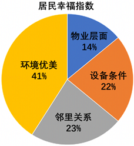
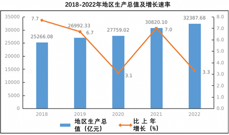
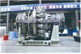

## **2023年广东省深圳市中考道德与法治试卷**
**一、单选题**
1．时代各有不同，青春一脉相承。青春，带着特殊的邀约，款款而来，对此，我们应该（　　）
A．怀揣梦想，追求物质财富
B．砥砺奋进，承担时代使命
C．努力学习，乐于超越他人
D．完善自己，唯求独善其身
2．深圳市开展禁毒先锋青少年教育培训行动，这是深化青少年预防毒品教育的创新举措。此项活动提倡我们（　　）
A．依法自律，远离毒品危害
B．珍爱生命，探寻生命意义
C．尊崇法治，参加扫毒行动
D．自律自强，克服一切诱惑
3．道德与法治课堂开展事例评价活动，以下事例和评价不合理的是（　　）
| 事例 | 评价 |
| --- | --- |
| A.深圳市中小学将人工智能学习纳入地方课程 | 评价：有利于培养学生的创新意识和能力 |
| B.某中学将绘画，摄影，烹饪，花艺，棒球等纳入到校内社团当中 | 评价：有利于五育并举，促进学生全面发展 |
| C.小粤在一次聚会上，主动和长辈打招呼，用公筷给他人夹菜 | 评价：践行文明，尊重他人 |
| D.YYDS、躺平摆烂等网络热词受到学生追捧 | 评价：追逐潮流，发扬网络文化 |

A．A	B．B	C．C	D．D
4．20年来，深圳市爱心助人活动，共举行活动3.4万次，惠及广大市民，构筑起深圳爱心助人城市文化地标。该活动提倡我们（　　）
A．自强不息，厚德载物	B．开放包容，务实法治
C．乐于助人，扶危济困	D．行己有耻，止于至善
5．下列人物提升的共同品质是（　　）
| 
  罗阳  
 | 
  奋斗30年，托起中国战机  
 |
| --- | --- |
| 
  郭明义  
 | 
  义务献血六万余毫升  
 |
| 
  徐淙祥  
 | 
  将一生贡献给农田事业  
 |
| 
  邓小岚  
 | 
  义务支教十几年，将山里娃送上大舞台  
 |

A．诚实守信	B．无私奉献	C．见利思义	D．勤劳勇敢
6．骑手工作走街串巷，是挖掘基层治理死角与盲区的“千里眼”“顺风耳”。南山区党委通过联动各方，发扬党员骑手、最美骑手的“主人翁”精神，引导他们积极担当文明宣传员，以上做法体现了（　　）
A．行政机关致力于打造服务型政府
B．党为人民的幸福生活而奋斗
C．人民的幸福生活是基本的大权
D．快递员享有物质帮助权
7．在深圳宪法公园，公益普法活动并不少见，每个月主题博物馆会举办各种主题的法律月展览，周末还开展模拟法庭、免费法律咨询等多种多样的普法活动。群众打卡深圳宪法公园（　　）
A．说明宪法具有最高法律效力、权威和地位
B．体现宪法是我国所有法律的总和
C．体现政府坚持以人民为中心，依宪执政
D．激发人民群众自觉认同、践行宪法的热情
8．维护国家安全，公民应（　　）
A．加强国家保护领域的立法
B．履行维护国家利益的法定义务
C．构建人类命运共同体
D．行使政治自由的法定权利
9．近年来，深圳公安经侦部门不断创新探索，努力做到护企安商有力度、有温度，既重拳打击违法犯罪，又提高对企业的服务水平，营造更健康、更安全、更高质量的发展环境。上述行为反映了（　　）
A．执法机关严格执法，捍卫正义
B．立法机关完善法律，维护稳定
C．全体公民尊法守法，遇事找法
D．监察机关监督调查，惩治犯罪
10．2023年5月28日，C919执行首次商业载客飞行，在过去16年的“飞天路”中，全国22个省，1000多个单位，30多万人参与研制，C919取得成就得益于（　　）
A．始终坚持以科学技术发展为中心
B．发挥集中力量办大事的制度优势
C．高扬改革创新为核心的民族精神
D．不断完善劳动群众权益保障机制
11．粤港澳大湾区龙舟赛以龙舟文化为精神纽带，展示了粤港澳三地的“非遗”保护成果，促进了粤港澳大湾区的融合发展和文化交流，由此可见（　　）
①龙舟文化集中体现了当代中国精神
②龙舟文化源远流长，博大精深
③龙舟比赛是促进文化传承的重要形式
④我们要全面继承和发展中华民族传统文化
A．①③	B．①④	C．②③	D．②④
12．如图是某居民业委会对居民幸福指数的调查数据，业委会根据调研数据督促物业进行整改，获得居民的好评，这说明了，调研居委会对居住满意度调查，民主管理（　　）
①能够了解居民的真实诉求
②切实保障居民的各种权益
③彻底解决居民急难盼问题
④调动人民自我管理的积极性

A．①②	B．①④	C．②③	D．③④
13．国家主席习近平同中亚五国元首共聚西安，共叙传统友谊，共谋未来发展，在各方共同努力下，中国同中亚五国签署了100余份合作协议。构建更加紧密的中国——中亚命运共同体，需要坚持（　　）
①团结互信，文化趋同
②合作共赢，相互成就
③回避冲突，永沐和平
④相知相亲，同心同德
A．①②	B．①④	C．②③	D．②④
14．党的二十大报告指出，必须坚持在发展中保障和改善民生，鼓励共同奋斗创造美好生活，实现人民对美好生活的向往。下列举措有利于实现人民对美好生活向往的合理传导路径的是（　　）
①坚持社会主义市场经济体制→激发各类市场主体活力→满足人民美好生活需求
②增强人民的幸福感和获得感→加强社会保障体系建设→逐步实现发展的根本目的
③走中国特色新型城镇化道路→进一步推动城乡一体化建设→维护社会公平正义
④积极融入世界经济全球化进程→协调签订国际合作协议→主导全球化进程
A．①②	B．①③	C．②③	D．②④
15．根据《深圳市2022年国民经济和社会发展统计公报》解读GDP变化水平，以下说法正确的是（　　）

①我市经济增速逐步放缓
②我市经济增长进入平稳增长期
③城镇化发展差距不断扩大
④经济高质量发展助力人民幸福生活
A．①②	B．①④	C．②③	D．②④
**二、分析说明题**
16．时移世易，事变法随。
材料一  天下大治，起于法治。欲达法治，立法先行。被誉为“管理法之法”的《中华人民共和国立法法》与时代同步，与改革同频，为建设中国特色社会主义现代化国家凝聚了强大的法治力量。
（1）结合材料并运用所学知识，说明《中华人民共和国立法法》的修订过程体现了什么道理？
材料二  人工智能技术的发展便利了我们的生活，同时也带来很多挑战。利用人工智能技术弄虚作假甚至违法犯罪的现象时有发生。
小深：引导人工智能技术有序发展和利用，关键在科学立法。
小圳：引导人工智能技术有序发展和利用，关键在全民守法。
（2）结合材料并运用所学知识，对上述两位同学的观点进行评析。
材料三  广东省某市的红色资源丰富，该市具有历史悠久的红色文化和革命传统，为保护红色基因，弘扬红色精神，该市出台《红色资源保护传承条例》，在红色资源的调查认定，保护名录，维护修缮等主要内容作了具体规定，利用民间文化艺术多样性的优势进行文艺创作，赓续红色血脉。
（3）结合材料并运用所学知识，说说该市政府通过法治力量“守护红色基因，赓续红色血脉”的原因。
**三、综合探究题**
17．高质量发展是全面建设社会主义现代化国家的首要任务。
中国式现代化深圳答卷为深圳响应“高质量发展”国家政策的重要体现。
答卷一深圳政府简政放权，优化服务，深化要素市场化改革，构建高水平市场经济体系，GDP提升迅速，成为全球最有“活力”城市之一。
答卷二近年来，深圳不断加大教育投入，持续优化高等教育发展环境，形成充满活力的竞争激励机制。高水平大学建设连获重要突破，综合实力和竞争力显著提升。
答卷三在深圳不到2000平方公里的土地上，分布着大大小小1090个各类公园，它们就像一张绿色的网，串联起深圳丰富多样的自然生态资源，使市民既能推窗见绿、开门见园，又能徒步山林、漫步郊野，“千园之城”成为深圳一道靓丽的名片。
答卷四深圳始终以“感恩改革开放，回报全国人民”的特区担当，服务全国乡村振兴战略大局。助力76个重点镇、120个村全面振兴，积极推进巩固脱贫攻坚成果与全面推进乡村振兴有效衔接。全面做好乡村振兴、帮扶协作、对口合作等工作.实施帮扶项目427个，投入财政资金50.4亿元。
（1）结合材料并运用所学知识，任意选举其中两个答卷，说明深圳市政府是如何先行先试，如何探索中国式现代化新路径？
【大国重器深圳上新】
|  | 太行110重型燃气轮机在深圳成功通过产品验证鉴定，这标志着我国重型燃气轮机攻克“卡脖子”难题，走完全自主研制全过程。“太行110”历经20年炼成装备制造业“皇冠上的明珠”，聚集了几代研发者的心血与付出，集合了国内航空、机械、石油、电力等行业力量，获得了102项国际专利，成果来之不易，过程何其艰辛，整个过程犹如一场接力跑！ |
| --- | --- |

（2）“民族振兴，强国有我”，请你以“奋斗”、“中国式现代化”为关键词，为“太行110”重型燃气轮机的研制者们写一份致敬词。（80﹣120字）
