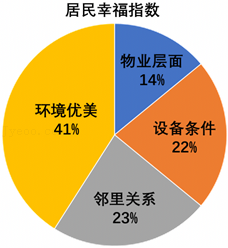
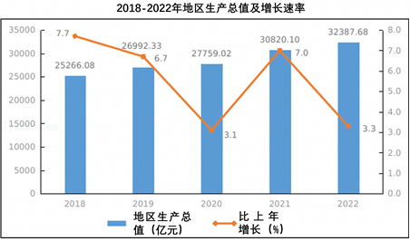
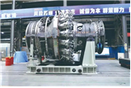

## **2023年广东省深圳市中考道德与法治试卷**

**参考答案与试题解析**

| 
  题号  
 | 
  1  
 | 
  2  
 | 
  3  
 | 
  4  
 | 
  5  
 | 
  6  
 | 
  7  
 | 
  8  
 | 
  9  
 | 
  10  
 | 
  11  
 |
| --- | --- | --- | --- | --- | --- | --- | --- | --- | --- | --- | --- |
| 
  答案  
 | 
  B  
 | 
  A  
 | 
  D  
 | 
  C  
 | 
  B  
 | 
  B  
 | 
  D  
 | 
  B  
 | 
  A  
 | 
  B  
 | 
  C  
 |
| 
  题号  
 | 
  12  
 | 
  13  
 | 
  14  
 | 
  15  
 |  |  |  |  |  |  |  |
| 
  答案  
 | 
  B  
 | 
  D  
 | 
  B  
 | 
  A  
 |  |  |  |  |  |  |  |

**一、单选题**
1．时代各有不同，青春一脉相承。青春，带着特殊的邀约，款款而来，对此，我们应该（　　）
A．怀揣梦想，追求物质财富
B．砥砺奋进，承担时代使命
C．努力学习，乐于超越他人
D．完善自己，唯求独善其身
【分析】本题考查珍惜青春。青春带给我们旺盛的生命力，使我们充满能量，有充沛的精力，敏捷的思维，对成长充满强烈渴望，感觉生活充满无限可能。
【解答】青春的我们要怀揣梦想，努力学习，不能一味追求物质财富，故A说法错误；青春的我们要肩负使命，砥砺奋进，故B说法正确；青春的我们要努力学习，不断超越自己，故C说法错误；青春的我们要不断完善自己，追求止于至善，故D说法错误。
故选：B。
【点评】仔细审题，联系珍惜青春的有关知识作答。
2．深圳市开展禁毒先锋青少年教育培训行动，这是深化青少年预防毒品教育的创新举措。此项活动提倡我们（　　）
A．依法自律，远离毒品危害
B．珍爱生命，探寻生命意义
C．尊崇法治，参加扫毒行动
D．自律自强，克服一切诱惑
【分析】本题考查黄、赌、毒及邪教的危害。毒品侵蚀人的肌体，毒害人的精神，威胁人民生命财产安全和社会稳定。
【解答】结合所学可知，守护生命首先要爱护自己的身体，因此，青少年要树立禁毒意识，珍爱生命健康，宣传禁毒知识，抵制不良诱惑，认清毒品危害，远离涉毒场所，故A说法正确；开展禁毒先锋青少年教育培训行动，深化预防毒品教育，和探寻生命意义没有直接关系，B说法与题不符；青少年不能参加扫毒行动，C说法错误；要自律自强，克服一切不良诱惑，D说法错误。
故选：A。
【点评】细心审题，联系黄、赌、毒及邪教的危害等知识作答。
3．道德与法治课堂开展事例评价活动，以下事例和评价不合理的是（　　）
| 事例 | 评价 |
| --- | --- |
| A.深圳市中小学将人工智能学习纳入地方课程 | 评价：有利于培养学生的创新意识和能力 |
| B.某中学将绘画，摄影，烹饪，花艺，棒球等纳入到校内社团当中 | 评价：有利于五育并举，促进学生全面发展 |
| C.小粤在一次聚会上，主动和长辈打招呼，用公筷给他人夹菜 | 评价：践行文明，尊重他人 |
| D.YYDS、躺平摆烂等网络热词受到学生追捧 | 评价：追逐潮流，发扬网络文化 |

A．A	B．B	C．C	D．D
【分析】本题考查政治常识。考查学生的综合能力。
【解答】深圳市中小学将人工智能学习纳入地方课程，有利于学生培养创新意识和能力，开发创造潜力，故A说法正确，不符合题意；某中学将绘画，摄影，烹饪，花艺，棒球等纳入到校内社团当中，认真履行学校保护的职责，有利于五育并举，促进学生全面发展，故B说法正确，不符合题意；小粤在一次聚会上，主动和长辈打招呼，用公筷给他人夹菜，体现出小粤做到了文明有礼、尊重他人，故C说法正确，不符合题意；YYDS、躺平摆烂等网络热词受到学生追捧，启示我们要培养独立思维，避免盲目从众，传播网络正能量，故D说法错误，符合题意。
故选：D。
【点评】把握政治常识，理解材料主旨，选择正确答案。
4．20年来，深圳市爱心助人活动，共举行活动3.4万次，惠及广大市民，构筑起深圳爱心助人城市文化地标。该活动提倡我们（　　）
A．自强不息，厚德载物	B．开放包容，务实法治
C．乐于助人，扶危济困	D．行己有耻，止于至善
【分析】本题考查关爱他人。关爱传递着传递美好情感，给人带来温暖和希望，是维系友好关系的桥梁。
【解答】深圳市具体性爱心助人活动，体现了乐于助人，扶危济困的传统美德，故C符合题意；ABD观点虽然正确，但在题干中没有体现，不符合题意。
故选：C。
【点评】仔细审题，联系关爱他人的有关内容作答。
5．下列人物提升的共同品质是（　　）
| 
  罗阳  
 | 
  奋斗30年，托起中国战机  
 |
| --- | --- |
| 
  郭明义  
 | 
  义务献血六万余毫升  
 |
| 
  徐淙祥  
 | 
  将一生贡献给农田事业  
 |
| 
  邓小岚  
 | 
  义务支教十几年，将山里娃送上大舞台  
 |

A．诚实守信	B．无私奉献	C．见利思义	D．勤劳勇敢
【分析】本题考查实现人生价值。探索生命意义，是人类生命的原动力之一。只有人类才可能驾驭自己的生活，选择自己的人生道路。
【解答】据教材知识，题干中的人物为国家的科技、农业和教育事业贡献一生，体现了承担责任，服务社会，无私奉献的精神品质，故B说法正确；诚实守信、见利思义、勤劳勇敢在题干中没有体现，故ACD不符合题意。
故选：B。
【点评】仔细审题，联系实现人生价值的有关内容作答。
6．骑手工作走街串巷，是挖掘基层治理死角与盲区的“千里眼”“顺风耳”。南山区党委通过联动各方，发扬党员骑手、最美骑手的“主人翁”精神，引导他们积极担当文明宣传员，以上做法体现了（　　）
A．行政机关致力于打造服务型政府
B．党为人民的幸福生活而奋斗
C．人民的幸福生活是基本的大权
D．快递员享有物质帮助权
【分析】本题考查了中国共产党的性质和地位。中国共产党是中国工人阶级的先锋队，是中国人民和中华民族的先锋队；中国共产党是我国的执政党，是中国特色社会主义事业的领导核心。
【解答】南山区党委通过联动各方，发扬党员骑手、最美骑手的“主人翁”精神，引导他们积极担当文明宣传员等，体现了党为人民幸福生活而奋斗，B说法正确；行政机关在题干中没有体现，A不符合题意；人民的幸福生活是最大的人权，C说法错误；物质帮助权是指公民在年老、疾病或丧失劳动能力的情况下，有从国家或社会获得物质帮助的权利，D说法错误。
故选：B。
【点评】本题要正确理解题意，只有理解题意，才能明确考查的知识点是中国共产党的性质和地位，才能做出正确选择。
7．在深圳宪法公园，公益普法活动并不少见，每个月主题博物馆会举办各种主题的法律月展览，周末还开展模拟法庭、免费法律咨询等多种多样的普法活动。群众打卡深圳宪法公园（　　）
A．说明宪法具有最高法律效力、权威和地位
B．体现宪法是我国所有法律的总和
C．体现政府坚持以人民为中心，依宪执政
D．激发人民群众自觉认同、践行宪法的热情
【分析】本题考查增强宪法意识。依法治国首先就必须依宪治国，树立法律的权威首先就必须树立宪法的权威，普及法律知识首先就应当普及宪法知识，增强公民的法律意识首先就要增强公民的宪法意识。
【解答】在宪法公园开展形式多样的公益普法活动，有利于增强公民的宪法意识，有利于激发人民群众自觉认同、践行宪法的热情，D说法正确；群众打卡深圳宪法公园并不能说明宪法的法律地位，A与题意不符；宪法是其他法律的立法依据和立法基础，但不是所有法律的总和，B说法错误；中国共产党依宪执政，C说法错误。
故选：D。
【点评】本题要正确理解题意，只有理解题意，才能明确考查的知识点是增强宪法意识，才能做出正确选择。
8．维护国家安全，公民应（　　）
A．加强国家保护领域的立法
B．履行维护国家利益的法定义务
C．构建人类命运共同体
D．行使政治自由的法定权利
【分析】本题考查了维护国家安全。国家安全是国家生存与发展的重要保障。国家政权和主权受到威胁，国家的统一和领土完整遭到破坏，国家的生存就会受到挑战。国家安全有保障，经济社会才能不断发展，祖国才能更加繁荣富强。
【解答】依据教材知识可知，维护国家安全人人有责，维护国家安全，公民应履行维护国家利益的法定义务，B说法正确；公民没有立法权，A说法错误；构建人类命运共同体与维护国家安全无关，C不符合题意；题干没有涉及政治自由，D不符合题意。
故选：B。
【点评】本题要正确理解题意，只有理解题意，才能明确考查的知识点是维护国家安全，才能做出正确选择。
9．近年来，深圳公安经侦部门不断创新探索，努力做到护企安商有力度、有温度，既重拳打击违法犯罪，又提高对企业的服务水平，营造更健康、更安全、更高质量的发展环境。上述行为反映了（　　）
A．执法机关严格执法，捍卫正义
B．立法机关完善法律，维护稳定
C．全体公民尊法守法，遇事找法
D．监察机关监督调查，惩治犯罪
【分析】本题考查依法行政。依法行政是依法治国基本方略的重要内容，是指行政机关必须根据法律法规的规定设立，并依法取得和行使其行政权力，对其行政行为的后果承担相应的责任的原则。
【解答】深圳市公安经侦部门通过重拳打击违法犯罪，提高对企业的服务水平，体现了执法机关严格执法，捍卫正义，故A说法正确；立法机完善法律、全体公民遵守法律、检察机关监督调查在题干中没有体现，故BCD不符合题意。
故选：A。
【点评】仔细审题，联系依法行政的有关知识作答。
10．2023年5月28日，C919执行首次商业载客飞行，在过去16年的“飞天路”中，全国22个省，1000多个单位，30多万人参与研制，C919取得成就得益于（　　）
A．始终坚持以科学技术发展为中心
B．发挥集中力量办大事的制度优势
C．高扬改革创新为核心的民族精神
D．不断完善劳动群众权益保障机制
【分析】本题考查中国特色社会主义制度。中国特色社会主义制度是实现中华民族伟大复兴的正确道路。
【解答】全国22个省，1000多个单位，30多万人参与研制，说明C919取得成就得益于发挥集中力量办大事的制度优势，故B说法正确；我国坚持以经济建设为中心，故A说法错误；高扬改革创新为核心的时代精神，故C说法错误；题干没有体现不断完善劳动群众权益保障机制，故D不符合题意。
故选：B。
【点评】把握中国特色社会主义制度，理解材料主旨，选择正确答案。
11．粤港澳大湾区龙舟赛以龙舟文化为精神纽带，展示了粤港澳三地的“非遗”保护成果，促进了粤港澳大湾区的融合发展和文化交流，由此可见（　　）
①龙舟文化集中体现了当代中国精神
②龙舟文化源远流长，博大精深
③龙舟比赛是促进文化传承的重要形式
④我们要全面继承和发展中华民族传统文化
A．①③	B．①④	C．②③	D．②④
【分析】本题考查中华文化。中华文化源远流长、博大精深、薪火相传、历久弥新。
【解答】社会主义核心价值观是当代精神的集中体现，故①说法错误；依据教材知识，粤港澳大湾区龙舟赛以龙舟文化为精神纽带，展示了粤港澳三地的“非遗”保护成果等，体现了中华文化的源远流长，博大精深，龙舟文化是促进文化传承的重要形式，故②③说法正确；我们要继承和发展中华民族优秀传统文化，故④说法错误。
故选：C。
【点评】把握中华文化，理解材料主旨，选择正确答案。
12．如图是某居民业委会对居民幸福指数的调查数据，业委会根据调研数据督促物业进行整改，获得居民的好评，这说明了，调研居委会对居住满意度调查，民主管理（　　）
①能够了解居民的真实诉求
②切实保障居民的各种权益
③彻底解决居民急难盼问题
④调动人民自我管理的积极性

A．①②	B．①④	C．②③	D．③④
【分析】本题考查基层群众自治制度。基层群众自治制度是我国的基本政治制度。
【解答】居委会属于基层群众自治组织。居委会对居住满意度调查，能够了解居民的真实诉求，调动人民自我管理的积极性，有利于居民的民主管理，故①④说法正确；切实保障居民的合法权益，故②说法错误；有利于解决居民急难盼问题，故③说法错误。
故选：B。
【点评】把握基层群众自治制度，理解材料主旨，选择正确答案。
13．国家主席习近平同中亚五国元首共聚西安，共叙传统友谊，共谋未来发展，在各方共同努力下，中国同中亚五国签署了100余份合作协议。构建更加紧密的中国——中亚命运共同体，需要坚持（　　）
①团结互信，文化趋同
②合作共赢，相互成就
③回避冲突，永沐和平
④相知相亲，同心同德
A．①②	B．①④	C．②③	D．②④
【分析】本题考查构建人类命运共同体。采取共同行动，承担共同责任，构建人类命运共同体，应成为各国解决全球性问题的必然选择。
【解答】依据教材知识分析，构建更加紧密的中国—中亚命运共同体，需要我国和中亚各国坚持合作共赢，相互成就，相知相亲，同心同德，故②④说法正确；世界文化具有多样性，不会趋同，故①说法错误；化解矛盾和冲突，不能回避，故③说法错误。
故选：D。
【点评】把握构建人类命运共同体，理解材料主旨，选择正确答案。
14．党的二十大报告指出，必须坚持在发展中保障和改善民生，鼓励共同奋斗创造美好生活，实现人民对美好生活的向往。下列举措有利于实现人民对美好生活向往的合理传导路径的是（　　）
①坚持社会主义市场经济体制→激发各类市场主体活力→满足人民美好生活需求
②增强人民的幸福感和获得感→加强社会保障体系建设→逐步实现发展的根本目的
③走中国特色新型城镇化道路→进一步推动城乡一体化建设→维护社会公平正义
④积极融入世界经济全球化进程→协调签订国际合作协议→主导全球化进程
A．①②	B．①③	C．②③	D．②④
【分析】本题考查社会主义市场经济体制。我国社会主义市场经济体制把社会主义制度和市场经济有机结合起来，充分发挥市场在资源配置中的决定性作用，更好发挥政府作用，进行科学宏观调控，激发各类市场主体的活力，为人民对美好生活的需求提供保障。
【解答】坚持社会主义市场经济体制，激发各类市场主体的活力，不断满足人民美好生活需求，故①说法正确；加强社会保障体系建设，增强人民的幸福感和获得感，逐步实现发展的根本目的，故②说法错误；走中国特色新型城镇化道路，进一步推动城乡一体化建设，维护社会公平正义，故③说法正确；我国没有主导全球化进程，故④说法错误。
故选：B。
【点评】把握社会主义市场经济体制，理解材料主旨，选择正确答案。
15．根据《深圳市2022年国民经济和社会发展统计公报》解读GDP变化水平，以下说法正确的是（　　）

①我市经济增速逐步放缓
②我市经济增长进入平稳增长期
③城镇化发展差距不断扩大
④经济高质量发展助力人民幸福生活
A．①②	B．①④	C．②③	D．②④
【分析】本题考查经济发展新常态。我国经济从高速增长阶段转为高质量发展阶段。
【解答】结合题干材料分析，深圳市生产总值和增长速度的变化数据，可以看出深圳市经济增速逐步放缓，我市经济增长进入平稳增长期，①②正确；③④说法与图表中的生产总值和增长速度的变化无关，与题意不符。
故选：A。
【点评】仔细审题，联系经济发展新常态的有关内容作答。
**二、分析说明题**
16．时移世易，事变法随。
材料一  天下大治，起于法治。欲达法治，立法先行。被誉为“管理法之法”的《中华人民共和国立法法》与时代同步，与改革同频，为建设中国特色社会主义现代化国家凝聚了强大的法治力量。
（1）结合材料并运用所学知识，说明《中华人民共和国立法法》的修订过程体现了什么道理？
材料二  人工智能技术的发展便利了我们的生活，同时也带来很多挑战。利用人工智能技术弄虚作假甚至违法犯罪的现象时有发生。
小深：引导人工智能技术有序发展和利用，关键在科学立法。
小圳：引导人工智能技术有序发展和利用，关键在全民守法。
（2）结合材料并运用所学知识，对上述两位同学的观点进行评析。
材料三  广东省某市的红色资源丰富，该市具有历史悠久的红色文化和革命传统，为保护红色基因，弘扬红色精神，该市出台《红色资源保护传承条例》，在红色资源的调查认定，保护名录，维护修缮等主要内容作了具体规定，利用民间文化艺术多样性的优势进行文艺创作，赓续红色血脉。
（3）结合材料并运用所学知识，说说该市政府通过法治力量“守护红色基因，赓续红色血脉”的原因。
【分析】本题考查了依法治国的含义和目的、依法行政、建设社会主义法治国家、政府的主要职责。依据课本知识分析材料，依据材料实际组织答案。
【解答】（1）本题考查了说明《中华人民共和国立法法》的修订过程体现的道理。从我国实施依法治国的基本方略、生活与法律息息相关、我国实行良法之治等方面解答。
（2）本题考查了结合材料并运用所学知识，对上述两位同学的观点进行评析。首先明确观点错误，然后回答理由，从引导人工智能技术有序发展和利用，需要科学立法、严格执法、公正司法和全民守法、公民要增强尊法学法守法用法意识、党和政府及其工作人员要带头尊法学法守法用法、加强法治宣传、国家和社会治理需要法律和道德共同发挥作用等方面解答。
（3）本题考查了该市政府通过法治力量“守护红色基因，赓续红色血脉”的原因。从法治是现代政治文明的核心、走法治道路是实现中华民族伟大复兴的必然选择、国家和社会治理需要法律和道德共同发挥作用等方面解答。
故答案为：
（1）①我国实施依法治国的基本方略。②生活与法律息息相关。法律应生活的需要而制定和颁布，对生活加以规范和调整。③我国实行良法之治。
（2）观点错误。①引导人工智能技术有序发展和利用，需要科学立法、严格执法、公正司法和全民守法。②现代社会的公民，要增强尊法学法守法用法意识，弘扬法治精神，强化规则意识，树立正确的权利义务观念。③党和政府及其工作人员要带头尊法学法守法用法，提高运用法治思维和法治方式深化改革、推动发展、化解矛盾、维护稳定、应对风险的能力。④要加强法治宣传，弘扬法治精神，共同营造良好的法治文化环境，在全社会鲜明地树立起“守法光荣、违法可耻”的法治文化导向。⑤国家和社会治理需要法律和道德共同发挥作用。
（3）①法治是现代政治文明的核心，是发展市场经济、实现强国富民的基本保障，是解决社会矛盾、维护社会稳定、实现社会正义的有效方式。走法治道路是实现中华民族伟大复兴的必然选择。②国家和社会治理需要法律和道德共同发挥作用，既重视发挥法律的规范作用，又重视发挥道德的教化作用；以法治承载道德理念，强化法律对道德建设的促进作用。
【点评】解答时注意认真研究题目，明确题目要求和答题方向是依法治国的含义和目的、依法行政、建设社会主义法治国家、政府的主要职责，综合运用基础知识作答，做到准确无误，思维发散，多角度多方面作答。
**三、综合探究题**
17．高质量发展是全面建设社会主义现代化国家的首要任务。
中国式现代化深圳答卷为深圳响应“高质量发展”国家政策的重要体现。
答卷一深圳政府简政放权，优化服务，深化要素市场化改革，构建高水平市场经济体系，GDP提升迅速，成为全球最有“活力”城市之一。
答卷二近年来，深圳不断加大教育投入，持续优化高等教育发展环境，形成充满活力的竞争激励机制。高水平大学建设连获重要突破，综合实力和竞争力显著提升。
答卷三在深圳不到2000平方公里的土地上，分布着大大小小1090个各类公园，它们就像一张绿色的网，串联起深圳丰富多样的自然生态资源，使市民既能推窗见绿、开门见园，又能徒步山林、漫步郊野，“千园之城”成为深圳一道靓丽的名片。
答卷四深圳始终以“感恩改革开放，回报全国人民”的特区担当，服务全国乡村振兴战略大局。助力76个重点镇、120个村全面振兴，积极推进巩固脱贫攻坚成果与全面推进乡村振兴有效衔接。全面做好乡村振兴、帮扶协作、对口合作等工作.实施帮扶项目427个，投入财政资金50.4亿元。
（1）结合材料并运用所学知识，任意选举其中两个答卷，说明深圳市政府是如何先行先试，如何探索中国式现代化新路径？
【大国重器深圳上新】
|  | 太行110重型燃气轮机在深圳成功通过产品验证鉴定，这标志着我国重型燃气轮机攻克“卡脖子”难题，走完全自主研制全过程。“太行110”历经20年炼成装备制造业“皇冠上的明珠”，聚集了几代研发者的心血与付出，集合了国内航空、机械、石油、电力等行业力量，获得了102项国际专利，成果来之不易，过程何其艰辛，整个过程犹如一场接力跑！ |
| --- | --- |

（2）“民族振兴，强国有我”，请你以“奋斗”、“中国式现代化”为关键词，为“太行110”重型燃气轮机的研制者们写一份致敬词。（80﹣120字）
【分析】本题考查了改革开放的成就与原因、教育的重要性、科教兴国战略、人才强国战略。依据课本知识分析材料，依据材料实际组织答案。
【解答】（1）本题考查了结合材料并运用所学知识，任意选举其中两个答卷，说明深圳市政府是如何先行先试，如何探索中国式现代化新路径。答卷一：从坚持深化改革、以经济建设为中心、推动经济高质量发展等方面解答。答卷二：从加大教育投入、促进教育高质量发展等方面解答。答卷三：从坚持绿色发展理念、坚持节约资源和保护环境的基本国策、实现人与自然和谐共生等方面解答。答卷四：从坚持乡村振兴战略、促进人民共享发展成果等方面解答。
（2）本题考查了以“奋斗”、“中国式现代化”为关键词，为“太行110”重型燃气轮机的研制者们写一份致敬词。从不懈奋斗、持续研发创新、为中国式现代化提供磅礴动力、太行110、向你们致敬等方面解答。
故答案为：
（1）答卷一：坚持深化改革，不断推进政府简政放权，以经济建设为中心，大力发展生产力，推动经济高质量发展，为中国式现代化探索经济发展的有效路径。
答卷二：加大教育投入，坚持教育强市，坚持科教兴国、人才强国战略，促进教育高质量发展，为中国式现代化探索教育发展的科学方案。
答卷三：坚持绿色发展理念，坚持绿色发展道路，坚持节约资源和保护环境的基本国策，实现人与自然和谐共生，为中国式现代化探索生态建设的成功范例。
答卷四：坚持乡村振兴战略，坚持共享发展理念，促进人民共享发展成果，为中国式现代化探索共同富裕的深圳样本。
（2）几代研发者不懈奋斗，20年持续研发创新；最终，你们破除卡脖子难题，打造“皇冠上的明珠”，国之重器，为中国式现代化提供磅礴动力！“太行110”，你们“太行”，向你们致敬！
【点评】该题考查学生运用所学知识分析和解决问题的能力，考查了，解答该题需要用全面的观点，善于从多角度分析和解决问题。
