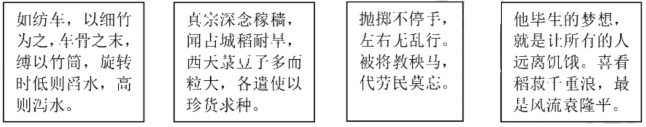
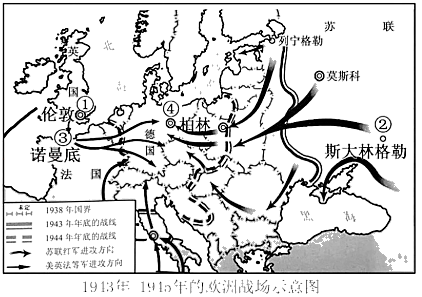

广东省深圳市2020年中考历史试卷

**一、单项选择题（30小题，每小题2分，共60分）。下列各题的四个选项中，只有一项最符合题意．**
1．中华文明主要是在适合农业耕作的大河流域诞生的。如图所示的文物出土于（　　）

A．长江流域	B．珠江流域	C．黄河流域	D．辽河流域
2．我们的先人很早就认识到生态环境的重要性。孔子说：“钓而不纲，戈不射宿。”意思是“不用大网打鱼，不射夜宿之鸟”。这一观点出自（　　）
A．儒家	B．道家	C．墨家	D．法家
3．秦统一后，李斯等人制定文字，主要采用古文，力求笔画简洁。制定出的文字是（　　）
A．甲骨文	B．金文	C．大篆	D．小篆
4．从现有史料来看，深圳市南头古城一带是汉武帝时期番禺盐官的驻地。由此可印证汉武帝（　　）
A．实施“推恩令”	B．实行盐铁专卖
C．铸造五铢钱	D．建立刺史制度
5．在学习历史的过程中，我们可以借助历史文学作品来了解史实。《三国演义》中“孔明草船借箭”“周瑜打黄盖”的故事有助于我们了解（　　）
A．桂陵之战	B．官渡之战	C．赤壁之战	D．淝水之战
6．“张公出，丝路兴，文明传。……大业（年号）始，东都建，运河开。”材料中的“丝路”与“运河”都促进了（　　）
A．南北交通的发展	B．经济和文化的交流
C．经济重心的南移	D．西汉的大一统
7．他的词“倾荡磊落，如诗如文，如天地奇观”。他极大地提高了词的品位，确定了豪放派在宋代词坛的重要地位。他是（　　）
A．李白	B．苏轼	C．李清照	D．关汉卿
8．清朝翰林官徐骏在奏章里把“陛下”的“陛”字错写成“狴”。雍正帝因此将其革职，又派人查他的诗集，以诽谤朝廷的罪名将其治罪。这反映清朝前期（　　）
A．大兴文字狱	B．八股取士
C．罢黜百家，独尊儒术	D．焚书坑儒
9．清政府实行闭关政策，特许设立了一个对外贸易机构，负责承销外商进口货物，并管理外国商人。这一机构是（　　）
A．宣政院	B．内阁	C．广州十三行	D．军机处
10．近代以来，中华民族的仁人志士为救亡图存和实现现代化而奋斗不息。以下历史人物和历史事件对应正确的是（　　）
A．邓世昌﹣﹣义和团运动	B．谭嗣同﹣﹣戊戌变法
C．孙中山﹣﹣五四运动	D．周恩来﹣﹣秋收起义
11．中国共产党不仅是合作共赢的倡导者，更是积极实践者。以下属于第一次国共合作成果的是（　　）
A．北伐的胜利进军	B．西安事变的和平解决
C．抗日战争的胜利	D．“双十协定”的签订
12．大革命失败后，中国共产党开始尝试起武装斗争的道路来挽救中国革命，随即在城市发动了第一次武装起义。这次起义是（　　）
A．黄花岗起义	B．广西起义	C．安庆起义	D．南昌起义
13．“这是长征途中的一次会议，它是党的历史上一个生死攸关的转折点，它决定了一支军队的命运，进而是一个党的命运，最终是一个国家的命运。”这次会议是（　　）
A．八七会议	B．古田会议
C．遵义会议	D．十一届三中全会
14．1945年8月29日《大公报》社评：“毛泽东先生来了!……大家都认为这是中国的一件大喜事。”为了争取和平，与蒋介石共商国是，社评中毛泽东到访的地点是（　　）
A．重庆	B．南京	C．北平	D．西安
15．“在中国长达数千年的发展历史上，公元前221年、公元1911年和1949年发生的三次大革命，从根本上改变了中国的政治和社会结构。”要了解第三次“大革命”的历史，我们可以查阅的教材是（　　）
A．	B．

C．	D．

16．“大国是关键，周边是首要，发展中国家是基础，多边是重要舞台。”这反映出中国特色大国外交的总布局是（　　）
A．独立自主的和平外交	B．和平共处
C．求同存异	D．全方位、多层次、立体化
17．运用如图史料，可以设计出有关中国历史的探究主题是（　　）

A．农业技术的发展	B．医药事业的进步
C．思想文化的繁荣	D．政治制度的演变
18．当前，世界正处于大发展、大变革、大调整时期，世界需要中国智慧、中国理念、中国方案，在这样的时代背景下孕育产生、丰富发展起来的理论是（　　）
A．马克思主义
B．毛泽东思想
C．邓小平理论
D．习近平新时代中国特色社会主义思想
19．伯里克利努力推进和完善民主政治，深得家乡民众的信任与爱戴。人们赞赏有加：“他在这里只熟悉一条路，那就是通向能与普通公民接触的广场和五百人会议的路。”他的家乡在（　　）
A．斯巴达城邦	B．亚历山大帝国
C．罗马共和国	D．雅典城邦
20．中世纪的一个西欧城市从英王亨利二世手里获得“特许状”，取得了一定程度的自由与特权。这种“特许状”的颁发反映了（　　）
A．资产阶级完全掌握了城市的政权
B．封建割据势力的增强
C．城市要求与其经济实力相称的政治权利
D．英国确立了君主立宪制
21．作为近代科学的奠基人之一，他除了在光学、力学和数学方面有开创性研究之外，还发现了一个宇宙定律，这个定律是揭开天体运行面纱的轰动性、革命性结论。这位科学家是（　　）
A．达尔文	B．牛顿	C．瓦特	D．诺贝尔
22．“国王是军队的传统首脑，士兵们是习惯于服从国王的；议会却拥有较大的资财。国王（查理一世）在1642年8月的一个黑暗和风暴的傍晚，在诺丁汉竖起了他的军旗，接着是一场长期和顽强的内战。”这反映的历史事件是（　　）
A．英国资产阶级革命	B．法国大革命
C．美国独立战争	D．工业革命
23．美国史学家爱默生在评价南北战争时，认为“符合社会利益的革命总是永远地为人民所记忆”。对“符合社会利益”理解正确的是（　　）
A．实现了民族独立	B．缓解了美苏矛盾
C．巩固了奴隶主统治	D．维护了国家统一
24．下表反映出，一战期间协约国与同盟国的军需品生产量出现了明显变化，发生这一变化的主要原因是（　　）
一战交战国军需品生产量（单位：百万吨）
| 时间 | 1914年9月 | 1914年9月 | 1917年 | 1917年 |
| --- | --- | --- | --- | --- |
| 交战国 | 协约国 | 同盟国 | 协约国 | 同盟国 |
| 生铁 | 16 | 25 | 50 | 15 |
| 钢 | 16 | 25 | 58 | 16 |
| 煤 | 346 | 355 | 851 | 340 |

A．意大利转投协约国	B．美国加入战争
C．俄国退出战争	D．德国战败
25．“哲学家们只是用不同的方式解释世界，而问题在于改变世界。”马克思主义诞生后，无产阶级“改变世界”有了科学理论的指导，社会主义由理想转变为现实。最早实现这一“转变”的是（　　）
A．辛亥革命	B．二月革命	C．十月革命	D．五四运动
26．20世纪前期，国际社会签订了一个重要条约来调和法德矛盾，以确保地区和平。但20年后世界大战再次爆发，证明其最终失效。这一条约是（　　）
A．《凡尔赛条约》	B．《九国公约》
C．《开罗宣言》	D．《联合国家宣言》
27．1921年苏维埃政府将原定征收的年度粮食税额下调至2.4亿普特（重量单位），受到农民热烈欢迎。这主要是因为（　　）
A．《和平法令》的颁布	B．斯大林模式的形成
C．新经济政策的实施	D．戈尔巴乔夫的改革
28．1929年10月开始，美国股市在一个月内持续滑坡，约300亿美元市值蒸发殆尽，大批银行倒闭，公司破产，商品价格暴跌。出现这些现象的原因是（　　）
A．一战的爆发	B．冷战的开始	C．经济大危机	D．罗斯福新政
29．1942年德国发动重点进攻，遭到当地军民顽强抵抗，城内外无论男女老少，人人都是战士，处处皆为战场，结果德军损失惨重。次年2月，德国投降。此役改变了战争双方的力量对比，成为第二次世界大战的转折点。如图所示，该战役发生的地点位于（　　）

A．①处	B．②处	C．③处	D．④处
30．1970年尼克松总统提出家庭援助计划，对贫困家庭提供援助，这有利于推动（　　）
A．欧洲一体化的进程
B．战时共产主义政策的实行
C．日本经济的崛起
D．社会保障制度的完善
**二、非选择题（3大题，共40分）**
31．（14分）服饰作为社会文化的符号，它的变化折射出人类社会的政治变革、经济变化和风尚变迁。阅读材料，回答问题。
材料一：（孝文帝）又引见王公卿士，责留京之官曰：“昨望见妇女之服，仍为夹领小袖（少数民族旧俗）。……卿等何为而违前诏？”
﹣﹣《魏书》卷二十一上《献文六王•咸阳王禧传》
材料二：民国元年，迁到北京不久的民国临时政府和参议院颁发了第一个正式的服饰法令，即《服制》。……使洋服正式步入中国人的生活……革命党人正是以法国大革命、美国独立战争为榜样，以西方政体为摹本。因此，民初服饰的西化是历史的必然，也从此改变了中国服饰传统的历史轨迹。
﹣﹣﹣摘编自《光明日报》2014年5月14日
材料三：18世纪以前，英国的棉织品质地低劣，竞争不过印度、中国的棉织品。当时穿着中印棉布衣服的风尚风靡一时。为了促进本国纺织业的发展，1700年英国议会通过法令，禁止从印度、中国和伊朗输入染色的棉纺织品……英国只有采用新技术才能在国际市场上同印度、中国的产品竞争。正是这个商品竞争的需要，才推动了一系列新发明，进而引发了工业革命。
﹣﹣摘自刘祚昌、光仁洪、韩承文主编《世界通史》
材料四：如图这幅艺术作品描绘的是日本明治维新时期民众生活的一个场景。

请回答：
（1）根据材料一并结合所学知识，指出孝文帝是哪一民族的统治者。留京官员违背了他的哪项诏令？孝文帝坚持推行改革起到了什么作用？
（2）根据材料二并结合所学知识，分析服饰法令的颁发与哪次革命存在关联。此后，民国时期服饰出现了什么变化？“以西方政体为摹本”，中国建立了什么政体？
（3）根据材料三并结合所学知识，指出工业革命最早从哪一行业开始。列举两个工业革命中的新发明。从材料中归纳英国促进该行业发展的方法。
（4）根据材料四，如图反映了明治维新时期民众服装的差异，有人穿传统服装，有人穿西式服装。结合所学知识，指出这是改革的哪一方面。经过改革，日本走上了什么道路？
（5）根据材料一、材料二和材料四，总结引起服饰变化的共同因素。
32．（14分）坚持“引进来和走出去并重，遵循共商共建共享”原则，加强开放合作，是时代发展的潮流。阅读材料，回答问题。
材料一：如图。
材料二：为了迅速掌握西方先进的科学技术，洋务派还向美国、英国、德国派遣了留学生，其中派往美国的四批，120人；派往欧洲的四批，85人……后来这些留学生大都学有所成，许多人成为中国各项近代化事业的开创者……在电讯业方面，国家和地方电报局的负责人几乎全由留学归来人员担任，从而摆脱了外国对这一领域的控制企图。
﹣﹣摘自张海鹏、翟金懿《简明中国近代史读本》
材料三：全球范围内冲突和贫困尚未根除，但和平与发展的时代潮流愈发强劲。世界多极化、经济全球化、文化多样化、社会信息化深入发展。弱肉强食的丛林法则、你输我赢的零和游戏不再符合时代逻辑，和平、发展、合作、共赢成为各国人民共同呼声。
﹣﹣摘自习近平《论坚持推动构建人类命运共同体》
材料四：今年是深圳经济特区成立40周年。深圳要充分释放“双区驱动效应”，多方面发力，努力成为全面现代化的典范，特别是制度现代化的典范，提升社会主义制度的吸引力。在推动制度开放的过程中，深圳要主动学习借鉴国际先进规则，不断完善自身的营商环境，力争成为新时代中国对接国际的窗口、国内国际双向开放的桥梁。
﹣﹣摘编自《深圳特区报》2020年6月24日
请回答：
（1）根据材料一并结合所学知识，指出郑和下西洋所处的朝代。郑和能够完成此壮举的必备条件有哪些？
（2）根据材料二并结合所学知识，列举一位洋务派的代表人物。结合材料二分析洋务派派遣留学生的直接目的。该材料反映出洋务运动的性质是什么？
（3）根据材料三并结合所学知识，指出二战以来世界格局发生的变化。当今世界的时代主题是什么？举例说明“社会信息化”在我们生活中的具体表现。
（4）根据材料四并结合所学知识，指出深圳现代化的迅速发展得益于哪一项重大决策。与深圳同一批建立的经济特区还有哪些？（答出两个即可）。
（5）综合上述四则材料并结合所学知识，请你为深圳“成为全面现代的典范”提一个合理建议。

33．（12分）“人民群众是历史发展和社会进步的主体力量，人民群众是历史的创造者。”阅读材料，回答问题。
材料一：法国大革命比其他同时代的革命重大得多，而且它所产生的后果也要深远得……在它先后发生的所有革命中，唯有它是真正的群众性社会革命，并且比任何一次类似的大剧变都要激进得多。
﹣﹣摘自唐晋主编《大国崛起》
材料二：抗日战争是持久战，战争的伟力之最深厚的根源，存在于民众之中。实行人民战争的路线，最后的胜利一定属于中国。
﹣﹣摘编自毛泽东《论持久战》
请回答：
（1）根据材料一并结合所学知识，指出标志法国大革命开始的历史事件。根据材料二并结合所学知识，指出抗日战争的起点和全民族抗战的开始分别是什么历史事件。总结中国取得抗日战争胜利的决定性因素。
（2）结合所学知识，从材料一、二中提取信息，自拟一个论题并展开论述。要求：观点明确，史论结合，论证充分。
