广东省深圳市2020年中考历史试卷

**一、单项选择题（30小题，每小题2分，共60分）。下列各题的四个选项中，只有一项最符合题意．**
1．中华文明主要是在适合农业耕作的大河流域诞生的。如图所示的文物出土于（　　）
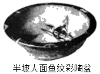
A．长江流域	B．珠江流域	C．黄河流域	D．辽河流域
2．我们的先人很早就认识到生态环境的重要性。孔子说：“钓而不纲，戈不射宿。”意思是“不用大网打鱼，不射夜宿之鸟”。这一观点出自（　　）
A．儒家	B．道家	C．墨家	D．法家
3．秦统一后，李斯等人制定文字，主要采用古文，力求笔画简洁。制定出的文字是（　　）
A．甲骨文	B．金文	C．大篆	D．小篆
4．从现有史料来看，深圳市南头古城一带是汉武帝时期番禺盐官的驻地。由此可印证汉武帝（　　）
A．实施“推恩令”	B．实行盐铁专卖
C．铸造五铢钱	D．建立刺史制度
5．在学习历史的过程中，我们可以借助历史文学作品来了解史实。《三国演义》中“孔明草船借箭”“周瑜打黄盖”的故事有助于我们了解（　　）
A．桂陵之战	B．官渡之战	C．赤壁之战	D．淝水之战
6．“张公出，丝路兴，文明传。……大业（年号）始，东都建，运河开。”材料中的“丝路”与“运河”都促进了（　　）
A．南北交通的发展	B．经济和文化的交流
C．经济重心的南移	D．西汉的大一统
7．他的词“倾荡磊落，如诗如文，如天地奇观”。他极大地提高了词的品位，确定了豪放派在宋代词坛的重要地位。他是（　　）
A．李白	B．苏轼	C．李清照	D．关汉卿
8．清朝翰林官徐骏在奏章里把“陛下”的“陛”字错写成“狴”。雍正帝因此将其革职，又派人查他的诗集，以诽谤朝廷的罪名将其治罪。这反映清朝前期（　　）
A．大兴文字狱	B．八股取士
C．罢黜百家，独尊儒术	D．焚书坑儒
9．清政府实行闭关政策，特许设立了一个对外贸易机构，负责承销外商进口货物，并管理外国商人。这一机构是（　　）
A．宣政院	B．内阁	C．广州十三行	D．军机处
10．近代以来，中华民族的仁人志士为救亡图存和实现现代化而奋斗不息。以下历史人物和历史事件对应正确的是（　　）
A．邓世昌﹣﹣义和团运动	B．谭嗣同﹣﹣戊戌变法
C．孙中山﹣﹣五四运动	D．周恩来﹣﹣秋收起义
11．中国共产党不仅是合作共赢的倡导者，更是积极实践者。以下属于第一次国共合作成果的是（　　）
A．北伐的胜利进军	B．西安事变的和平解决
C．抗日战争的胜利	D．“双十协定”的签订
12．大革命失败后，中国共产党开始尝试起武装斗争的道路来挽救中国革命，随即在城市发动了第一次武装起义。这次起义是（　　）
A．黄花岗起义	B．广西起义	C．安庆起义	D．南昌起义
13．“这是长征途中的一次会议，它是党的历史上一个生死攸关的转折点，它决定了一支军队的命运，进而是一个党的命运，最终是一个国家的命运。”这次会议是（　　）
A．八七会议	B．古田会议
C．遵义会议	D．十一届三中全会
14．1945年8月29日《大公报》社评：“毛泽东先生来了!……大家都认为这是中国的一件大喜事。”为了争取和平，与蒋介石共商国是，社评中毛泽东到访的地点是（　　）
A．重庆	B．南京	C．北平	D．西安
15．“在中国长达数千年的发展历史上，公元前221年、公元1911年和1949年发生的三次大革命，从根本上改变了中国的政治和社会结构。”要了解第三次“大革命”的历史，我们可以查阅的教材是（　　）
A．	B．
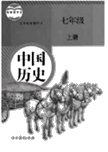
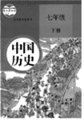
C．	D．

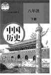
16．“大国是关键，周边是首要，发展中国家是基础，多边是重要舞台。”这反映出中国特色大国外交的总布局是（　　）
A．独立自主的和平外交	B．和平共处
C．求同存异	D．全方位、多层次、立体化
17．运用如图史料，可以设计出有关中国历史的探究主题是（　　）

A．农业技术的发展	B．医药事业的进步
C．思想文化的繁荣	D．政治制度的演变
18．当前，世界正处于大发展、大变革、大调整时期，世界需要中国智慧、中国理念、中国方案，在这样的时代背景下孕育产生、丰富发展起来的理论是（　　）
A．马克思主义
B．毛泽东思想
C．邓小平理论
D．习近平新时代中国特色社会主义思想
19．伯里克利努力推进和完善民主政治，深得家乡民众的信任与爱戴。人们赞赏有加：“他在这里只熟悉一条路，那就是通向能与普通公民接触的广场和五百人会议的路。”他的家乡在（　　）
A．斯巴达城邦	B．亚历山大帝国
C．罗马共和国	D．雅典城邦
20．中世纪的一个西欧城市从英王亨利二世手里获得“特许状”，取得了一定程度的自由与特权。这种“特许状”的颁发反映了（　　）
A．资产阶级完全掌握了城市的政权
B．封建割据势力的增强
C．城市要求与其经济实力相称的政治权利
D．英国确立了君主立宪制
21．作为近代科学的奠基人之一，他除了在光学、力学和数学方面有开创性研究之外，还发现了一个宇宙定律，这个定律是揭开天体运行面纱的轰动性、革命性结论。这位科学家是（　　）
A．达尔文	B．牛顿	C．瓦特	D．诺贝尔
22．“国王是军队的传统首脑，士兵们是习惯于服从国王的；议会却拥有较大的资财。国王（查理一世）在1642年8月的一个黑暗和风暴的傍晚，在诺丁汉竖起了他的军旗，接着是一场长期和顽强的内战。”这反映的历史事件是（　　）
A．英国资产阶级革命	B．法国大革命
C．美国独立战争	D．工业革命
23．美国史学家爱默生在评价南北战争时，认为“符合社会利益的革命总是永远地为人民所记忆”。对“符合社会利益”理解正确的是（　　）
A．实现了民族独立	B．缓解了美苏矛盾
C．巩固了奴隶主统治	D．维护了国家统一
24．下表反映出，一战期间协约国与同盟国的军需品生产量出现了明显变化，发生这一变化的主要原因是（　　）
一战交战国军需品生产量（单位：百万吨）
| 时间 | 1914年9月 | 1914年9月 | 1917年 | 1917年 |
| --- | --- | --- | --- | --- |
| 交战国 | 协约国 | 同盟国 | 协约国 | 同盟国 |
| 生铁 | 16 | 25 | 50 | 15 |
| 钢 | 16 | 25 | 58 | 16 |
| 煤 | 346 | 355 | 851 | 340 |

A．意大利转投协约国	B．美国加入战争
C．俄国退出战争	D．德国战败
25．“哲学家们只是用不同的方式解释世界，而问题在于改变世界。”马克思主义诞生后，无产阶级“改变世界”有了科学理论的指导，社会主义由理想转变为现实。最早实现这一“转变”的是（　　）
A．辛亥革命	B．二月革命	C．十月革命	D．五四运动
26．20世纪前期，国际社会签订了一个重要条约来调和法德矛盾，以确保地区和平。但20年后世界大战再次爆发，证明其最终失效。这一条约是（　　）
A．《凡尔赛条约》	B．《九国公约》
C．《开罗宣言》	D．《联合国家宣言》
27．1921年苏维埃政府将原定征收的年度粮食税额下调至2.4亿普特（重量单位），受到农民热烈欢迎。这主要是因为（　　）
A．《和平法令》的颁布	B．斯大林模式的形成
C．新经济政策的实施	D．戈尔巴乔夫的改革
28．1929年10月开始，美国股市在一个月内持续滑坡，约300亿美元市值蒸发殆尽，大批银行倒闭，公司破产，商品价格暴跌。出现这些现象的原因是（　　）
A．一战的爆发	B．冷战的开始	C．经济大危机	D．罗斯福新政
29．1942年德国发动重点进攻，遭到当地军民顽强抵抗，城内外无论男女老少，人人都是战士，处处皆为战场，结果德军损失惨重。次年2月，德国投降。此役改变了战争双方的力量对比，成为第二次世界大战的转折点。如图所示，该战役发生的地点位于（　　）

A．①处	B．②处	C．③处	D．④处
30．1970年尼克松总统提出家庭援助计划，对贫困家庭提供援助，这有利于推动（　　）
A．欧洲一体化的进程
B．战时共产主义政策的实行
C．日本经济的崛起
D．社会保障制度的完善
**二、非选择题（3大题，共40分）**
31．（14分）服饰作为社会文化的符号，它的变化折射出人类社会的政治变革、经济变化和风尚变迁。阅读材料，回答问题。
材料一：（孝文帝）又引见王公卿士，责留京之官曰：“昨望见妇女之服，仍为夹领小袖（少数民族旧俗）。……卿等何为而违前诏？”
﹣﹣《魏书》卷二十一上《献文六王•咸阳王禧传》
材料二：民国元年，迁到北京不久的民国临时政府和参议院颁发了第一个正式的服饰法令，即《服制》。……使洋服正式步入中国人的生活……革命党人正是以法国大革命、美国独立战争为榜样，以西方政体为摹本。因此，民初服饰的西化是历史的必然，也从此改变了中国服饰传统的历史轨迹。
﹣﹣﹣摘编自《光明日报》2014年5月14日
材料三：18世纪以前，英国的棉织品质地低劣，竞争不过印度、中国的棉织品。当时穿着中印棉布衣服的风尚风靡一时。为了促进本国纺织业的发展，1700年英国议会通过法令，禁止从印度、中国和伊朗输入染色的棉纺织品……英国只有采用新技术才能在国际市场上同印度、中国的产品竞争。正是这个商品竞争的需要，才推动了一系列新发明，进而引发了工业革命。
﹣﹣摘自刘祚昌、光仁洪、韩承文主编《世界通史》
材料四：如图这幅艺术作品描绘的是日本明治维新时期民众生活的一个场景。
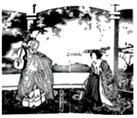
请回答：
（1）根据材料一并结合所学知识，指出孝文帝是哪一民族的统治者。留京官员违背了他的哪项诏令？孝文帝坚持推行改革起到了什么作用？
（2）根据材料二并结合所学知识，分析服饰法令的颁发与哪次革命存在关联。此后，民国时期服饰出现了什么变化？“以西方政体为摹本”，中国建立了什么政体？
（3）根据材料三并结合所学知识，指出工业革命最早从哪一行业开始。列举两个工业革命中的新发明。从材料中归纳英国促进该行业发展的方法。
（4）根据材料四，如图反映了明治维新时期民众服装的差异，有人穿传统服装，有人穿西式服装。结合所学知识，指出这是改革的哪一方面。经过改革，日本走上了什么道路？
（5）根据材料一、材料二和材料四，总结引起服饰变化的共同因素。
32．（14分）坚持“引进来和走出去并重，遵循共商共建共享”原则，加强开放合作，是时代发展的潮流。阅读材料，回答问题。
材料一：如图。
材料二：为了迅速掌握西方先进的科学技术，洋务派还向美国、英国、德国派遣了留学生，其中派往美国的四批，120人；派往欧洲的四批，85人……后来这些留学生大都学有所成，许多人成为中国各项近代化事业的开创者……在电讯业方面，国家和地方电报局的负责人几乎全由留学归来人员担任，从而摆脱了外国对这一领域的控制企图。
﹣﹣摘自张海鹏、翟金懿《简明中国近代史读本》
材料三：全球范围内冲突和贫困尚未根除，但和平与发展的时代潮流愈发强劲。世界多极化、经济全球化、文化多样化、社会信息化深入发展。弱肉强食的丛林法则、你输我赢的零和游戏不再符合时代逻辑，和平、发展、合作、共赢成为各国人民共同呼声。
﹣﹣摘自习近平《论坚持推动构建人类命运共同体》
材料四：今年是深圳经济特区成立40周年。深圳要充分释放“双区驱动效应”，多方面发力，努力成为全面现代化的典范，特别是制度现代化的典范，提升社会主义制度的吸引力。在推动制度开放的过程中，深圳要主动学习借鉴国际先进规则，不断完善自身的营商环境，力争成为新时代中国对接国际的窗口、国内国际双向开放的桥梁。
﹣﹣摘编自《深圳特区报》2020年6月24日
请回答：
（1）根据材料一并结合所学知识，指出郑和下西洋所处的朝代。郑和能够完成此壮举的必备条件有哪些？
（2）根据材料二并结合所学知识，列举一位洋务派的代表人物。结合材料二分析洋务派派遣留学生的直接目的。该材料反映出洋务运动的性质是什么？
（3）根据材料三并结合所学知识，指出二战以来世界格局发生的变化。当今世界的时代主题是什么？举例说明“社会信息化”在我们生活中的具体表现。
（4）根据材料四并结合所学知识，指出深圳现代化的迅速发展得益于哪一项重大决策。与深圳同一批建立的经济特区还有哪些？（答出两个即可）。
（5）综合上述四则材料并结合所学知识，请你为深圳“成为全面现代的典范”提一个合理建议。
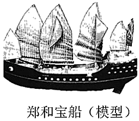
33．（12分）“人民群众是历史发展和社会进步的主体力量，人民群众是历史的创造者。”阅读材料，回答问题。
材料一：法国大革命比其他同时代的革命重大得多，而且它所产生的后果也要深远得……在它先后发生的所有革命中，唯有它是真正的群众性社会革命，并且比任何一次类似的大剧变都要激进得多。
﹣﹣摘自唐晋主编《大国崛起》
材料二：抗日战争是持久战，战争的伟力之最深厚的根源，存在于民众之中。实行人民战争的路线，最后的胜利一定属于中国。
﹣﹣摘编自毛泽东《论持久战》
请回答：
（1）根据材料一并结合所学知识，指出标志法国大革命开始的历史事件。根据材料二并结合所学知识，指出抗日战争的起点和全民族抗战的开始分别是什么历史事件。总结中国取得抗日战争胜利的决定性因素。
（2）结合所学知识，从材料一、二中提取信息，自拟一个论题并展开论述。要求：观点明确，史论结合，论证充分。
参考答案与试题解析
**一、单项选择题（30小题，每小题2分，共60分）。下列各题的四个选项中，只有一项最符合题意．**
1．中华文明主要是在适合农业耕作的大河流域诞生的。如图所示的文物出土于（　　）
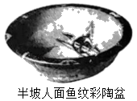
A．长江流域	B．珠江流域	C．黄河流域	D．辽河流域
【分析】本题考查半坡人的生产生活，知道半坡人生活在黄河流域，会制造彩陶。
【解答】据题干并结合所学知识可知，距今约6000年的半坡人生活在黄河流域，会制造彩陶。故如图所示的文物出土于黄河流域。
故选：C。
【点评】本题考查半坡人的生产生活，考查学生的理解和分析能力，解题关键是掌握基础知识。
2．我们的先人很早就认识到生态环境的重要性。孔子说：“钓而不纲，戈不射宿。”意思是“不用大网打鱼，不射夜宿之鸟”。这一观点出自（　　）
A．儒家	B．道家	C．墨家	D．法家
【分析】本题考查孔子，知道孔子是儒家学派创始人。
【解答】孔子是儒家学派创始人，他的核心思想是仁，故“钓而不纲，弋不射宿”出自儒家。
故选：A。
【点评】本题考查孔子，考查学生的理解和分析能力，解题关键是掌握基础知识。
3．秦统一后，李斯等人制定文字，主要采用古文，力求笔画简洁。制定出的文字是（　　）
A．甲骨文	B．金文	C．大篆	D．小篆
【分析】本题主要考查秦统一后制定出的文字的相关史实。掌握秦朝巩固统一的措施和我国文字的演变。
【解答】战国时，七国的文字书写各异。秦始皇为消除文字上的差异，命丞相李斯等人统一文字，制定笔画规整的小篆，作为通用文字颁行全国。文字的统一，使政令能够在全国各地顺利推行，也使不同地域的人民能够顺畅沟通，有利于文化的交流与发展。秦统一后，李斯等人制定文字，主要采用古文，力求笔画简洁。制定出的文字是小篆。
故选：D。
【点评】本题主要考查学生综合运用所学知识解决问题的能力。理解并识记秦统一后制定出的文字的相关史实。
4．从现有史料来看，深圳市南头古城一带是汉武帝时期番禺盐官的驻地。由此可印证汉武帝（　　）
A．实施“推恩令”	B．实行盐铁专卖
C．铸造五铢钱	D．建立刺史制度
【分析】本题主要考查汉武帝在经济上采取的措施的相关史实。重点掌握汉武帝推进大一统的措施及影响。
【解答】据所学知识可知，汉武帝时期，为了实现大一统，在经济上，汉武帝将地方的铸币和盐铁经营权收归中央。据“盐官”及所学知识可知，从现有史料来看，深圳市南头古城一带是汉武帝时期番禺盐官的驻地，由此可印证汉武帝实行盐铁专卖。选项B符合题意。
故选：B。
【点评】本题主要考查解读题干信息和对历史史实的分析和准确识记能力。理解并识记汉武帝在经济上采取的措施的相关史实。
5．在学习历史的过程中，我们可以借助历史文学作品来了解史实。《三国演义》中“孔明草船借箭”“周瑜打黄盖”的故事有助于我们了解（　　）
A．桂陵之战	B．官渡之战	C．赤壁之战	D．淝水之战
【分析】本题考查了赤壁之战。孙刘联军用火攻的办法，以少胜多，大败曹军。
【解答】“孔明草船借箭”“周瑜打黄盖”等这些脍炙人口的故事都和赤壁之战有关。208年曹操为乘胜消灭孙权和依附荆州势力的刘备，统一全国发动赤壁之战。刘备采用了诸葛亮的建议，联合江东的孙权，孙刘联军用火攻的办法，以少胜多，大败曹军。相传在这次战役中诸葛亮““草船借箭”和施“连环计”。黄盖诈降、庞统献“连环计”的时候，程昱等人就劝曹操要谨慎小心、明察秋毫，但曹操不听劝告，一意孤行，从而导致上当中计，兵败赤壁。蒋干盗书，成语典故。这个故事出自《三国演义》，发生在赤壁大战前夕，曹操亲率百万大军，驻扎在长江北岸，意欲横渡长江，直下东吴。东吴都督周瑜也带兵与曹军隔江对峙，双方剑拔弩张。曹操手下的谋士蒋干，因自幼和周瑜同窗读书，便向曹操毛遂自荐，要过江到东吴去作说客，劝降周瑜。结果周瑜设下计策，令蒋干盗得假冒曹操水军都督蔡瑁、张允写给周瑜的降书。蒋干献书曹操，令斩了蔡瑁、张允。后来蒋干盗书用来比喻中别人的反间计。
故选：C。
【点评】本题考查学生对基础知识的识记能力，需要准确识记赤壁之战的相关故事。
6．“张公出，丝路兴，文明传。……大业（年号）始，东都建，运河开。”材料中的“丝路”与“运河”都促进了（　　）
A．南北交通的发展	B．经济和文化的交流
C．经济重心的南移	D．西汉的大一统
【分析】本题主要考查了丝绸之路和大运河开通的共同作用，都促进了经济和文化的交流。
【解答】“张公出，丝路兴，文明传。……大业（年号）始，东都建，运河开。”材料中的“丝路”促进了东西方经济文化交流。大运河的开通，加强了南北地区政治、经济和文化交流，对中国以后经济的发展有重大意义。B符合题意。
故选：B。
【点评】本题主要考查了丝绸之路和大运河开通的共同作用，注意基础知识的识记与理解。
7．他的词“倾荡磊落，如诗如文，如天地奇观”。他极大地提高了词的品位，确定了豪放派在宋代词坛的重要地位。他是（　　）
A．李白	B．苏轼	C．李清照	D．关汉卿
【分析】本题考查苏轼。知道苏轼极大地提高了词的品位，确定了豪放派在宋代词坛的重要地位。
【解答】根据所学知识可知，苏轼是北宋著名的文学家，对词的发展有突出贡献，他的词突破了传统词的题材限制，扩大了词境，达到了“无意不可入，无事不可言”，他的词气势豪迈，雄健奔放，对后世影响很大，开创了宋词的新时代，苏轼极大地提高了词的品位，确定了豪放派在宋代词坛的重要地位。B符合题意。
故选：B。
【点评】解答本题要正确理解题意，考查了苏轼，在此基础上进行分析，做出正确答案。
8．清朝翰林官徐骏在奏章里把“陛下”的“陛”字错写成“狴”。雍正帝因此将其革职，又派人查他的诗集，以诽谤朝廷的罪名将其治罪。这反映清朝前期（　　）
A．大兴文字狱	B．八股取士
C．罢黜百家，独尊儒术	D．焚书坑儒
【分析】本题考查清朝的文字狱。文字狱造成社会恐怖，摧残了人才。
【解答】雍正八年，徐骏在奏章里把“陛下”的“陛”字错写成“狴”字，雍正看见之后，马上把徐骏革职。后来再派人一查，在徐骏的诗集里找岀了“清风不识字，何故乱翻书”这样的诗句，于是雍正认为这是存心诽谤。按大不敬斩立决。反映的是清朝的文字狱。文字狱造成社会恐怖，摧残了人才，使知识分子不敢有独立的见解，从而禁锢了思想，阻碍了社会进步。
故选：A。
【点评】掌握清朝的文字狱的表现和危害。
9．清政府实行闭关政策，特许设立了一个对外贸易机构，负责承销外商进口货物，并管理外国商人。这一机构是（　　）
A．宣政院	B．内阁	C．广州十三行	D．军机处
【分析】本题主要考查闭关政策。清政府实行闭关政策，特许设立广州十三行负责承销外商进口货物，并管理外国商人。
【解答】清朝前期，为巩固清王朝的统治，清政府实行闭关锁国政策，严格限制对外贸易，又限制商民出海，只开广州一处为对外通商口岸，政府特许设立了广东十三行统一经营管理对外贸易，闭关锁国对西方殖民者的入侵起过一定的积极作用，但最终阻碍了中国社会的进步，使中国在世界上逐步落伍。C符合题意。
故选：C。
【点评】本题主要考查学生运用所学知识解决问题的能力。识记与灵活掌握清朝闭关政策的原因、含义以及带来的不良影响。
10．近代以来，中华民族的仁人志士为救亡图存和实现现代化而奋斗不息。以下历史人物和历史事件对应正确的是（　　）
A．邓世昌﹣﹣义和团运动	B．谭嗣同﹣﹣戊戌变法
C．孙中山﹣﹣五四运动	D．周恩来﹣﹣秋收起义
【分析】本题考查近代史上重要历史人物及其事迹，注意题目要求“对应正确的”。
【解答】据所学知，邓世昌是甲午中日战争中涌现的民族英雄，孙中山是辛亥革命的领导者，周恩来领导了南昌起义。谭嗣同是戊戌变法的代表人物，甘愿为变法流血牺牲。
故选：B。
【点评】本题考查学生的识记能力，掌握近代史上重要历史人物及其事迹。
11．中国共产党不仅是合作共赢的倡导者，更是积极实践者。以下属于第一次国共合作成果的是（　　）
A．北伐的胜利进军	B．西安事变的和平解决
C．抗日战争的胜利	D．“双十协定”的签订
【分析】本题考查了北伐战争。北伐军出师不到半年，从珠江流域打到长江流域，声势震动全国。
【解答】属于第一次国共合作成果的是北伐战争。为推翻吴佩孚、孙传芳、张作霖为首的北洋军阀的统治，统一全国，1926年国共合作进行北伐，北伐不到半年，消灭了吴佩孚、孙传芳，北伐军从珠江流域打到长江流域，基本推翻北洋军阀统治。
故选：A。
【点评】解答本题要正确理解题意，考查了北伐战争，在此基础上，结合分析各个选项，选出正确答案。
12．大革命失败后，中国共产党开始尝试起武装斗争的道路来挽救中国革命，随即在城市发动了第一次武装起义。这次起义是（　　）
A．黄花岗起义	B．广西起义	C．安庆起义	D．南昌起义
【分析】本题考查南昌起义。重点识记南昌起义的时间、内容与影响。
【解答】结合所学可知，题干“大革命失败后，中国共产党开始尝试起武装斗争的道路来挽救中国革命，随即在城市发动了第一次武装起义”是对南昌起义的描述。1927年8月1日，周恩来、贺龙、叶挺、朱德等率领两万多人在南昌举行起义，打响了武装反抗国民党反动派的第一枪。成为中国共产党创建人民军队、独立领导武装斗争的开始。
 故选：D。
【点评】本题主要考查学生对南昌起义相关知识的掌握。重点识记内容与影响。
13．“这是长征途中的一次会议，它是党的历史上一个生死攸关的转折点，它决定了一支军队的命运，进而是一个党的命运，最终是一个国家的命运。”这次会议是（　　）
A．八七会议	B．古田会议
C．遵义会议	D．十一届三中全会
【分析】本题考查了遵义会议。1935年1月15日至17日，中共中央政治局在贵州遵义召开的独立自主地解决中国革命问题的一次极其重要的扩大会议。这次会议是在红军第五次反“围剿”失败和长征初期严重受挫的情况下，为了纠正王明“左”倾领导在军事指挥上的错误，挽救红军和中国革命的危机而召开的。
【解答】结合所学内容可知，遵义会议是在长征途中，面临国民党军队围追堵截，生死攸关的时候召开的一次重要会议，这次会议是中共第一次独立的运用马克思主义解决自身所面临的问题，是党的历史上生死攸关的转折点。
故选：C。
【点评】解答本题注重考查学生的分析能力，本题的关键点是分析题干，注意准确识记遵义会议的相关知识点。
14．1945年8月29日《大公报》社评：“毛泽东先生来了!……大家都认为这是中国的一件大喜事。”为了争取和平，与蒋介石共商国是，社评中毛泽东到访的地点是（　　）
A．重庆	B．南京	C．北平	D．西安
【分析】本题考查重庆谈判的相关知识。1945年8月，毛泽东偕周恩来、王若飞前往重庆，同国民党进行谈判，达成和平建国的《双十协定》。
【解答】题干中的关键信息是“1945年8月29日”“毛泽东先生来了”。为了尽一切可能争取国内和平，戳穿蒋介石假和平的阴谋，1945年8月，毛泽东偕周恩来、王若飞前往重庆，同国民党进行谈判，达成和平建国的《双十协定》。BCD均不符合题意。
故选：A。
【点评】本题考查学生分析材料提取材料有效信息的能力。重点掌握重庆谈判。
15．“在中国长达数千年的发展历史上，公元前221年、公元1911年和1949年发生的三次大革命，从根本上改变了中国的政治和社会结构。”要了解第三次“大革命”的历史，我们可以查阅的教材是（　　）
A．	B．
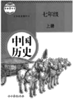
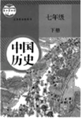
C．	D．

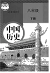
【分析】本题考查了新中国成立。1949年10月1日下午，北京30万军民齐集天安广场，隆重举行开国大典。毛泽东向全世界庄严宣告：中华人民共和国中央人民政府今天成立了！、
【解答】第三次“大革命”是新中国成立。新中国成立标志着中国新民主主义革命取得伟大胜利，标志着半殖民地半封建时代已经过去，中国人民从此站立起来了。1949年之后的历史，属于中国现代史，我们可以查阅的教材是八下课本。
故选：D。
【点评】解答本题要明确考查的知识点是新中国成立，分析题意，运用所学知识正确作答即可。
16．“大国是关键，周边是首要，发展中国家是基础，多边是重要舞台。”这反映出中国特色大国外交的总布局是（　　）
A．独立自主的和平外交	B．和平共处
C．求同存异	D．全方位、多层次、立体化
【分析】本题考查了新中国的外交成就。我国外交事业取得一个又一个伟大成就，在国际事务中发挥越来越重要的作用。
【解答】材料体现了改革开放后，中国特色大国外交全面推进，中国秉持共商共建共享的全球治理观，逐步形成了中国特色大国外交局面，形成全方位、多层次、立体化的外交布局。
故选：D。
【点评】解答本题要把握好考查的知识点是新中国的外交成就，运用所学，分析题目的要求，即可做出正确的选择。
17．运用如图史料，可以设计出有关中国历史的探究主题是（　　）
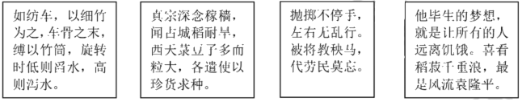
A．农业技术的发展	B．医药事业的进步
C．思想文化的繁荣	D．政治制度的演变
【分析】本题考查农业技术的发展和进步，知道四则史料体现了农业技术的发展和进步。
【解答】四则史料分别反映的是筒车、占城稻的引进、秧马、袁隆平育成籼型杂交水稻，体现了农业技术的发展和进步。
故选：A。
【点评】本题考查农业技术的发展和进步，考查学生的理解和分析能力，解题关键是掌握基础知识。
18．当前，世界正处于大发展、大变革、大调整时期，世界需要中国智慧、中国理念、中国方案，在这样的时代背景下孕育产生、丰富发展起来的理论是（　　）
A．马克思主义
B．毛泽东思想
C．邓小平理论
D．习近平新时代中国特色社会主义思想
【分析】本题考查中国特色社会主义理论体系。中国特色社会主义理论体系，在新的时代条件下系统回答了什么是社会主义、怎样建设社会主义，建设什么样的党、怎样建设党，实现什么样的发展、怎样发展等重大理论实际问题。
【解答】习近平新时代中国特色社会主义思想是在世界需要中国智慧、中国理念、中国方案，在这样的时代背景下孕育产生、丰富发展起来的理论，它的内容十分丰富，涵盖改革发展稳定、内政外交国防、治党治国治军等各个领域、各个方面。习近平新时代中国特色社会主义思想活的灵魂是解放思想、实事求是、与时俱进。
故选：D。
【点评】解答此题要熟记中国特色社会主义理论体系的内容，排除干扰项。
19．伯里克利努力推进和完善民主政治，深得家乡民众的信任与爱戴。人们赞赏有加：“他在这里只熟悉一条路，那就是通向能与普通公民接触的广场和五百人会议的路。”他的家乡在（　　）
A．斯巴达城邦	B．亚历山大帝国
C．罗马共和国	D．雅典城邦
【分析】本题主要考查雅典民主政治。公元前5世纪后期，在伯里克利执政时期，雅典的奴隶主民主政治发展到古代世界的高峰。
【解答】据题干并结合所学知识可知，伯里克利的家乡在雅典城邦。古代雅典实行的是民主政治，并成为西方民主政治的源头。公元前5世纪后期，在伯里克利执政时期，古希腊雅典城邦达到全盛，经济繁荣，文化昌盛，奴隶主民主政治发展到古代世界的高峰。公民担任政府公职，公民大会决定国家重大问题。D符合题意。
故选：D。
【点评】本题主要考查分析问题的能力。需要准确掌握希腊文明﹣雅典民主政治的相关知识。
20．中世纪的一个西欧城市从英王亨利二世手里获得“特许状”，取得了一定程度的自由与特权。这种“特许状”的颁发反映了（　　）
A．资产阶级完全掌握了城市的政权
B．封建割据势力的增强
C．城市要求与其经济实力相称的政治权利
D．英国确立了君主立宪制
【分析】本题主要考查中世纪欧洲封建城市。“特许状”的颁发反映了城市要求与其经济实力相称的政治权利。
【解答】据题干并结合所学知识可知，“特许状”的颁发反映了城市要求与其经济实力相称的政治权利。10世纪由于生产力的发展，西欧开始出现作为手工业和商业的中心的城市，西欧城市不断发展，城市的发展要求与其经济实力相称的政治权利，13世纪，西欧许多城市取得了某种程度的自由与特权，成为自由城市。城市取得自由和自治权的形式，是从国王或领主手里取得一种证书。这种证书就是“特许状”。
故选：C。
【点评】本题注重考查学生识记和分析历史知识能力，注意掌握中世纪欧洲封建城市的兴起、特点以及意义。
21．作为近代科学的奠基人之一，他除了在光学、力学和数学方面有开创性研究之外，还发现了一个宇宙定律，这个定律是揭开天体运行面纱的轰动性、革命性结论。这位科学家是（　　）
A．达尔文	B．牛顿	C．瓦特	D．诺贝尔
【分析】本题主要考查牛顿的内容的相关史实。《自然哲学的数学原理》是牛顿重要的物理学哲学著作。
【解答】依据“宇宙定律”可知，与牛顿有关。牛顿是近代自然科学的奠基人之一，牛顿的《自然哲学的数学原理》总结了近代天体力学和地面力学的成就，为经典力学规定了一套基本概念，提出了力学的三大定律和万有引力定律，从而使经典力学成为一个完整的理论体系。他用数学方法精确描绘宇宙间运行的自然法则，为法国启蒙思想和唯物主义哲学奠定了科学基础。选项B符合题意。
故选：B。
【点评】本题主要考查解读题干信息和对历史史实的分析和准确识记能力。理解并识记《自然哲学的数学原理》的相关史实。
22．“国王是军队的传统首脑，士兵们是习惯于服从国王的；议会却拥有较大的资财。国王（查理一世）在1642年8月的一个黑暗和风暴的傍晚，在诺丁汉竖起了他的军旗，接着是一场长期和顽强的内战。”这反映的历史事件是（　　）
A．英国资产阶级革命	B．法国大革命
C．美国独立战争	D．工业革命
【分析】本题主要考查英国资产阶级革命的过程的相关史实。国王（查理一世）是解题的关键。
【解答】据“国王（查理一世）”“国王（查理一世）在1642年8月的一个黑暗和风暴的傍晚，在诺丁汉竖起了他的军旗，接着是一场长期和顽强的内战”及所学知识可知，题干反映的历史事件是英国资产阶级革命。1640年，英国议会重新召开，议员们不断抨击国王专权。查理一世恼羞成怒，派军队闯入议会，企图逮捕反对他的议员，挑起了内战。经过几年的反复斗争，议会军队打败国王军队。1649年，查理一世被推上断头台。随后，英国宣布为共和国。选项A符合题意。
故选：A。
【点评】本题主要考查解读题干信息和对历史史实的分析和准确识记能力。理解并识记英国资产阶级革命的相关史实。
23．美国史学家爱默生在评价南北战争时，认为“符合社会利益的革命总是永远地为人民所记忆”。对“符合社会利益”理解正确的是（　　）
A．实现了民族独立	B．缓解了美苏矛盾
C．巩固了奴隶主统治	D．维护了国家统一
【分析】本题考查美国南北战争。解答本题需掌握南北战争影响。
【解答】结合所学，1861年到1865年美国的南北战争，维护了国家统一，废除了黑人奴隶制度，扫清了美国资本主义发展的又一障碍，促进了美国资本主义的发展。选项D符合题意。其他选项与南北战争无关。
故选：D。
【点评】本题美国南北战争为背景，考查学生分析史料和识记历史知识能力。
24．下表反映出，一战期间协约国与同盟国的军需品生产量出现了明显变化，发生这一变化的主要原因是（　　）
一战交战国军需品生产量（单位：百万吨）
| 时间 | 1914年9月 | 1914年9月 | 1917年 | 1917年 |
| --- | --- | --- | --- | --- |
| 交战国 | 协约国 | 同盟国 | 协约国 | 同盟国 |
| 生铁 | 16 | 25 | 50 | 15 |
| 钢 | 16 | 25 | 58 | 16 |
| 煤 | 346 | 355 | 851 | 340 |

A．意大利转投协约国	B．美国加入战争
C．俄国退出战争	D．德国战败
【分析】本题考查一战的有关知识，重点掌握一战中同盟国与协约国的主要成员国。
【解答】一战期间交战国军需品的生产量变化表在1917年发生了巨大变化，协约国优势明显，结合所学知识可知，造成变化的主要原因是1917年美国加入协约国一方作战，增强了协约国的综合实力。
故选：B。
【点评】本题主要考查学生运用所学知识解决问题的能力。识记与灵活掌握第一次世界大战的原因、经过、性质和影响。
25．“哲学家们只是用不同的方式解释世界，而问题在于改变世界。”马克思主义诞生后，无产阶级“改变世界”有了科学理论的指导，社会主义由理想转变为现实。最早实现这一“转变”的是（　　）
A．辛亥革命	B．二月革命	C．十月革命	D．五四运动
【分析】本是考查十月革命的相关知识，要知道十月革命的胜利使社会主义理论由理想转变为现实。
【解答】根据所学知识可知十月革命是最早实现社会主义由理想转变为现实的事件。俄国十月社会主义革命是人类历史上第一次获得胜利的社会主义革命。世界上第一个社会主义国家由此诞生。十月革命的胜利沉重打击了帝国主义的统治，推动了国际社会主义运动的发展，鼓舞了殖民地半殖民地人民的解放斗争。
故选：C。
【点评】注意掌握十月革命的经过及其历史意义。
26．20世纪前期，国际社会签订了一个重要条约来调和法德矛盾，以确保地区和平。但20年后世界大战再次爆发，证明其最终失效。这一条约是（　　）
A．《凡尔赛条约》	B．《九国公约》
C．《开罗宣言》	D．《联合国家宣言》
【分析】本题主要考查巴黎和会和《凡尔赛条约》。题干关键信息“《凡尔赛条约》”“20年后世界大战再次爆发”。
【解答】据题干关键信息“《凡尔赛条约》”“20年后世界大战再次爆发”并结合所学知识可知，1919年的巴黎和会，战胜国同德国签订了《凡尔赛和约》，规定德国承担发动战争的责任，把德国的殖民地瓜分殆尽，该体系表面上是“和平”体系，实质是帝国主义国家重新瓜分世界，因分赃不均，矛盾进一步激化、复杂，使得各国矛盾加剧，为二战的爆发埋下了隐患，不可能长期维持下去，1939年德国挑起二战，报复性地打击欧洲，这一体系被彻底打破，1939﹣1919＝20年；A符合题意。
故选：A。
【点评】本题主要考查学生的识记能力以及分析问题的能力。识记与灵活掌握凡尔赛﹣﹣华盛顿体系的形成和认识。
27．1921年苏维埃政府将原定征收的年度粮食税额下调至2.4亿普特（重量单位），受到农民热烈欢迎。这主要是因为（　　）
A．《和平法令》的颁布	B．斯大林模式的形成
C．新经济政策的实施	D．戈尔巴乔夫的改革
【分析】本题主要考查苏俄新经济政策的相关知识。题干关键信息“1921年”。
【解答】据题干并结合所学知识可知，在列宁的领导下，1921年苏俄开始实施新经济政策，主要内容是废除余粮收集制，实现粮食税，允许多种经济并存，大力发展商品经济，新经济政策从国情出发，调动了生产者的积极性，迅速缓解了危机，巩固了工农联盟，促使国民经济稳步发展。《和平法令》颁布1917年，斯大林模式形成1936年，戈尔巴乔夫改革1985年，ABD选项时间不符。
故选：C。
【点评】本题主要考查学生的识记能力以及分析问题的能力。识记与灵活掌握苏俄新经济政策的实施、内容、特点以及影响。
28．1929年10月开始，美国股市在一个月内持续滑坡，约300亿美元市值蒸发殆尽，大批银行倒闭，公司破产，商品价格暴跌。出现这些现象的原因是（　　）
A．一战的爆发	B．冷战的开始	C．经济大危机	D．罗斯福新政
【分析】本题主要考查1929年开始的资本主义经济大危机的相关史实。“1929年”是解题的关键。
【解答】1929年，一次空前严重的经济危机首先在美国爆发，然后迅速席卷了整个资本主义世界。这次经济危机的特点是涉及范围特别广、持续时间比较长，破坏性特别大。经济危机给资本主义世界以沉重打击，导致工业生产下降，失业人数增加，引起了资本主义各国政局的动荡。一战爆发于1914年；冷战开始于1947年；罗斯福新政开始于1933年。选项C符合题意。
故选：C。
【点评】本题主要考查学生综合运用所学知识解决问题的能力。理解并识记1929年开始的资本主义经济大危机的相关史实。
29．1942年德国发动重点进攻，遭到当地军民顽强抵抗，城内外无论男女老少，人人都是战士，处处皆为战场，结果德军损失惨重。次年2月，德国投降。此役改变了战争双方的力量对比，成为第二次世界大战的转折点。如图所示，该战役发生的地点位于（　　）
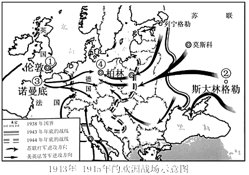
A．①处	B．②处	C．③处	D．④处
【分析】本题考查的是斯大林格勒战役。1942年7月，德军开始集中力量进攻斯大林格勒。举世闻名的斯大林格勒会战由此开始。1943年2月，斯大林格勒会战以苏军的胜利宣告结束。
【解答】依据“第二次世界大战的转折点”可知与斯大林格勒战役有关。1943年2月，苏军取得了斯大林格勒会战的胜利。斯大林格勒会战是二战中最关键性的战役，它不仅是苏德战场根本转折的开始，而且是第二次世界大战的重要转折点。故B符合题意。
故选：B。
【点评】解答本题需掌握斯大林格勒会战的历史地位和作用。
30．1970年尼克松总统提出家庭援助计划，对贫困家庭提供援助，这有利于推动（　　）
A．欧洲一体化的进程
B．战时共产主义政策的实行
C．日本经济的崛起
D．社会保障制度的完善
【分析】本题考查西方的福利制度，要在掌握课本相关知识的基础上，对问题进行深入的分析，从而得出结论。
【解答】由题干材料“1970年尼克松总统提出家庭援助计划，对贫困家庭提供援助”判断，这有利于推动社会保障制度的完善。欧洲一体化的进程没有涉及美国。战时共产主义政策的实行是苏维埃俄国的。日本经济的崛起也不是美国的。
故选：D。
【点评】在二战后西方资本主义国家经济政策进行新调整，其中主要措施有发展国家垄断资本主义和建立国家福利制度。
**二、非选择题（3大题，共40分）**
31．（14分）服饰作为社会文化的符号，它的变化折射出人类社会的政治变革、经济变化和风尚变迁。阅读材料，回答问题。
材料一：（孝文帝）又引见王公卿士，责留京之官曰：“昨望见妇女之服，仍为夹领小袖（少数民族旧俗）。……卿等何为而违前诏？”
﹣﹣《魏书》卷二十一上《献文六王•咸阳王禧传》
材料二：民国元年，迁到北京不久的民国临时政府和参议院颁发了第一个正式的服饰法令，即《服制》。……使洋服正式步入中国人的生活……革命党人正是以法国大革命、美国独立战争为榜样，以西方政体为摹本。因此，民初服饰的西化是历史的必然，也从此改变了中国服饰传统的历史轨迹。
﹣﹣﹣摘编自《光明日报》2014年5月14日
材料三：18世纪以前，英国的棉织品质地低劣，竞争不过印度、中国的棉织品。当时穿着中印棉布衣服的风尚风靡一时。为了促进本国纺织业的发展，1700年英国议会通过法令，禁止从印度、中国和伊朗输入染色的棉纺织品……英国只有采用新技术才能在国际市场上同印度、中国的产品竞争。正是这个商品竞争的需要，才推动了一系列新发明，进而引发了工业革命。
﹣﹣摘自刘祚昌、光仁洪、韩承文主编《世界通史》
材料四：如图这幅艺术作品描绘的是日本明治维新时期民众生活的一个场景。
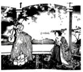
请回答：
（1）根据材料一并结合所学知识，指出孝文帝是哪一民族的统治者。留京官员违背了他的哪项诏令？孝文帝坚持推行改革起到了什么作用？
（2）根据材料二并结合所学知识，分析服饰法令的颁发与哪次革命存在关联。此后，民国时期服饰出现了什么变化？“以西方政体为摹本”，中国建立了什么政体？
（3）根据材料三并结合所学知识，指出工业革命最早从哪一行业开始。列举两个工业革命中的新发明。从材料中归纳英国促进该行业发展的方法。
（4）根据材料四，如图反映了明治维新时期民众服装的差异，有人穿传统服装，有人穿西式服装。结合所学知识，指出这是改革的哪一方面。经过改革，日本走上了什么道路？
（5）根据材料一、材料二和材料四，总结引起服饰变化的共同因素。
【分析】本题考查北魏孝文帝改革、辛亥革命的影响、第一次工业革命、日本明治维新等，掌握相关的基础知识。
【解答】（1）根据材料一“（孝文帝）又引见王公卿士，责留京之官曰：‘昨望见妇女之服，仍为夹领小袖（少数民族旧俗）。……卿等何为而违前诏？’”并结合所学知识孔子，孝文帝是鲜卑族的统治者。留京官员违背了他的以汉服代替鲜卑服的诏令，孝文帝坚持推行改革起到了促进民族交融，增强北魏实力的作用。
（2）根据材料二“民国元年，迁到北京不久的民国临时政府和参议院颁发了第一个正式的服饰法令，即《服制》。……使洋服正式步入中国人的生活……革命党人正是以法国大革命、美国独立战争为榜样，以西方政体为摹本。因此，民初服饰的西化是历史的必然，也从此改变了中国服饰传统的历史轨迹”并结合所学知识孔子，服饰法令的颁发与辛亥革命存在关联。此后，民国时期服饰出现的变化是服饰西化，“以西方政体为摹本”，中国建立了民主共和政体。
（3）根据材料三“18世纪以前，英国的棉织品质地低劣，竞争不过印度、中国的棉织品。当时穿着中印棉布衣服的风尚风靡一时。为了促进本国纺织业的发展，1700年英国议会通过法令，禁止从印度、中国和伊朗输入染色的棉纺织品……英国只有采用新技术才能在国际市场上同印度、中国的产品竞争。正是这个商品竞争的需要，才推动了一系列新发明，进而引发了工业革命”并结合所学知识可知，工业革命最早从棉纺织业开始。工业革命中的新发明有珍妮机、改良蒸汽机等。英国促进棉纺织业发展的方法是出台法令禁止棉纺织品进口，采用新技术。
（4）根据材料四可知，图片反映了明治维新时期民众服装的差异，有人穿传统服装，有人穿西式服装。结合所学知识可知，这是改革的社会生活方面。经过改革，日本走上了发展资本主义的道路。
（5）根据材料一、材料二和材料四可知，引起服饰变化的共同因素是政治变革，国家政策的影响等。
故答案为：
（1）鲜卑族；以汉服代替鲜卑服；促进民族交融，增强北魏实力。
（2）辛亥革命；服饰西化；民主共和政体。
（3）棉纺织业；珍妮机、改良蒸汽机等；出台法令禁止棉纺织品进口，采用新技术。
（4）社会生活方面；发展资本主义的道路。
（5）政治变革，国家政策的影响等。
【点评】本题考查学生的识记能力以及分析问题的能力，理解并识记北魏孝文帝改革、辛亥革命的影响、第一次工业革命、日本明治维新等相关史实。
32．（14分）坚持“引进来和走出去并重，遵循共商共建共享”原则，加强开放合作，是时代发展的潮流。阅读材料，回答问题。
材料一：如图。
材料二：为了迅速掌握西方先进的科学技术，洋务派还向美国、英国、德国派遣了留学生，其中派往美国的四批，120人；派往欧洲的四批，85人……后来这些留学生大都学有所成，许多人成为中国各项近代化事业的开创者……在电讯业方面，国家和地方电报局的负责人几乎全由留学归来人员担任，从而摆脱了外国对这一领域的控制企图。
﹣﹣摘自张海鹏、翟金懿《简明中国近代史读本》
材料三：全球范围内冲突和贫困尚未根除，但和平与发展的时代潮流愈发强劲。世界多极化、经济全球化、文化多样化、社会信息化深入发展。弱肉强食的丛林法则、你输我赢的零和游戏不再符合时代逻辑，和平、发展、合作、共赢成为各国人民共同呼声。
﹣﹣摘自习近平《论坚持推动构建人类命运共同体》
材料四：今年是深圳经济特区成立40周年。深圳要充分释放“双区驱动效应”，多方面发力，努力成为全面现代化的典范，特别是制度现代化的典范，提升社会主义制度的吸引力。在推动制度开放的过程中，深圳要主动学习借鉴国际先进规则，不断完善自身的营商环境，力争成为新时代中国对接国际的窗口、国内国际双向开放的桥梁。
﹣﹣摘编自《深圳特区报》2020年6月24日
请回答：
（1）根据材料一并结合所学知识，指出郑和下西洋所处的朝代。郑和能够完成此壮举的必备条件有哪些？
（2）根据材料二并结合所学知识，列举一位洋务派的代表人物。结合材料二分析洋务派派遣留学生的直接目的。该材料反映出洋务运动的性质是什么？
（3）根据材料三并结合所学知识，指出二战以来世界格局发生的变化。当今世界的时代主题是什么？举例说明“社会信息化”在我们生活中的具体表现。
（4）根据材料四并结合所学知识，指出深圳现代化的迅速发展得益于哪一项重大决策。与深圳同一批建立的经济特区还有哪些？（答出两个即可）。
（5）综合上述四则材料并结合所学知识，请你为深圳“成为全面现代的典范”提一个合理建议。
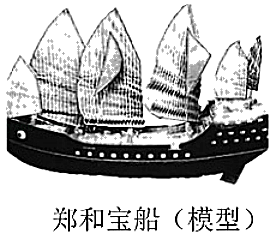
【分析】本题以四则材料为依托，综合考查郑和下西洋、政治多极化、经济全球化、社会信息化、改革开放、经济特区，题目设计注重基础性，要在掌握课本相关知识的基础上，对问题进行深入的分析作答。
【解答】（1）据材料一并结合所学知识，郑和下西洋所处的朝代是明朝：郑和能够完成此壮举的必备条件有国力强盛，皇帝支持，航海及造船技术发达，郑和个人具备优秀的领导才能。
（2）据材料二并结合所学知识，洋务派的代表人物有李鸿章、曾国藩、张之洞等；结合材料二洋务派派遣留学生的直接目的是学习西方先进技术：封建地主阶级的自救运动。
（3）据材料三并结合所学知识，二战以来世界格局发生的变化从两极格局到政治多极化、经济全球化、文化多样化、社会信息化；当今世界的时代主题是和平与发展；“社会信息化”在我们生活中的具体表现如健康码了解个人行程及健康信息，电子支付的普及，人脸识别等等。
（4）据材料四并结合所学知识，深圳现代化的迅速发展得益于实行改革开放，设立深圳经济特区；与深圳同一批建立的经济特区还有珠海，汕头，厦门。
（5）为深圳“成为全面现代的典范”提一个合理建议，如：推进信息化建设，加快5G等新技术的全方位应用，加强国际合作，提升现代化综合水平。
故答案为：
（1）明朝；国力强盛，皇帝支持，航海及造船技术发达，郑和个人具备优秀的领导才能。
（2）李鸿章、曾国藩、张之洞等（答出一个即可）；学习西方先进技术；封建地主阶级的自救运动。
（3）从两极格局到政治多极化、经济全球化、文化多样化、社会信息化；和平与发展；健康码了解个人行程及健康信息，电子支付的普及，人脸识别等等。
（4）实行改革开放，设立深圳经济特区；珠海，汕头，厦门。
（5）推进信息化建设，加快5G等新技术的全方位应用，加强国际合作，提升现代化综合水平。
【点评】本题考查学生识记和分析历史知识的能力，理解把握郑和下西洋、政治多极化、经济全球化、社会信息化、改革开放、经济特区的相关知识。运用所学，具体分析作答。
33．（12分）“人民群众是历史发展和社会进步的主体力量，人民群众是历史的创造者。”阅读材料，回答问题。
材料一：法国大革命比其他同时代的革命重大得多，而且它所产生的后果也要深远得……在它先后发生的所有革命中，唯有它是真正的群众性社会革命，并且比任何一次类似的大剧变都要激进得多。
﹣﹣摘自唐晋主编《大国崛起》
材料二：抗日战争是持久战，战争的伟力之最深厚的根源，存在于民众之中。实行人民战争的路线，最后的胜利一定属于中国。
﹣﹣摘编自毛泽东《论持久战》
请回答：
（1）根据材料一并结合所学知识，指出标志法国大革命开始的历史事件。根据材料二并结合所学知识，指出抗日战争的起点和全民族抗战的开始分别是什么历史事件。总结中国取得抗日战争胜利的决定性因素。
（2）结合所学知识，从材料一、二中提取信息，自拟一个论题并展开论述。要求：观点明确，史论结合，论证充分。
【分析】本题考查九一八事变、七七事变、抗日战争的胜利、法国大革命等，掌握相关的基础知识。
【解答】（1）根据材料一“法国大革命比其他同时代的革命重大得多，而且它所产生的后果也要深远得……在它先后发生的所有革命中，唯有它是真正的群众性社会革命，并且比任何一次类似的大剧变都要激进得多”并结合所学知识可知，标志法国大革命开始的历史事件是1789年巴黎人民攻占巴士底狱。根据材料二“抗日战争是持久战，战争的伟力之最深厚的根源，存在于民众之中。实行人民战争的路线，最后的胜利一定属于中国”并结合所学知识可知，抗日战争的起点是1931年九一八事变，标志着全民族抗战开始的是七七事变；中国取得抗日战争胜利的决定性因素是建立了抗日民族统一战线。
（2）可以拟定主题为人民群众是社会变革的决定力量，无论是法国大革命还是抗日战争，两者胜利的根本因素是广大人民群众的参与。法国大革命中，巴黎人民奋起反抗，攻占巴士底狱，在欧洲其他国家干涉法国革命时，法国各地人民拿起武器击退侵略者，保护大革命的成果，随后法国废除君主制，建立共和政体。抗日战争中，国共两党不计前嫌，一致对外，全国人民参与到抗日救亡中，抗日民族统一战线建立，最终中华民族赢得了这场正义战争的胜利，一雪前耻。所以人民群众是社会变革的决定力量。
故答案为：
（1）巴黎人民攻占巴士底狱；九一八事变，七七事变；建立了抗日民族统一战线。
（2）人民群众是社会变革的决定力量
        无论是法国大革命还是抗日战争，两者胜利的根本因素是广大人民群众的参与。法国大革命中，巴黎人民奋起反抗，攻占巴士底狱，在欧洲其他国家干涉法国革命时，法国各地人民拿起武器击退侵略者，保护大革命的成果，随后法国废除君主制，建立共和政体。抗日战争中，国共两党不计前嫌，一致对外，全国人民参与到抗日救亡中，抗日民族统一战线建立，最终中华民族赢得了这场正义战争的胜利，一雪前耻。所以人民群众是社会变革的决定力量。
【点评】本题考查学生的识记能力以及分析问题的能力，理解并识记九一八事变、七七事变、抗日战争的胜利、法国大革命等相关史实。
