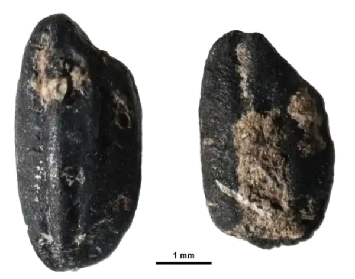
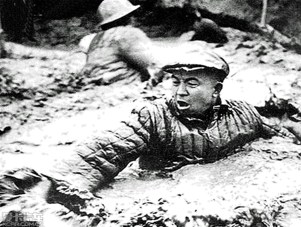
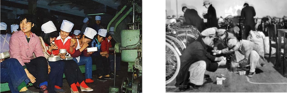
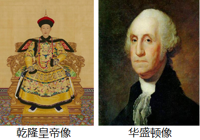

## **深圳市****2022****年学业水平考试历史卷**

**第一部分**** ****单项选择题（****23****小题，每小题****2****分，共****46****分）**

**下列各题的四个选项，只有一项符合题意。请你选出正确选项并用****28****铅笔在答题卡上将该题相对应的答案标号涂黑。**
1. “一粒深埋在遗址里的稻米，几块掺杂了碧糠碎谷的陶片，代表了古人向土地探寻食物的智慧，也记录了一场作物生产的革命。”这场“作物生产的革命”指的是（    ）

             碳化稻粒
A. 家畜饲养出现	B. 原始农业的产生

C. 定居生活的开始	D. 渔猎生产的发展
2. 孔子的教学方法以启发诱导为主，以人影响人的方式去“爱人”和教人。具有强烈的人本色彩。由此可见，孔子教育理论的起点是（    ）
A. 仁	B. 礼	C. 法	D. 德
3. 商鞅变法造就了以军工和才干上升的官僚功勋系统，使秦国社会的动力驱动系统焕然一新。推动这一驱动系统建立的变法措施是（    ）
A. 织致粟帛多者复其身	B. 民有二男以上不分异者，倍其赋
C. 有军功者，各以率受上爵	D. 为私斗者，各以轻重被刑大小
4. 如果没有秦统一战争这种特殊的历史手段，东方六国由分封到郡县的过渡恐怕就要拖几个时代，才能慢慢完成社会转型。此观点认为秦统一（    ）
A. 有利于民族融合	B. 加强了中央集权
C. 推动了经济发展	D. 促进了文化交流
5. 有学者探究了中国古代部分王朝选择都城的主要原因
| 
  人物  
 | 
  都城  
 | 
  定都的主要原因  
 |
| --- | --- | --- |
| 
  商王盘庚  
 | 
  殷  
 | 
  土地肥沃  
 |
| 
  汉高祖刘邦  
 | 
  长安  
 | 
  易守难攻  
 |
| 
  北魏孝文帝拓跋宏  
 | 
  洛阳  
 | 
  ▲  
 |
| 
  明成祖朱棣  
 | 
  北京  
 | 
  威慑地方  
 |

结合所学知识，可将表格补充完整一项是（    ）

A. 发迹之地	B. 军事需要	C. 宗教信仰	D. 推行改革
6. 陈寅恪先生认为科举制度是为王朝提供官僚精英的一种手段，这些人依靠王朝而不是依靠高贵的世系和世袭的特权取得地位和权力，陈寅恪先生意在说明科举制（    ）
A. 推动了教育的发展	B. 扩大了统治的基础
C. 提升了文官的地位	D. 强化了贵族的统治
7. 北宋时期，政府乐于见到人们的鉴赏喜好从贵金属转向陶瓷，这一转变有利于金属货币的流通，并向少数民族政权换取和平。可见政府支持这一转变的主要意图是（    ）
A. 引导贵族生活方式的转变	B. 推动文化教育事业的发展
C. 提倡节俭以保持士人清廉	D. 促进经济发展和支付岁币
8. 公主赵姬因战乱流落到今天的深圳一带并结婚生子，到南宋光宗时期才追认为皇姑，并追封为郡主。这个故事发生的背景是（    ）
A. 金灭北宋	B. 蒙古灭金	C. 元朝建立	D. 元灭南宋
9. 下表整理了徐光启推广农作物和整理农书的材料（    ）
| 1607-1608 | 将甘薯从福建引入上海，进行农业实验，成功种植，撰写《甘薯疏》，推广种植经验。 |
| --- | --- |
| 1613-1621 | 在天津建立水稻试验田，探索出行之有效的种植经验，撰写《北耕录》《宜垦令》等农书。 |
| 1622-1625 | 在上海和天津的经验上，整合前期农学著作，完成《农政全书》的初稿 |

A. 学习西方科学技术	B. 得到政府的支持
C. 注重搜集文献资料	D. 具有实践探索精神
10. 战前,列强在中国设立工厂还是不合法的,战后,他们却“合法”的经营了许多轻工业,导致这一变化的战争是（   ）
A. 鸦片战争	B. 第二次鸦片战争
C. 甲午中日战争	D. 八国联军侵华战争
11. 他们的目的在于恢复儒家的地位，使这个极其落魄的帝国恢复传统专制制度那种平静安稳的统治。但是也逐渐认识到改革和谨慎的现代化的必要性。“改革和谨慎的现代化”是指（    ）
A. 洋务运动	B. 新文化运动	C. 戊戌变法	D. 实业救国
12. 《儿童画报》是面向儿童的一种刊物，发行于1902至1904年间。据著名报人萨空了回忆，他在七八岁时最喜欢《儿童画报》的合订版，在画报中获得了许多科学知识。例如瓦特通过沸水发明了蒸汽机，世界人种的分类和五大洲的形状。这说明该刊物（    ）
A. 否定了传统文化	B. 传播了科学知识
C. 成为了学校教材	D. 宣传了革命思想
13. 1912年1月27日，孙中山致电各国公使说：“本总统甚愿让位于袁，而袁已允照办，岂袁忽南京临时政府迅速解散，此则为民国万难照办者，盖民国之愿让步，为共和，不为袁氏也。此电文体现了（   ）
A. 孙中山捍卫共和的决心	B. 列强武力干涉中国革命
C. 袁世凯接受临时政府的主张	D. 革命派的软弱性和妥协性
14. 1930年，中国共产党召开了扩大的六届三中全会，会议提出停止组织城市武装暴动和进攻大城市，巩固和发展当前苏维埃统治区域和红军武装，对党最有利的地方建立苏维埃政权。这说明该会议（    ）
A. 延续了城市武装暴动行为	B. 提出建设党的革命军队
C. 否定了党武装革命主张	D. 肯定工农武装割据思想

15. 1938年，各地青年纷纷涌向延安，形成了“天下归心于延安”的趋势，这种情形的出现主要是基于中央（    ）
A. 重视教育的发展	B. 重视文化艺术
C. 全民族抗战	D. 开展土地改革
16. 1969年同中国建交的西方资本主义国家只有法国等六个国家。1973年时，中国与除美国以外的其他西方资本主义发达国家基本建交，同欧盟也建立了正式关系。这种情况的变化反映了（    ）
A. 社会主义制度的确立	B. 中美关系的缓和
C. 资本主义阵营的分化	D. 改革开放的需要
17. 古埃及穷人死后埋入地下简陋墓穴，官僚贵族则埋入高出于地面的平顶陵墓，法老死后葬入宛如宫殿的金字塔。这种差别反映了古埃及（    ）
A. 地理环境各异	B. 风俗习惯迥异
C. 社会等级森严	D. 建筑形式多样
18. 文艺复兴时期的文艺作品具有丰富的色彩，如红、绿、蓝分别象征了爱情、希望、天空和海洋，扫除了中世纪的灰暗。作品鲜明的色彩反映了（    ）
A. 古罗马文化的复兴	B. 宗教信仰的改变
C. 东方文化影响	D. 精神面貌的变化

19. 瓦特在取得专利的说明书中，把他的蒸汽机说成是大工业普遍适用的发动机，与当时使用其他动力来源的机器相比，他的普遍适用性体现在（    ）
A. 突破地理条件的限制	B. 机器简单易于制造
C. 能源清洁更加环保	D. 可用能源丰富多样
20. 1868年，一批新的领导人在日本开始了革命性的变革，并最终把日本提高到一个具有国际威望的大国地位，这个改革（    ）
A. 仿效唐朝典章制度	B. 开启了幕府统治
C. 推行锁国政策	D. 发展了资本主义
21. 下图是第二次世界大战某个阶段的形势图。下列选项能作为此图标题的是（    ）

A. 德意法西斯的进攻	B. 世界反法西斯联盟建立
C. 盟军欧洲战场反攻	D. 欧洲战争策源地形成
22. 有学者指出，世界正迎来非西方大国和非西方世界的“群体性崛起”和美国主导的世界秩序“失序”这样一个历史转折的重要时刻。此观点认为（    ）
A. 美国的综合国力迅速衰落	B. 西方国家已无法影响世界
C. 世界多极化趋势的发展	D. 非西方国家主导世界秩序
23. 2022年北京冬奥会开幕式中，表演者的舞台采用光影投屏技术，形成巨大冰面视效，每一秒地屏画面都会随节目的调整而变化，或空灵或浪漫，呈现出独特美学。2008年奥运会开幕式也曾计划采用这种方式，但技术尚不成熟。如今技术成熟得益于（    ）
A. 信息技术的进步	B. 电影拍摄技术的提高
C. 空间技术的发展	D. 快速制冰技术的出现

**第二部分非选择题（****2****大题，共****24****分）**

24. 阅读材料，回答下列问题

习近平指出，工人阶级是中国共产党最可靠和最坚实的阶级基础，工人阶级和广大劳动人民是推动经济社会发展和维护社会安定团结的根本力量。
材料一：1919年6月11日，张东荪在《时务新报》中指出：“我们的罢工和同时期外国的罢工在性质上是不同的。他们的罢工，是劳动者和资本家的争斗，有的为了工值，有的为了工作时间，有的为了工作待遇。我们的，为的是不愿再受到一二卖国贼的支配，是争回民主国民的资格。”
——张德旺《道路和选择》
材料二：庆石油工人发出了：“宁可少活二十年，拼命也要拿下大油田”的口号，体现了大庆石油工人“爱国，求实，创新，奉献”的精神风貌，铸就了铁人精神。
一一中共党史研究室《中共共产党的九十年》

材料三：深圳特区的建立吸引了全国各地的劳动者，形成了上世纪80年代“百万劳工下深圳”的打工热潮。外未务工者为深圳的发展做出了重要的贡献。

   准备打饭的蛇口工业区玩具厂工人          沙井工厂流水线的工人领到第一笔工资
——深圳市档案馆《先行之路—深圳经济特区发展档案》
请回答：
（1）根据材料一，结合所学知识，五四时期工人罢工的要求是什么？五四时期的工人和同时期西方工人运动有什么区别？（不得照抄原文）
（2）根据材料二，说你出“铁人精神”在社会主义建设艰辛探索时期的意义是什么？某地组织党员实地学习上世纪五六十年代干部群众的精神风貌，请你推荐一个城市或地区，并说明理由。
（3）材料三的图片中，劳动者脸上都洋溢着发自内心的喜悦。结合上述材料及所学知识，请你说出他们展现出这种精神风貌的原因。并结合所学谈谈你对中国劳动者群体的认识。
25. 阅读材料，回答下列问题。
习近平在中国共产党成立100周年大会上指出：中国已经大踏步赶上了这个时代。
材料一：乾隆（1711年-1799年）和华盛顿（1732年-1799年）都生活在18世纪，乾隆统治期间中国处于康乾盛世，华盛顿则带领美国赶上了时代。

材料二：“中国要取得发展，摆脱落后和贫困，就必须开放”
——《邓小平文选》
请回答：
（1）根据所学知识回答，华盛顿带领美国赶上了怎样的时代？
（2）综合上述材料，自行提取观点并展开论述。（要求：观点明确，论证充分，史论结合，价值观正确，不得照搬材料。）
