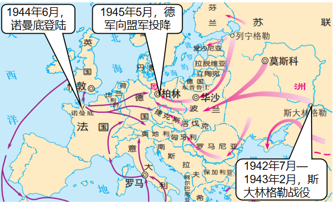
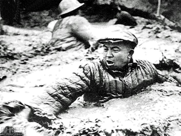
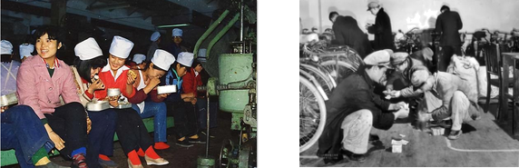
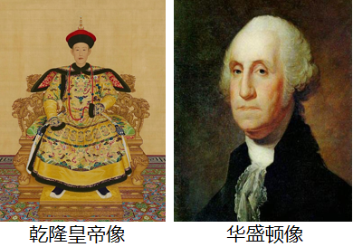

## **深圳市****2022****年学业水平考试历史卷**

**第一部分**** ****单项选择题（****23****小题，每小题****2****分，共****46****分）**

**下列各题的四个选项，只有一项符合题意。请你选出正确选项并用****28****铅笔在答题卡上将该题相对应的答案标号涂黑。**
1. “一粒深埋在遗址里的稻米，几块掺杂了碧糠碎谷的陶片，代表了古人向土地探寻食物的智慧，也记录了一场作物生产的革命。”这场“作物生产的革命”指的是（    ）

             碳化稻粒
A. 家畜饲养的出现	B. 原始农业的产生
C. 定居生活的开始	D. 渔猎生产的发展
【答案】B
【解析】
【详解】根据所学和材料“‘一粒深埋在遗址里的稻米’”可知，这是说种植稻，也就是说，原始农业产生了，B项正确；材料没有涉及家畜饲养，排除A项；作物生产指的是农作物生产，不是说定居，排除C项；作物生产指的是农作物生产，不是说渔猎生产，排除D项。故选B项。
2. 孔子的教学方法以启发诱导为主，以人影响人的方式去“爱人”和教人。具有强烈的人本色彩。由此可见，孔子教育理论的起点是（    ）
A. 仁	B. 礼	C. 法	D. 德
【答案】A
【解析】
【详解】根据所学可知，孔子的核心思想是“仁”，他提出“仁者爱人”，即要有爱心和同情心，“己所不欲，勿施于人”“ 己欲立而立人，己欲达而达人”，将“仁”作为处理人与人关系的最高行为准则和道德规范。结合题干“爱人”、“具有强烈的人本色彩”可得出孔子教育理论的起点是仁，A项正确；“礼”是政治主张，排除B项；“法”是法家所强调的，孔子是儒家，排除C项；题干并未体现“德”，排除D项。故选A项。
3. 商鞅变法造就了以军工和才干上升的官僚功勋系统，使秦国社会的动力驱动系统焕然一新。推动这一驱动系统建立的变法措施是（    ）
A. 织致粟帛多者复其身	B. 民有二男以上不分异者，倍其赋
C. 有军功者，各以率受上爵	D. 为私斗者，各以轻重被刑大小
【答案】C
【解析】
【详解】根据所学和材料“有军功者，各以率受上爵”可知，这是奖励军功，这样，就造就了以军工和才干上升的官僚功勋系统，使秦国社会的动力驱动系统焕然一新，C项正确；织致粟帛多者复其身，这促进农业的发展，排除A项； 民有二男以上不分异者，倍其赋，这样增加了户口，排除B项；为私斗者，各以轻重被刑大小，这样，就减少了私斗，有利于公战，排除D项。故选C项。
4. 如果没有秦统一战争这种特殊的历史手段，东方六国由分封到郡县的过渡恐怕就要拖几个时代，才能慢慢完成社会转型。此观点认为秦统一（    ）
A. 有利于民族融合	B. 加强了中央集权
C. 推动了经济发展	D. 促进了文化交流
【答案】B
【解析】
【详解】材料中“由分封郡县的过程恐怕就要拖几个时代’的描述中的分封到郡县的趋势是指的中央集权加强，因此材料中的观点秦的统一加强了中央集权。加速了由分封到郡县的过程，B项正确；材料中描述的是分封到郡县指的是地方行政制度的变化，与民族融合无关，排除A项；材料中描述的是分封到郡县指的是地方行政制度的变化，与经济发展没有直接关系，排除C项；材料中描述的是分封到郡县指的是地方行政制度的变化，与文化交流无关，排除D项。故选B项。
5. 有学者探究了中国古代部分王朝选择都城的主要原因
| 
  人物  
 | 
  都城  
 | 
  定都的主要原因  
 |
| --- | --- | --- |
| 
  商王盘庚  
 | 
  殷  
 | 
  土地肥沃  
 |
| 
  汉高祖刘邦  
 | 
  长安  
 | 
  易守难攻  
 |
| 
  北魏孝文帝拓跋宏  
 | 
  洛阳  
 | 
  ▲  
 |
| 
  明成祖朱棣  
 | 
  北京  
 | 
  威慑地方  
 |

结合所学知识，可将表格补充完整的一项是（    ）
A. 发迹之地	B. 军事需要	C. 宗教信仰	D. 推行改革
【答案】D
【解析】
【详解】根据所学可知，北魏孝文帝拓跋宏进行汉化改革，为了推行汉化改革，他迁都洛阳，这样，就有利于改革的进行，D项正确；北魏发迹于北方草原，排除A项；洛阳易攻难守，因此，迁都洛阳并不是出于军事需要，排除B项；北魏信奉北方草原的萨满教，洛阳盛行佛教，排除C项。故选D项。
6. 陈寅恪先生认为科举制度是为王朝提供官僚精英的一种手段，这些人依靠王朝而不是依靠高贵的世系和世袭的特权取得地位和权力，陈寅恪先生意在说明科举制（    ）
A. 推动了教育的发展	B. 扩大了统治的基础
C. 提升了文官的地位	D. 强化了贵族的统治
【答案】B
【解析】
【详解】根据所学和材料“依靠王朝而不是依靠高贵的世系和世袭的特权取得地位和权力”可知，这是说，科举制选拔了很多阶层中的精英进行统治阶层，这样，就扩大了统治基础，排除B项；材料没有涉及教育和文官，排除AC二项；科举制消弱了贵族的统治，排除D项。故选B项。
7. 北宋时期，政府乐于见到人们的鉴赏喜好从贵金属转向陶瓷，这一转变有利于金属货币的流通，并向少数民族政权换取和平。可见政府支持这一转变的主要意图是（    ）
A. 引导贵族生活方式的转变	B. 推动文化教育事业的发展
C. 提倡节俭以保持士人清廉	D. 促进经济发展和支付岁币
【答案】D
【解析】
【详解】由题干中的“这一转变有利于金属货币的流通，并向少数民族政权换取和平”，结合所学知识可知，北宋时期与辽、西夏签订了条约，需要支付大量岁币，以此获得和平，从而推动经济的发展，D项正确；题干中所述的是“政府乐于见到人们的鉴赏喜好从贵金属转向陶瓷”，可见群体不单单是贵族，排除A项；题干强调的意图是促进经济发展和支付岁币，与文化教育事业无关，排除B项；题干中的“政府乐于见到人们的鉴赏喜好从贵金属转向陶瓷”，不能直接推出提倡节俭以保持士人清廉，排除C项。故选D项。
8. 公主赵姬因战乱流落到今天的深圳一带并结婚生子，到南宋光宗时期才追认为皇姑，并追封为郡主。这个故事发生的背景是（    ）
A. 金灭北宋	B. 蒙古灭金	C. 元朝建立	D. 元灭南宋
【答案】A
【解析】
【详解】根据所学可知，1127年，金灭北宋，北宋皇族流落民间，于是出现了这种情况：公主赵姬因战乱流落到今天的深圳一带并结婚生子，到南宋光宗时期才追认为皇姑，并追封为郡主，A项正确；蒙古灭金、元朝建立与北宋皇族流落民间没有关系，排除BC二项；材料是说南宋光宗时期才追认，元灭南宋晚于此，排除D项。故选A项。
9. 下表整理了徐光启推广农作物和整理农书的材料（    ）
| 1607-1608 | 将甘薯从福建引入上海，进行农业实验，成功种植，撰写《甘薯疏》，推广种植经验。 |
| --- | --- |
| 1613-1621 | 在天津建立水稻试验田，探索出行之有效的种植经验，撰写《北耕录》《宜垦令》等农书。 |
| 1622-1625 | 在上海和天津的经验上，整合前期农学著作，完成《农政全书》的初稿 |

A. 学习西方科学技术	B. 得到政府的支持
C. 注重搜集文献资料	D. 具有实践探索精神
【答案】D
【解析】
【详解】根据所学和材料“将甘薯从福建引入上海、在天津建立水稻试验田”可知，这些均是实践，它体现的是实践探索精神，D项正确；材料没有涉及学习其它科技，排除A项；材料只是说徐光启实践，体现不出得到政府的支持，排除B项；材料强调的是实践，不能体现注重搜集文献资料，排除C项。故选D项。
10. 战前,列强在中国设立工厂还是不合法的,战后,他们却“合法”的经营了许多轻工业,导致这一变化的战争是（   ）
A. 鸦片战争	B. 第二次鸦片战争
C. 甲午中日战争	D. 八国联军侵华战争
【答案】C
【解析】
【详解】依据所学知识可知，甲午中日战争中清政府失败，1895年春，清政府派李鸿章为议和全权大臣，前往日本马关议和，经过谈判，双方签订中日《马关条约》，规定：清政府割辽东半岛、台湾全岛及所有附属各岛屿澎湖列岛给日本，赔偿日本兵费白银2亿两，开放沙市、重庆、苏州、杭州为商埠，允许日本在通商口岸开设工厂等，C项正确；ABD选项与题意不符，排除。故选C项。
11. 他们的目的在于恢复儒家的地位，使这个极其落魄的帝国恢复传统专制制度那种平静安稳的统治。但是也逐渐认识到改革和谨慎的现代化的必要性。“改革和谨慎的现代化”是指（    ）
A. 洋务运动	B. 新文化运动	C. 戊戌变法	D. 实业救国
【答案】C
【解析】
【详解】根据材料“他们目的在于恢复儒家的地位，使这个极其落魄的帝国恢复传统专制制度那种平静安稳的统治。”结合所学知识可知，戊戌变法时期康有为梁启超等对儒家思想采取宣传的态度，“但是也逐渐认识到改革和谨慎的现代化的必要性。”其目的的利用儒家思想为变法宣传造舆论，如《孔子改制考》，C项正确；洋务运动时期是学习西方的技术，根本目的是维护清王朝的封建统治，排除A项；新文化运动对儒家学说采取完全否定的态度，排除B项；实业救国借助兴办民族资本主义企业来拯救民族危亡，排除D项。故选C项。

12. 《儿童画报》是面向儿童的一种刊物，发行于1902至1904年间。据著名报人萨空了回忆，他在七八岁时最喜欢《儿童画报》的合订版，在画报中获得了许多科学知识。例如瓦特通过沸水发明了蒸汽机，世界人种的分类和五大洲的形状。这说明该刊物（    ）
A. 否定了传统文化	B. 传播了科学知识
C. 成了学校教材	D. 宣传了革命思想

【答案】B
【解析】
【详解】根据题干“在画报中获得了许多科学知识”可得出该刊物传播了科学知识，B项正确；材料反映的是儿童画报有许多科学常识，没有体现否定了传统文化，排除A项；材料中没有信息可以得知画报成为学校教材，排除C项；材料主要反映画报传播科学知识，没有提及革命思想，排除D项。故选B项。
13. 1912年1月27日，孙中山致电各国公使说：“本总统甚愿让位于袁，而袁已允照办，岂袁忽南京临时政府迅速解散，此则为民国万难照办者，盖民国之愿让步，为共和，不为袁氏也。此电文体现了（   ）
A. 孙中山捍卫共和的决心	B. 列强武力干涉中国革命
C. 袁世凯接受临时政府的主张	D. 革命派的软弱性和妥协性
【答案】A
【解析】
【详解】根据题干信息“……此则为民国万难照办者，盖民国之愿让步，为共和，不为袁氏也”，结合所学知识可知，此电文体现了孙中山捍卫共和的决心。A项正确；列强武力干涉中国革命，题干内容没有体现，排除B项；袁世凯接受临时政府的主张、革命派的软弱性和妥协性，与题干内容不符，排除CD项。故选A项。
14. 1930年，中国共产党召开了扩大的六届三中全会，会议提出停止组织城市武装暴动和进攻大城市，巩固和发展当前苏维埃统治区域和红军武装，对党最有利的地方建立苏维埃政权。这说明该会议（    ）
A. 延续了城市武装暴动行为	B. 提出建设党的革命军队
C. 否定了党的武装革命主张	D. 肯定工农武装割据思想
【答案】D
【解析】
【详解】根据所学和材料“巩固和发展当前苏维埃统治区域和红军武装，对党最有利的地方建立苏维埃政权”可知，这是主张进行武装斗争和根据地建设，实际上是肯定工农武装割据思想，D项正确；材料否定了城市武装暴动行为，排除A项；南昌起义已经拥有了党的军队，排除B项；材料是肯定 了党的武装革命主张，排除C项。故选D项。
15. 1938年，各地青年纷纷涌向延安，形成了“天下归心于延安”的趋势，这种情形的出现主要是基于中央（    ）
A. 重视教育的发展	B. 重视文化艺术
C. 全民族抗战	D. 开展土地改革
【答案】C
【解析】
【详解】根据所学可知，1937年，爆发七七事变，中共主张全民族抗战，各地青年纷纷涌向延安，形成了“天下归心于延安”的趋势，C项正确；重视教育的发展、 重视文化艺术均是重要原因，排除AB二项；抗日战争时期的政策是减租减息，不是开展土地改革，排除D项。故选C项。
16. 1969年同中国建交的西方资本主义国家只有法国等六个国家。1973年时，中国与除美国以外的其他西方资本主义发达国家基本建交，同欧盟也建立了正式关系。这种情况的变化反映了（    ）
A. 社会主义制度的确立	B. 中美关系的缓和
C. 资本主义阵营的分化	D. 改革开放的需要
【答案】B
【解析】
【详解】根据材料“1973年时，中国与除美国以外其他西方资本主义发达国家基本建交，同欧盟也建立了正式关系。”及所学可知，1972年中美关系实行正常化，推动了中国与其他西方资本主义国家的建交，B项正确；1956年三大改造基本完成，标志着社会主义基本制度在我国的确立，排除A项；这一时期资本主义阵营并未分化，不符合史实，排除C项；1978年十一届三中全会在北京召开，大会作出了实行改革开放的伟大决策，时间不符，排除D项。故选B项。

17. 古埃及穷人死后埋入地下简陋墓穴，官僚贵族则埋入高出于地面的平顶陵墓，法老死后葬入宛如宫殿的金字塔。这种差别反映了古埃及（    ）
A. 地理环境各异	B. 风俗习惯迥异
C. 社会等级森严	D. 建筑形式多样
【答案】C
【解析】
【详解】根据所学和材料“古埃及穷人死后埋入地下简陋墓穴，官僚贵族则埋入高出于地面的平顶陵墓，法老死后葬入宛如宫殿的金字塔”可知，按阶级的不同，坟墓也出现了等级差别，这体现出社会等级森严，C项正确；材料反映的是古埃及坟墓的等级差异，并不是为了说明古埃及的地理环境各异，排除A项；材料反映的是古埃及坟墓的等级差异，并非为了说明古埃及的风俗习惯迥异，排除B项；材料反映的是古埃及坟墓的等级差异，而不是为了说明古埃及的建筑形式多样，排除D项。故选C项。
18. 文艺复兴时期的文艺作品具有丰富的色彩，如红、绿、蓝分别象征了爱情、希望、天空和海洋，扫除了中世纪的灰暗。作品鲜明的色彩反映了（    ）
A. 古罗马文化的复兴	B. 宗教信仰的改变
C. 东方文化的影响	D. 精神面貌的变化
【答案】D
【解析】
【详解】根据所学和材料“爱情、希望”可知，这是对人的感情的关注，也就是关注人，而不再关注神，这体现了精神面貌的变化，D项正确；材料并没有相关内容能说明文艺复兴是对古罗马文化的复兴，排除A项；关注人情感和真实的自然，并不属于宗教信仰的改变，排除B项；材料并没有相关内容能说明文艺复兴受到东方文化的影响，排除C项。故选D项。
19. 瓦特在取得专利的说明书中，把他的蒸汽机说成是大工业普遍适用的发动机，与当时使用其他动力来源的机器相比，他的普遍适用性体现在（    ）
A. 突破地理条件的限制	B. 机器简单易于制造
C. 能源清洁更加环保	D. 可用能源丰富多样
【答案】A
【解析】
【详解】根据所学可知，瓦特改良蒸汽机作动力，它使用煤为能源来源，这样，就突破了地理条件的限制，推动工业革命向深层发展，A项正确；改良蒸汽机比手工劳动相对复杂，排除B项；蒸汽机燃烧煤产生蒸汽会造成污染，排除C项；蒸汽机可用能源单一，排除D项。故选A项。
20. 1868年，一批新领导人在日本开始了革命性的变革，并最终把日本提高到一个具有国际威望的大国地位，这个改革（    ）

A. 仿效唐朝典章制度	B. 开启了幕府统治
C. 推行锁国政策	D. 发展了资本主义
【答案】D
【解析】
【详解】根据题干材料关键信息“1868年，一批新的领导人在日本开始了革命性的变革”结合所学知识可知，1868年明治政府开始实行一系列改革，通过明治维新，日本迅速走上发展资本主义的道路，D项正确；仿效唐朝典章制度是大化改新的特点，排除A项；日本幕府时期是指从公元1192 年到 1867 年，在日本历史上是武士阶级掌握政权、实行军事封建统治的“幕府政治”时期，排除B项；日本幕府统治后期推行锁国政策，排除C项。故选D项。
21. 下图是第二次世界大战某个阶段的形势图。下列选项能作为此图标题的是（    ）

A. 德意法西斯的进攻	B. 世界反法西斯联盟建立
C. 盟军欧洲战场反攻	D. 欧洲战争策源地形成
【答案】C
【解析】
【详解】根据所学可知，第二次世界大战后期，1944年，诺曼底登陆成功，法西斯德国陷入盟军的东西夹击之中，盟军欧洲战场反攻，C项正确；德意法西斯的进攻在第二次世界大战前期，排除A项；世界反法西斯联盟建立在1942年，排除B项；希特勒上台，欧洲战争策源地形成，排除D项。故选C项。
22. 有学者指出，世界正迎来非西方大国和非西方世界的“群体性崛起”和美国主导的世界秩序“失序”这样一个历史转折的重要时刻。此观点认为（    ）
A. 美国的综合国力迅速衰落	B. 西方国家已无法影响世界
C. 世界多极化趋势的发展	D. 非西方国家主导世界秩序
【答案】C
【解析】
【详解】根据所学和材料“群体性崛起——美国主导的世界秩序失序”可知，这是说，美国影响力下降，很多力量影响力上升，这体现的是世界多极化趋势的发展，C项正确；美国的综合国力相对而不是迅速衰落，排除A项；西方国家仍在一定程度上影响世界，排除B项；非西方国家影响世界秩序的变化但不能主导世界，排除D项。故选C项。
23. 2022年北京冬奥会开幕式中，表演者的舞台采用光影投屏技术，形成巨大冰面视效，每一秒地屏画面都会随节目的调整而变化，或空灵或浪漫，呈现出独特美学。2008年奥运会开幕式也曾计划采用这种方式，但技术尚不成熟。如今技术成熟得益于（    ）
A. 信息技术的进步	B. 电影拍摄技术的提高
C. 空间技术的发展	D. 快速制冰技术的出现
【答案】A
【解析】
【详解】根据材料“光影投屏技术”可知，这属于信息技术的进步，A项正确；材料中的光影投屏是信息技术，不是电影拍摄技术、空间技术、快速制冰技术，排除BCD项。故选A项。

**第二部分非选择题（****2****大题，共****24****分）**

24. 阅读材料，回答下列问题。
习近平指出，工人阶级是中国共产党最可靠和最坚实的阶级基础，工人阶级和广大劳动人民是推动经济社会发展和维护社会安定团结的根本力量。
材料一：1919年6月11日，张东荪在《时务新报》中指出：“我们的罢工和同时期外国的罢工在性质上是不同的。他们的罢工，是劳动者和资本家的争斗，有的为了工值，有的为了工作时间，有的为了工作待遇。我们的，为的是不愿再受到一二卖国贼的支配，是争回民主国民的资格。”
——张德旺《道路和选择》
材料二：庆石油工人发出了：“宁可少活二十年，拼命也要拿下大油田”的口号，体现了大庆石油工人“爱国，求实，创新，奉献”的精神风貌，铸就了铁人精神。
一一中共党史研究室《中共共产党的九十年》

材料三：深圳特区的建立吸引了全国各地的劳动者，形成了上世纪80年代“百万劳工下深圳”的打工热潮。外未务工者为深圳的发展做出了重要的贡献。

   准备打饭的蛇口工业区玩具厂工人          沙井工厂流水线的工人领到第一笔工资
——深圳市档案馆《先行之路—深圳经济特区发展档案》
请回答：
（1）根据材料一，结合所学知识，五四时期工人罢工要求是什么？五四时期的工人和同时期西方工人运动有什么区别？（不得照抄原文）

（2）根据材料二，说你出“铁人精神”在社会主义建设艰辛探索时期的意义是什么？某地组织党员实地学习上世纪五六十年代干部群众的精神风貌，请你推荐一个城市或地区，并说明理由。
（3）材料三的图片中，劳动者脸上都洋溢着发自内心的喜悦。结合上述材料及所学知识，请你说出他们展现出这种精神风貌的原因。并结合所学谈谈你对中国劳动者群体的认识。
【答案】（1）释放被捕学生；惩治卖国赋；拒绝在和约上签字
西方工人运动是为了提高待遇等个人目的，五四时期工人运动与社会背景相关，国家命运相连，是广泛群众性的反帝爱国运动。
（2）有利于形成艰苦奋斗，奋发图强的劳模精神，激励广大群众投身于祖国建设；有利于推动社会主义建设事业取得新成就，新发展。
示例
地区：东北地区
理由：“一五”计划期间，东北地区发挥地理和政策优势，先后建立长春第一汽车制造厂、沈阳第一机床厂和飞机制造厂等重工业，经过不懈努力，生产出我国第一批汽车、喷气歼击机等，改变了我国工业落后的面貌。
（3）原因；改革开放政策的实施；人们的收入，生活水平提高；国家经济的发展；“特区精神”的感染等
认识：劳动人民是历史的创造者；劳动人民为国家经济发展建设做出巨大贡献；我们要尊重劳动人民，珍惜劳动成果；我们要热爱劳动，以劳动为荣，立志投身于社会主义建设事业等。
【解析】
【小问1详解】
根据所学知识，五四时期工人罢工的要求是：释放被捕学生；惩治卖国赋；拒绝在和约上签字。根据材料“他们的罢工，是劳动者和资本家的争斗，有的为了工值，有的为了工作时间，有的为了工作待遇。我们的，为的是不愿再受到一二卖国贼的支配，是争回民主国民的资格。”可知，西方工人运动是为了提高待遇等个人目的，五四时期工人运动与社会背景相关，国家命运相连，是广泛群众性的反帝爱国运动。
【小问2详解】
根据材料“宁可少活二十年，拼命也要拿下大油田”的口号，体现了大庆石油工人“爱国，求实，创新，奉献”的精神风貌，铸就了铁人精神。”可知，有利于形成艰苦奋斗，奋发图强的劳模精神，激励广大群众投身于祖国建设；有利于推动社会主义建设事业取得新成就，新发展。本题为开放性题目，言之有理即可。例如：地区：东北地区理由：“一五”计划期间，东北地区发挥地理和政策优势，先后建立长春第一汽车制造厂、沈阳第一机床厂和飞机制造厂等重工业，经过不懈努力，生产出我国第一批汽车、喷气歼击机等，改变了我国工业落后的面貌。
【小问3详解】
根据材料“深圳特区”可知，1978年十一届三中全会做出了改革开放的历史性决策，人们的收入生活水平得到提高，改革开放促进了国家经济的发展，深圳“特区精神”也感染着这些劳动者。其他答案言之有理也可。本题为开放性题目，言之有理即可。例如：劳动人民是历史的创造者；劳动人民为国家经济发展建设做出巨大贡献；我们要尊重劳动人民，珍惜劳动成果；我们要热爱劳动，以劳动为荣，立志投身于社会主义建设事业等。
25. 阅读材料，回答下列问题。
习近平在中国共产党成立100周年大会上指出：中国已经大踏步赶上了这个时代。
材料一：乾隆（1711年-1799年）和华盛顿（1732年-1799年）都生活在18世纪，乾隆统治期间中国处于康乾盛世，华盛顿则带领美国赶上了时代。

材料二：“中国要取得发展，摆脱落后和贫困，就必须开放”
——《邓小平文选》
请回答：
（1）根据所学知识回答，华盛顿带领美国赶上了怎样的时代？
（2）综合上述材料，自行提取观点并展开论述。（要求：观点明确，论证充分，史论结合，价值观正确，不得照搬材料。）
【答案】（1）资本主义时代（资产阶级时代）：华盛顿带领人民完成独立战争，确立资本主义政治制度。
工业革命时代：美国完成独立战争后，为资本主义发展扫清了障碍，赶上并利用工业革命成果，迅速发展。
（2）本题主要考察学生的历史解释素养。学生需以唯物史观为指导，对相关史事之间的关系进行合理的解释和评述；坚持论从史出、史论结合的原则；阅卷可对学生答卷从整体上进行分层评价。
论点：杰出人物推动社会发展乾隆帝是中国封建社会后期一位赫赫有名的皇帝，在位期间清朝达到了康乾盛世以来的最高峰。他在康熙、雍正两朝文治武功的基础上，进一步完成了多民族国家的统一，社会经济文化有了进一步发展。华盛顿领导独立战争使美国摆脱了英国的殖民统治，获得了国家独立，走上了资本主义道路，进入资本主义时代；主持制定了1787年美国宪法，确定了分权制衡的民主原则，推动了世界民主法制建设的进程，是美国历史的著名总统，为美国社会的发展做出了重大贡献。综上所述，历史人物在社会发展过程事起着重要作用，杰出人物推动社会发展。
【解析】
【小问1详解】
时代：根据所学知识可知，华盛顿带领美国人民实现了民族独立，确立了资本主义制度，步入资本主义时代；同时，美国独立战争后，为资本主义发展清除了障碍，赶上并利用工业革命成果，迅速发展，进入工业时代。
【小问2详解】
本题可以从两位领导人身上所就有的品质或者事迹中去提炼观点，如杰出人物推动历史发展，然后围绕观点进行论述，论述部分需要用两个以上的相关史实进行说明，最后进行总结即可。
论点：杰出人物推动社会发展
乾隆帝是中国封建社会后期一位赫赫有名的皇帝，在位期间清朝达到了康乾盛世以来的最高峰。他在康熙、雍正两朝文治武功的基础上，进一步完成了多民族国家的统一，社会经济文化有了进一步发展。
华盛顿领导独立战争使美国摆脱了英国的殖民统治，获得了国家独立，走上了资本主义道路，进入资本主义时代；主持制定了1787年美国宪法，确定了分权制衡的民主原则，推动了世界民主法制建设的进程，是美国历史的著名总统，为美国社会的发展做出了重大贡献。
综上所述，历史人物在社会发展过程事起着重要作用，杰出人物推动社会发展。
