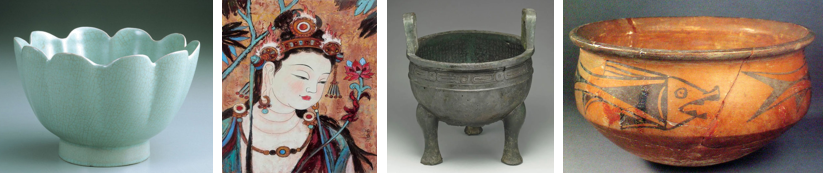
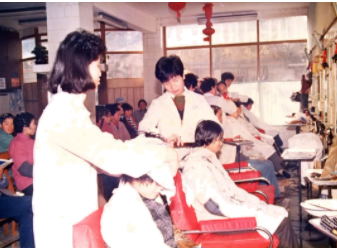
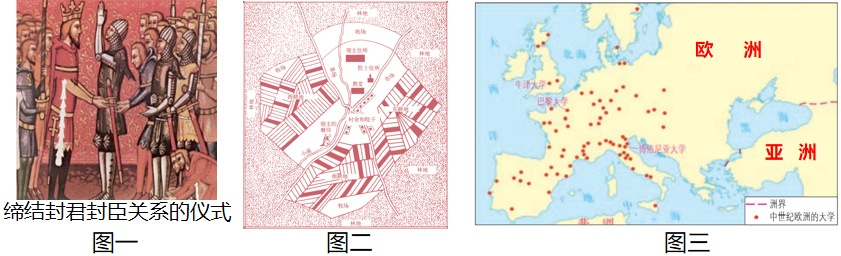
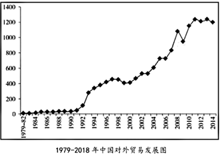

## **2023****年广东省深圳市中考历史真题**

**一、选择题**
1. 博物馆参观展览是学习历史的方式。了解商周时期的历史，参观下列哪一展览（    ）

A. 瓷器      清淡含蓄     故宫博物馆汝窑瓷器展
B. 壁画       交流互鉴    敦煌石窟与河西走廊丝路艺术展
C. 鼎        鼎盛千秋    上海博物馆铜器特展
D. 陶        远古回声    半坡遗址与半坡文化展
2. 颜渊曾说，学了满身本领，但是如果违背了道德，宁肯藏而不用。这体现了（    ）
A. 尊崇自然	B. 仁德为先	C. 学以致用	D. 以法治国
3. “短短15年的秦朝，把全国的人力财力，榨取尽了，无数血汗生命，造成许多事功。”体现这一观点的是（    ）
A. 灭六国	B. 焚诗书	C. 行郡县	D. 筑长城
4. 豹炙是北方少数民族食肉习惯。在炙肉时，将整只动物放在火上烧烤，再分块分食。南北朝时，南北方社会上层的宴饮中，食用炙烤肉类现象普遍。南齐高帝曾赐给江淹鹅炙和美酒，奖励他草拟诏书有功。说明这一时期（    ）

A. 北人大量迁往南方	B. 南方社会相对稳定
C. 南北方饮食基本一致	D. 民族之间相互交融
5. 唐朝政府中，中央和地方都有外国人担任各类官职。据统计，总数不下3000人，有一些还身居高位。这说明唐朝（    ）
A. 开放包容	B. 经济繁荣	C. 文化昌盛	D. 政治腐败
6. 了解宋代政治，下列哪一史料最合适（    ）
A. 《梦溪笔谈》	B. 《宋史·职官志》
C. 《清明上河图》	D. 《马可·波罗行纪》
7. 朱元璋认为明朝的刑法难以达到明刑弼教的目的，又制定《大诰》。《大诰》拟罪唯朱元璋一人，官员拟罪须以《大诰》为依据，降一级。此措施体现了（    ）
A. 追求法律平等	B. 加强思想禁锢
C. 维护官员利益	D. 强化君主专制
8. 1691年，康熙帝把蒙古的所有王公、新疆的部分王公和西藏的喇嘛请到多伦诺尔兵营，在这里阅兵和会盟。之后，清廷把漠北地区纳入直接管辖。凭借着喀尔喀部落在北部边疆筑起了一道“铜墙铁壁”。这次会盟（    ）
A. 加强了东南海防	B. 促进了中外联系
C. 巩固了清朝疆域	D. 激化了社会矛盾
9. 有学者认为，1840年之后，西学输入中国，对中国的影响比较慢，对士大夫的影响长时间只停留在表面，尤其是和日本相对比。下面能体现这一观点的是（    ）
A. 洋务运动	B. 戊戌变法	C. 辛亥革命	D. 新文化运动
10. 19世纪80年代，《点石斋画报》记载了北京的风俗，比如《超度孤魂》等。20年之后却受到了批判，《北京画报》里记载“七月十五是鬼节，烧法船……这种有碍风化的事情，警厅应当管一管”。这一变化说明（    ）
A. 时人崇洋媚外	B. 地区发展有差异
C. 不记得了	D. 科学思想的传播
11. 1933年中华苏维埃共和国临时中央政府在机关报《红色中华》上开辟“红板”专栏，表彰革命精神模范
| 
  1933.1-1934.9“红板”专栏表彰概说  
 | 
  1933.1-1934.9“红板”专栏表彰概说  
 | 
  1933.1-1934.9“红板”专栏表彰概说  
 |
| --- | --- | --- |
| 序号 | 标题 | 模范类型和表彰对象 |
| 1 | 紧急战争动员中的“红板名单” | 节省经济模范、劳动模范；个人 |
| 2 | 节省运动的中央无线电队 | 节省经济模范；集体 |
| 3 | 帮助战费被服厂工人同志捐出工资 | 节省经济模范；集体和个人 |
| 4 | 大家起来革命竞赛帮助战争 | 节省经济模范；集体 |
| …… | …… | …… |

上表说明（    ）
A. 体现共产党注重价值引领	B. 扩大农村革命根据地范围
C. 表达共产党对知识分子尊重	D. 有利于赢得北伐战争的最终胜利

12. 1937．7-1938．10，我国有108所高校其中有91所被轰炸，教师和学生减员20%，财产损失3360多万元，更有一些损失无法估算。这说明（    ）
A. 晚清教育发展艰难	B. 北洋政府统治黑暗
C. 全民族抗战局面形成	D. 侵华日军残暴的本质
13. 彭德怀在挺进大别山时说：“我们吸引的敌人越多，其他战区的兄弟部队和包围圈就更加顺利。”这体现了（    ）
A. 振奋抗日信心	B. 消灭国军主力
C 牵制敌军部队	D. 进攻长江以南

14. 二十世纪五十年代，在中国共产党的领导下，中国建立了工业基础，形成了独立完整的工业体系。材料意在说明（    ）
A. 土地改革	B. 抗美援朝	C. “一五”计划	D. 三大改造
15. 如图反映的是1984年山东胶县某乡妇女正在围观上海发廊的画报。据统计，此前几年，该乡进入发廊烫发的女性不过3人，但仅1984年一年，就有万人烫发。这体现了（    ）

A. 农民生产积极性的提高	B. 人们个性解放的要求
C. 城市经济体制改革的成果	D. 全面对外开放的影响
16. 罗马不再是拉丁-罗马城邦和城邦文化的象征，它吸收了叙利亚、希腊和其他地中海文明，成为欧洲文明的先声。材料指出罗马（    ）
A. 早期法律制度背景	B. 吸收希腊文化的原因

C. 文化交流和传播的影响	D. 民主政治发展历程的特征
17. 某班历史复习课展示了三张图片。图一封君和封臣。图二庄园地图。图三大学分布图。这节复习课的主题应该是（    ）

A 古代亚非文明	B. 欧洲封建时代

C. 近代文明的曙光	D. 早期殖民掠夺
18. 位于佛罗伦萨的某大教堂，1420—1435年时改建了教堂穹顶，将原本封闭的穹顶打通，使阳光能够照入教堂，这反映了（    ）
A. 近代法制	B. 人文主义	C. 近代民主	D. 君权神授
19. “这个重要的文件，最大程度地保证了议会的立法权，从财政和军队招募两方面保证对国王的监督权。”这个重要的文件是（    ）
A. 《权利法案》	B. 《独立宣言》
C. 《人权宣言》	D. 1787年宪法
20. 有学者认为“在19世纪的第一个四分之一时间里，玻利瓦尔就是美洲。”该学者观点的依据是，玻利瓦尔（    ）
A. 领导了美洲独立运动	B. 收回了巴拿马运河的主权
C. 发起了非暴力不合作运动	D. 颁布了《解放黑人奴隶宣言》
阅读材料，完成下面小题
阿芙乐意为“黎明”、“曙光”。在1917年11月7日晚上9点45分，阿芙乐号巡洋舰率先对临时政府政权所在地冬宫进行炮击，革命开始了……法西斯对列宁格勒攻击时，阿芙乐号巡洋舰选择在此海港自沉。在战争后期被打捞起来并维修……此后阿芙乐号就在涅瓦河畔上，供人们参观、瞻仰。
21. “革命开始了”，这场“革命”（    ）
A. 让民族获得了独立	B. 废除了农奴制度
C. 促进了资本主义经济的发展	D. 建立无产阶级政权
22. 与“此海港”有关的事件是（    ）
A. 苏德战争	B. 珍珠港事件	C. 东欧剧变	D. 雅尔塔会议
23. 2023年6月23日，央视“新闻频道”报道了北约将在日本建立联络处。这将是北约在亚洲建立的第一个联络处。北约的举动体现了（    ）
A. 遏制苏联的需要	B. 冷战思维的延续
C. 经济全球化的发展	D. 多极化的强化
**二、非选择题**
24. 当前中国是近代以来发展最好的时期，而西方则是百年未有之大变局。我们应该以史为鉴，思危图安。
材料一：美洲金银矿的发现，土著居民的被绞杀、被奴役和被埋葬于矿井，对东印度的征服和掠夺，美洲成为了商业性猎获黑人的场所——这些都标志着资本主义生产时代的曙光。这种田园诗式的过程也是原始积累的过程。
——中共中央编译局《马克思恩格斯文集》（第五卷）
材料二：18世纪中国的对外贸易一直都是出超，在1781-1790年，中国销往英国的商品仅茶叶就达9600万元，而在1781-1793年，英国销往中国的所有工业品为1600万元，仅为茶叶的6/1。19世纪初广州流入中国的白银每年为100万两到400万两。
——摘编自李侃、李时岳《中国近代史1840-1919》
材料三：19世纪末30年，抢夺殖民地再度成为热点。1914年，世界被占殖民地总和为7490万平方公里，占地球陆地总面积的55%。如果按照各区域被占殖民地的百分比算的话，被占殖民土地，澳洲100%，非洲90.4%，亚洲56.6%，美洲20.7%。
——摘编自徐天新、许平等《世界通史（现代篇）》
材料四：改革开放以来，中国的对外贸易一直在持续发展（如下图）。2021年，中国国内生产总值位居世界第二位。

——CEIC中国经济数据库
请回答：
（1）根据材料一并结合所学知识，西方殖民者获得黄金白银的手段有哪些？你是怎么看待这种田园诗式的过程？
（2）阅读材料二，清朝前中期，世界白银流入中国的原因有哪些？西方殖民者通过哪些方式来改变这种状态的？
（3）阅读材料三，西方殖民者为什么要加速抢夺殖民地？中国是否属于“亚洲56.6%”？请说明你的判断理由。
（4）根据材料四，中国现在已经成为了世界财富的中心之一。你认为现在是否还会出现清朝的危机？请说明你的判断理由。
25. 民以食为天，国以农为本，某学习小组以“农业生产和粮食问题”为主题开展了研究性学习活动，搜集的资料如下：
| 
  朝代  
 | 
  资料  
 |
| --- | --- |
| 
  战国  
 | 
  都江堰  
 |
| 
  南北朝  
 | 
  《齐民要术》  
 |
| 
  唐朝  
 | 
  曲辕犁、筒车  
 |
| 
  宋朝  
 | 
  秧马、占城稻  
 |
| 
  明朝  
 | 
  《农政全书》玉米、甘薯等  
 |
| 
  清朝  
 | 
  黄河、淮河治理  
 |
| 
  抗战时期  
 | 
  大生产运动  
 |
| 
  1950年  
 | 
  《中华人民共和国土地改革法》  
 |
| 
  20世纪70年代  
 | 
  籼型杂交水稻  
 |
| 
  1978年  
 | 
  家庭联产承包责任制  
 |

请结合所学知识，并根据上述资料，自拟一个论题展开论述，要求观点明确，史论结合，价值观正确。
