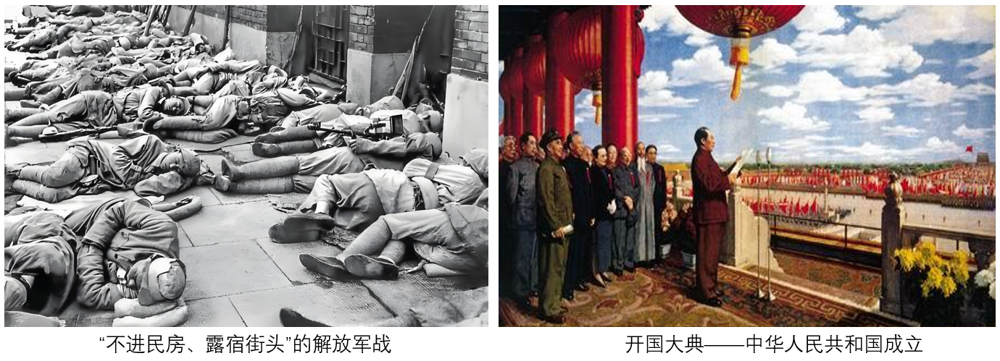

## **深圳市2025年初中学业水平考试**

## **历史试卷**

**2025.6.27**

**说明：全卷共4页。考试时间60分钟，满分70分。答题前，请将姓名、准考证号、考点用黑色字迹的钢笔或签字笔写在答题卡指定的位置上，并将条形码粘贴好。考试结束后，请将本试卷和答题卡一并交回。**
**一、选择题（共17题，每小题2分，共计34分）**
1. 俗话说“水火不容”，但古代先民却在烹饪上实现了“水火相成”。只要水、火之间有一层薄薄的隔离，它们就能共存相成。半坡先民解决这一问题使用的方法是（   ）
A. 人工取火	B. 种植水稻	C. 制作陶器	D. 建造房屋
【答案】C
【解析】
【详解】据题干“半坡先民解决‘水、火之间有一层薄薄的隔离，它们就能共存相成’这一问题”和所学知识可知，半坡先民会制作陶器，陶器可以盛水，在烹饪时，陶器能将水与火隔离，实现“水火相成”，C项正确；人工取火是获取火的方式，不能解决水与火在烹饪中“隔离共存”问题，排除A项；半坡先民种植粟，种植水稻是河姆渡先民的活动，且与题干“水火相成”烹饪问题无关，排除B项；建造房屋是居住方面的内容，和烹饪中水火关系无关，排除D项。故选C项。
2. 公元前544年，鲁襄公宴请晋卿范献子，举行射礼时，鲁国公室竟凑不够6个熟悉礼仪又善用弓矢的官属，只好从大夫的家臣中借。这反映了（   ）
A. 铁制工具的推广	B. 分封制度的衰落	C. 社会经济的萧条	D. 兼并战争的残酷
【答案】B
【解析】
【详解】据所学可知，题干描述鲁国公室因缺乏熟悉礼仪的官员，需向大夫家臣借人，反映公室人才匮乏，卿大夫势力增强。分封制下，诸侯与卿大夫本应各司其职，但春秋晚期卿大夫崛起，公室衰微，礼乐制度（如射礼）难以维持，这正是分封制瓦解的体现，B项正确；铁器推广属生产力发展，与题干无关，排除A项；经济萧条在材料中未提及，排除C项；兼并战争非材料中现象的直接原因，材料体现了王室衰微，分封制逐步瓦解的现象，排除D项。故选B项。
3. 秦始皇规定历法的岁首（过年的时间）为十月初一，汉武帝将其改为正月初一。岁首的规定，让全国有了一致的行政时间。由此可知，他们的做法（   ）
A. 促进了科技发展	B. 维护了国家统一	C. 丰富了节日文化	D. 推广了法家思想
【答案】B
【解析】
【详解】根据题干“岁首的规定，让全国有了一致的行政时间”可知，统一岁首使全国行政时间一致，利于政令推行、增强国家认同感，从文化制度层面强化中央集权，维护国家统一，符合秦朝、汉朝加强中央集权的整体诉求，B项正确；岁首时间统一属于行政、文化规范，与科技发展无直接关联，排除A项；虽然岁首与节日（春节）相关，但题干强调“行政时间统一”，重点在国家治理（行政、集权），而非节日文化丰富，排除C项；汉武帝时期尊崇儒家思想，且统一岁首是行政制度调整，与法家思想推广无直接联系，排除D项。故选B项。
4. 南北朝时，社会上开始流行戴纱帽。这一风气最先出现在南方，此后在北方社会上层也很流行。这说明当时（   ）
A. 等级观念深厚	B. 政局逐渐稳定	C. 经济重心南移	D. 区域文化交流
【答案】D
【解析】
【详解】据所学可知，题干指出纱帽流行始于南方，后传入北方上层，说明南北文化存在互动。“区域文化交流”正确，因南北虽政治对立，但文化（如服饰）仍相互影响，如孝文帝汉化改革促进南北交流。D项正确；“等级观念”与题干现象南北区域文化交流无关，排除A项；“政局稳定”不符合南北朝分裂动荡的史实，排除B项；“经济重心南移”发生于唐宋时期，与南北朝时间不符，排除C项。故选D项。
5. 贞观元年至三年，关中、山东连续大灾。唐太宗即令灾区开仓救灾，并准许灾民前往非灾区就食。这体现了唐太宗（   ）
A. 以民为本	B. 勤于政事	C. 虚心纳谏	D. 知人善任
【答案】A
【解析】
【详解】依据题干可知唐太宗在灾年开仓赈济、允许灾民迁移就食，直接体现其关注民生、体恤百姓疾苦的举措。“以民为本”符合题意，强调统治者以百姓利益为根本，A项正确；“勤于政事”侧重处理政务的积极性，与题干救灾措施无直接关联，排除B项；“虚心纳谏”指皇帝虚心接受臣子建议，题干未提及纳谏行为，排除C项；“知人善任”强调善于用人，与救灾无关，排除D项。故选A项。
6. 宋太宗即位之初，广开科举，殿试特以训兵练将为题，考察和选拔士人。这反映了北宋政府（   ）
A. 注重文臣军事素养	B. 强化儒家思想教育	C. 提升武将文化水平	D. 削弱地方割据势力
【答案】A
【解析】
【详解】根据题干和所学知识可知，北宋吸取唐末五代以来藩镇割据、武将专权的教训，推行 “重文轻武” 政策，大量任用文官参与军政事务。殿试以军事相关题目考察士人，说明政府希望选拔出既懂文治、又具备军事见识的文臣，以适应文官掌军的政治需求，A项正确；题干未涉及对儒家学说的措施，不能看出儒家思想教育的强化，排除B项；殿试对象是士人而非武将，并非针对武将文化水平的提升，排除C项；题干具体体现的是对文臣军事素养的重视，而非直接针对地方割据，排除D项。故选A项。
7. 明朝中期，江南一些地区专务蚕桑而放弃稻粮，同时广植棉花、烟草、甘蔗等作物。这体现了明朝（   ）
A. 农业技术得到提高	B. 饮食习惯发生改变	C. 耕地面积不断扩大	D. 商品经济有所发展
【答案】D
【解析】
【详解】据题干“明朝中期，江南一些地区专务蚕桑而放弃稻粮，同时广植棉花、烟草、甘蔗等作物”和所学知识可知，明朝中期，江南地区部分农民放弃传统稻粮种植，转而种植蚕桑、棉花等经济作物，这些经济作物主要用于商品交换，反映出农产品商品化趋势，体现了商品经济有所发展，D项正确；题干未涉及农业技术（如耕作方法、农具改进等）的内容，排除A项；饮食习惯改变侧重于人们食物偏好的变化，而题干是种植作物的调整，并非直接体现饮食习惯，排除B项；题干强调的是种植作物的变化，不是耕地面积的扩大，排除C项。故选D项。
8. 1860年，在英法联军进攻北京的同时，江苏巡抚派专员到上海找英法领事求救，同时两江总督也逃到上海找外国公使商议，共同出兵江南剿匪。出现这一现象的原因是（   ）
A 农民反帝爱国运动持续高涨	B. 清政府对地方控制进一步加强

C. 农民战争沉重打击反动势力	D. 清政府已经和英法达成了一致
【答案】C
【解析】
【详解】根据题干“1860年……江苏巡抚派专员到上海找英法领事求救，同时两江总督也逃到上海找外国公使商议，共同出兵江南剿匪”可知，太平天国运动农民战争沉重打击清朝统治反动势力，使清政府面临内忧外患，为维护统治，想借助英法力量镇压太平天国，符合题干中“共同出兵江南剿匪”的行为逻辑，C项正确；太平天国运动是反封建反侵略，“反帝爱国”表述不能准确解释清政府与英法勾结的行为，排除A项；题干中江苏巡抚、浙江总督的行为是地方官员与英法的互动，无法体现清政府对地方控制加强，排除B项：1860年10月《北京条约》才签订，此时“谋求事款”“商议”说明还在交涉，未达成一致，排除D项。故选C项。
9. 五四运动时，在较为宽松的社会氛围下，产生了“三多”:社团多、主义多、期刊多。这说明（   ）
A. 马克思主义成为主流	B. 社会思想比较活跃
C. 国民革命运动的兴起	D. 工人运动蓬勃发展
【答案】B
【解析】
【详解】据所学可知，题干指出五四运动时“社团多、主义多、期刊多”，这反映了当时思想领域的多元化和活跃性，说明不同思想流派并存且广泛传播，B项正确；马克思主义虽在五四后传播加速，但题干未体现其“主流”地位，排除A项；国民革命运动始于1924年，与题干五四运动时期不符，排除C项；选工人运动蓬勃发展与思想文化现象无关，排除D项。故选B项。
10. 1938年，我国又艺界出现了一批优秀作品:（   ）
| 
  报告文学  
 | 
  《台儿庄战场散记》  《第七连》  
 |
| --- | --- |
| 
  诗歌  
 | 
  《我的家在黑龙江》  《给战斗者》  
 |
| 
  歌曲  
 | 
  《游击队之歌》  《歌八百壮士》  
 |
| 
  电影  
 | 
  《华北是我们的》  《风雪太行山》  
 |

这些作品讴歌的共同时代旋律是
A. 时局艰难、变法图强	B. 内忧外患、民主共和
C. 民族急、抗日救亡	D. 开天辟地、当家作主
【答案】C
【解析】
【详解】据题干“1938年，我国文艺界一批优秀作品，如《台儿庄战场散记》《游击队之歌》等”和所学知识可知，1938年处于抗日战争时期，这些作品围绕台儿庄战场、游击队、华北抗战等内容，体现了在民族危急时刻文艺作品对抗日救亡的歌颂，反映出民族危急、抗日救亡的时代旋律，C项正确；变法图强是戊戌变法时期（19世纪末）的主题，与1938年的时代背景不符，排除A项；1938年主要是反抗日本帝国主义侵略的民族矛盾，“内忧外患、民主共和”中民主共和是辛亥革命时期的追求，排除B项；“开天辟地、当家作主”与1949年新中国成立相关，时间不符，排除D项。故选C项。
11. 1949年-1952年，中国工业生产总值中国营、私营经济所占比例如下表所示
| 
  年份  
 | 
  国营经济占工业产值比例  
 | 
  私营经济占工业产值比例  
 |
| --- | --- | --- |
| 
  1949  
 | 
  43.8%  
 | 
  56.2%  
 |
| 
  1952  
 | 
  67.3%  
 | 
  32.7%  
 |

这样的变化（   ）
A. 有利于社会性质的变化	B. 得益于三大改造的推进
C. 反映土地改革基本完成	D. 改变了工业落后的面貌
【答案】A
【解析】
【详解】据题干“1949年-1952年，中国工业生产总值中国营、私营经济所占比例变化（国营经济占比从43.8%提升到67.3% ，私营经济占比从56.2%下降到32.7% ）”和所学知识可知，1949-1952年是国民经济恢复时期，国营经济占比不断提升，公有制经济逐步发展，这有利于向社会主义过渡，促进社会性质的变化（从新民主主义社会向社会主义社会转变），A项正确；三大改造开始于1953年，时间不符，排除B项；土地改革是关于农业领域土地制度的变革，将农村中封建地主土地所有制改变为农民个体土地所有制，与工业中公私经济占比变化无关，排除C项；改变工业落后面貌主要是“一五”计划（1953-1957年）的成果，1949-1952年主要是恢复经济，排除D项。故选A项。
12. 1993年，中国首次文稿拍卖会在深圳举行。主办方代表发言:这是一次试验，可能成功，也可能失败，但我们确要为文化产品的市场化做出尝试。文稿拍卖会的举办反映出深圳（   ）

A. 重视传统文化	B. 坚持实事求是	C. 引进高端人次	D. 敢于开拓创新
【答案】D
【解析】
【详解】根据题干“我们的确要为文化产品的市场化做出尝试”可知，深圳作为改革开放试验田，举办文稿拍卖会是突破传统文化产品交易模式契合深圳“开拓创新”的城市发展特质，D项正确；题干核心是“文化产品市场化尝试”，并非强调对传统文化本身的重视，与题意不符，排除A项；实事求是侧重尊重客观实际、按规律办事，题干重点是“试验”“尝试新举措”，并非突出遵循实际的工作方法，排除B项；题干中未提及“高端人才”相关内容（如人才引进政策、人才参与等），属于无中生有，排除C项。故选D项。
13. 哈拉帕遗址的年代经碳素测定，结果误差较大，后来在两河流域出土的印度器具为印度古文明提供了较为精确的时间坐标。这说明了（   ）
A. 两河流域文明比较先进	B. 古代亚非之间存在联系
C. 世界文明呈现多元特色	D. 实物史料见证文明交流
【答案】D
【解析】
【详解】依据题干可知，古印度哈拉帕遗址的碳素测定误差较大，但两河流域出土的印度器具为其提供了更精确的时间坐标，这表明两地之间存在文明交流，而且印度器具作为实物史料，因此说明实物史料见证文明交流，D项正确；两河流域文明较先进与题意无关，题干未比较文明先进程度，排除A项；古代亚非存在联系不准确，因两河流域（西亚）和印度（南亚）均属亚洲，不涉及非洲，排除B项；文明多元强调多样性，但题干侧重文明间的联系，而非差异，排除C项。故选D项。
14. 1600年，荷兰海军上将让.内克率领船队到珠江三角洲进行考察。他派20人与岸上的葡萄牙人进行谈判，葡萄牙人全力阻止这些人与中国官员进行会晤，并处决了这20人。材料说明葡萄牙人意图（   ）
A 垄断中国贸易	B. 激化殖民矛盾	C. 维护中国海权	D. 扩大三角贸易

【答案】A
【解析】
【详解】据题干“1600年，荷兰舰队到珠江三角洲考察，派20人与岸上葡萄牙人谈判，葡萄牙人阻止其与中国官员会晤并处决20人”和所学知识可知，16-17世纪，葡萄牙等西方国家在亚洲进行殖民贸易活动，葡萄牙人阻止荷兰人与中国官员接触，是为了独霸与中国的贸易，妄图垄断中国贸易，A项正确；葡萄牙人主要目的是维护自身在华贸易优势，不是刻意激化殖民矛盾（殖民矛盾是殖民国家间的矛盾，这里主要是贸易垄断），排除B项；葡萄牙人是殖民侵略者，不可能维护中国海权，排除C项；三角贸易主要是欧洲、非洲、美洲之间的黑奴贸易等，与中国无关，排除D项。故选A项。
15. 法国大革命前，“革命”一词主要表示“动乱”之意，是贬义词；法国大革命之后，革命思潮兴起，“革命”成为褒义词。这种变化主要是因为法国大革命（   ）
A 支持北美独立，体现进步精神	B. 反对特权统治，争取人民主权

C. 打击英国势力，争夺世界霸权	D. 反对殖民主义，维护民族自决
【答案】B
【解析】
【详解】据题干“法国大革命前‘革命’是贬义词，法国大革命后‘革命’成为褒义词”和所学知识可知，法国大革命前，“革命”一词被视为动乱，但是法国大革命反对封建特权统治，追求自由、平等、人民主权，是具有进步意义的社会变革，让人们看到“革命”能推动社会进步、争取人民权利，所以“革命”词义发生转变，B项正确；法国大革命对北美独立的支持不是“革命”词义转变的主要原因，主要原因是其自身反对特权、追求民主的内涵，排除A项；法国大革命主要是国内反封建，并非主要为打击英国、争夺世界霸权，且这与“革命”词义褒贬变化关联小，排除C项；法国大革命是反对本国封建统治，不是反对殖民主义，排除D项。故选B项。
16. 1940年，德、意、日形成轴心军事集团，都希望通过战争扩张自己的领土范围。1942年，26个国家代表签署《联合国家宣言》，主张“对征服世界的邪恶的、残暴的力量进行共同的战斗”。这说明反法西斯战争胜利的重要原因是（   ）
A. 欧洲第二战场的开辟	B. 法西斯军事力量的薄弱
C. 联合国的成立和协调	D. 团结合作壮大正义力量
【答案】D
【解析】
【详解】据题干“1940年德、意、日形成轴心军事集团，1942年26个国家代表签署《联合国家宣言》，主张共同对邪恶力量战斗”和所学知识可知，德意日法西斯集团妄图通过战争扩张，而《联合国家宣言》的签署，标志着世界反法西斯联盟正式形成，不同国家团结协作，壮大了正义力量，为反法西斯战争胜利奠定基础，D项正确；欧洲第二战场开辟是1944年诺曼底登陆，时间不符，排除A项；二战中法西斯军事力量强大，给世界带来巨大灾难，“法西斯军事力量的薄弱”说法错误，排除B项；联合国成立于1945年，题干中是《联合国家宣言》签署（世界反法西斯联盟形成），排除C项。故选D项。
17. 二战后，西欧国家普遍将交通、能源、宇航等部门收归国有；日本制定了全国性经济发展计划，虽然不是指令性的，但具有指导作用。这反映了资本主义国家（   ）
A. 推行福利政策	B. 重视发展高新产业	C. 增强宏观调控	D. 建立计划经济体制
【答案】C
【解析】
【详解】据题干“二战后，西欧国家普遍将交通、能源、宇航等部门收归国有；日本制定了全国性经济发展计划，虽然不是指令性的，但具有指导作用”和所学知识可知，二战后，资本主义国家为应对经济发展问题，通过国有化、制定经济发展计划等方式，加强对经济的干预或宏观调控，国家垄断资本主义得到发展，以促进经济恢复和发展，C项正确；题干未涉及福利政策（如社会保障、福利补贴等）相关内容，排除A项；西欧国家收归国有的部门和日本的经济计划，不只是针对高新产业，表述片面，排除B项；资本主义国家普遍实行市场经济体制，只是加强宏观调控，并非建立计划经济体制（计划经济体制以计划为主导，排斥市场作用），排除D项。故选C项。
**二、非选择题（36分）**
18. 某历史研究小组以“弘扬科学家精神、培养新时代青年”为主题，开展探究性学习任务，搜集到以下资料。
材料一：学习小组将初中历史教材中的中国古代科技成果整理成表
| 
  时期  
 | 
  人物  
 | 
  成就  
 |
| --- | --- | --- |
| 
  东汉  
 | 
  蔡伦  
 | 
  改进造纸术  
 |
| 
  东汉  
 | 
  张仲景  
 | 
  《伤寒杂病论》  
 |
| 
  魏晋南北朝  
 | 
  祖冲之  
 | 
  《缀术》  
 |
| 
  魏晋南北朝  
 | 
  贾思勰  
 | 
  《齐民要术》  
 |
| 
  唐朝  
 | 
  （无）  
 | 
  火药  
 |
| 
  北宋  
 | 
  毕昇  
 | 
  活字印刷术  
 |
| 
  北宋  
 | 
  （无）  
 | 
  指南针  
 |
| 
  明朝  
 | 
  李时珍  
 | 
  《本草纲目》  
 |
| 
  明朝  
 | 
  宋应星  
 | 
  《天工开物》  
 |
| 
  明朝  
 | 
  徐光启  
 | 
  《农政全书》  
 |

（1）根据材料一并结合所学，概括中国古代科技成就的特点。从材料一的表中挑选两个不同领域的成就，并概括其对社会的贡献。
材料二:荣获“两弹一星”功勋奖章的王希季先生，年轻时曾留学美国，毕业后他放弃在美国继续攻读博士的机会和优厚的待遇，毅然回国。几十年后，他回忆道:“归国的动力来自于报纸上刊登的两幅照片。”（两张照片为:“不进民房、露宿街头”的解放军战士、开国大典-中华人民共和国成立）

（2）根据材料二并结合所学，分析两张照片成为王希季归国动力的原因
材料三：21世纪以来，我国航天事业取得辉煌成就。在神舟六号的研制过程中，总指挥尚志总是亲临现场，从工作决策到计划调度，他总是盯在现场。哪里出了问题，他就及时补上去，教方法、传经验，甚至手把手地帮带；哪里有了难题，他帮着出主意、想办法。年轻的神舟六号飞船队伍受到了总指挥尚志的精神感染，不少年轻人纷纷推迟了自己的结婚日期，把精力放在神舟六号的研制上。在这些年轻人的婚礼上，尚志感动得说道：“我们的年轻人啊，真的很傻，傻得执着。”
（3）根据材料三并结合所学，分析我国航天事业取得巨大成就的原因。
（4）完成主题学习后，你认为成为一个优秀的科学家需要哪些精神品质?
【答案】（1）特点:注重实用技术；领域广泛。
示例:①医学:《伤寒杂病论》，张仲景在这本著述中系统梳理中医理论与诊疗方法，奠定中医临床学基础，为中医药学的发展作出巨大贡献。为后世中医治病救人提供规范，守护民众健康，传承发展中医体系。
②农学:《齐民要术》，贾思勰总结了农、林、牧、副、渔等方面的生产技术和农民生产经验，内容十分丰富。强调农业生产要遵循自然规律，种植农作物要因地制宜，指导农民精耕细作，促进了农业产量的提高，保障社会粮食供应。
（2）原因:①“不进民房、露宿街头”的解放军战士:
这张照片展现解放军纪律严明、爱护百姓，是人民的军队。王希季从中看到新中国是人民当家作主的国家，军队为人民服务，让他感受到新中国重视人民、与人民站在一起，激发其归国建设人民国家的使命感。
同时说明解放军的良好作风，象征新中国有能力维护社会秩序，给知识分子提供安全、稳定的建设环境，让王希季相信回国后能安心投身事业，无需担忧社会动荡。
②开国大典中华人民共和国成立:唤起民族责任感:开国大典标志民族独立、人民解放，结束百年屈辱。王希季作为海外学子，民族意识被激发，觉得有责任归国参与新中国建设，让国家真正富强，实现民族复兴。赋予历史机遇感:新中国成立是全新起点，急需人才建设。王希季意识到这是参与国家“从无到有、从弱到强”建设的历史机遇，能在新中国的科研、发展中贡献力量，实现个人价值与国家使命统一。
（3）原因:从精神引领（如榜样与团队精神）、国家战略、人才支撑等多个角度分析都可以。
（4）无私奉献、执着专注、传承协作、敢于创新、高度的爱国主义精神等精神品质
【解析】
【小问1详解】
特点：根据材料一“改进造纸术”“火药”“指南针”可知注重实用技术；根据材料一“《伤寒杂病论》”“《齐民要术》”“指南针”可知领域广泛。
贡献：示例①：根据材料信息，可选择医学领域的《伤寒杂病论》。结合所学知识可知，《伤寒杂病论》系统总结了东汉以前的中医诊疗经验，确立了 “辨证论治” 的基本原则，为中医临床治疗奠定了理论基础，对后世医学发展影响深远。所以贡献是：《伤寒杂病论》，张仲景在这本著述中系统梳理中医理论与诊疗方法，奠定中医临床学基础，为中医药学的发展作出巨大贡献。为后世中医治病救人提供规范，守护民众健康，传承发展中医体系。
示例②：根据材料信息，可选择农学领域的《齐民要术》。结合所学知识可知，《齐民要术》是中国现存最早最完整的农书，系统总结了六世纪以前黄河中下游地区的农业生产经验，对古代农业技术的传承与发展具有里程碑意义。所以贡献是：贾思勰总结了农、林、牧、副、渔等方面的生产技术和农民生产经验，内容十分丰富。强调农业生产要遵循自然规律，种植农作物要因地制宜，指导农民精耕细作，促进了农业产量的提高，保障社会粮食供应。
【小问2详解】
原因：①：根据图片信息“不进民房、露宿街头’解放军战士”和所学知识可知，解放军纪律严明、爱护百姓，体现了人民的地位，让王希季感受到了系中国与以往任何政权都不相同，是真正人民的国家。所以原因是这张照片展现解放军纪律严明、爱护百姓，是人民的军队。王希季从中看到新中国是人民当家作主的国家，军队为人民服务，让他感受到新中国重视人民、与人民站在一起，激发其归国建设人民国家的使命感。同时说明解放军的良好作风，象征新中国有能力维护社会秩序，给知识分子提供安全、稳定的建设环境，让王希季相信回国后能安心投身事业，无需担忧社会动荡。

②：根据图片信息“开国大典——中华人民共和国成立”和所学知识可知，新中国的成立标志着中国人民站起来，中国历史开始了新纪元，亟需进行大规模的社会主义建设，王希季认为自己有义务为新中国的发展贡献力量。所以原因是唤起民族责任感：开国大典标志民族独立、人民解放，结束百年屈辱。王希季作为海外学子，民族意识被激发，觉得有责任归国参与新中国建设，让国家真正富强，实现民族复兴。赋予历史机遇感：新中国成立是全新起点，急需人才建设。王希季意识到这是参与国家“从无到有、从弱到强”建设的历史机遇，能在新中国的科研、发展中贡献力量，实现个人价值与国家使命统一。
【小问3详解】
原因：根据材料三“年轻的神舟六号飞船队伍受到了总指挥尚志的精神感染，不少年轻人纷纷推迟了自己的结婚日期，把精力放在神舟六号的研制上”可知精神引领（如榜样与团队精神）；根据材料三“总指挥尚志总是亲临现场，从工作决策到计划调度，他总是盯在现场。哪里出了问题，他就及时补上去”和所学知识可知，国家政策大力支持航天科技的发展，培养了许多高科技人才，作为科研的重要力量。
【小问4详解】
精神品质：根据上述材料可知，航天人推迟婚期、投身事业，愿意为科研牺牲个人时间与利益，肩负推动科技进步、服务国家社会的责任；面对科研难题（如航天器研制的技术瓶颈），保持耐心与专注，反复试验、钻研，不轻易放弃；前辈传帮带、后辈虚心学习，团队成员分工协作（如航天工程多部门联动），凝聚集体智慧攻克难关；敢于突破常规，在未知领域（如深空探测、新型航天技术）大胆尝试，以创新思维推动科学进步；将个人科研追求与国家需求结合（如航天人助力国家航天强国建设），用科技报国，实现个人价值与国家使命统一。所以精神品质有：无私奉献、执着专注、传承协作、敢于创新、高度的爱国主义精神。
19. 阅读经典著作，感悟历史发展。
材料一：不管最近25年来的情况发生了多大的变化，这个《宣言》中所阐述的一般原理整个说来直到现在还是完全正确的。某些地方本来可以作一些修改。这些原理的实际运用，正如《宣言》中所说的，随时随地都要以当时的历史条件为转移，所以第二章末尾提出的那些革命措施根本没有特别的意义。如果是在今天，这一段在许多方面都会有不同的写法了。
——马克思、恩格斯《共产党宣言》1872年德文版序
材料二：中国的革命为什么能取得胜利?就是以毛泽东同志为首的中国共产党人，独立思考，把马克思主义的普遍真理同中国的具体情况相结合，找到了适合中国情况的革命道路、形式和方法。十月革命的胜利也是列宁把马克思主义原理同俄国革命的实践相结合的结果。
——邓小平《建设社会主义的物质文明和精神文明》
请回答:
（1）请根据材料一，概括马克思和恩格斯在1872年对《共产党宣言》的看法。
（2）根据材料二并结合所学知识，概述俄国十月革命的历史意义。请用史实说明中国共产党在革命和建设时有哪些“独立思考”?
（3）根据材料并结合所学，以“马克思主义”为主题，自拟一个观点并加以阐述或说明。（要求:观点正确，史论结合，条理清楚）
【答案】（1）看法：①《共产党宣言》的一般原理完全正确，但部分内容需因时而变；②原理的实际运用要以当时历史条件为转移，特定历史条件下的革命措施（如原第二章末尾的）因时代变迁，意义不再显著，需结合新历史条件调整。
（2）历史意义：①十月革命是人类历史上第一次取得胜利的社会主义革命，建立了世界上第一个社会主义国家②推动了国际无产阶级革命运动，鼓舞了殖民地半殖民地人民的解放斗争。
独立思考：①革命时期：开创“农村包围城市、武装夺取政权”的革命道路：秋收起义后，毛泽东率领工农革命军转向井冈山，建立农村革命根据地，摆脱了苏俄“城市中心论”的模式，结合中国国情（半殖民地半封建社会，农村敌人统治薄弱），以农村为革命重心，最终取得新民主主义革命胜利。
②建设时期：实行改革开放和中国特色社会主义道路：1978年十一届三中全会后，中国共产党突破计划经济体制的束缚，立足中国生产力发展水平，提出改革开放政策，建立社会主义市场经济体制，形成中国特色社会主义理论体系，摆脱了传统社会主义模式的局限，推动国家经济快速发展。
（3）
论题：马克思主义要和具体国情相结合，才能推动社会进步。（或者与时俱进）
论证1.从中国历史的角度写，解题关键：材料二中“马克思主义的普遍真理同中国的具体情况相结合”的史实，如井冈山道路，中国特色社会主义道路等具体史实为角度展开论述即可。
【解析】
【小问1详解】
看法：根据材料一“这个《宣言》中所阐述的一般原理整个说来直到现在还是完全正确的。某些地方本来可以作一些修改”可知《共产党宣言》的一般原理完全正确，但部分内容需因时而变；根据材料一“随时随地都要以当时的历史条件为转移，所以第二章末尾提出的那些革命措施根本没有特别的意义。如果是在今天，这一段在许多方面都会有不同的写法了”可知原理的实际运用要以当时历史条件为转移，特定历史条件下的革命措施（如原第二章末尾的）因时代变迁，意义不再显著，需结合新历史条件调整。
【小问2详解】
意义：根据材料二“十月革命的胜利也是列宁把马克思主义原理同俄国革命的实践相结合的结果”和所学知识可知，十月革命推翻了资产阶级临时政府，建立了世界上第一个社会主义国家 ——苏维埃俄国。为后续的工业化和农业集体化奠定了基础，使俄国从一个落后的帝国主义国家转变为社会主义强国。十月革命是人类历史上第一次成功的社会主义革命，为各国无产阶级革命提供了实践范例和理论指导，为殖民地半殖民地人民的解放斗争提供了思想武器。
“独立思考”：①革命时期：结合所学知识可知，中国共产党在革命和建设时期的 “独立思考”，体现在始终立足中国国情，不盲从外来经验，创造性地探索符合自身实际的道路。大革命失败后，毛泽东在井冈山革命根据地实践中，提出“武装斗争、土地革命、根据地建设”三者结合的“工农武装割据”思想，是马克思主义与中国农村实际结合的重要成果，为“农村包围城市”道路奠定了理论基础。1935年遵义会议上，中国共产党首次独立自主地解决了党内军事和组织问题，确立了毛泽东在党中央和红军的领导地位，标志着党在政治上开始走向成熟，为长征胜利和革命转折提供了关键保障。1938年，毛泽东发表《论持久战》，结合中国半殖民地半封建社会的特点，打破了对国际援助的过度依赖，为全国抗战提供了正确的战略指引，是党独立分析中国抗战规律的典范。
②建设时期：结合所学知识可知，改革开放前，中国曾在一定程度上借鉴苏联计划经济模式，中共十二大上，邓小平明确提出“走自己的路，建设有中国特色的社会主义”。此后，从家庭联产承包责任制到建立经济特区，再到社会主义市场经济体制改革，均体现了对传统社会主义模式的突破，是党独立探索现代化道路的核心成果。在解决香港、澳门和台湾问题上，邓小平提出“一国两制”构想，既坚持了国家主权统一的原则，又尊重了历史遗留的社会制度差异，是马克思主义国家学说与中国具体问题结合的创新。进入新时代，面对社会主要矛盾转化，党提出“新时代中国特色社会主义思想”，在对外关系上倡导 “人类命运共同体”，在国家治理上推进“国家治理体系和治理能力现代化”。是党在新时代独立思考的集中体现。
【小问3详解】
论题：根据题目要求和所学知识可知，马克思主义作为普遍原理，必须与本国国情相结合才能指导社会的发展进步，所以论题为：马克思主义要和具体国情相结合，才能推动社会进步。结合井冈山道路，中国特色社会主义道路等具体史实为角度展开论述即可。
